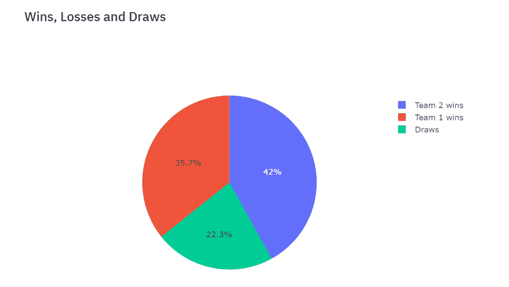

# 体育分析:国际足球比赛的探索性分析-第二部分

> 原文：<https://towardsdatascience.com/sports-analytics-an-exploratory-analysis-of-international-football-matches-part-2-a20674cca78c?source=collection_archive---------18----------------------->


在我之前的[文章](/sports-analytics-an-exploratory-analysis-of-international-football-matches-part-1-e133798295f7)(本系列的第 1 部分)中，我已经为一个有意义的探索性分析实现了一些有趣的可视化工具。然后，用 Python 包 [Streamlit](https://streamlit.io/docs/) ，我让他们以网络应用的形式互动。

在本文中，我将像以前一样继续处理相同的数据集，这次重点关注两个团队之间的交互。我将继续使用 [Plotly](https://plot.ly/python/) 作为可视化工具，因为它提供了与图形交互和收集相关信息的可能性。由于我不会附上我以前的[文章](/sports-analytics-an-exploratory-analysis-of-international-football-matches-part-1-e133798295f7)的代码，如果你是 Streamlit 的新手，我强烈建议你在开始之前阅读它。

现在，正如预期的那样，我想详细谈谈两支感兴趣的球队之间的比赛。因此，让我们首先用用户的多选来过滤我们的初始数据集(这里有[可用](https://www.kaggle.com/martj42/international-football-results-from-1872-to-2017)):

```
import streamlit as st
import pandas as pd
import numpy as np
import plotly.express as px
import seaborn as sns
import matplotlib.pyplot as plt
import plotly.graph_objects as go
from plotly.subplots import make_subplotsst.title('Internationa Football matches')
df = pd.read_csv("results.csv")st.subheader('Comparing 2 teams')
teams_to_compare = st.multiselect('Pick your teams', df['home_team'].unique())comparison = df[(df['home_team'].isin(teams)) & (df['away_team'].isin(teams)) ]  
comparison = comparison.reset_index(drop=True)
st.write(comparison)
st.write('Number of matches: ', len(comparison))
```

对象' teams_to_compare '将是两个队的列表，我对分析两个队之间的比赛感兴趣(不管哪一个队在主场比赛)。然后，我让我的应用程序显示新过滤的数据集以及匹配的数量:


在这里，我对英格兰对苏格兰的所有比赛都感兴趣，这是我最终的数据集。

现在让我们对这两个团队进行一些分析。

首先，我想知道哪场比赛的比赛强度最高，我决定将它量化为进球总数。因此，我创建了一个新的熊猫系列，作为两个“分数”列的总和，然后计算该系列的最大值的指数。

```
st.subheader('Highest intensity of play')out_c = comparison.iloc[np.argmax(np.array(comparison['home_score']+comparison['away_score']))]
st.write(out_c)
```


所以，打得最多的比赛是 1961 年 4 月 15 日的英国锦标赛。同样的道理，你可以调查任何一种表现。也就是说，您可以要求显示两个队之间得分差距最大的比赛。

现在，我想可视化我的团队之间的胜败比例。为此，我将使用一个 Plotly 饼图:

```
team1_w = 0
team2_w = 0
teams_draw=0
team1_cum=[]
team2_cum=[]for i in range(len(comparison)):
    if comparison['home_team'][i]==teams_to_compare[0]:
        if comparison['home_score'][i]>comparison['away_score'][i]:
            team1_w+=1
            team1_cum.append(1)
            team2_cum.append(0)
        elif comparison['home_score'][i]<comparison['away_score'][i]:
            team2_w+=1
            team1_cum.append(0)
            team2_cum.append(1)
        else:
            teams_draw+=1
            team1_cum.append(0)
            team2_cum.append(0)
    else:
        if comparison['home_score'][i]<comparison['away_score'][i]:
            team1_w+=1
            team1_cum.append(1)
            team2_cum.append(0)
        elif comparison['home_score'][i]>comparison['away_score'][i]:
            team2_w+=1
            team1_cum.append(0)
            team2_cum.append(1)
        else:
            teams_draw+=1
            team1_cum.append(0)
            team2_cum.append(0)

comparison_labels = ['Team 1 wins','Team 2 wins','Draws']
comparison_values = [team1_w, team2_w, teams_draw]fig5 = go.Figure(data=[go.Pie(labels=comparison_labels, values=comparison_values)])
st.plotly_chart(fig5)
```



在上面的代码中，我还定义了两个列表，team1_cum 和 team2_cum，这样我就可以检查我的两个团队的获胜路径。因此，让我们构建一个带有按钮和滑块的折线图:

```
st.subheader('Cumulative wins of two teams')fig6 = go.Figure()fig6.add_trace(go.Scatter(x=list(new_df_wins['date']), y=np.cumsum(np.array(team1_cum)), name='team 1'))
fig6.add_trace(go.Scatter(x=list(new_df_wins['date']), y=np.cumsum(np.array(team2_cum)), name='team 2'))fig6.update_layout(
    xaxis=go.layout.XAxis(
        rangeselector=dict(
            buttons=list([
                dict(count=1,
                     label="1m",
                     step="month",
                     stepmode="backward"),
                dict(count=6,
                     label="6m",
                     step="month",
                     stepmode="backward"),
                dict(count=1,
                     label="YTD",
                     step="year",
                     stepmode="todate"),
                dict(count=1,
                     label="1y",
                     step="year",
                     stepmode="backward"),
                dict(step="all")
            ])
        ),
        rangeslider=dict(
            visible=True
        ),
        type="date"
    )
)st.plotly_chart(fig6)
```


注意:在饼图中，看起来第二队(英格兰)赢了第一队(苏格兰)的大部分比赛。那么，为什么从上面的线形图来看，似乎在大部分时间里，苏格兰统治着英格兰呢？好吧，原因在于数据集:英格兰和苏格兰在 1910 年后打了大部分比赛，因此这与之前收集的信息一致。

此外，这个图表是有意义的。事实上，我们看到，直到 1910 年(或多或少)，苏格兰一直统治着英格兰。这种趋势反转的原因是什么？人们可能会对这一特定事件感兴趣:


我还想检索另外两个元素。首先，我想知道这些比赛在每个城市进行了多少次。为此，我将构建一个条形图，显示每个城市在我的过滤数据集中出现的次数:

```
st.subheader('Frequency of city of matches')cities = comparison.groupby('city').count()['country'].index.values
occurrences = comparison.groupby('city').count()['country'].values
occurrences.sort()fig7 = go.Figure(go.Bar(
            x=occurrences,
            y=cities,
            orientation='h'))st.plotly_chart(fig7)
```


其次，我想收集一些关于锦标赛类型的信息。这个想法是绘制一个气泡图，其 x 和 y 坐标是主客场得分，大小代表比赛的强度(进球总数)，颜色代表锦标赛的类型。另外，为了知道我的哪支球队在主场比赛，我将把主场球队设置为 hover_name，它将显示在每个气泡的顶部。

```
st.subheader('Tournament information')comparison['challenge']=np.array(comparison['home_score']+comparison['away_score'])
fig8 = px.scatter(comparison, x="home_score", y="away_score",
          size="challenge", color="tournament",
                 hover_name="home_team")st.plotly_chart(fig8)
```


这张图表的第一瞥显示了进球数最高的比赛似乎是英国锦标赛。最后，让我们将这些信息与每对球队的锦标赛类型的频率结合起来:

```
tour = st.selectbox('Select a tournament', comparison['tournament'].unique())comparison_t = comparison[comparison['tournament']==tour] 
per = len(comparison_t)/len(comparison)st.write(f"{round(per*100,2)}% of matches between the 2 teams have been played as {tour} matches")
```


因此，不仅英国锦标赛举办了最高强度的比赛，而且英格兰和苏格兰之间的比赛也是最多的。

同样，正如我在上一篇文章中所预期的，这些只是你可以在数据集上构建的一小部分分析。这真的取决于你需要的信息，然而第一个解释性的洞察力总是一个好的起点，因为它可能会提供新的直觉和分析的角度。

我希望你喜欢阅读！

**参考文献:**

*   [https://www . ka ggle . com/martj 42/international-football-results-from-1872-to-2017](https://www.kaggle.com/martj42/international-football-results-from-1872-to-2017)
*   【https://streamlit.io/docs/ 
*   [https://plot.ly/python/](https://plot.ly/python/)

*原载于 2019 年 10 月 28 日*[*http://datasciencechalktalk.com*](https://datasciencechalktalk.com/2019/10/28/sports-analytics-an-exploratory-analysis-of-international-football-matches-part-2/)*。*