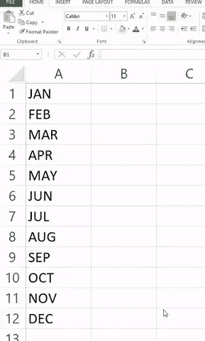
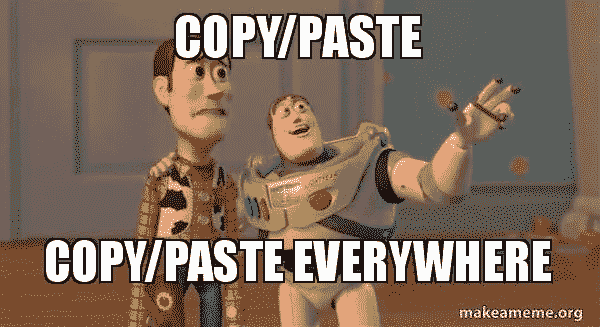

# 大规模毁灭的电子表格

> 原文：<https://towardsdatascience.com/spreadsheets-of-mass-destruction-754bf72724f9?source=collection_archive---------30----------------------->

人类最初的作品不是故事，而是电子表格。我们可以找到有关会计的最古老的文字记录。很快，[电子表格成为了表现 it 的主要方式](https://theodox.quora.com/The-worlds-oldest-spreadsheet)。


The tablet Plimpton 322, from -1800 (source wikipedia)

人类同时创造了它最灾难性的发明:电子表格错误！[上面的石碑已经包含了我们这个时代遗留下来的数学错误](http://www.math.ubc.ca/~cass/courses/m446-03/pl322/pl322.html#errors)。

工具从这些古老的时代开始进化。今天*微软 Excel* 或者*谷歌工作表*防止我们犯错……或者不犯错。

[欧洲电子表格风险利益集团](http://www.eusprig.org)的任务是分析电子表格错误风险。他们的网站引用了恐怖故事，讲述一个简单的复制和粘贴就能让你损失数百万。

2016 年的一项研究分析了 35175 份包含基因研究数据的 excel 文件。他们发现几乎 20%的电子表格包含基因名称错误。2008 年的文学评论估计超过 90%的电子表格都有错误。



## 使用电子表格进行战略决策

如今，金融服务业的高管们使用电子表格来制定战略决策。大多数情况下，电子表格导出是我们的客户要求与我们合作的一项强制性功能。这种格式现在是 B2B 数据通信标准，不是最好的。


[https://xkcd.com/1906/](https://xkcd.com/1906/)

这种流行是因为电子表格易于操作数据。今天，这种观点不再成立，许多编程语言更容易使用。[例如，蟒蛇和熊猫是很好的替代品。](/jupyter-is-the-new-excel-a7a22f2fc13a)

例如，假设您有一个电子表格，其中包含购买的元素数量及其价格。如果你想知道你的总支出，你可以写:

```
SUMPRODUCT(F1:F18,H1:H18)
```

在熊猫中，你可以写:

```
total_spending = ( data['quantity'] * data['price'] ).sum()
```

多亏了 [Google Colab](https://colab.research.google.com) ，所有这些工具都可以在浏览器中获得，无需任何安装。

## 数据可靠性

改变你用来做战略决策的工具并不能解决所有问题。实现 math 时的错误并不新鲜。由于几十年的编程错误，好的实践出现了。电子表格用户大部分时间都不尊重它们:

*   一个 excel 文件就能统治一切！让我们拥有这个包含所有数据和计算的巨大电子表格。
*   **复制粘贴。**让我们复制并粘贴公式及其包含的错误。
*   **手动操作。**为了对数据采取行动，让我们始终应用相同的手动步骤，确信不会出现人为错误。
*   **无测试。**为什么测试，这是平均值，平均值怎么会错？



今天，现代编码模式和方法应用最佳实践来限制这些问题:

*   [**单一责任原则**](https://en.wikipedia.org/wiki/Single_responsibility_principle) 。一个函数应该只负责分析的一部分。
*   [**不要重复自己**](https://en.wikipedia.org/wiki/Don%27t_repeat_yourself) **。不要复制粘贴，使用函数，这样如果你发现一个错误，你可以在任何地方纠正它。**
*   [**绵集成**](https://en.wikipedia.org/wiki/Continuous_integration) 。自动化交付流程，使其更快、更可靠。
*   **自动测试**。每次修改后都要测试。

我们仍然允许客户将数据导出为电子表格。但是我们把这种用法解释为我们产品中缺少的功能。这意味着他们需要更多的分析来采取行动。作为数据专家，我们的职责是提供这种分析，同时确保不出现灾难性错误。

[这篇文章最初发表在 Cornis 的博客上。](https://ai.cornis.fr/spreadsheets-of-mass-destruction/)