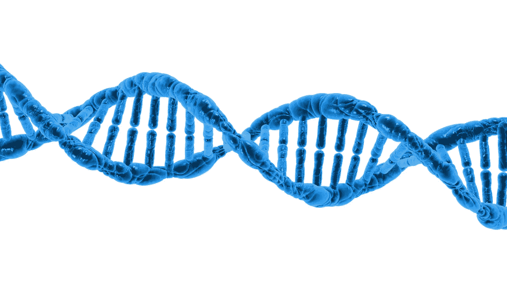
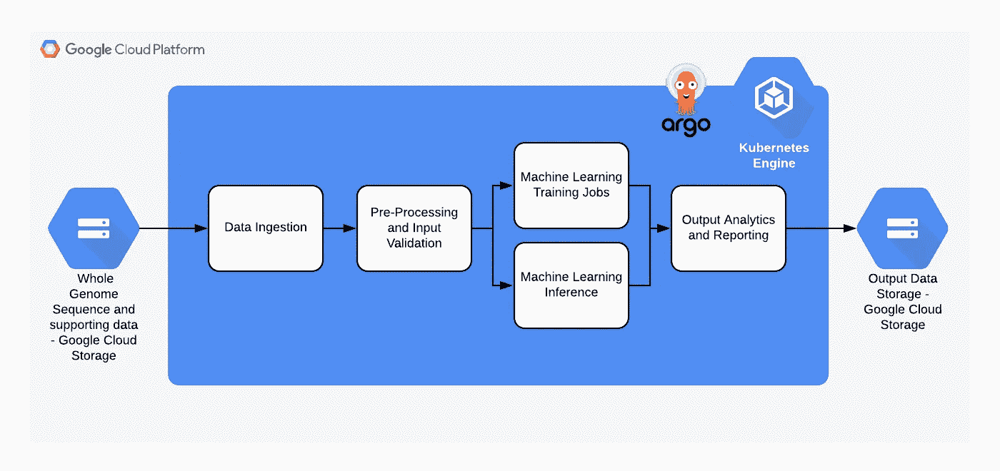
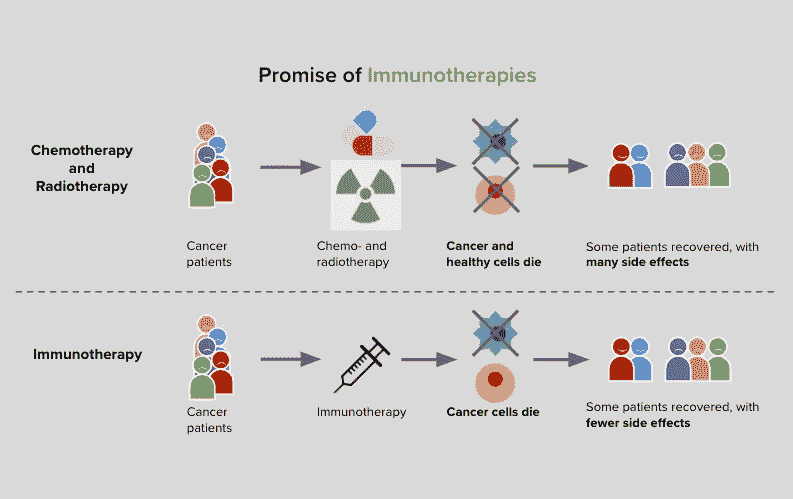

# 2019 年春季:来自 Max Kelsen Genomics 的更新

> 原文：<https://towardsdatascience.com/spring-2019-update-from-max-kelsen-genomics-6db00ebd3900?source=collection_archive---------40----------------------->

## 概述我们癌症和基因组学研究部门的最新进展和发展。

**作者**:ma ciej Trzaskowski 博士， [Max Kelsen 的基因组学和机器学习研究负责人](https://maxkelsen.com)

自从我们的[上一次更新](https://maxkelsen.com/blog/crc-p-cancer-ai-research)以来，我们看到了我们研究团队的大量活动和成果。下面我们将概述我们癌症和基因组学研究部门的一些最新进展和发展，包括合作伙伴关系、项目和演示。

# **合作关系**

MK Genomics 自豪地宣布，我们正在与[谷歌云平台](https://cloud.google.com/) (GCP)合作。通过这种合作关系，我们可以访问他们的 GPU 和 TPU 集群，以帮助处理全球多个地区的大量数据。

我们还与[谷歌健康](https://www.google.com/intl/en_us/health/about/)的基因组学团队签署了合作和拨款协议，利用这一基础设施开发新型深度学习应用。通过利用 [Kubernetes-native](https://kubernetes.io/) 机器学习(ML)工作流编排器，如 [Argo](https://argoproj.github.io/argo/) 和 [Kubeflow](https://www.kubeflow.org/) ，以及 GCP 基础设施(见下图 1)，我们能够以最小的成本和周转时间交付成果。

对于谷歌健康团队，我们真的说不出足够多的好话，他们为研究社区做出了很大贡献，我们喜欢与他们合作。

# **项目**

最初构想为[免疫治疗结果预测(IOP)](https://maxkelsen.com/blog/crc-p-cancer-ai-research) 的研究项目已被分解为一系列子项目，以使我们能够精确而集中地解决这些研究问题。这导致了一个名为 **MK Genomics** 的内部团体的形成。

MK Genomics 目前正在进行五个研究项目:

*   免疫治疗结果预测(IOP)
*   未知原发癌
*   显著性映射
*   心脏蛋白质组学
*   慢性髓细胞白血病

**IOP** 和 **CUP** 是两个最先进的项目，将在下面详细介绍。

## **免疫治疗结果预测(IOP)**

处理生物学数据并不简单。它不仅在数据采集方面带来了很多挑战，这通常是高度侵入性的，而且在数据采用数字形式之前，在实验室中面临的生物和技术障碍也带来了很多挑战。在分析阶段，这些挑战往往被低估，因为分析的重点主要是统计的严谨性。

虽然在复杂数据集中寻找显著信号时，设计良好的 ML 模型至关重要，但仔细的专家质量控制通常是真正的生物信号和技术人工制品之间的屏障。在Max Kelsen，我们与一些世界上最有经验的癌症遗传学家合作( [genomiQa](https://genomiqa.com/) 、 [QIMR](https://www.qimrberghofer.edu.au/) )，他们拥有跨越数十年的专业知识，确保获得最高质量的数据。

基因研究的另一个重要挑战是有效处理海量数据的能力。在 x30 深度采样的单个[全基因组序列](https://en.wikipedia.org/wiki/Whole_genome_sequencing)可以消耗 100 千兆字节的存储空间，成对的肿瘤/正常文件集可以占用每个个体多达 300 千兆字节(因为肿瘤的测序深度通常至少是正常组织的两倍)，成功的 ML 训练所需的样本可以达到数千千兆字节！

目前，MK Genomics 的人工智能基因组管道分为四个不同的阶段(见下图 1):

*   **第 1 阶段:数据接收** —来自我们自己的云基础架构、我们合作伙伴的基础架构或静态存储
*   **阶段 2:预处理**——质量控制(例如，批次效应、分布特性等。)，然后转换成 ML 友好的格式(例如，NumPy 数组、Pandas DataFrame、TensorFlow TFRecords 等)。)
*   **阶段 3:训练或推理** —运行模型推理，以分类、预测或重新训练超出模型分歧阈值的情况
*   **阶段 4:** **分析后输出和存储** —用于报告或可视化目的

**Figure 1:** MK Genomics Generic Cloud Architecture

除了新的数据来源，我们还利用了公开可用的癌症数据集，探索癌症数据的统计特性，如分布概况、混杂控制、尺度转换和稀疏性。我们已经部署了各种各样的 ML 模型，不仅相互比较它们的性能，而且在可能影响我们发现的通用性的各种技术人工制品的场景中比较它们的性能。

传统疗法，如化疗和放疗是非特异性干预，旨在通过杀死所有细胞(包括健康细胞)来消除癌症。因此，这些疗法是高度侵入性的，并且许多患者经历了严重的副作用。不幸的是，传统疗法不能保证癌症的完全缓解。

[另一方面，免疫疗法](https://www.cancer.org.au/about-cancer/treatment/immunotherapy.html)(见下图 2)的侵入性要小得多，因为它使用我们自身免疫系统的力量来靶向并摧毁癌细胞。这使得健康细胞保持完整，副作用更少——然而，并不是每个人都对这些疗法有反应。更好地理解缺乏应答的生物学原因不仅对总体上改进免疫疗法是至关重要的，而且对确定最有可能对其应答的个体也是至关重要的。

**Figure 2:** Comparison of immunotherapy versus chemotherapy and radiotherapy

能够准确预测[免疫疗法](https://en.wikipedia.org/wiki/Immunotherapy)的结果可以防止新患者接受可能无效的昂贵疗法或错过那些有效的疗法。我们投入了大量精力来理解和准确估计我们模型的不确定性以及未知数据的不确定性，以最大限度地降低此类误诊的风险。

## **不明原发癌(CUP)**

癌症研究中的一个重大挑战是癌细胞来源的不确定性。每当收集肿瘤活检时，所收集的细胞都有可能是转移性的。换句话说，细胞有可能从其他地方迁移到收集点。在未知原发性癌症(CUP)的情况下，起源部位是未知的。

几项研究已经解决了这个问题，表明 ML 模型非常善于对看不见的样本的组织类型进行分类。然而，还有一些新的方面尚未探索，如控制组织类型差异表达后的泛癌遗传信号，或特定特征贡献——这是我们旨在做出贡献的地方。

我们正在产生的结果非常令人鼓舞，我们将很快揭示进一步的见解和结果。

# 报告

我们的首席执行官 [Nicholas](https://www.linkedin.com/in/ntherkelsen/) 最近被邀请到新加坡参加 Google Cloud On Air 活动，讨论我们的癌症和基因组学研究。下面是他的完整演讲。

## 如果您想了解更多关于我们的工作，或者探索合作机会，请在下面留言或发电子邮件至[hello@maxkelsen.com](mailto:hello@maxkelsen.com)联系我们。