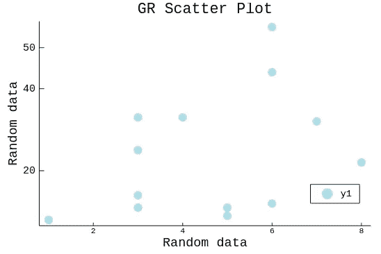
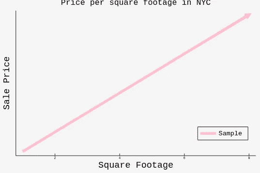
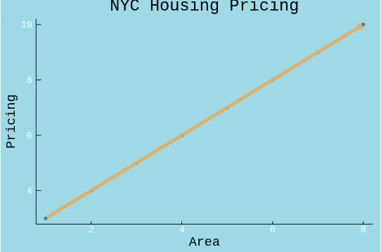
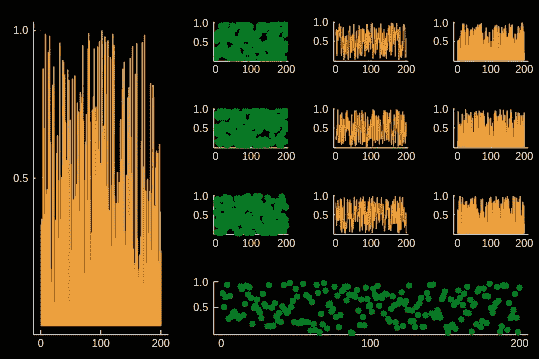
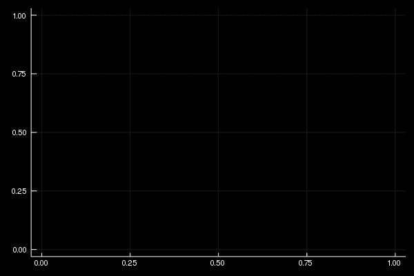

# 在 Julia 中美化您的 GR 可视化

> 原文：<https://towardsdatascience.com/spruce-up-your-gr-visualizations-in-julia-88a964450a7?source=collection_archive---------19----------------------->



Simple Scatter Plot with GR

> 没错，又是 Julia，我保证 R，Scala，Python 还在这个爱情圈里

剧情。当谈到朱莉娅的形象化时，JL 是一个如此多样化的组合。虽然大多数后端使用 Python，但是使用 Plots.jl 可以在一个包中使用 Plotly、Matplotlib(PyPlot)甚至更多的工具。关于后端的完整列表，包括基于 Python 的后端，以及 Julia、C 甚至 Plots.jl 的 LaTex 后端，可以在这里找到。

所有这些后端对于它们所应用的用例都是有用的。GR 后端通常关注快速、轻便和简单的可视化，只需设置最少的参数来改变您的绘图。尽管如此，它仍然是一个非常有用的工具。事实上，你可能会经常看到我在和 Julia 一起工作时使用 GR 进行可视化。一如既往，笔记本在这里。

# 确保您在 GR 后端

虽然感觉相对初级，但这将返回您选择的后端:

```
using Plots
# Using function we can return what backend we are in: 
println("Current Plots.jl Backend:")
Plots.backend()
```

如果它不是 GR，您可以通过执行以下操作将其设置为 GR:

```
Plots.gr()
```

# 基础知识

像往常一样，有一些(几乎)通用的参数将适用于每种类型的绘图，如背景颜色、网格线、xticks、yticks、标签等。这是一个相当基本的散点图，包含一些可用的参数:

```
scatter(x,y,
    # title:
    title = "GR Scatter Plot",
    # X label:
    xlabel = "Random data",
    # Y label
    ylabel = "Random data",
    # Grid:
    grid = false,
    # Legend position
    legend=:bottomright,
    # Color of the marker
    color = :lightblue,
    # Marker stroke width and opacity
    markerstrokewidth = 4,
    markerstrokealpha = .75,
    # Marker stroke color
    markerstrokecolor = :lightblue,
    # Adjust out y ticks
    yticks = [20,40,50],
    # Our font options
    fontfamily = :Courier,xtickfontsize=7,ytickfontsize=9,
    ytickfont=:Courier,xtickfont = :Courier,titlefontsize=13,
    # We can also add annotations, super easily:
    )
```


## 标题

当然，标题很简单，只需设置标题等于一个字符串，相对简单。我们也可以使用

```
titlefont = :FontName
titlefontsize = fontsize
```

我们也可以全局设置字体，当然我更喜欢将它们保存在一个实例中，但它可能对某些人有用:

```
gr(tickfont=font("serif"), titlefont=font("serif"))
```

## 网格和图例

要删除默认启用的网格，我们只需添加

```
grid = false
```

我们的参数。图例的位置有点复杂，因为我们只能将它放入预设的位置。例如，这里我用:bottom-right。我认为没有必要详细说明，因为其他位置是相对于语法。

此外，更改图例中的文本相对简单，

```
label="Sample"
```

# x-标签和刻度，Y-标签和刻度

为了将 label =设置为一个字符串，很简单:

```
xlabel = "MyLabel"
ylabel = "MyLabel"
```

当然，刻度列表必须在 X 和 Y 的范围内，并作为一个数组被带入参数中。

```
yticks = [20,40,50]
```

# 标记形状、颜色、大小和 Alpha

**注意:**在混合了线条和其他元素的图上，颜色只会改变坐标点的颜色，而不会改变线条的颜色。标记笔划将决定我们轮廓的大小，以便应用与此相同的属性:

```
# Marker stroke width and opacity
    markerstrokewidth = 4,
    markerstrokealpha = .75,
    # Marker stroke color
    markerstrokecolor = :lightblue,
```

我们做同样的事情，但只是删除“标记笔划”

```
color = :lightblue,
width = 4
alpha = .75
```

# 不同参数输入下的线图

```
x = [1,2,3,4,5,6,7,8]
y = [3,4,5,6,7,8,9,10]
gr(bg=:whitesmoke)
plot(x,y,arrow = true,
    linewidth = 6,
    color = :pink,
    yticks=([0,250000,500000,750000,100000]),
    grid = false,legend=:bottomright,label="Sample",
    title = "Price per square footage in NYC",
    xlabel = "Square Footage", ylabel = "Sale Price",
    fontfamily = :Courier,xtickfontsize=4,ytickfontsize=4,
    ytickfont=:Courier,xtickfont = :Courier,titlefontsize=10
    )
```



## 新零件:

*   箭

Arrow 是一个布尔值，它只是在你的线的末端放一个小三角形。

*   行距

确定线条宽度的整数。

*   背景颜色

我们只是使用 gr()函数并将以下内容放入参数中:

```
gr(bg=:whitesmoke)
```

现在我们将开始分散，并一起绘制一条线。

```
gr(leg=false, bg=:lightblue)
scatter(x,y,smooth = true,
title = "NYC Housing Pricing",arrow = true,
markershape = :hexagon,
    markersize = 3,
    markeralpha = 0.6,
    markercolor = :blue,
    markerstrokewidth = 1,
    markerstrokealpha = 0.0,
    markerstrokecolor = :black,
    linealpha = 0.5,
    linewidth = 5,
    linecolor = :orange,
    textcolor = :white,
xlabel = "Area",ylabel = "Pricing",
fontfamily = :Courier,grid = false)
```



Talk about ugly

## 新零件

*   文本颜色

更改 x 坐标和 y 坐标的颜色。

*   线性α
*   行距
*   线条颜色

正如我所解释的，当与其他图一起使用时，线条有单独的参数。这细分为“线条、宽度和颜色”这将改变我们的线的属性，而不是我们的标记，所以我们可以独立地改变我们的点和我们的线。

*   马克舍普

当然，这改变了我们绘制的点的形状，这里我们使用六边形。

# 基本布局

布局也经常是任何图形库不可或缺的一部分。

```
gr(leg=false, bg=:black)
l = [@layout](http://twitter.com/layout) [  a{0.3w} [grid(3,3)
                         b{0.2h} ]]
plot(
    rand(200,11),
    layout = l, legend = false, seriestype = [:bar :scatter :path], textcolor = :white,
markercolor = :green, linecolor = :orange, markerstrokewidth = 0,yticks = [.5,1],
    xticks = [0,100,200]
)
```



第一步是创建我们的布局，它实际上是一个被调用的构造函数。我们通过以下方式实现这一点:

```
layout = @layout [[parameters]]
```

现在，让我们来分解图例部分的每一部分的含义，我们将从以下内容开始:

```
l = [@layout](http://twitter.com/layout) **[ a{0.3w}** [grid(1,1)
                        b{0.5h}]]
```

前面的 a 部分并不重要，只是构造函数的局部访问器；你可以在这里放任何你想要的东西。{0.3w}所做的只是确定可视化的宽度。

```
l = [@layout](http://twitter.com/layout) [ a{0.3w} **[grid(1,1)
                        b{0.5h}]]**
```

至于这最后一部分，它创建了一个网格，在上面的演示中是 3 x 3，如果列表太小，可视化将重复到这些网格中。

## 新零件

*   系列类型

这将设置我们的**有序的**模型类型数组，以应用于我们的布局。

*   布局

这将布局设置为我们的可视化。

*   神话；传奇

Legend 是一个布尔值，用于删除粘贴在我们的可视化顶部的图例。

# 基础动画

没错，GR 也支持动画。动画就像创建一个 for 循环并添加:

```
@gif
```

到它的开始。

```
p = plot([sin, cos], zeros(0), leg=false,linecolor=:white)
anim = Animation()
[@gif](http://twitter.com/gif) for x = range(0, stop=10π, length=100)
    push!(p, x, Float64[sin(x), cos(x)])
    frame(anim)
end
```



# GR 是一个很好的工具

增加你的工作流程。GR 后端使许多图形非常平滑，非常容易。我计划更多地谈论 GR，以及与 Julia's Plots.jl 相关的一些其他后端，但现在，GR 很快，非常适合，尤其是它的速度和易用性。