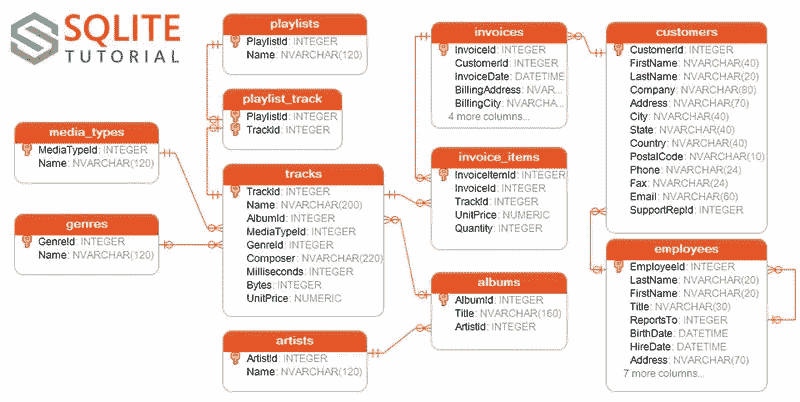
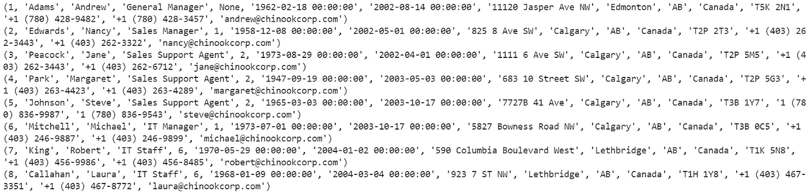
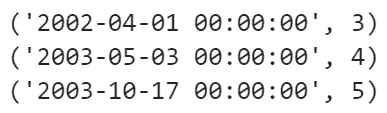
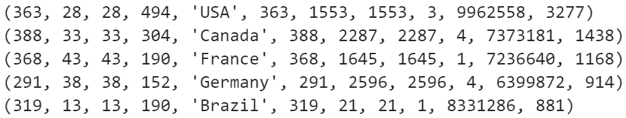
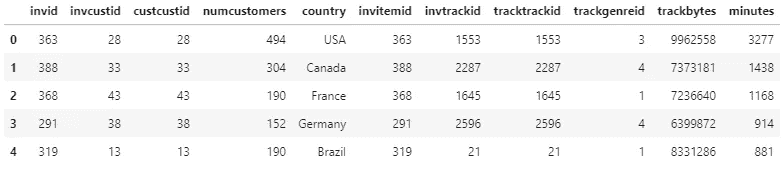

# Python 中的 SQLAlchemy 简介

> 原文：<https://towardsdatascience.com/sql-and-etl-an-introduction-to-sqlalchemy-in-python-fc66e8be1cd4?source=collection_archive---------11----------------------->

SQL 比 Pandas 更简单，可读性更好，这就是为什么许多人使用它，除了它也是一个遗留系统。虽然它很快，但它是与数据库对话和从数据仓库提取数据的语言。这是大规模数据科学的东西！

在本文中，我将浏览一下我的笔记本，它大致模拟了这种扩展数据科学的核心工作流:ETL。ETL 代表提取、转换和加载。虽然这个例子是我本地计算机上的一个笔记本，但是如果数据库文件来自一个源系统，提取就需要将它移动到一个数据仓库中。从那里，它将被转换使用 SQL 查询。最后一步是将数据加载到 Python 和 Pandas 之类的东西中，以进行机器学习和其他很酷的事情。

我用的是 SQLAlchemy，引擎盖下用的是 SQLite。SQLAlchemy 有自己的一套运行 SQL 查询的类和方法，但是我写出了原始的 SQL，以供更有兴趣或更熟悉它的读者使用。我这样做也是为了显示我的查询的逻辑，因为所有这些都会被 SQLAlchemy 抽象掉。

## 安装

我在这里下载了 chinook.db 数据库文件[开始使用。这是一个 zip 文件夹，所以我用下面的 shell 脚本将它解压缩并复制到我笔记本的工作目录中:](http://www.sqlitetutorial.net/sqlite-sample-database/)

`!cd ..\..\..\Downloads && powershell.exe -NoP -NonI -Command 'Expand-Archive'.\chinook.zip''.\chinook\ && cd C:\Users\riley\Downloads\chinook\ && copy chinook.db C:\Users\riley\Documents\Coding\ETL`

上面的命令对您来说会有所不同，因为您有不同的文件夹，但这是可以修改的。这也是一个 powershell 脚本，所以它只适用于 Windows。但是这是一种快速而巧妙的解压文件并将内容拷贝移动到目标目录的方法。“！”向 Jupyter 表明该行是一个 shell 脚本。相当整洁！

## "摘录"

将数据库文件放在工作目录中后，我继续编写导入语句，并使用 Sqlite 通过 SQLAlchemy 库创建连接到数据库的引擎。

Import statements and connection to the database via sqlite

在我做任何事情之前，我查阅了下面的表模式。这让我了解了哪些变量是可用的，以及表之间的关系。在 SQL 中，关系和模式是预定义的，必须在创建表和随后用数据填充表之前声明。

Chinook.db table schemas

接下来，我需要定义元数据，它实例化组成表的对象。我还看了一下“雇员”表中的列，因为这是我很好奇的开始部分。

Metadata instantiation and column inspection

上面的代码返回“雇员”表的列。

言归正传，我调用了对‘employees’表的第一个查询，并查看了结果。

Connects to the engine, which is connected to the database, then returns the query written in raw SQL on line 4.

The output of the code above for the employees in that table

`SELECT * FROM table_name`基本上是 SQL 的 hello world。你可以把它想成`df`。不过，我不建议在没有`LIMIT n`(相当于`df.head(n)`)语句的情况下这样做，其中 n 是要返回的行数。这将保护你和你的电脑，以防你的桌子太大。

为了查看数据库中的其他表，我调用了`inspector.get_table_names()`，它返回一个列表。这是一种便捷的方式来查看有什么可探索的。

基于这些数据，我对一些事情产生了兴趣:

1.  有多少员工？
2.  每个销售代表帮助了多少客户？
3.  销售代表在公司的资历和他们帮助了多少客户之间有联系吗？
4.  我如何利用不同表格中的信息来回答另一个问题:购买了多少分钟的音乐，按国家汇总？

## 改变

第一个问题很容易回答。我没有限制`SELECT * FROM employees`的输出，所以它把它们都给我看了。显然有 8 个条目。但是知道这一点很容易，因为桌子很大。如果是 300 万员工呢？不管表的大小如何，计算雇员数量的代码如下。

Returns the number of employees in the employees table

为了回答我的第二个问题，我查看了“customers”表中的“SalesRepId”变量，对其进行了计数，并将其分组，以查看每个“SalesRepId”有多少个实例。

Returns the number of customers employees 3, 4, and 5 helped respectively

员工 3 帮助了 21 个客户，4 帮助了 20 个客户，5 帮助了 18 个客户。为了回答我的第三个问题，我接下来检查了员工的雇佣日期。

Returns the hire date and employee ID for employees 3–5 ordered in ascending order (note: the BETWEEN clause in SQL is inclusive of the lower and upper bound of the range given)

The output of the code above shows the difference in hiring date for employees 3–5

为了找到最资深的雇员，我编写了下面的查询。在这么小的桌子上，这是不必要的，但我还是把它写了出来，因为这就是如何缩放！

Returns the hire date and employee ID of the most senior employee (the “smallest” hire date — which translates to furthest date back)

似乎存在某种线性关系，至少在这个非常有限的数据集上。随着任期的延长，得到帮助的客户数量也在增加。显然，这些信息不足以推断技能——某人在某处工作的时间越长，他们完成的[在此插入任务]就越多。

## 把这一切联系起来

我想回答一个更复杂/有趣的问题，并为此编写同样更复杂的 SQL 查询。我还想使用不同表中的数据，因为有太多的数据可供选择。为此，我需要连接这些表。

在关系数据库中，表之间有关系。“客户”表有一个主键“客户 Id”。这是每个客户的唯一标识符。这一点很重要，因为虽然可能有多个 Joe，但不会有多个“CustomerId”编号 2355。

有了这个原则，我开始着手解决一个挑战，即调查每个国家销售了多少分钟的音乐。

“曲目”表中的歌曲长度以毫秒为单位。“客户”表告诉我们国家。

我将“tracks”表连接到“invoice_items”表，该表包含一个公共键:“TrackId”。“TrackId”是“tracks”表的主键，但却是“invoice_items”表的外键。因为这些表共享该列，所以它们可以根据该列合并在一起。

[如果你喜欢](https://medium.com/launch-school/sql-joins-and-you-21448802b795)，这里有一篇很好的中型文章详细介绍了 joins。

考虑到这一点，我使用所需的外键将“tracks”与“invoice_items”、“invoice_items”与“invoice”以及“invoice”与“customers”连接起来。

Returns a table of various attributes of various tables, the last column of which being the total length of music sold in minutes to each country

Minutes of music sold to customers in the US, Canada, and so on

3277 分钟的音乐卖给了 494 个美国人！酷！🎵🎶

## 负荷

转换方面完成后，我继续加载它作为最后一步。一旦完成，你就可以深入到更复杂的分析中去，熊猫和 Python 宇宙就是以这些分析而闻名的！

代码是相同的查询，作为 Pandas 的`pd.read_sql_query()`方法的第一个参数输入。

Creates a Pandas dataframe from the SQL query (note: the engine.connect() argument must be included)

最后这里是调用`df.head()`的输出:

Back to the world of Pandas dataframes

## 结论

我简要概述了 ETL(提取、转换和加载)及其在大数据世界中的作用。这是对我的代码的一次演练，并附带了对关键 SQL 概念的解释。我在 SQLAlchemy for Python 中工作，它有一系列抽象的类和方法，所以如果我使用它们，SQL 查询看起来不会完全一样。您可以在[文档页面](https://docs.sqlalchemy.org/en/latest/orm/examples.html)上看到该语法。

这个项目的完整代码可以在我的 GitHub 上找到。

我希望你喜欢这本书！

如果你学到了新的东西，并想把它交给下一个学习者，[考虑捐赠](https://www.patreon.com/rileypredum)你觉得合适的任何数量，谢谢！

编码快乐！

奢侈的生活