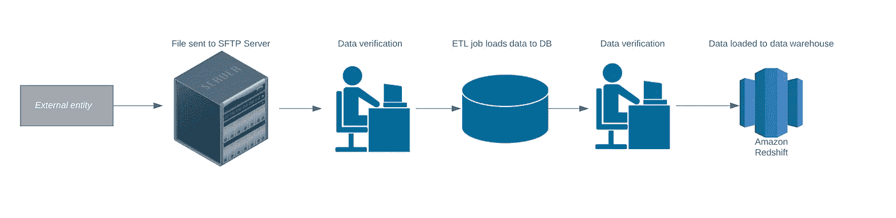
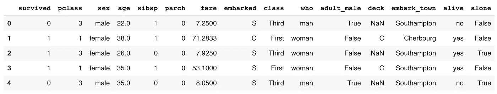
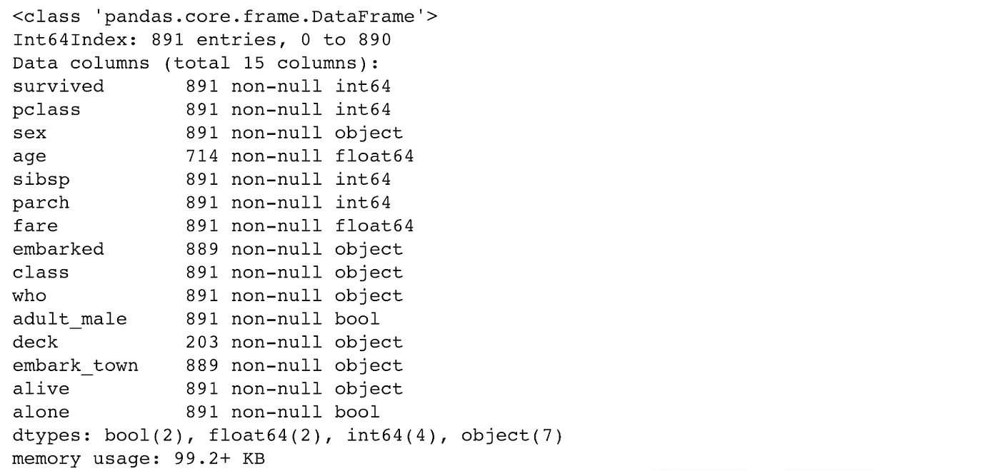
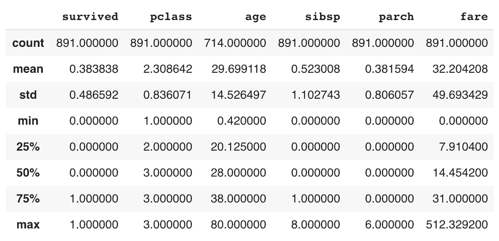
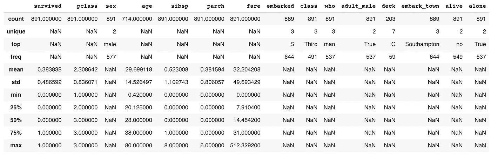
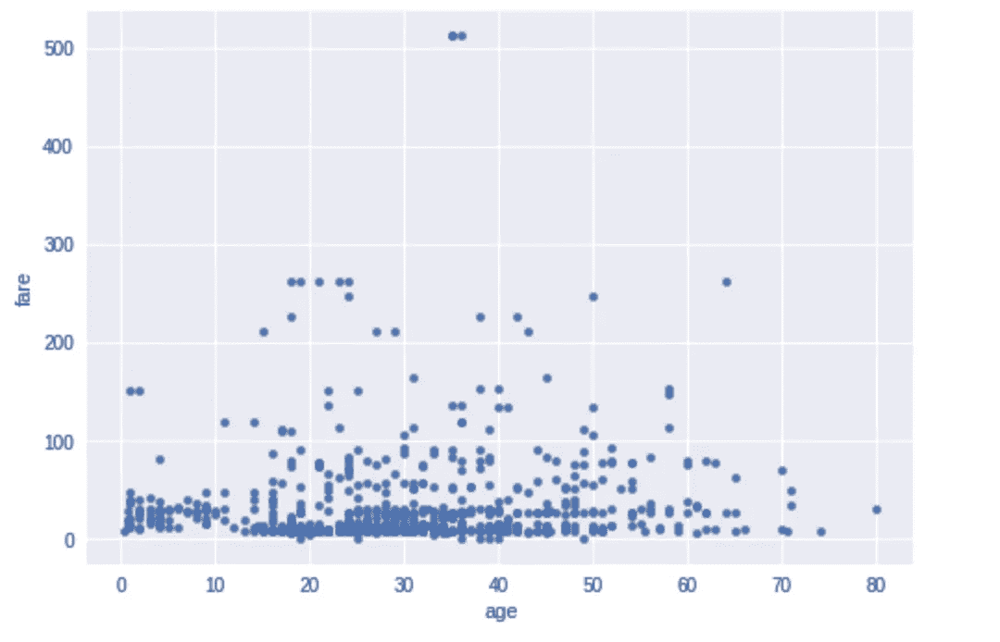

# SQL 和熊猫

> 原文：<https://towardsdatascience.com/sql-and-pandas-268f634a4f5d?source=collection_archive---------3----------------------->

## 这些工具应该在哪里使用以及如何使用？


正如我在上一篇文章中提到的，我的技术经验几乎都在 SQL 方面。虽然 SQL 很棒，可以做一些非常酷的事情，但它有其局限性——这些局限性在很大程度上是我决定在 Lambda School 获得数据科学超能力的原因。在我以前的数据角色中，我需要分析来自外部来源的数据文件，我可以使用的工具要么限制了它可以处理的数据量，要么花费了过多的时间，使任务变得如此平凡，几乎不可能彻底完成。

在我担任的所有职位中，都有一条数据管道，大致是这样的:



我们从外部来源接收数据，需要对这些数据进行质量分析和对 ETL 需求的理解。我们使用 excel 来做这件事，但是任何尝试过使用 excel 处理大文件的人都知道这是一场噩梦。所以我们会编写 excel 宏，但是由于每个文件都不同，它们并不总是很有用。我们本可以花钱购买为数据分析而构建的工具，但这些工具需要花钱，而且当那些买单的人没有直接感受到或理解数据生活的痛苦时，这些工具很难销售。

进入:Python 的熊猫库。我的脑子被**炸了**。

我怎么会不知道这个非常有用的免费工具呢？这会让我的生活变得轻松很多！你会问，怎么会？好吧，让我告诉你。

# 熊猫


与 SQL 不同，Pandas 有内置函数，当您甚至不知道数据是什么样子时，这些函数会有所帮助。当数据已经是文件格式(.csv，。txt，。tsv 等)。Pandas 还允许您在不影响数据库资源的情况下处理数据集。

我将解释并展示一些我非常喜欢的功能示例:

## pandas.read_csv()

首先，您需要将数据放入数据帧。一旦将它设置为一个变量名(下面的' df ')，就可以使用其他函数来分析和操作数据。将数据加载到 dataframe 时，我使用了“index_col”参数。该参数将第一列(index = 0)设置为数据帧的行标签。你可以在这里找到其他有用的参数[。有时，在格式正确之前，您需要对参数进行调整。如果该函数被设置为变量，它不会返回输出，但是一旦设置好，您可以使用下一个函数来查看数据。](https://pandas.pydata.org/pandas-docs/stable/reference/api/pandas.read_csv.html)

```
# Command to import the pandas library to your notebook
import pandas as pd# Read data from Titanic dataset.
df = pd.read_csv('...titanic.csv', index_col=0) 
# Location of file, can be url or local folder structure
```

## 熊猫. head()

head 函数在预览加载后的数据帧时非常有用。默认显示前 5 行，但是您可以通过键入`.head(10)`来调整。

```
df.head()
```



First 5 rows of dataframe

这是一个很好的起点。我们可以看到字符串、整型、浮点型的组合，并且一些列有 NaN 值。

## pandas.info()

info 函数将给出 dataframe 列的细目以及每个列有多少个非空条目。它还告诉您每一列的数据类型，以及数据帧中总共有多少条目。

```
df.info()
```



## 熊猫.描述()

describe 函数对于查看数据的分布非常有用，尤其是像 int 和 floats 这样的数字字段。正如您在下面看到的，它返回一个数据帧，其中包含每一列的平均值、最小值、最大值、标准偏差等。

```
df.describe()
```



为了查看所有列，而不仅仅是数字列，您必须使用如下所示的 include 参数。请注意，添加了“unique”、“top”和“freq”。这些仅对非数字数据类型显示，对数字数据类型显示 NaN。上面的其他细目不适用于这些新栏目。

```
df.describe(include='all')
```



## pandas.isna()

isna 函数本身并不特别有用，因为如果字段已填充，它将返回整个数据帧，如果是 NaN 或 NULL 值，则返回 False 或 True。如果你包括。sum()和 isna()，然后您将得到如下所示的输出，其中每一列都有 NaN 或 NULL 字段。

```
df.isna().sum()
```


## pandas.plot()

熊猫绘图功能是非常有用的，只是得到一个快速可视化的数据。这个函数使用 matplotlib 进行可视化，所以如果你熟悉这个库，这将很容易理解。您可以在此找到可用于此功能[的所有不同参数。](https://pandas.pydata.org/pandas-docs/stable/reference/api/pandas.DataFrame.plot.html)

```
df.plot(x='age', y='fare', kind='scatter')
```



这些只是我用于初始数据分析的一些有用的 Pandas 函数。还有许多其他的数据分析和操作功能，你可以在这里找到。

# 何时使用 SQL 与熊猫

使用哪种工具取决于你的数据在哪里，你想用它做什么，你自己的优势是什么。如果您的数据已经是一种文件格式，就没有必要使用 SQL 做任何事情。如果您的数据来自数据库，那么您应该通过以下问题来了解您应该在多大程度上使用 SQL。

## 要回答的问题:

**你对数据库有多少权限？如果您只能编写一个查询，而其他人为您运行它，您将无法真正查看您的数据。此时，您应该将您认为可能需要的所有数据提取出来，并导出到 csv 中，以便使用 pandas。**

*另一个考虑事项:*如果您需要为您的数据运行的查询将占用大量数据库资源，并且您知道您的数据库管理员不会允许或喜欢这样做，那么只需提取数据并使用 pandas 在数据库之外完成工作。避免在查询中使用 **SELECT *** ，尤其是当您不确定一个表中有多少数据时。

**您希望如何转换/合并您的数据？**
如果您已经知道您想要对数据做的一些事情，如过滤掉某些值、连接到另一个表、在计算或连接中合并某些字段等，那么运行 SQL 来提取您想要的数据，然后导出到 csv 中以用于任何数据分析或数据科学工作将会更加容易。

**你的优势是什么？**
最大的问题是你的优势在哪里。如果您觉得使用这两种语言中的一种更舒服，那么就坚持使用这种语言来进行数据操作。

## 总结一下:

这两个工具都非常有用。我建议两个都学。这种结合将使您能够有效地进行广泛的数据分析和操作。很快，您将不再需要处理 Excel 崩溃的问题。

*注意:如果你正在处理非常大的数据集，你可以使用 [Dask](http://docs.dask.org/en/latest/dataframe.html) ，它是专门为大数据构建的。将来我可能会写一篇关于 Dask 基础知识的文章。