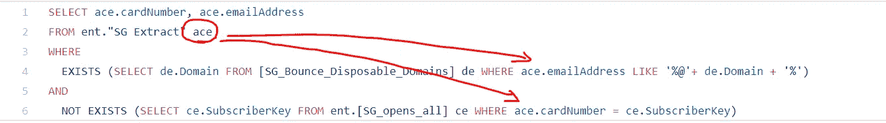

# SQL 中连接表的 8 种不同方式及其时间复杂度

> 原文：<https://towardsdatascience.com/sql-complexity-and-8-different-ways-to-join-tables-22ed7ae0060c?source=collection_archive---------4----------------------->

最近在 Salesforce 营销云平台上工作时，我和一位同事遇到了一个由外部供应商编写的 SQL 查询，其形式我们相当不熟悉。事情是这样的:

Inefficient SQL query

这个查询在 Salesforce Marketing Cloud 上表现很差，运行时间很长，超时频繁，让我们很沮丧。与我们熟悉的 Google Bigquery 不同，它是一个完全托管的 Pb 级数据平台，Salesforce Marketing Cloud 的计算能力低得多，无法处理复杂的查询负载。

注意，在这个低效的查询中，它的两个子查询引用了 where 表中的主表。

Sub-queries referencing main query in the where function

这激发了团队内部的求知欲；*`我们可以用多少种方式编写一个 SQL 查询，每个查询的时间复杂度是多少？`.*

我们决定基于 Fabian Pascal 1988 年的一篇文章[重放一个实验，以比较在 SQL 查询中编写连接的不同方式的性能。这将有助于在排除故障、编辑某人的查询以及理解 SQL 的时间复杂性时建立我们的直觉，并允许我们编写更好的 SQL。](http://www.dbdebunk.com/2013/02/language-redundancy-and-dbms.html)

展示了从 Google Bigquery 获得的增加了时间复杂度的 SQL 中连接表的 8 种方法，希望你喜欢这篇文章！

TLDR:最有效的连接也是最简单的连接，“关系代数”。如果你想找到更多关于所有连接方法的信息，请继续阅读。

**方法 1:关系代数**

关系代数是编写查询最常见的方式，也是最自然的方式。代码很干净，很容易排除故障，不出所料，这也是连接两个表的最有效的方法。

Relational Algebra

**方法 2:不相关的子查询**

不相关子查询方法通过首先创建 account_number 的子查询列表，然后使用 IN 函数来筛选子查询中的帐号，从而执行筛选函数。虽然效率不如关系代数，但由于易于编写，它是更常用的连接方法之一。

Uncorrelated Subquery

**方法 3:相关子查询**

在相关子查询中，EXISTS 函数用于在未筛选的子查询' SELECT * '中进行搜索。子查询中的筛选操作需要一个“where MP . account _ number = t . account _ number”。这是`inefficient query`中使用的 join 函数之一。这种连接的性能令人苦恼。

Correlated Subquery

**方法 WHERE 子句中的标量子查询**

通过使用子查询作为 WHERE 函数的筛选器，该查询能够筛选 f_online = 1。这是一种很酷的思维方式，但不幸的是，它的表现并不好。

Scalar Subquery in the WHERE clause

**方法 SELECT 子句中的标量子查询**

编写查询的另一种非常有趣的方式是，该方法在 SELECT 函数中使用子查询从另一个表中提取 account_number，但是由于这两个表有多对多的关系，我们必须添加一个过滤器来删除空值。

Scalar Subquery in the SELECT clause

**方法 6:聚合函数检查存在性**

与标量子查询类似，此方法在 WHERE 函数中使用子查询。不同之处在于，该方法使用了一个子查询 COUNT(*)，其过滤器大于 1。​

Aggregate function to check existence

**方法 7:相关子查询(双重否定)**

类似于相关子查询，但使用双重否定。这也是`inefficient query`中使用的连接之一。但有趣的是，它的表现并没有我预期的那么差。这可能仅仅是由于数据结构中异常多于包含。

Correlated subquery (double negative)

**方法 8:不相关子查询(双重否定)**

类似于不相关子查询，但使用双重否定。

Uncorrelated subquery (double negative)

总之，我们编写 SQL 查询的方式对查询的效率有很大的影响。效率最高的查询运行时间为 13.8 秒，而效率最低的查询运行时间为 52.6 秒。我们在 Salesforce Marketing Cloud 上重新编写了外部供应商的低效查询，我们能够将运行时间从 45 分钟(外加频繁超时)减少到 4 分钟。之后，我们去喝了一杯冰啤酒，庆祝我们的胜利。

**参考** *1988 年 Fabian Pascal 的文章《SQL 冗余和 DBMS 性能》发表在《数据库编程》&Design—[http://www . db deedged . com/2013/02/language-Redundancy-and-DBMS . html](http://www.dbdebunk.com/2013/02/language-redundancy-and-dbms.html)
* Day 4:SQL 的十二天:您编写查询的方式至关重要—[https://iggyfernandez . WordPress . com/2011/11](https://iggyfernandez.wordpress.com/2011/12/04/day-4-the-twelve-days-of-sql-there-way-you-write-your-query-matters/)

感谢 [Daniel](https://www.linkedin.com/in/daniel-lim-305b1a106/) 提供这篇文章背后的灵感，感谢 [Shawn](https://www.linkedin.com/in/shawn-phua-kc/) 提供关于 SQL sequence 的额外材料。我很幸运有像你们这样酷的同事。

感谢乔治分享费边·帕斯卡 1988 年的实验；)

干杯，

[孟勇](https://www.linkedin.com/in/mylee1/)