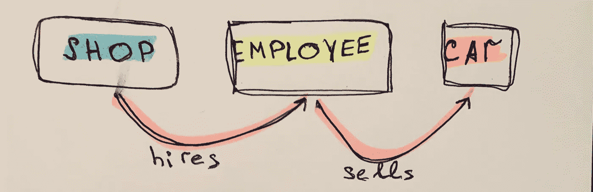
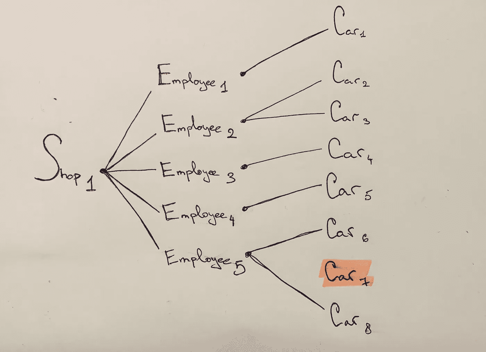
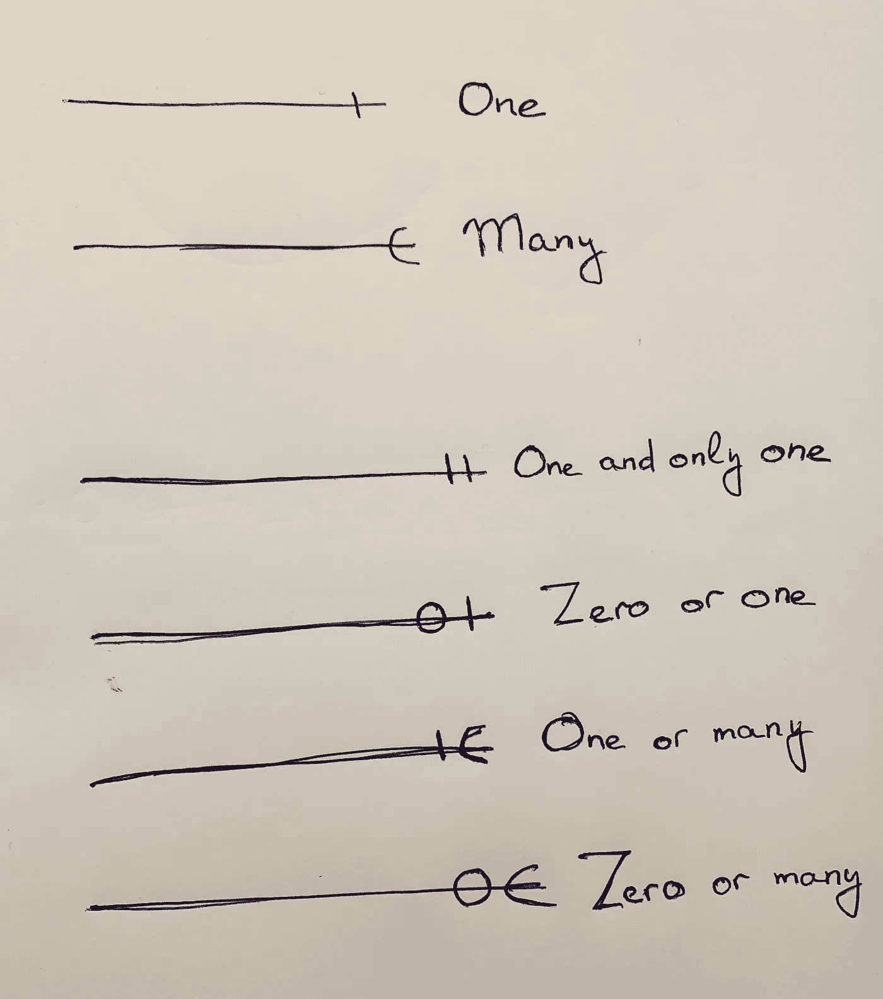
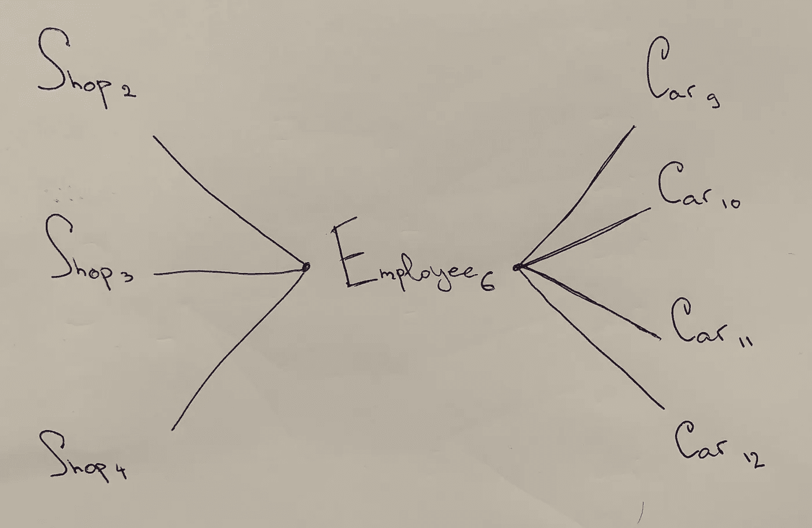
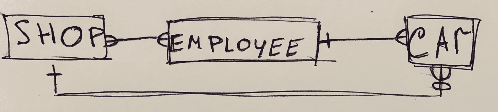

# SQL 连接陷阱。数据工程师/数据科学家必备知识

> 原文：<https://towardsdatascience.com/sql-connection-traps-must-know-for-data-engineer-data-scientist-8ad95faa07ae?source=collection_archive---------17----------------------->

## 如果你的职称中有“数据”，那么你必须清楚这篇文章描述的是什么。

Photo by [michael podger](https://unsplash.com/@jammypodger7470?utm_source=medium&utm_medium=referral) on [Unsplash](https://unsplash.com?utm_source=medium&utm_medium=referral)

> 本文中描述的陷阱意识可以防止您在查询数据库时得到错误的结果。

在本文结束时，您将:

*   知道 SQL 中有哪些连接陷阱吗
*   能够通过重构一个弱构建的 SQL 模型来解决问题
*   请注意连接陷阱的存在，这样可以避免出现“误报”查询结果

我们将讨论在一些数据库中出现的两种连接陷阱，尤其是当数据库被构建为服务于具有一些明确定义的功能的特定应用程序时。尽管这样的数据库模型将很好地满足您现在的需求，但有一天，同一个数据库可能会以不同的方式被使用(查询)。也许，这一天你会意识到由于不正确的建模丢失了部分连接信息。

**综合考虑，我尽最大努力让这篇文章 100%实用。**

# **商业案例**

你被要求为一个汽车市场链建立一个关系模型。

这家连锁店有几个商店，每个商店都出售许多不同的汽车。为了本文的问题，我们留下 3 个主要实体:**汽车商店**、**雇员**和**汽车**。

假设链所有者给出的描述如下:

> 每个车店有 N 个员工，N 辆车。每辆车将由一个特定的员工销售，因为所有的车都分配给员工(这样员工的表现很容易跟踪)。
> 
> 此外，有一类员工只负责豪华车，由于每个商店都没有足够的豪华车，这些员工不得不监管少数商店的汽车。

一个关系表示将是:

*   员工和汽车之间的 1:N 关系
*   商店和雇员之间的 N:N 关系，因为一个商店可能有多个雇员，而一些雇员将在几个商店工作

Entity relation diagram

## 裂缝陷阱

> 鸿沟陷阱——从一个实体到另一个实体的路径似乎存在，但在某些情况下可能会被打破。

***鸿沟陷阱问题***

你得数一数每个商店有多少辆车。为此，您必须编写一个查询，计算分配给每个商店每个员工的汽车数量。一切似乎都是正确的，但是，**结果与您应该得到的结果**不同。怎么发生的？

***深沟陷阱***

有些新车刚到，比如还没有分配。根据我们的模型，这些汽车与任何商店都没有关联，但事实并非如此。

‘Car 7’ belongs to ‘Shop 1’ but we cannot deduct this information until car is unassigned to an employee

在上面的例子中，我们看到“商店 1”有 8 辆汽车和 5 名员工。由于“汽车 7”仍未分配给任何员工，我们在库存中没有看到它。基本上，它存在于我们的汽车表中，在外人不知情的情况下(例如，商店经理)，它不能被分配给商店。因此，数据库本身不再可靠，因为它不能将汽车分配给商店。

***如何避免陷入鸿沟陷阱***

首先，你应该在收集需求时考虑到这种情况。

二、**一对多**是什么意思？1 比 0 还是一对多吗？有些人会说是的，他们是对的。例如， [1:0 是 1:N](https://en.wikipedia.org/wiki/Natural_number) 的子集。

> **没有指定的下限是个问题。**

我的建议是总是在这两个选项中选择一个:

*   一对(零或多)
*   一对(一个或多个)

在这种情况下，没有任何含糊不清的余地。

Try to avoid using top 2 types of connection explainers

当您检查您的实体关系图时，它似乎有从一个实体到另一个实体通过一些其他实体的路径，请确保没有 **xyz 到(零个或多个)或 xyz 到(零个或一个)**路径。

## 扇形陷阱

> 粉丝陷阱——从一个实体到另一个实体的路径是模糊的。

***范陷阱问题***

**扇形陷阱比深沟陷阱更棘手**因为模糊的东西有时会被遗漏或误解，而深沟陷阱总是会发出警报。

按照我们的例子，当豪华车销售员工成为等式的一部分时，粉丝陷阱就会出现。

***迷因陷阱***

这种类型的雇员(一个特定的雇员)可能与汽车商店有 1:N 的关系，与汽车有 1:N 的关系。因此，当您试图将汽车商店与汽车联系起来时，您无法正确识别哪辆汽车属于哪家商店。

Shops and cars are blades of a fan with employee being a center of a fan

Employee 实体就像一卷杂乱的单色字符串，你永远无法将它们分开。

现在，即使所有的连接都是**XYZ**对(一个或多个)你也无法正确识别特定汽车店里的汽车，因为路径是模糊的。

## 风扇陷阱的解决方案

> ***店铺→汽车→员工***

这样的建模会解决粉丝陷阱，但是，没有车的员工还是会迷失在鸿沟陷阱里。尤其是对于豪华车销售商来说，这将是一个案例。

## 两种陷阱的解决方案

> ***(商店→员工→汽车)+(商店→汽车)***

Add one additional connection between shop and a car

当我们添加一个额外的连接来跳过 employee 实体时，我们就消除了 fan 和 chasm 这两个陷阱。

这看起来像是一个冗余的连接，但它不是冗余的——这是构建模型的正确方式。

## 最坏情况的例子

想象你仍然同时有两个陷阱。您执行一个简单的检查，通过一个查询来计算一个商店中库存的汽车数量，您得到一个正确的结果。然而，**一辆车尚未分配(-1)，一名管理豪华车的员工从其他商店购买了豪华车(+1)。这两种效应正好相互抵消。您验证您的检查，并将模型投入生产。对企业来说，后果可能是灾难性的。**

> 除非你知道连接陷阱，否则你永远不会发出警报并问自己正确的问题。

# 总结和结论

> 当两个或多个实体之间的路径不明确或虚假存在时，就会出现连接陷阱。

关系数据库看起来很简单，然而，正确编写的查询并不总是能得到正确的结果。

尽量总是指定连接的下限。

请注意在数据库建模或查询第三方数据库时可能出现的 SQL 连接陷阱，否则，您可能会犯一个小错误，从而在将来导致大问题。

希望有一天这些信息能帮到你。