# 面向初级数据科学家的 SQL

> 原文：<https://towardsdatascience.com/sql-for-beginner-data-scientist-6bfab20ff368?source=collection_archive---------17----------------------->

# 为什么 SQL 是最值得学习的技能之一？

**为什么学习 SQL 很重要？**

在我的一生中，我掌握了许多技能，但没有一项技术技能比 SQL 更有用。SQL 对我来说是最有价值的技能，原因如下:

*   SQL 对不同的角色和学科都有好处。
*   学习 SQL 其实并不难。
*   这是招聘者最容易搜索到的技能之一。

**什么是 SQL？**
SQL(结构化查询语言)是负责管理关系数据库管理系统(RDBMS)中数据的主要语言。
SQL 用于查询、插入、更新和修改数据。大多数关系数据库都支持 SQL，这对数据库管理员(DBA)来说是一个额外的好处，因为他们经常需要支持跨多个不同平台的数据库。

SQL 于 20 世纪 70 年代初由 Raymond Boyce 和 Donald Chamberlin 在 IBM 首次开发，并于 1979 年由 Relational Software Inc .(现在称为 Oracle Corporation)发布。当前的标准 SQL 版本是自愿的，与供应商兼容，由美国国家标准协会(ANSI)监控。大多数主要供应商也有基于 ANSI SQL 的专有版本，例如 SQL*Plus (Oracle)和 Transact-SQL (T-SQL) (Microsoft)。

简单地说，SQL 是我们用来与数据库交互的语言。

> *SQL 是桌面*开发人员、web 开发人员、系统管理员、开发人员和数据科学家最流行的语言之一:

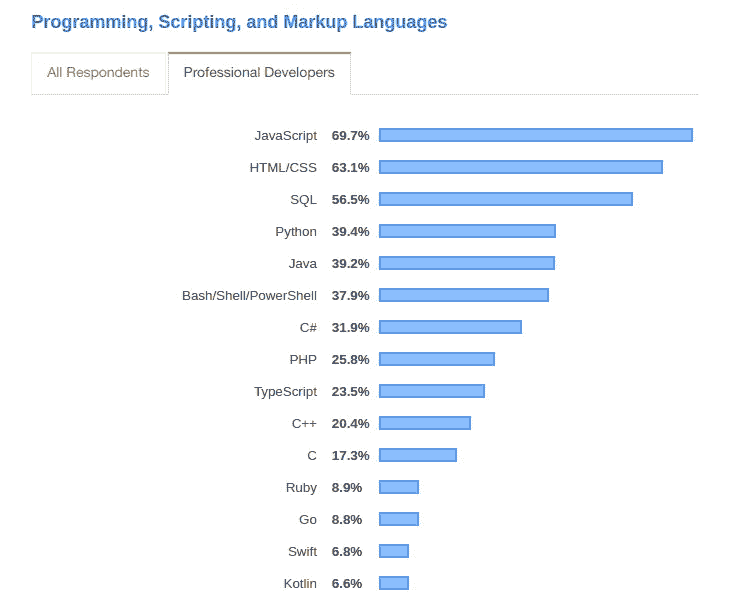

我整理了一个名为 SQL for 初学者数据科学家的系列文章，共有七篇文章。通过阅读，你可以用一种非常务实和愉快的方式学习 SQL。

# 安装 PostgreSQL 和 pgAdmin

# PostgreSQL 是什么？

PostgreSQL 或 Postgres 是一个关系数据库管理系统，它提供了 SQL 查询语言的实现。对于许多小型和大型项目来说，这是一个受欢迎的选择，它的优点是符合标准，并具有许多高级功能，如可靠的事务和无读锁的并发性。

这里有一个在数字海洋机器上安装 PostgreSQL 的逐步指南，在您的终端上编写一组命令行。这是应在 Ubuntu 18.04 LTS 上进行的安装，但在此之前，让我们检查一下您是否以前安装过 PostgreSQL，如果您没有任何安装，并且您的机器是干净的，您可以跳到下一步。

# 第一步:检查旧安装

在这一步你必须做三件事来完成你任务的第一步

## 第一项任务:列出所有与 Postgres 相关的包

```
$ dpkg -l | grep postgrespostgresql                            
postgresql-8.3                        
postgresql-client                     
postgresql-client-8.3                 
postgresql-client-common           
postgresql-common                  
postgresql-contrib                                
postgresql-contrib-8.3
```

## 第二项任务:移除上面列出的所有包

```
$ sudo apt-get --purge remove postgresql postgresql-10 postgresql-9.5 postgresql-client postgresql-client-10 postgresql-client-9.5 postgresql-client-common postgresql-common postgresql-contrib postgresql-contrib-9.5
```

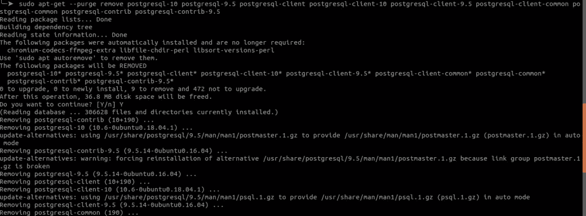

## 第三项任务:删除以下文件夹

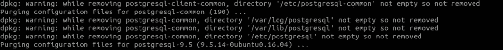

如果您检查最后一个图像，您会在此过程中发现一些警告消息，因此下一个任务是从我们的系统中删除这些文件

```
$ sudo rm -rf /var/lib/postgresql/
$ sudo rm -rf /var/log/postgresql/
$ sudo rm -rf /etc/postgresql/
```

让我们进入学习 SQL 旅程的下一步

# 第二步:安装 PostgreSQL

Ubuntu 的默认库包含 Postgres 包，因此您可以使用`apt`打包系统轻松安装这些包。如果这是您第一次在`apt` 这个会话中使用，您需要刷新我们的本地包索引。然后你可以安装 Postgres 包和一个`-contrib`包，这个包增加了一些额外的工具和功能:

```
$ sudo apt-get update
```

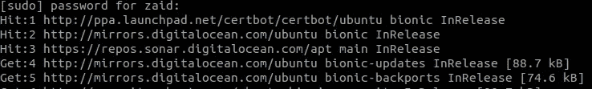

引入更新存储库的命令后，第一个屏幕要求您输入密码。

```
$ sudo apt-get install postgresql postgresql-contrib
```

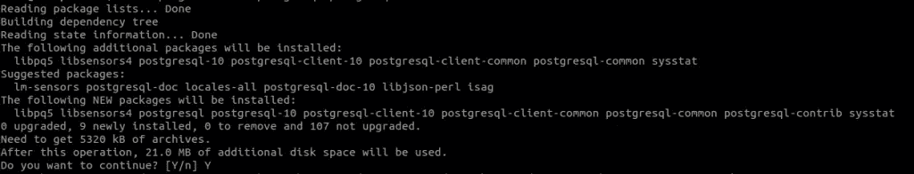

第二个屏幕询问您是否想继续，请键入 yes！
干得好！您完成了安装 PostgreSQL 的第一个任务。

安装过程创建了一个名为`postgres`的用户帐户，它与默认的 Postgres 角色相关联。为了使用 Postgres，您可以登录该帐户。好的一面是，您可以使用以下命令登录这个超级用户的帐户:

```
$ sudo -i -u postgres
```


看看这个，第一件事就是问你密码。你注意到上面屏幕的变化了吗？如果没有，再看截图，*拜托。*
当前用户`zaid`变为新用户`postgres.``postgres`用户将能够使用以下命令访问 SQL:

```
$ psql
```

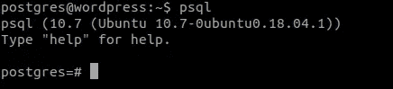

您将登录并能够立即与数据库管理系统进行交互。

从 PostgreSQL 控制台注销后，数据库中只配置了超级用户。因此，您需要使用 create user 命令从命令行创建新角色。让我们生成一个新用户，这样您就可以在将来使用服务器的相同用户来访问您的数据库(这是推荐的做法)。因此，您需要使用 *create user* 命令从命令行创建新角色。让我们生成一个新用户，这样您就可以在将来使用服务器的相同用户来访问您的数据库(这是推荐的做法)。

在我们的案例中:

```
create user zaid with encrypted password 'password_to_login_in_my_ server';
```

创建新用户后，首先从 PostgreSQL 控制台键入`\q` exit，然后键入`exit`退出超级用户并返回到您的主页。

```
postgres=# \q
postgres@wordpress:~$ exit
```


一旦有了合适的用户，就可以使用这个命令登录到 Postgres 数据库

```
$ psql -U zaid -d postgres
```

如果你看到下图，这意味着你做得很好。


使用这个命令，您可以列出 Postgres 数据库的所有用户

```
\du
```

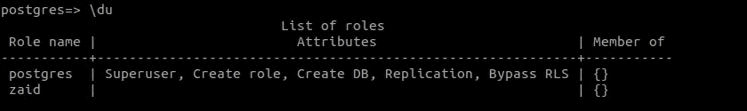

太棒了。让我们转到 SQL，通过键入这些 SQL 表达式来感受一下它的乐趣:

```
CREATE TABLE test_table(name TEXT, phone VARCHAR(11), address TEXT);
INSERT INTO test_table VALUES ('Zaid', '07911123456','Oxford Street');
INSERT INTO test_table VALUES ('David', '07922123456','Manchester Street');
```

第一行生成一个名为“test_table”的新表，第二行和第三行在表中插入一些值。

```
SELECT * FROM test_table;
```

上面一行将 test_table 中的所有值打印到屏幕上

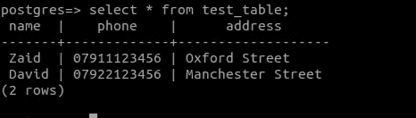

在这个 SQL 小游戏之后，您再次退出 PostgreSQL 控制台:

```
postgres=# \q
```

# 第三步:安装 pgAdmin

是时候安装和设置 pgAdmin 了。pgAdmin 是 PostgreSQL 及其相关数据库管理系统的开源管理和开发平台。它用 Python 和 jQuery 编写，支持 PostgreSQL 中的所有特性。您可以使用 pgAdmin 完成从连接到的所有工作。在这一步中，您必须完成三项任务才能从您的个人笔记本电脑完成 missionPostgres 数据库的第一步:编写基本的 SQL 查询、编写复杂的查询、监控您的数据库以及配置高级数据库架构。

在本教程中，我们将介绍安装和配置最新版本的 pgAdmin、通过 web 浏览器访问 pgAdmin 并将其连接到服务器上的 PostgreSQL 数据库的过程。

在这一步，你要做三件事来完成你的第三步任务。

## 第一项任务:配置连接。

作为第一项任务，通过键入这些代码，让您的远程服务器准备好连接。第一行是允许来自任何(或特定)IP 地址的传入连接。

```
$ sudo su - root
# echo "listen_addresses = '*'" >> /etc/postgresql/10/main/postgresql.conf
```

*注意:上面的一行只有一行，小心点。*


第二行用于使适用的用户能够从任何(或特定)IP 地址访问所有数据库。

```
# echo 'host all all 0.0.0.0/0 md5' >> etc/postgresql/10/main/pg_hba.conf
```

*注意:这是一行代码！只有你的浏览器把它分成 2 行！*


添加这两行代码后，重启并退出 root bash。

```
# /etc/init.d/postgresql restart
# exit
```

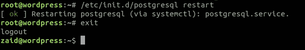

## 第二项任务:下载并安装程序。

从[**https://www.postgresql.org/media/keys/ACCC4CF8.asc**](https://www.postgresql.org/media/keys/ACCC4CF8.asc)导入存储库密钥:

```
$ sudo apt-get install curl ca-certificates curl [https://www.postgresql.org/media/keys/ACCC4CF8.asc](https://www.postgresql.org/media/keys/ACCC4CF8.asc) | sudo apt-key add -
```

(您可以通过运行 **lsb_release -c** 来确定您的发行版的代码名称)。对于上述内容的简化版本，假设您使用的是受支持的版本:

```
$ sudo sh -c 'echo "deb [http://apt.postgresql.org/pub/repos/apt/](http://apt.postgresql.org/pub/repos/apt/) $(lsb_release -cs)-pgdg main" > /etc/apt/sources.list.d/pgdg.list'
```

最后，更新软件包列表，并开始安装软件包:

```
$ sudo apt-get update sudo apt-get install pgadmin4
```

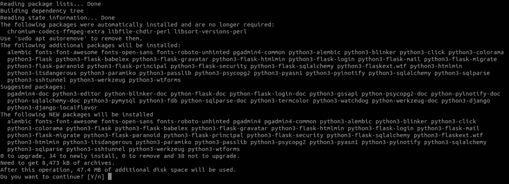

## 第三个任务:连接服务器。

完成后，您将看到以下屏幕:

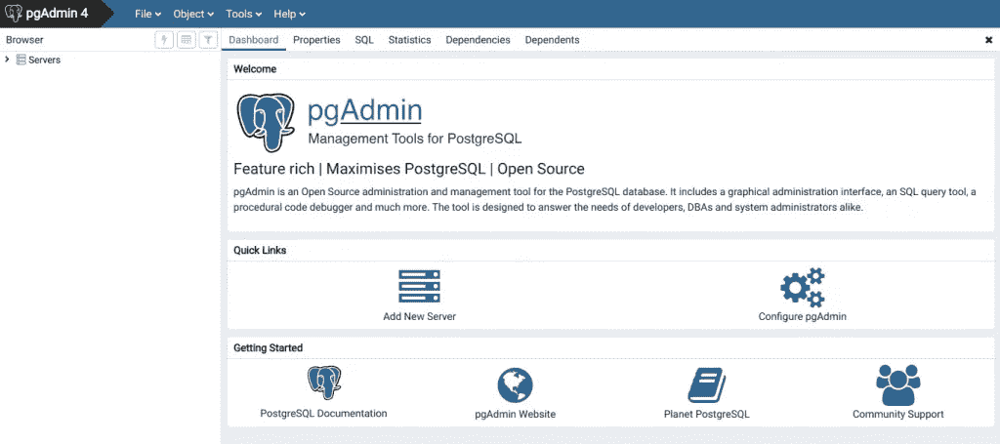

单击添加新服务器图标，并填写弹出窗口:

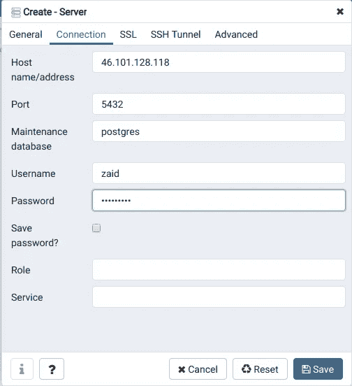

常规:

```
“Name:” anything you want (eg. “our test server“)
```

"连接:"

```
“Host name/address:” your remote server’s IP Address (in my case: 46.101.128.118)
“Port:” 5432
“Maintenance database:” postgres
“User name:” [your_user_name]
“Password:” your recently generated SQL password for your user
```

点击并保存祝贺！！您已连接到您的数据库！

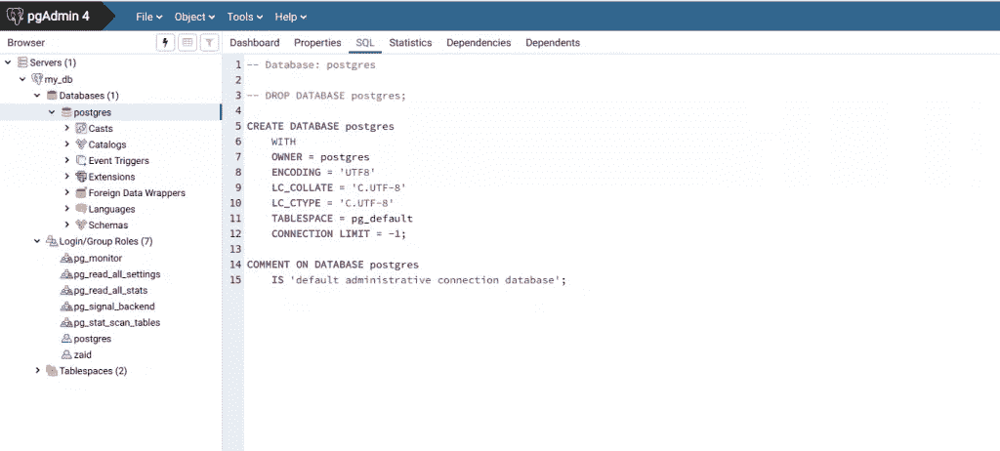

乍一看，这并不简单，但是您可以在左侧发现不同的文件夹。如果您右键单击服务器的名称(在我的截图上:“SafaCreations 测试服务器”)，您可以从您的服务器断开连接。或者以同样的方式连接，当你想回去的时候。
请注意，在我们的屏幕截图上，您可以看到我们在 PostgreSQL 控制台中得到的完全相同的结果！

# 结论

你完成了任务，我亲爱的朋友，干得好！
**您已经创建并安装了 SQL，这是您成为数据科学家的奇妙的第一步！**
正如我在这篇文章中多次提到的，我已经创建了相当多的教程来向您展示如何使用 SQL。所有这些都是从最基本的开始。我们将在接下来的几周开始放更多的文章。因此，请与我们保持联系，找到学习 SQL 的简单方法。

[*查看我们在 udemy*](https://www.udemy.com/course/amazon-aws-mastering-boto3-using-python/?couponCode=1BDB3420D6804133A918) 上的免费课程

> *感谢阅读。如果你喜欢这篇文章，请点击下面的按钮，这样我们就可以保持联系。*