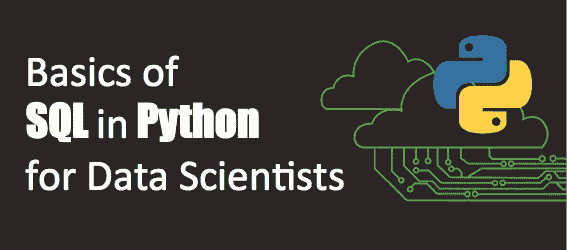
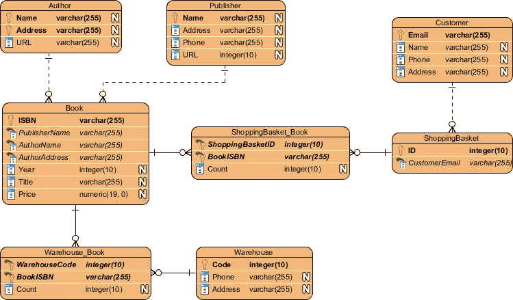
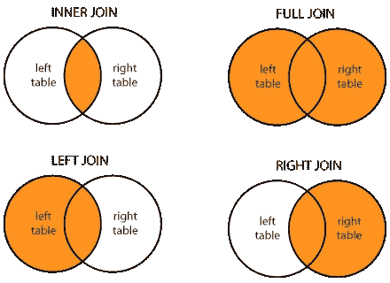

# 面向数据科学家的 Python 中的 SQL 介绍

> 原文：<https://towardsdatascience.com/sql-in-python-for-beginners-b9a4f9293ecf?source=collection_archive---------1----------------------->

## 在 Python 环境中使用 SQL 的数据科学家指南。

本文为数据科学家提供了基本 SQL 语句的概述，并解释了如何在 Python 中实例化 SQL 引擎并用于从数据库中查询数据。



作为一名使用 Python 的数据科学家，您经常需要从本地服务器或云(例如 AWS cloud)上托管的关系数据库中获取数据。有许多方法可以解决这个问题。例如，您可以在 Oracle 中查询您的数据，将文件保存为`.csv`文件，然后在 Python 中导入它。然而，最有效的方法是在 Python 中直接使用 SQL。SQL 和 Pandas 的结合将为您在 Python 中查询、处理和使用项目数据提供许多选择。

## 重要的事情先来！什么是 SQL？

SQL(也称为结构化查询语言)是一种编程语言，用于管理或查询存储在关系数据库管理系统(RDBMS)中的数据。SQL 一直是处理结构化数据的主要语言，其中数据库中的实体(例如表或表实体)是相关的(这就是为什么这些数据库被称为关系数据库)。处理这类数据还有其他选择，但 SQL 是业内最流行、最广泛使用的语言。

## **“SQL”怎么发音？**

SQL 于 20 世纪 70 年代初由 IBM 开发，最初名为“ [SEQUEL(结构化英语查询语言)](https://en.wikipedia.org/wiki/SQL)”。后来，由于商标问题，该名称被改为 SQL(结构化查询语言)。然而，发音“see-qu-El”([/ˈsiːkwəl/](https://en.wikipedia.org/wiki/Help:IPA/English))保留了下来，这也是大多数从业者所采用的发音。

如果你想得到这份工作，当你去面试的时候，确保你的发音是“see-qu-el ”!]

## 关系数据库看起来像什么？

[Amazon Web Services 为关系数据库提供了最佳定义:](https://aws.amazon.com/relational-database/)

> 关系数据库是数据项之间具有预定义关系的集合。这些条目被组织成一组包含列和行的**表**。表用于保存关于要在数据库中表示的对象的信息。表中的每一列保存某种数据，一个字段存储属性的实际值。表中的行表示一个对象或实体的相关值的集合。**一个表**中的每一行都可以用一个被称为**主键**的**唯一标识符**来标记，多个表中的**行可以使用外键**进行关联**。可以用许多不同的方式访问这些数据，而无需重新组织数据库表本身。**

数据库可以有非常复杂的设计，有许多表，每个表有许多实体(列)和许多行。当不知道表之间的关系时，查询数据将非常困难，甚至是不可能的。 **ERD** (实体关系图)用于可视化这些关系，还显示每个表中的实体及其数据类型。您的数据库管理员应该能够为您提供数据库的 ERD。



A Sample ERD — [https://www.visual-paradigm.com/guide/data-modeling/what-is-entity-relationship-diagram/](https://www.visual-paradigm.com/guide/data-modeling/what-is-entity-relationship-diagram/)

## **SQL 在 Python 中是如何使用的？**

在 Python 中使用 SQL 有很多种方法。为此，已经开发了多个可以利用的库。SQLite 和 MySQL 就是这些库的例子。

在本文中，我们将结合`[sqlalchemy](https://www.sqlalchemy.org/)` [库使用 Python Pandas。](https://www.sqlalchemy.org/)

## 创建 SQL 引擎

我们开始吧！我们需要先安装然后导入库。我们将使用这个库中的`create_engine`特性。

```
!pip install sqlalchemyimport pandas as pd
from sqlalchemy import create_engine
```

一旦库被导入，我们需要使用这个命令创建一个 SQL 引擎，它创建一个新的 class`.Engine `实例。

```
engine = create_engine(*args, **kwargs)
```

第一个参数通常是以 URL 形式表示数据库方言和连接参数的字符串，可以写成:

```
dialect[+driver]://user:password@host/dbname[?key=value..]
```

其中`dialect`是数据库名称，如`mysql`、`oracle`、`postgresql`等。，以及`driver` 一个 DBAPI 的名字，如`psycopg2`、`pyodbc`、`cx_oracle`等。更多细节可以在 https://www.sqlalchemy.org/的[找到。](https://www.sqlalchemy.org/)

## 使用 SQL 语句的数据查询

现在您已经连接到数据库，您可以提交数据查询。要使用`sqlalchemy`，您需要将您的 SQL 语句包装在一个容器中，将其发送到数据库，获取响应，然后将响应放入`panda`数据帧中。每个查询中必须存在的两个主要子句是`SELECT`和`FROM`。

*   `SELECT`允许你从一个表中选择列的子集(或全部)，
*   `FROM`指定从哪个表中提取列。

例如，下面的代码片段将从`table_1`返回所有实体(列),将响应保存到 dataframe 中，并显示标题。

```
sql = """
SELECT *
FROM table_1
"""df = pd.read_sql_query(sql, engine)
df.head()
```

相反，您也可以使用以下代码从表中提取特定的列:

```
SELECT entity_1, entity_2, entity_3
FROM table_1
```

如果您正在处理多个表(在实际项目中肯定会这样)，您可能需要指定哪个表中的哪个实体，因为感兴趣的实体可能来自数据库中的不同表。我们将讨论如何查询多个表中的多个实体，但是这个例子是针对一个表中的实体的。在这种情况下，您可以在 SQL 语句中使用`namespacing`:

```
SELECT table_1.entity_1, table_1.entity_2
FROM table_1
```

出于简化或可读性的目的，还可以为每个实体名或表名指定别名:

```
SELECT t.entity_1 AS name, t.entity_2 AS id
FROM table_1 AS t
```

如果您想从一列中获得不同的行，您可以发送以下 SQL 语句:

```
SELECT DISTINCT entity_1
FROM table_1
```

如果您想按特定列(或多列)对数据进行排序，您可以使用`ORDER BY`并指定您想要的`ASC`(升序)或`DESC`(降序)顺序。请记住，如果您在`ORDER BY`中使用多列，SQL 排序数据的顺序将是从左到右。

```
SELECT entity_1, entity_2, entity_3
FROM table_1
ORDER BY entity_1 DESC, entity_3 ASC
```

有时您正在处理一个非常大的数据集，但是您可能只需要从数据库中检索一个有限的数据集。如果出现这种情况，可以使用`LIMIT:`

```
SELECT *
FROM table_1
LIMIT 10
```

如果你想在查询中包含一个条件，你可以使用`WHERE.`或者使用布尔条件，或者使用`wildcards`作为字符串实体。例如:

```
SELECT *
FROM table_1
WHERE entity_1 > 5
```

或者`WHERE entity_1 BETWEEN 5 and 10`

或者`WHERE entity_1 > 5 AND entity_1 < 10.`

[**通配符**(或称通配符)是用来替换或表示单词中一个或多个字符的符号。大家比较熟悉的是](https://www.computerhope.com/jargon/w/wildcard.htm) `[*](https://www.computerhope.com/jargon/w/wildcard.htm)` [用于](https://www.computerhope.com/jargon/w/wildcard.htm) `[zero or many characters](https://www.computerhope.com/jargon/w/wildcard.htm)` [或者](https://www.computerhope.com/jargon/w/wildcard.htm) `[?](https://www.computerhope.com/jargon/w/wildcard.htm)` [用于](https://www.computerhope.com/jargon/w/wildcard.htm) `[one character](https://www.computerhope.com/jargon/w/wildcard.htm).`在 SQL 中使用`LIKE`语句查询字符串实体时，我们可以在 SQL 中有效地使用通配符。`%`和`*`的区别在于`%`也占下划线，而`*`没有。在 Python 中，你应该使用`%%`而不是一个`%`。以下语句返回`entity_3`以`M.`开始的所有行

```
SELECT *
FROM table_1
WHERE entity_3 LIKE "M%%"
```

`ILIKE`使该查询不区分字符大小写，并且`NOT LIKE`返回实体是**而不是通配符**的所有行。

要处理空值，您可以使用:

```
SELECT *
FROM table_1
WHERE entity_1 IS NULL
```

或者`WHERE entity_1 IS NOT NULL.`

通常，您需要聚合数据、对数据进行分组，并对聚合的数据应用条件。这些汇总报表包括`COUNT, AVG, MIN, MAX, and SUM.`例如:

```
SELECT SUM(entity_1) AS sum, entity_2
FROM table_1
```

使用聚合时，应该使用`HAVING`而不是`WHERE,`，比如:

```
SELECT SUM(entity_1) AS sum, entity_2
FROM table_1
HAVING entity_2 BETWEEN 5 and 10
```

要按特定实体对数据进行分组，您可以使用`GROUP BY:`

```
SELECT entity_1, SUM(entity_2) AS sum
FROM table_1
GROUP BY entity_1
HAVING entity_3 BETWEEN 5 and 10
```

## 连接表格

当查询多个表中的数据时，需要连接这些表。在 SQL 中有多种连接表的方法。下图说明了这些连接。您可能会更频繁地使用内部联接，但是理解每种类型的联接的作用很重要。



Different Types of Table Joins in SQL — [https://www.dofactory.com/sql/join](https://www.dofactory.com/sql/join)

只有当两个表之间有一个公共实体时，才能连接表，您需要使用`ON`来定义这种关系。

```
SELECT t_1.entity_1, t_2.entity_2
FROM table_1 AS t_1 
INNER JOIN table_2 AS t_2 ON t_2.key = t_1.key
```

这些语句涵盖了 Python 中 SQL 的基础知识。您可以根据您正在处理的数据库、您需要的数据类型来组合这些语句。你可以使用更多的语句。https://www.w3schools.com/sql/对 SQL 语句提供了更全面的概述。

***Nick Minaie，博士****(*[*LinkedIn 简介*](https://www.linkedin.com/in/nickminaie/) *)是一位高级顾问和富有远见的数据科学家，代表了领导技能、世界级数据科学专业知识、商业敏锐度和领导组织变革能力的独特组合。他的使命是推进人工智能(AI)和机器学习在行业中的实践。*