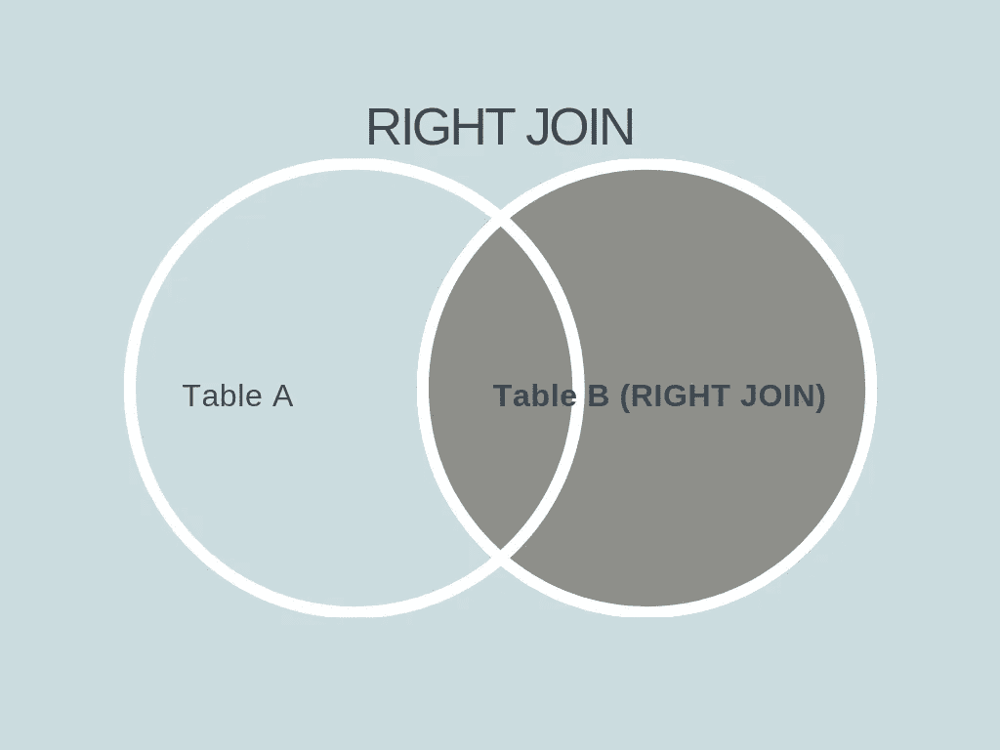

# SQL 连接

> 原文：<https://towardsdatascience.com/sql-join-8212e3eb9fde?source=collection_archive---------9----------------------->

## 一次一个联接地将数据汇集在一起

> 感谢[周润发](https://medium.com/@jeremyrchow)巧妙的字幕！


Photo by [Marc Sendra Martorell](https://unsplash.com/@marcsm?utm_source=unsplash&utm_medium=referral&utm_content=creditCopyText) on [Unsplash](https://unsplash.com/search/photos/bubble?utm_source=unsplash&utm_medium=referral&utm_content=creditCopyText)

> 我在这个博客中使用的代码可以在我的 GitHub 上找到。

SQL 有很多东西要学，尤其是对我来说。我花了最长时间理解的事情之一是`JOIN`陈述。一开始这很吓人，但是经过阅读和大量的练习，我掌握了窍门，我希望在这篇博客结束时，你也会有同样的感觉！

在这篇博客中，我们将讨论四种不同类型的连接:

*   内部联接(或联接)
*   左连接(或左外连接)
*   右连接(或右外连接)
*   完全连接

# **安装**

**对于这些例子，我们将使用好的 ol' Chinook 数据库，它也用于 SQL 基础博客和我的大多数其他 SQL 相关博客。**

**让我们设置数据库文件、库和函数:**

****

**The chinook database for visualization purposes**

**数据库已经加载，现在我们准备好处理连接了！**

# **内部联接/联接**

****

**The INNER JOIN keyword**

****`INNER JOIN`**关键字选择两个表中满足条件的所有行。**该关键字创建一个新的集合，该集合组合了两个表中公共字段值相同的所有行。****

****让我们用一个例子来看看这是如何工作的:****

```
**SELECT a.name, a.composer, b.name
FROM tracks AS a
INNER JOIN genres AS b
ON a.genreid = b.genreid
WHERE b.name LIKE 'b%'
LIMIT 10;**
```

****在将`tracks`表设置为变量名`a`并将`genres`表设置为变量名`b`、**后，这两个表通过一个公共键**链接起来，这个公共键就是两个表中都存在的`genreid`键。然后，它从`tracks`表中找到歌曲名称和作曲家，然后从`genres`表中找到相应的流派名称。****

****然后，它将结果限制为歌曲名称以字母“b”开头的歌曲，并进一步将结果限制为前 10 个。最终输出将返回 10 首蓝调风格的歌曲，包括歌曲名和作曲家名。****

****现在我们可以更好地解释`INNER JOIN`关键字中发生的事情，让我们继续讨论`LEFT JOIN`关键字！****

# ****左连接/左外连接****

********

****The LEFT JOIN keyword****

******`LEFT JOIN`**关键字** **返回连接左侧表的所有行和连接右侧表的匹配行。**如果左侧的行与右侧的行不匹配，空值*将填充右侧的空间。*******

```
**SELECT a.trackid, a.name, a.composer, b.invoicelineid, b.invoiceid
FROM tracks AS a
LEFT JOIN invoice_items AS b
ON a.trackid = b.trackid;**
```

****在上面的例子中，查询将`tracks`表设置为变量名`a`，将`invoice_items`表设置为变量名`b`。它通过公共键`trackid`将它们链接起来，并返回 tracks 表中的 trackid、name 和 composer，以及 invoice_items 表中的 invoice line ID 和 invoice ID。****

****在查看数据时，您可能会想:“空值去了哪里？”。如果你没有，我们将向你展示如何找到其中的一些！****

```
**SELECT a.trackid, a.name, a.composer, b.invoicelineid, b.invoiceid
FROM tracks AS a
LEFT JOIN invoice_items AS b
ON a.trackid = b.trackid
**WHERE b.invoiceid IS NULL;****
```

****`IS NULL`子句对于查找列中的任何空值非常有用。将这一行添加到原始示例中，我们发现许多行在原始的`invoice_items`表中没有值，而是被替换为空值。****

# ****右连接/右外部连接****

********

****The RIGHT JOIN keyword****

****正如你所料，`RIGHT JOIN`与`LEFT JOIN`相似。**该连接返回连接右侧的表的所有行以及连接左侧的表的匹配行。**并且，对于左侧现在有匹配行的任何行，这些值被替换为空值*。*****

*****在大多数查询中，`RIGHT JOIN`看起来像这样:*****

```
***SELECT a.trackid, a.name, a.composer, b.invoicelineid, b.invoiceid
FROM tracks AS a
**RIGHT JOIN** invoice_items AS b
ON a.trackid = b.trackid;***
```

*****请注意，该设置看起来几乎与`LEFT JOIN`示例中的示例一模一样，只是现在显示为`RIGHT JOIN`。*****

*******现在，对于那些使用不支持** `RIGHT JOIN` **的 SQL 程序的人来说，** `RIGHT JOIN` **关键字本质上是一个翻转的** `LEFT JOIN`。以下是该变通办法的效果:*****

```
***SELECT b.trackid, b.name, b.composer, a.invoicelineid, a.invoiceid
FROM invoice_items AS a
**LEFT JOIN** tracks AS b
ON a.trackid = b.trackid;***
```

*****它对`RIGHT JOIN`关键字进行了细微的调整，但是它将输出与`RIGHT JOIN`示例相同的内容。*****

*****该查询的输出将显示实际订购歌曲的发票。任何发票中未订购的任何歌曲都不会显示在该查询中。*****

*****现在我们已经有了这些例子，让我们继续进行`FULL JOIN`！*****

# *****完全连接/完全外部连接*****

**********

*****The FULL JOIN keyword*****

*******`FULL JOIN`**关键字通过组合** `LEFT JOIN` **和** `RIGHT JOIN`的结果来创建结果。对于任何不匹配的行，结果将包含空值。*******

*****该关键字很少使用，但可用于查找两个表之间的重复行、缺失行或相似行。*****

*****如果您的 SQL 程序支持，您的查询看起来会非常简单:*****

```
***SELECT table1.column1,table1.column2,table2.column1,....
FROM table1 
**FULL JOIN** table2
ON table1.matching_column = table2.matching_column;***
```

*****知道`FULL JOIN`本质上是一个`LEFT JOIN`和一个`RIGHT JOIN`的组合是很有用的。假设我们的 SQL 程序既不支持`FULL JOIN`也不支持`RIGHT JOIN`，我们的查询应该是这样的:*****

```
***SELECT * 
FROM invoice_items AS a
**LEFT JOIN** tracks AS b
ON a.trackid = b.trackid
**UNION**
SELECT *
FROM tracks AS a
**LEFT JOIN** invoice_items AS b
ON a.trackid =b.trackid
**WHERE a.trackid IS NULL;*****
```

*****在这个例子中，有三件主要的事情在进行:*****

1.  *****第一部`LEFT JOIN`*****
2.  *****第二个`LEFT JOIN`(伪`RIGHT JOIN`)*****
3.  *****将两者合并在一起的`UNION`*****

*****`IS NULL`行确保重复的行不会被输入到结果集中，这对获得可读的结果非常有用。*****

*****结果将输出 2240 行数据，包括发票数据和单首歌曲数据。*****

# *****结论*****

*****唷！有很多问题，我很感谢你在这里逗留了这么久！*****

*****总的来说，下面是每个 JOIN 关键字的作用:*****

*   *******内部连接**:从两个表中选择具有匹配公共键的所有行。*****
*   *******左连接**:使用左侧表格中的所有行，并从右侧表格中寻找匹配的行。*****
*   *******右连接**:使用右侧表格中的所有行，并从左侧表格中找到匹配的行。*****
*   *******完全连接**:合并两个表中的所有行。*****

*****希望这有助于了解如何用你的数据库创建连接查询，我希望你会在下一篇文章中 ***加入*** 我！*****