# SQL 连接

> 原文：<https://towardsdatascience.com/sql-joins-55cbbffb2002?source=collection_archive---------8----------------------->

## 用 pandas 数据框架展示不同类型的 SQL 连接

如果你以前从未使用过 SQL，它可能会有点吓人。您会听到人们谈论表之间的复杂连接，但不知道他们在谈论什么。在过去的几年里，我已经教了很多人如何编写 SQL 查询，我想我可以在互联网上与大众分享一些知识。

# 首先，什么是 join？

在关系数据库中，如果表共享一个键，它们可以相互连接。主键是一个**不能在一个表中**重复的值。这意味着一个值在主键列中只能出现一次。该键可以作为外键存在于另一个创建关系的表中。外键**在一个表中可以有重复的实例。**

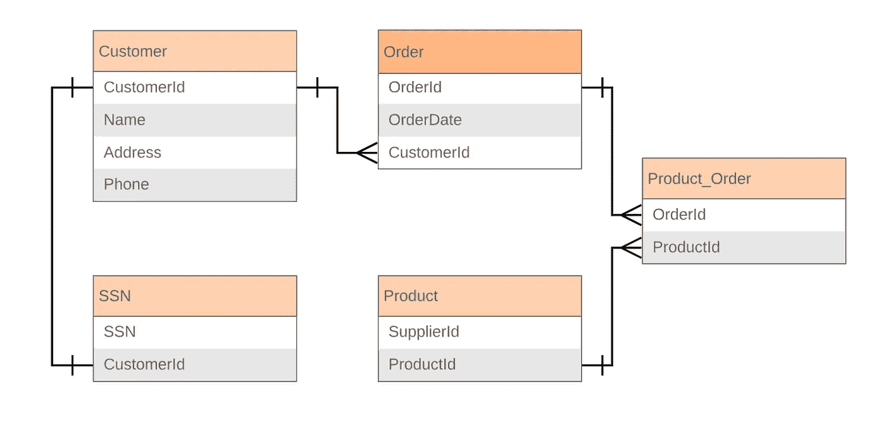

ERD example for relationships below

## 表关系

表之间的关系类型有一对一、一对多和多对多。

**一对一**类似于拥有一张顾客表和一张 SSN 表。一个客户只能有一个 SSN，一个 SSN 只能分配给一个人。Customer 表上的主键是 CustomerId，它是 SSN 表上的外键。

**一对多**就像有一个客户表和一个订单表。一个客户可以有多个订单，但是这些订单只能与一个客户相关联。在本例中，主键和外键是相同的。

**多对多**看起来就像有一个订单表和一个产品表。一个订单可以包含许多产品，一个产品可以包含在许多订单中。这些关系通常会有另一个表，您需要使用该表将主 Order 表和 Product 表连接在一起。您将在上面的图表中看到，该表名为 Product_Order。ProductId 和 OrderId 都是 Product_Order 表上的外键，但它们是各自表中的主键。

# 连接的类型

有 4 种类型的联接:内联接、左联接、右联接和全外联接。我将使用上面客户和订单表的一对多示例，通过一个非常简单的 pandas 数据框架向您展示这些内容，但是我还将展示 SQL 语法。

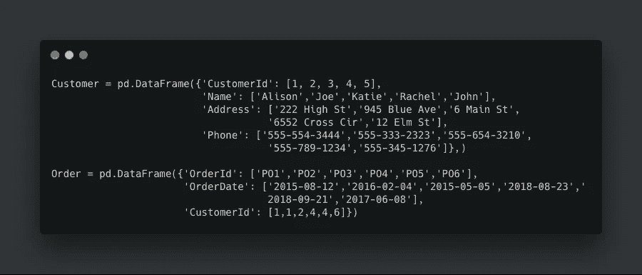

Using python pandas to create dataframes

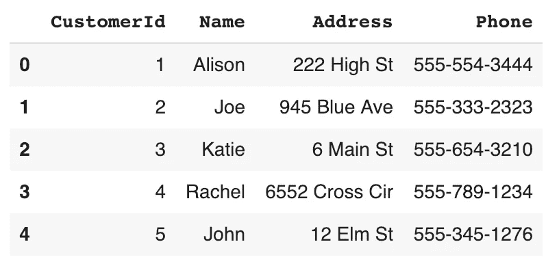

Customer table

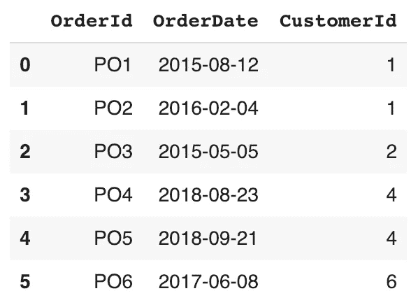

Order table

提醒一下，CustomerId 是 Customer 表的主键，也是 Order 表上的外键。OrderId 是订单表上的主键。

## 内部连接

内部联接将返回两个表中都存在所联接字段的值的行。

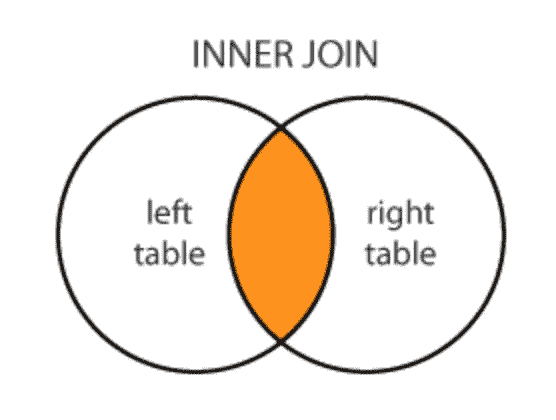

Image from dofactory

在 SQL 中，您可以使用 JOIN，因为它默认为内部连接。或者可以包含内部联接。

在 SQL 中，这可以写成:

```
SELECT *
FROM Customer
JOIN Order ON Customer.CustomerId = Order.CustomerId;
```

在 Pandas 中，你可以使用合并功能。

```
pd.merge(Customer, Order, how='inner', on='CustomerId')
```

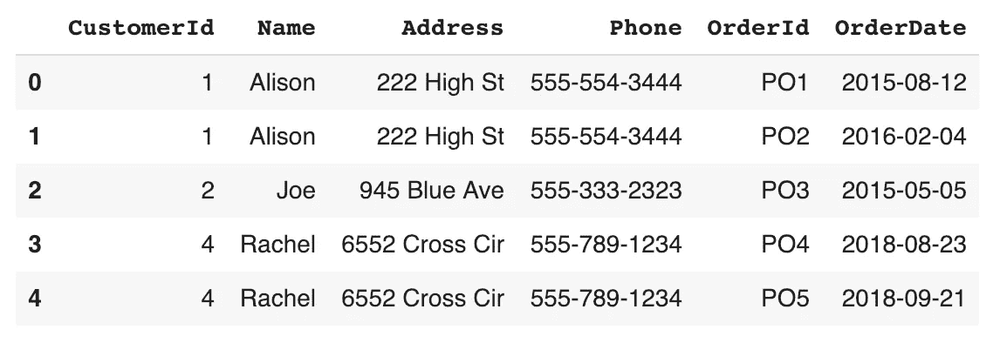

Order 表中存在的唯一 CustomerId 值是[1，2，4]，因此在内部连接的结果中，CustomerId [3，5]不返回。

## 左连接

左连接将返回第一个表(在本例中为 Customer)中的所有行，并且只填充第二个表中存在键值的字段。它将在第二个表中不存在的地方返回 NULLs(或者 python 中的 NaNs)。

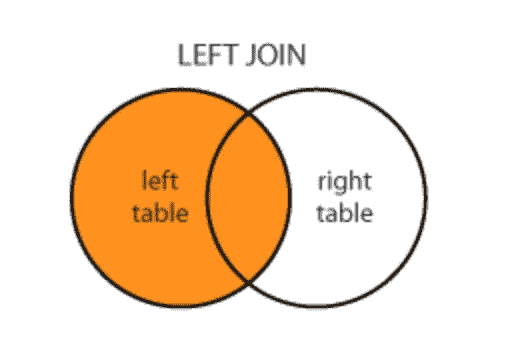

Image from dofactory

在 SQL 中，这将被写成:

```
SELECT *
FROM Customer
LEFT JOIN Order ON Customer.CustomerId = Order.CustomerId;
```

对于熊猫来说:

```
pd.merge(Customer, Order, how='left', on='CustomerId')
```

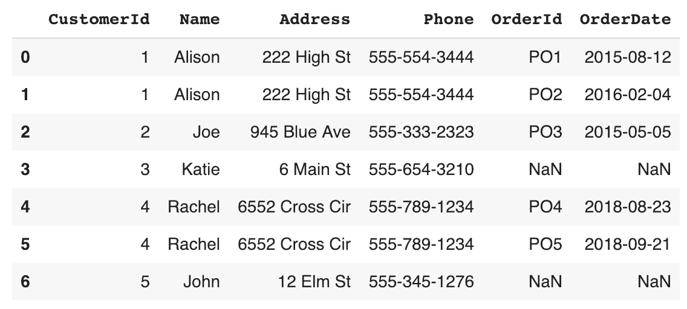

通过这个连接，我们可以看到所有的 customerid[1，2，3，4，5]，但是这些 customerid 有重复，因为它们有多个订单。CustomerId [3，5]没有任何订单，因此 OrderId 和 OrderDate 返回 NaN。

## 右连接

右连接将返回写入的第二个表中的所有行，在这个实例中排序，并且只填充存在键值的第一个表的字段。它将在第一个表中不存在的地方返回 NULLs(或者 python 中的 NaNs)。

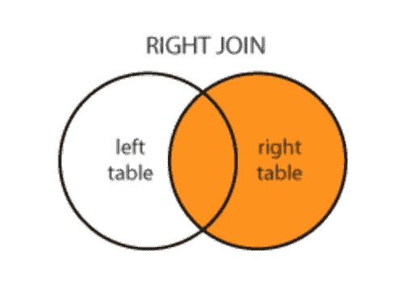

Image from dofactory

在 SQL 中，这将被写成:

```
SELECT *
FROM Customer
RIGHT JOIN Order ON Customer.CustomerId = Order.CustomerId;
```

对于熊猫来说:

```
pd.merge(Customer, Order, how='right', on='CustomerId')
```

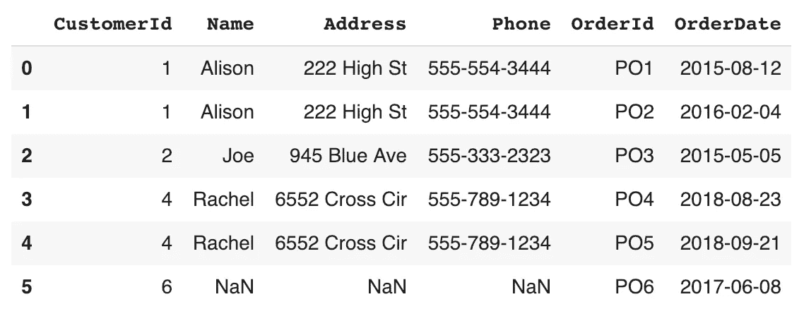

通过这个连接，我们可以看到 Order 表中的所有订单，但是由于 CustomerId 6 在 Customer 表中不存在，所以我们得到了 Name、Address 和 Phone 的 NaN 值。

## 完全外部连接

您还会听到这种称为外部连接(没有完整连接)的方法，因为您不必在编写的 SQL 中包含完整连接。

这将返回所有行，无论您要联接的字段中的值是否存在于两个表中。如果该值在另一个表中不存在，则该表的字段将返回空值。

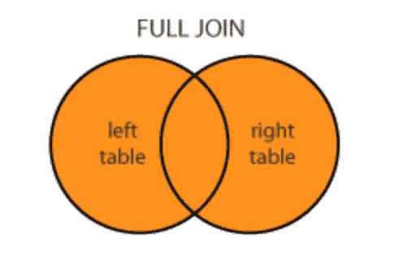

Image from dofactory

在 SQL 中，这将被写成:

```
SELECT *
FROM Customer
OUTER JOIN Order ON a.col1 = b.col1;
```

对于熊猫来说:

```
pd.merge(Customer, Order, how='outer', on='CustomerId')
```

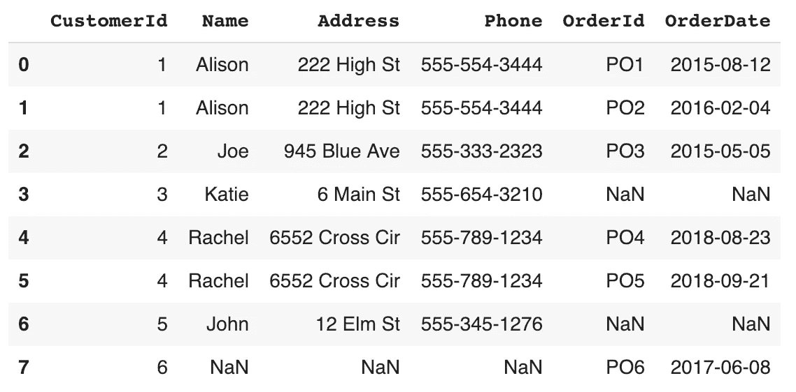

该联接的结果显示所有 CustomerId 和所有 OrderId。其中 CustomerId 为[3，5]，订单字段为 NaN，OrderId 为 6，客户字段为 NaN。

# 结论

在 SQL 和 Python 中，使用 pandas dataframes 用一个表中的一些数据补充另一个表中的数据，连接确实非常有用。在返回 NaN 或 NULL 值时必须小心，尤其是在向可能不允许 NULL 值的新表中插入数据时。理解要连接的表之间的关系也很重要，这样就不会返回不期望的结果。

我希望这些信息是有帮助的，我很乐意连接并回答您可能有关于 SQL 查询的任何问题！

注意:我在我写的 SQL 例子中使用了显式连接，但是有些人认为隐式连接也可以。根据我的经验，使用显式连接总是更安全，因为您确切地知道结果会是什么。隐式连接并不总是如你所愿。