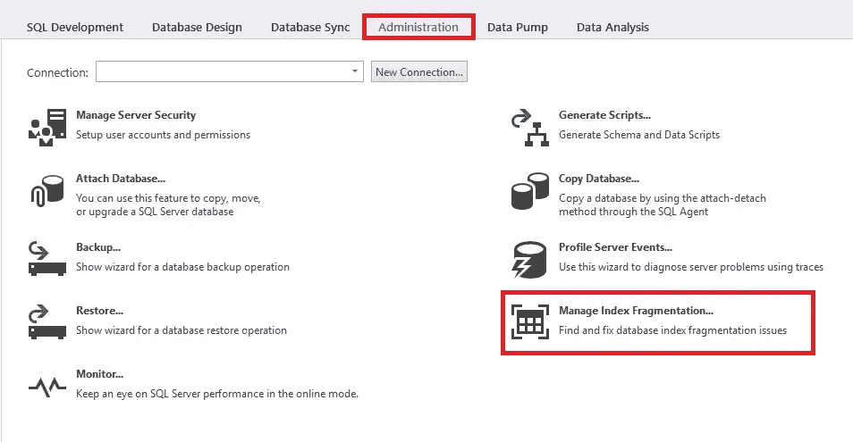
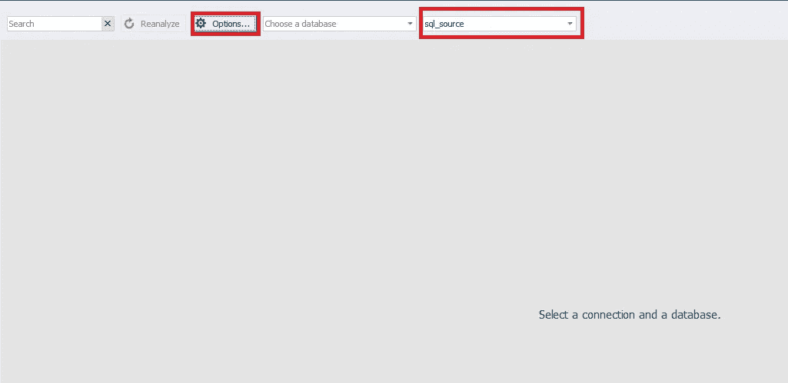
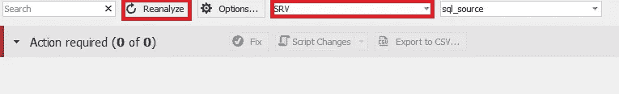
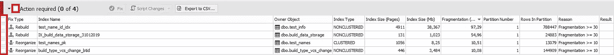
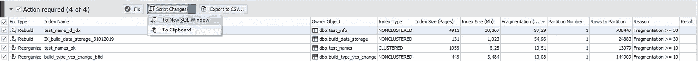
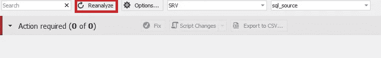

# SQL Server 索引分析和优化

> 原文：<https://towardsdatascience.com/sql-server-index-analysis-and-optimization-1edd84d9da?source=collection_archive---------9----------------------->

## 熟悉 SQL Server 数据库中索引分析和优化的关键方面


经常需要优化索引和统计数据，以便优化器更快地搜索必要的数据和更好地构建查询执行计划。

以下工作领域可以理解为索引优化:

*   缺失索引的创建
*   重叠索引的删除
*   删除未使用的索引
*   更改现有索引，以适应随时间变化的操作条件(键列的结构、包含列的结构以及索引本身的属性)
*   在随时间变化的操作条件下，删除那些维护成本明显大于其优化收益的指标
*   索引重组和重建。

# **SQL Server 索引分析**

借助以下查询，可以分析数据库中的索引碎片级别:

将返回以下列:

1.  **数据库** —数据库名称
2.  **模式** —模式对象(表，视图)
3.  **tb** —索引所在的表/视图
4.  **idx** —索引 ID
5.  **数据库标识** —数据库标识
6.  **索引名称** —索引名称
7.  **指标类型 desc** —指标类型描述
8.  **object_id** —索引所在的对象 id(表、视图)
9.  **frag_num** —分配单元最后一级的片段数
10.  **frag** —所有页面使用的可用磁盘空间的平均百分比
11.  **frag_page** —在分配单元 IN_ROW_DATA 的最后一级的一个片段中的平均页数
12.  **页** —索引页或数据的总数

这显示了大小不小于 1 个区(8 页)且碎片超过 10%的索引的碎片级别。它只适用于带有聚集索引的表，并且只考虑根索引。该查询使用两种系统视图:

1.  [**sys . DM _ db _ index _ physical _ stats**](https://docs.microsoft.com/en-us/sql/relational-databases/system-dynamic-management-views/sys-dm-db-index-physical-stats-transact-sql?view=sql-server-2017)—返回 SQL Server 中指定表或视图的数据和索引的大小和碎片信息。
2.  [**sys . indexes**](https://docs.microsoft.com/en-us/sql/relational-databases/system-catalog-views/sys-indexes-transact-sql?view=sql-server-2017)—包含表对象(如表、视图或表值函数)的每个索引或堆的一行。

接下来，让我们考虑何时推荐索引优化以及如何执行索引优化。

# **SQL Server 索引优化**

在上一个查询中，有两个指标特别重要:

1.  frag —索引碎片的级别，以百分比表示
2.  页面-索引总页数的大小

有不同的方法来解释索引碎片的级别和索引优化方法。本文将考虑其中之一。

在以下情况下，需要优化索引:

*   其大小超过 8 页，碎片化程度超过 30%。
*   它的大小超过 64 页，碎片程度超过 25%。
*   它的大小超过 1 000 页，碎片程度超过 20%。
*   它的大小超过 10 000 页，碎片程度超过 15%。
*   它的大小超过 100，00 0 页，碎片程度超过 10%。

有两种方法可用于索引优化:

**1。** **指标重组**

索引重组需要最少的系统资源。在重组过程中，表和视图中的聚集索引和非聚集索引的叶级通过叶级页的物理重组进行碎片整理。因此，它们按照叶节点的逻辑顺序排列(从左到右)。此外，重组会压缩索引页。它们的压缩是根据填充因子的当前值执行的。
您可以借助以下命令执行索引重组:

```
ALTER INDEX < index_name> ON <schema>.<table> REORGANIZE;
```

**2。索引重建**

重建会删除旧索引并创建新索引。这消除了碎片，通过将页压缩到指定或现有的填充因子来恢复磁盘空间，对连续页中的索引行进行重新排序，并更新新的索引统计信息。
您可以借助以下命令执行索引重建:

```
ALTER INDEX < index_name> ON <schema>.<table> REBUILD;
```

如果您的 MS SQL Server 版本支持，索引重建可以在线完成:

```
ALTER INDEX <index_name> ON <schema>.<table> REBUILD WITH(ONLINE=ON);
```

更多关于改变索引命令的信息可以在[这里](https://docs.microsoft.com/en-us/sql/t-sql/statements/alter-index-transact-sql?view=sql-server-2017)找到。

有许多免费和收费的索引优化工具。例如，[Sergey syrovacthenko](https://www.linkedin.com/in/sergeysyrovatchenko/)正在开发一个相当强大且免费的[工具](https://github.com/sergeysyrovatchenko/SQLIndexManager)用于优化索引。
该工具的优点如下:

*   获取碎片索引的优化算法
*   能够在一个流程中同时服务多个数据库
*   基于所选设置为索引自动选择操作
*   支持全局搜索和高级过滤，以实现更好的分析
*   许多关于索引的设置和有用信息
*   索引维护脚本的自动生成
*   支持堆和列索引维护
*   能够启用索引压缩和统计数据更新，而不是重建
*   支持 SQL Server 2008 和更高版本的所有版本，以及 Azure SQL 数据库。

关于该工具的详细讨论可以在这里找到[。](https://www.sql.ru/forum/1312218-1/sql-index-manager-besplatnaya-utilita-po-obsluzhivaniu-indeksov-dlya-sql-server-i-azure)

# **统计分析和优化**

让我们考虑一种确定过时统计数据的方法:

在给出的方法中，过时统计数据由以下指标确定:

1.  如果数据发生了重大变化。
2.  如果统计数据很长时间没有更新。
3.  如果对象大小小于指定的最大值或未指定该最大值。
4.  如果区段中的行数小于指定的最大值或未指定此最大值。

查询中使用了以下系统视图:

1.  [**sys . DM _ db _ partition _ stats**](https://docs.microsoft.com/en-us/sql/relational-databases/system-dynamic-management-views/sys-dm-db-partition-stats-transact-sql?view=sql-server-2017)—返回当前数据库所有部分的页数和行数信息。
2.  [**sys.objects**](https://docs.microsoft.com/en-us/sql/relational-databases/system-catalog-views/sys-objects-transact-sql?view=sql-server-2017) —数据库对象。
3.  [**sys.stats**](https://docs.microsoft.com/en-us/sql/relational-databases/system-catalog-views/sys-stats-transact-sql?view=sql-server-2017) —表、索引和索引视图的统计信息。
4.  [**系统索引**](https://docs.microsoft.com/en-us/sql/relational-databases/system-catalog-views/sys-indexes-transact-sql?view=sql-server-2017) —索引。
5.  [**sys . DM _ db _ stats _ properties**](https://docs.microsoft.com/en-us/sql/relational-databases/system-dynamic-management-views/sys-dm-db-stats-properties-transact-sql?view=sql-server-2017)—从当前 SQL Server 数据库返回指定数据库对象(表或索引视图)的统计属性。
6.  [**【sys . stats _ columns】**](https://docs.microsoft.com/en-us/sql/relational-databases/system-catalog-views/sys-stats-columns-transact-sql?view=sql-server-2017)—sys . stats 统计数据中的每一列对应一行。
7.  [**sys.columns**](https://docs.microsoft.com/en-us/sql/relational-databases/system-catalog-views/sys-columns-transact-sql?view=sql-server-2017) —所有带列对象的列。
8.  [](https://docs.microsoft.com/en-us/sql/relational-databases/system-catalog-views/sys-types-transact-sql?view=sql-server-2017)**—数据类型。**

**使用以下命令可以进一步优化统计信息:**

```
IF (EXISTS(SELECT TOP(1) 1 FROM sys.stats AS s WHERE s.[object_id]=<object_id> AND s.[stats_id]=<stats_id>))UPDATE STATISTICS <SchemaName>.<ObjectName> (<StatName>) WITH FULLSCAN;
```

**关于更新统计命令的更多信息可在[这里](https://docs.microsoft.com/en-us/sql/t-sql/statements/update-statistics-transact-sql?view=sql-server-2017)找到。**

****db forge Studio for SQL Server 中的索引分析和优化示例****

**在[db forge Studio for SQL Server](https://www.devart.com/dbforge/sql/studio/features.html?utm_source=towardsdatascience.com&utm_medium=referral&utm_campaign=articlesqlindex)中，可以分析和优化索引碎片的级别。产品 [dbForge 索引管理器](https://www.devart.com/dbforge/sql/index-manager/?utm_source=towardsdatascience.com&utm_medium=referral&utm_campaign=articlesqlindex)也有这个功能。**

**在这个例子中，我们将考虑为 MS SQL Server DBMS 服务的 [SRV 数据库](https://github.com/jobgemws/Projects-MS-SQL-Server-DBA/tree/master/SRV)。**

**这个 SRV 数据库是出于任何目的免费分发的。打开 studio 后，单击“管理”选项卡上的“管理索引碎片”按钮:**

****

***“Manage Index Fragmentation…” selection on the “Administration” tab.***

**在打开的窗口中，选择服务器并单击“选项”来配置设置:**

****

***Server selection and settings configuration.***

**在出现的选项窗口中，设定所需的参数:**

****

***Indexes optimization options.***

**通过点击左下角的按钮“保存命令行…”可以将设置结果保存为 bat 文件。你可以通过点击右下角的按钮“恢复默认值”来重置为默认设置。**

**接下来，单击“确定”。**

**现在选择您需要的数据库:**

****

***Database selection.***

**之后，分析就开始了。您也可以通过点击“重新分析”按钮来更新分析。**

**分析完成后，选择所需的优化索引:**

****

***Selection of indexes for optimization.***

**请注意，可以通过单击“导出到 CSV …”按钮将分析结果下载为 CSV 文件。**

**此外，可以通过多种方式进行优化:**

1.  **在新的 studio 窗口中生成脚本(在“脚本更改”菜单中选择“到新的 SQL 窗口”)。**
2.  **将脚本生成到剪贴板(在“脚本更改”菜单中选择“到剪贴板”)。**
3.  **直接运行优化(单击“修复”按钮)。**

****

**让我们选择第三种方法—单击“修复”按钮。**

**优化过程完成后，您需要再次单击“重新分析”按钮:**

****

***Analysis after indexes optimization.***

# ****结论****

**对指标碎片化程度和随后优化的统计数据过时程度进行了分析。从上面的例子中还可以清楚地看到， [dbForge 索引管理器工具](https://www.devart.com/dbforge/sql/studio/features.html?utm_source=towardsdatascience.com&utm_medium=referral&utm_campaign=articlesqlindex)允许您快速分析索引碎片的级别，并生成数据库索引优化脚本。**