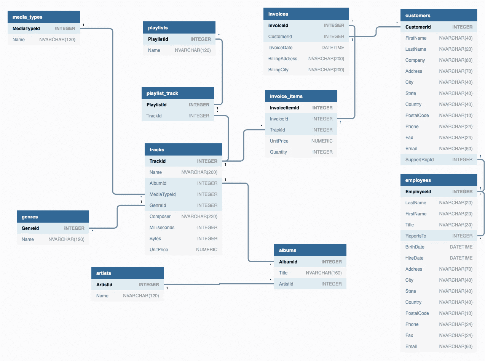

# SQL 子查询

> 原文：<https://towardsdatascience.com/sql-subqueries-85770fd52eb1?source=collection_archive---------17----------------------->

## 在查询中查询以获得更深入的见解


Photo by [Henri L.](https://unsplash.com/@d3cima?utm_source=unsplash&utm_medium=referral&utm_content=creditCopyText) on [Unsplash](https://unsplash.com/?utm_source=unsplash&utm_medium=referral&utm_content=creditCopyText)

> 我在这篇博客中使用的代码可以在我的 [GitHub](https://github.com/rmacaraeg/SQL_lessons/tree/master/SQL_subqueries) 中找到。

每当我学习一些关于 SQL 的新知识时，我开始发现有很多我不知道的应用程序。在学习了查询的基本语法和一些基本工具之后，我开始学习 SQL 中的子查询。

当你执行多个步骤时，子查询(又名**内部查询**或**嵌套查询**)是非常有用的工具。这感觉像是盗梦空间，因为你在查询。

子查询可以在查询中的几个地方使用，所以今天我们将讨论在最常见的地方使用它们:`SELECT`、`FROM`和`WHERE`子句。

# 安装

对于这些例子，我们将使用 Chinook 数据库，它也在 [SQL 基础博客](https://medium.com/better-programming/a-gentle-introduction-to-sql-basics-in-python-b137651ed1ff)中使用。

让我们设置数据库文件、库和函数:



The chinook database for visualization purposes

数据库已经加载，现在我们可以开始处理子查询了！

# 使用 FROM 语句的子查询

让我们从一个示例查询开始，并分析查询内部的情况。

```
SELECT thisisaname.*
FROM ( 
    SELECT *
    FROM genres
    WHERE name LIKE 'r%'
    ) AS thisisaname
WHERE thisisaname.genreid > 6;
```

首先，数据库运行**内部查询**，或者括号内的部分:

```
SELECT *
FROM genres
WHERE name LIKE 'r%';
```

该查询进入`genres`表并提取名称以“r”开头的所有行。

您可能会注意到这个子查询可以独立存在，这一点非常重要:**您的子查询必须独立运行**。一旦运行，**输出充当外部查询**的底层表。

此外，子查询几乎总是应该有名字，这些名字加在括号后面。在本节中，我们将子查询命名为`thisisaname`。

子查询/内部查询运行后，外部查询采取行动:

```
SELECT thisisaname.*
FROM (**subquery**) thisisaname
WHERE thisisaname.genreid > 6;
```

这个查询现在看起来就像一个常规的基本查询！使用新的`thisisaname`表，外部查询现在搜索`genreid`大于 6 的所有数据。最终查询将输出两行:雷鬼和 R & B/Soul。

**补充说明:**在`SELECT`和`WHERE`语句中，由于这只是我们正在处理的一个表，我们不一定需要将`thisisaname`的名字添加到查询中，它仍然会输出相同的内容。使用它们仍然是一种很好的形式，当在多个表之间交互时使用`JOIN`语句会更有意义。

现在我们对`WHERE`语句中的子查询有了更好的理解，让我们看看`SELECT`语句中发生了什么！

# 使用 SELECT 语句的子查询

现在让我们看看当我们在`SELECT`语句中放置嵌套查询时我们能做什么。下面是一个可能的例子:

```
SELECT composer, COUNT(*) AS IndividualCount, 
                COUNT(*)*1.0/(SELECT COUNT(*)
                                FROM tracks) AS CountToTotalRatio
FROM tracks
WHERE composer <> 'none'
GROUP BY composer
HAVING IndividualCount > 30;
```

类似于上面的例子，我们将从内部查询开始，然后向外移动。

```
SELECT COUNT(*)
FROM tracks;
```

该子查询将对 tracks 数据集中的所有行进行完整计数，总共 3503 行。

```
SELECT composer, COUNT(*) AS IndividualCount, 
                COUNT(*)*1.0/(**subquery**) AS CountToTotalRatio
FROM tracks
WHERE composer <> 'none'
GROUP BY composer
HAVING IndividualCount > 30;
```

外部查询中的`COUNT`函数与子查询中的函数不同。外部查询中的`COUNT`使用`GROUP BY`子句计算每个作曲家的频率。它还只收集计数超过 30 的行，并忽略任何缺少编写器名称的行。

最终的输出将给出四行，包括作曲者姓名、每个作曲者的总数以及每个作曲者的频率(与 3503 的总表数相比)。

希望我解释得很好，有意义。最后，让我们看看`WHERE`语句中的子查询！

# 使用 WHERE 语句的子查询

像上一个例子一样，让我们从完整的查询开始:

```
SELECT *
FROM employees
WHERE hiredate IN (SELECT hiredate
                    FROM employees
                    ORDER BY hiredate
                    LIMIT 5
                    );
```

和往常一样，我们从内部查询开始:

```
SELECT hiredate
FROM employees
ORDER BY hiredate
LIMIT 5;
```

该查询按升序(默认情况下)对所有雇佣日期进行排序，并选取最早的 5 个雇佣日期。现在，让我们回到最初的查询！

```
SELECT *
FROM employees
WHERE hiredate IN (subquery);
```

外部查询现在搜索 employees 表中的所有行，并且只返回雇用日期在子查询中找到的 5 个雇用日期之内的行。这返回 6 个员工，公司里最早的一些！

# 结论

我真的很感激你坚持到最后，我希望你能从中找到一些有用的东西。请继续关注即将发布的另一篇 SQL 博文！