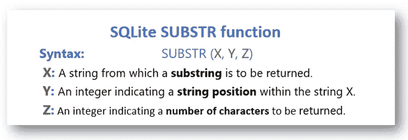
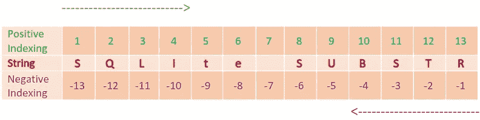

# SQL 带有负索引的子字符串

> 原文：<https://towardsdatascience.com/sql-substring-with-negative-indexing-728c89603187?source=collection_archive---------17----------------------->

在这篇文章中，我讨论了 SQL 中一个非常重要的字符串相关操作——SUBSTR 和负索引的应用。

SUBSTR 用于从给定位置提取给定字符串的特定部分。我已经使用 SUBSTR 的 SQLite 实现来说明负索引的使用。

我已经使用 [movielens](http://files.grouplens.org/datasets/movielens/ml-latest-small.zip) 数据库编写了 SUBSTR 的各种查询。这个数据库有四个表— *链接，电影，收视率，标签。*我们对*电影*表感兴趣。该表的前 20 行如下

**Table 1: movies table**

现在我们将详细介绍 SUBSTR 操作符及其参数。SUBSTR 接受三个参数，如表 1 所示。最后一个参数— **Z** ，是可选的。



**Figure 2: SQLite — SUBTSR**

**Y** 和 **Z** 参数都可以取正负指标值。此外， **Z** 是可选的，因此我们有以下六种可能性

```
╔══════════╦══════════╗
║    Y     ║    Z     ║
╠══════════╬══════════╣
║ Positive ║    -     ║
║ Negative ║    -     ║
║ Positive ║ Positive ║
║ Positive ║ Negative ║
║ Negative ║ Positive ║
║ Negative ║ Negative ║
╚══════════╩══════════╝
```

现在，我们将为上述六种可能性中的每一种编写查询。在此之前，我们应该知道 SUBSTR 中的负索引是如何工作的。如图 3 所示，正索引从字符串中最左边的数字 1 开始，负索引从最右边的数字-1 开始。



**Figure 3: SUBTSR — Positive and Negative Indexing**

下表包含如何评估六种组合 **Y** 和 **Z** 的详细信息。

**Table 2: SUBTSR — Combination of Y and Z with examples**

现在，我们将执行一些查询，在这些查询中，我们可以使用来获得所需的结果。

> **查询 1:编写一个查询，从电影标题中删除电影发行年份，只显示标题。**

```
SELECT TRIM(SUBSTR(TRIM(title), -6, (SELECT 6-MAX(LENGTH(title))
                                     FROM movies)))
FROM movies
```

在查询 1 中，我们为 **X，Y，Z**1 设置了以下值。 **X** = `TRIM(title)`
我们已经修剪了电影表格的标题列，以消除电影标题两端有空格的任何可能性。2。 **Y** = `-6`
为什么-6？因为我们对所有的电影片名都有以下结构——**<片名> <空间> ( <四位数电影上映年份> )** 。我们有最后 6 个字符作为`‘(‘, ‘<digit>’, ‘<digit>’, ‘<digit>’, ‘<digit>’, ‘)’`。

3.由于标题的长度不同，我们必须确保每个标题都完整地出现在结果中。我们已经处理了具有最大标题长度的情况，它将适用于其他情况。我们可以将此操作分解为以下步骤—
**首先是**，计算所有电影标题的长度— `LENGTH(title)`。它产生一个包含每个电影标题长度的表格。
**第二个**，计算最大长度— `MAX(LENGTH(title))`。这导致标题的最大长度为 158。
**第三个**，`6-MAX(LENGTH(title))`结果为 6–158 =-152。
因此我们有 **Z** as -152。这里，Y 和 Z 都有负值。从第-6 个字符开始读取，即**'('，**)，然后读取-152 的绝对值，即 152，即 **'('** 之前的字符，不包括 **'('** 字符。由于 152 是电影表中标题的最大长度，它将提取所有电影的标题。以为例，**《吉米·好莱坞(1994)》**就会产生`‘**Jimmy Hollywood** ’`和《修整后》`‘**Jimmy Hollywood**’`。

> **查询 2:编写一个查询，从电影标题中删除标题，只显示年份。**

同样，我们可以从标题列中提取电影上映年份。

```
SELECT TRIM(SUBSTR(TRIM(title), -5, 4))
FROM movies
```

在此查询中，提取电影发行年份从电影发行年份的第一个数字-5 字符开始，然后提取其后的 4 个字符，包括-5 字符。

现在我们可以利用负索引的力量来执行一些特定的操作。例如，我们可以根据电影发行年份的查询 2 的结果进行分组，并可以获得每年发行的电影数量。

> **查询 3:写一个查询，找出电影《碟中谍》的上映年份。**

```
SELECT TRIM(SUBSTR(TRIM(title), -5, 4))
FROM movies
WHERE title LIKE "Mission: Impossible%"
```

最后，我想强调的一点是，可以使用正则表达式以更加优雅和高效的方式执行上述操作，但在本文中，我尝试展示了 SUBSTR 中负索引的应用。