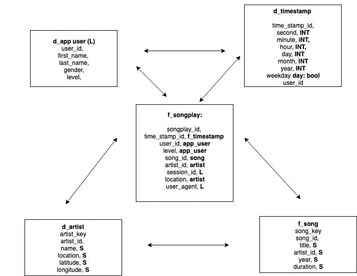
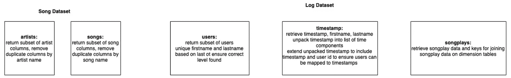

# SQL 与 no SQL:ETL 应用的两种方法

> 原文：<https://towardsdatascience.com/sql-vs-nosql-two-approaches-to-etl-applications-904d52380bef?source=collection_archive---------15----------------------->


Photo by [Franck V.](https://unsplash.com/@franckinjapan?utm_source=unsplash&utm_medium=referral&utm_content=creditCopyText) on [Unsplash](https://unsplash.com/s/photos/duality?utm_source=unsplash&utm_medium=referral&utm_content=creditCopyText)

在本文中，我将探讨 SQL 和 noSQL ETL 管道的区别。

本文将关注传输和加载技术->一旦数据被加载到应用程序中，那么**会发生什么。**

提取部分很简单。它涉及到读取文件和一些基本的数据争论。通过比较提取后数据集是如何划分的，您可以看到数据库的选择如何影响应用程序架构。您还可以确定选择特定数据库的优势和劣势。

我将首先讨论 SQL 方法。SQL 方法更加灵活。由于数据被划分为不同的单元，如果表可以以合理的方式连接起来，就更容易开发灵活的查询。SQL 方法的伸缩性不太好，因为设置水平 SQL 集群的效率不高。

noSQL 方法提供了显著的可伸缩性优势。查询速度更快，因为它们不涉及连接多个表。此外，根据 noSQL，数据库数据可以跨水平集群复制。尽管 noSQL 数据库需要一些先验知识或假设，但是当您对数据建模以适应特定查询时，您的应用程序将如何被使用。

一旦比较完成，我将讨论如何一起使用 SQL 和 noSQL 数据库。

## **SQL 方法**

SQL 项目的目标是将 json 文件中的数据加载到下面的模型中。

**图式:**



**数据集:**

```
Extract of file regarding artists and songs:{
  "num_songs": 1,
  "artist_id": "ARD7TVE1187B99BFB1",
  "artist_latitude": null,
  "artist_longitude": null,
  "artist_location": "California - LA",
  "artist_name": "Casual",
  "song_id": "SOMZWCG12A8C13C480",
  "title": "I Didn't Mean To",
  "duration": 218.93179,
  "year": 0
}Example of file regarding songplays by application users:{
  "artist": "N.E.R.D. FEATURING MALICE",
  "auth": "Logged In",
  "firstName": "Jayden",
  "gender": "M",
  "itemInSession": 0,
  "lastName": "Fox",
  "length": 288.9922,
  "level": "free",
  "location": "New Orleans-Metairie, LA",
  "method": "PUT",
  "page": "NextSong",
  "registration": 1541033612796,
  "sessionId": 184,
  "song": "Am I High (Feat. Malice)",
  "status": 200,
  "ts": 1541121934796,
  "userAgent": "\"Mozilla/5.0 (Windows NT 6.3; WOW64) AppleWebKit/537.36 (KHTML, like Gecko) Chrome/36.0.1985.143 Safari/537.36\"",
  "userId": "101"
}
```

**方法:**

第一步是确定如何从数据中填充表。下面是如何选择歌曲和日志文件中的数据并对其进行重复数据消除以满足要求的高级概述。



同样值得注意的是，数据中存在明显的依赖关系，这要求应用程序以某种方式构建。

艺人和歌曲之间是**一对多**的关系(一个艺人可以有多首歌)。

因此，首先创建艺术家表，然后通过将特定歌曲的艺术家 id 加入特定艺术家的艺术家 id 来填充歌曲表。

```
query['artist_insert'] = 'insert into d_artist (artist_id, artist_name, artist_location, artist_longitude, artist_latitude) values (%s, %s, %s, %s, %s) on conflict (artist_id, artist_name) do nothing'query['song_insert'] = 'insert into d_song (song_id, song_name, year, length, artist_key) values (%s, %s, %s, %s, (select artist_key from d_artist where artist_name=%s)) on conflict (song_name, song_id) do nothing'
```

对于日志数据集，选择关于用户的数据，并将其直接插入到数据库中。

推断时间戳表的所有数据更加复杂。时间戳表需要将时间戳整数转换成一系列字符串、布尔值和整数，以提供每首歌曲播放时间的可读记录。

这包括:

*   迭代时间戳列表
*   将每个时间戳转换成可以映射到 d_timestamp 模式的列表
*   确定歌曲播放是否发生在周末
*   将列表转换为元组，以便可以写入数据库

```
 def unpack_timestamp(*row*): new_row = list(
      datetime.fromtimestamp(int(row[0] // 1000)).timetuple()[0: 7]
   ) new_row[-1] = new_row[-1] > 5 new_row.extend(row) *return* tuple(new_row)
```

一旦填充了时间戳表，就创建了提供上下文并丰富基于事务的歌曲播放表的所有**维度表**。

填充 song-play 表需要根据我前面定义的模式对表进行一些相对简单的连接。下面的查询用于迭代歌曲播放数据集，并从维度表中获取适当的主键，以便可以在进一步的查询中查找数据。

```
query['songplay_insert'] = 'insert into f_songplay (start_time, user_key, level, song_key, artist_key, session_id) values (%s, (select user_key from d_app_user where first_name = %s and last_name = %s), %s, (select song_key from d_song where song_name = %s and artist_key = (select artist_key from d_artist where artist_name = %s)),(select artist_key from d_artist where artist_name= %s),%s)'
```

**该方法的优势:**

这种方法创建了一个灵活的数据模型。由于数据被分成小的组成单元，查询数据相对简单。识别哪个男性用户在特定周末听了最多的歌曲的查询需要:

*   选择该时间段内的所有数据
*   按男性用户分组数据
*   按名字和姓氏对数据分组并选择最大计数

通过理解表之间的关系，对 SQL 有中级理解的人也可以实现类似复杂性的其他查询。因此，我们有一个可以回答各种业务问题的数据仓库。新的问题不一定需要创建新的表格或修改代码库。

**哪里会分崩离析:**


Photo by [Jen Theodore](https://unsplash.com/@jentheodore?utm_source=unsplash&utm_medium=referral&utm_content=creditCopyText) on [Unsplash](https://unsplash.com/s/photos/scale?utm_source=unsplash&utm_medium=referral&utm_content=creditCopyText)

PostgreSQL 等关系数据库的伸缩性不如 noSQL。这是因为关系数据库不能容易地分布在服务器或容器集群中。

这是因为在高流量系统中，连接表和通过网络传送数据包会导致性能问题。复制也很难。例如，如果有一个涉及查询几个表的 update 语句，则必须在复制数据的每个节点上完成该事务。

如果数据集增加到 100GB+(甚至 20GB)，我创建的 ETL 可能会崩溃。

我可以做一些事情来提高性能。将 CSV 文件直接复制到数据库中并并行运行不相关的任务会提高应用程序的性能，尤其是当数据量开始增加时。然而，当查询单个服务器数据库时，应用程序将遇到瓶颈。

正是因为这些原因，一旦应用达到一定规模，往往首选 noSQL 数据库。

**no SQL 方法**

noSQL 方法包括将包含以下各列的 csv 文件加载到基于以下模式的三个表中。Cassandra 被用作 noSQL 数据库。

**CSV 文件布局:**

```
CSV Columns:artist,
auth,
firstName,
gender,
itemInSession,
lastName,
length,
level,
location,
method,
page,
registration,
sessionId,
song,
status,
ts,
userIdExample CSV Row:Stephen Lynch,
Logged In,
Jayden,
M,
0,
Bell,
182.85669,
free,
"Dallas-Fort Worth-Arlington, TX",
PUT,
NextSong,
1.54099E+12,829,
Jim Henson's Dead,
200,
1.54354E+12,
91
```

**模式:**

```
'user_and_song_model'
song = columns.Text(*primary_key*=True
firstName = columns.Text()
lastName = columns.Text()'user_and_session_model'
userId = columns.Integer(*primary_key*=True)
sessionId = columns.Integer(*primary_key*=True, *clustering_order*='DESC')
artist = columns.Text()
firstName = columns.Text()
gender = columns.Text()
itemInSession = columns.Integer()
lastName = columns.Text()
length = columns.Float()
level = columns.Text()
location = columns.Text()
song = columns.Text()__table_name__ = 'event_data_model'
sessionId = columns.Integer(*primary_key*=True)
itemInSession = columns.Integer(*primary_key*=True)
artist = columns.Text()
firstName = columns.Text()
gender = columns.Text()
lastName = columns.Text()
length = columns.Float()
level = columns.Text()
location = columns.Text()
song = columns.Text()
userId = columns.Integer()
```

第一个模型/表格记录了应用程序用户播放的歌曲。第二个和第三个表更详细，包括艺术家、sessionId 和其他有关用户活动的数据。

在 noSQL 方法中，表没有连接在一起。每个表代表一个特定的查询，或者需要解决的业务问题。

由于数据不需要连接，所以管道更简单。一旦数据被聚合和清理，每个表所需的数据集的列被选择并以可以直接读入数据库的格式写入磁盘。

```
aggregate_csv_path = os.getcwd() + '/event_datafile_new.csv'event_columns = ['sessionId', 'itemInSession', 'artist', 'firstName', 'gender', 'lastName', 'length', 'level', 'location', 'song', 'userId']event_frame[event_columns].to_csv(
   *path_or_buf*=aggregate_csv_path, *index*=False
)subprocess.run(cqlsh_load_csv(), *shell*=True)def cqlsh_load_csv():
*return* (*return* ('cqlsh -e "COPY sparkifydb.event_data_model FROM ' + "'{}/event_datafile_new.csv' ".format(os.getcwd()) + 'WITH HEADER=TRUE"')
```

**no SQL 方法的优势:**


Photo by [drmakete lab](https://unsplash.com/@drmakete?utm_source=unsplash&utm_medium=referral&utm_content=creditCopyText) on [Unsplash](https://unsplash.com/s/photos/future?utm_source=unsplash&utm_medium=referral&utm_content=creditCopyText)

noSQL 数据库比 SQL 数据库的伸缩性更好。由于查询不遍历多个表，因此它们可以更快地执行，因为它们不涉及跨磁盘的多次查找。

noSQL 数据库也允许水平伸缩。在 Cassandra 数据库中，建立了一个集群，并且在集群中对表进行**复制**。根据事务类型(读/写)，选择不同的节点。让一些节点负责读取而让其他节点负责写入会提高性能，并且有一种机制可以在成功的写入/更新/删除之后更新读取节点，以确保整个数据库的最终一致性。

更简单的查询和复制使 noSQL Cassandra 数据库能够处理比 PSQL 数据库多得多的流量。苹果、网飞、易贝和其他价值数十亿美元的公司使用 Cassandra 来管理[万亿字节甚至千兆字节的数据，这一事实就说明了这一点！](http://cassandra.apache.org/)

**no SQL 方法不灵活**

noSQL 方法在可伸缩性方面提供了巨大的好处。但是在 noSQL 数据库上执行灵活的查询是很困难的，因为表不能被连接。比方说，每次会话播放的歌曲查询不提供商业价值。我们想知道早上最流行的歌曲。

使用 PSQL 数据库，我们可以通过连接时间戳表和歌曲播放表来识别最流行的早间歌曲。noSQL 模式目前还不支持这个需求。当使用 noSQL 数据库时，很有可能需要开发表和应用程序代码来回答那些可以由结构良好的关系数据库来回答的问题。

**结论**:

在本文中，我展示了如何围绕 SQL & noSQL 数据库构建应用程序和数据库软件。如果灵活性和执行复杂查询的需求是优先考虑的，那么 SQL 数据库更合适。

noSQL 数据库更适合处理大量数据。如果像网飞一样，您需要在不停机的情况下为数亿客户提供服务，那么 noSQL 数据库是更好的选择。

还值得注意的是，数据库可以一起使用。noSQL 数据库可用于为客户提供服务，并确保他们以最小的延迟访问内容。对于包括了解如何使用应用程序的分析任务，可以使用 SQL 数据库。在这里，成功和失败不是由 5 秒的页面加载来定义的，构建灵活而复杂的查询是非常重要的。

SQL 管道[**可以在这里查看。**](https://github.com/Daniel57910/psql_sparkify)

noSQL 管道 [**可以在这里查看。**](https://github.com/Daniel57910/cass_sparkify)