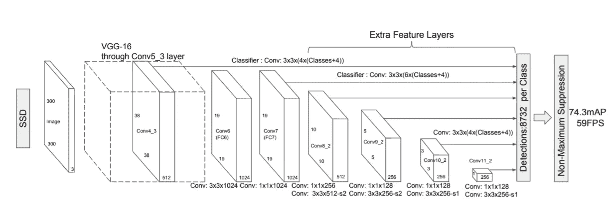
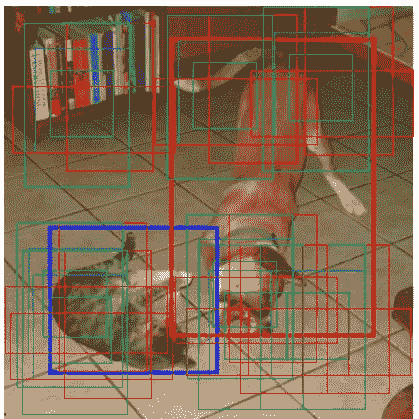
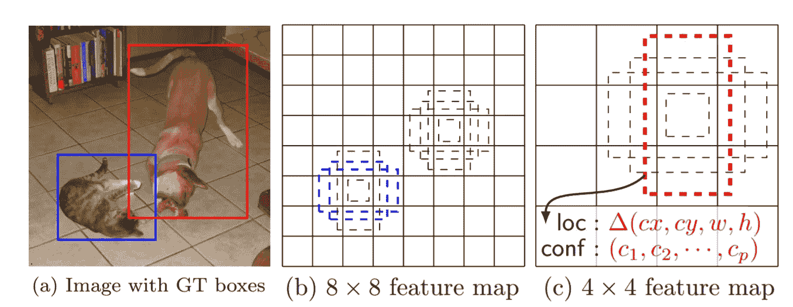
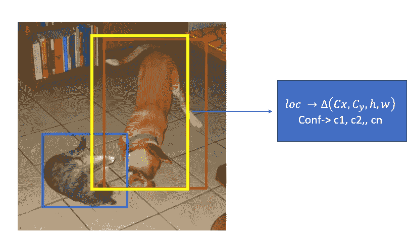

# SSD:使用多盒进行物体检测的单次检测器

> 原文：<https://towardsdatascience.com/ssd-single-shot-detector-for-object-detection-using-multibox-1818603644ca?source=collection_archive---------2----------------------->

***在这篇短文中，我们将了解什么是固态硬盘、它的架构以及它如何被训练和用于物体检测***

# 单发探测器

像 YOLO **这样的单镜头探测器只需一次拍摄，就可以使用多框探测图像中的多个物体。**

它在速度上明显快于高精度的目标检测算法。在 VOC2007 上快速比较不同对象检测模型的速度和准确性

*   **SDD300** : 59 FPS，贴图 74.3%
*   **SSD 500:**22 帧/秒，平均映射为 76.9%
*   **更快的 R-CNN** : 7 FPS，mAP 73.2%
*   **YOLO** : 45 FPS，贴图 63.4%

使用相对低分辨率图像的 SSD 的高速度和准确性归因于以下原因

*   消除了像 RCNN 中使用的包围盒建议
*   包括用于预测物体类别和边界框位置偏移的递减卷积滤波器。

SSD 中的高检测精度是通过使用具有不同大小和纵横比的多个盒子或过滤器来进行对象检测而实现的。它还将这些过滤器应用于网络后期的多个要素地图。这有助于在多个尺度上进行检测。

# 单触发探测器的体系结构

**固态硬盘有一个基本的 VGG-16 网络，后跟多个 conv 层**

**基本神经网络:提取特征**

SDD 的 VGG-16 基础网络是用于高质量图像分类的标准 CNN 架构，但是没有最终分类层。VGG-16 用于特征提取。

**附加 Conv 层:检测物体**

对于基本的 VGG 网络，我们增加了额外的卷积层用于检测。基本网络末端的卷积层大小逐渐减小。这有助于在多个尺度上检测物体。用于检测的卷积模型对于每个特征层是不同的。

**对图像中不同对象的包围盒和置信度的预测不是由一个而是由代表多个尺度的不同大小的多个特征图来完成**

逐渐减少的卷积层会减小特征图的大小并增加深度。深层覆盖更大的感受野，并构建更抽象的表达。这有助于探测更大的物体。初始 conv 层覆盖较小的感受野，有助于检测图像中存在的较小物体。

# SSD 的培训

SSD 的输入是一个输入图像，图像中的每个对象都有地面真实边界框，如下所示

VGG-16 是执行特征提取的基础网络。Conv 图层在不同比例的多个要素地图中的每个位置评估不同纵横比的盒子，如下所示。

多盒子就像快速 R-CNN 的主播。我们有多个不同大小的默认框，如下图所示。SSD 用 8732 盒。这有助于找到与包含对象的地面真实边界框重叠最多的默认框。

# 匹配策略

在训练期间，默认框在纵横比、位置和比例上与地面真实框相匹配。我们选择与地面真实边界框具有最高重叠的框。预测框和地面实况之间的 IoU(交集/并集)应大于 0.5。我们最终选择了与真实情况有最大重叠的预测框。

在上图中，我们匹配了两个默认的框。一个带着猫，一个带着狗。它们被视为正边界框，其余的被视为负边界框。

每个预测包括

*   具有形状偏移的边界框。∈*c*x，∈*c*y， *h* 和 w *，*代表从默认框中心的偏移量及其高度和宽度
*   所有对象类别或所有类的置信度。类 0 被保留以指示对象的不存在

SSD 中使用的损失函数是多盒损失，它由两项组成:置信度损失和定位损失。

# **数据扩充:**

数据扩充技术用于处理对象大小和形状的变化，使用剪切、放大、缩小、翻转、裁剪等。数据扩充的应用使得该模型对于各种输入对象尺寸和形状更加稳健。这有助于提高模型的准确性。

每个训练图像由以下选项之一随机采样

*   使用整个原始输入图像
*   对对象的面片进行采样，使与对象的最小重叠为 0.1、0.3、0.5、0.7 或 0.9
*   随机抽取补丁样本

# 使用 SSD 进行推断

SSD 在不同的输出层上使用不同比例、形状和纵横比的默认框。

它使用 8732 个盒子来更好地覆盖位置、比例和长宽比。大多数预测将不包含任何对象。SSD 会丢弃置信度得分低于 0.01 的预测。然后，我们应用每类 0.45 的非最大抑制(NMS)重叠，并保留每幅图像的前 200 个检测。

固态硬盘需要记住的要点

*   而 Yolo 具有固定的网格单元纵横比。固态硬盘使用不同的宽高比和多个盒子，以获得更高的精确度
*   固态硬盘在基本 VGG-16 的末端有额外的 conv 层，用于物体检测。卷积层具有不同尺度的多种特征，因此能够更好地检测多尺度下的目标

# 参考资料:

[单发探测器(C. Szegedy 等人)](https://arxiv.org/pdf/1512.02325.pdf)

https://github.com/amdegroot/ssd.pytorch#demos