# 堆叠图例过滤器、双轴密度标记图和双轴散点图

> 原文：<https://towardsdatascience.com/stacked-legend-filter-dual-axis-density-marks-map-dual-axis-scatter-plot-in-tableau-3d2e35f0f62b?source=collection_archive---------21----------------------->

## [加快数据可视化](https://towardsdatascience.com/tagged/datafiedviz)

## 它是数据化的！— Tableau 剧本

Photo by [Campaign Creators](https://unsplash.com/@campaign_creators?utm_source=unsplash&utm_medium=referral&utm_content=creditCopyText) on [Unsplash](https://unsplash.com/s/photos/charts?utm_source=unsplash&utm_medium=referral&utm_content=creditCopyText)

嘿#数据摇滚明星们！在这篇[专栏](https://towardsdatascience.com/tagged/datafiedviz)的文章中，我将使用 Tableau、dashboarding 最佳实践和一些方便的技巧/窍门来涵盖各种数据可视化概念。在我的 Tableau 公共配置文件中会发布一个示例仪表板，您可以随意使用。所有的概念都会融入其中，方便你参考和学习。在本期 **Tableau Playbook 系列**中，我们将参考以下仪表盘。

[**It’s Datafied! Tableau Playbook Series**](https://public.tableau.com/profile/pavneet.singh#!/vizhome/ProfitSalesAnalysisacrossCitiesinUSA/ProfitSalesAnalysisDashboard)

我们将一步一步地介绍仪表板每个组件的开发，以及其中使用了哪些概念。我希望你能像我写这篇博客一样兴奋地学习。那么，事不宜迟，让我们开始吧！

**组件 1——兼作图例的过滤器组。**

**步骤 1:** 将“区域”维度拖放到色卡上。你会看到如下所示的 4 个小方块。(颜色图例中的颜色可能不同)。

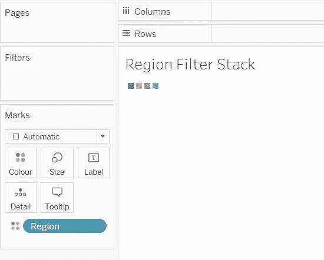

**步骤 2:** 双击 columns shelf 创建一个自定义度量，并键入“min(10)”作为度量(不带引号)。这将方形标记变成一个堆栈，如下所示。这样做是为了使用常数值作为调整堆栈大小的度量。您还可以为相同的创建自定义计算，以便更有条理。

**步骤 3:** 通过从底部拖动来调整堆叠的高度，宽度可以从尺寸卡开始增加。通过右键单击轴标题并取消选择“显示标题”来隐藏轴标题，如下所示。通过“格式”选项删除不必要的格式行，以保持数据-油墨比率。

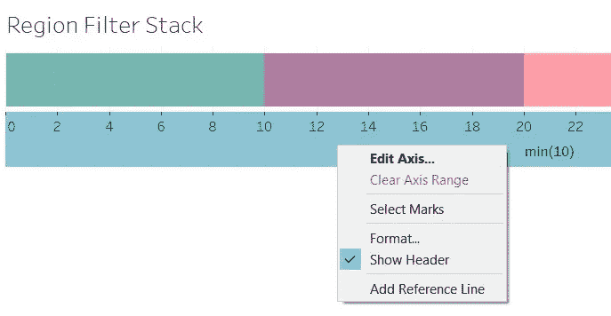

**第四步:**将区域维度拖放到标签卡上*瞧！*我们已经完成了过滤器+图例堆栈的构建！很简单，不是吗？！我们可以通过*过滤器动作*在我们的仪表板中使用它作为过滤器。

**组件 2——带区域和密度标记的双轴地图。**

**第一步:**双击状态维度。Tableau 会自动将生成的纬度和经度度量药丸放置到行和列架上，因为 state dimension 被分配了地理角色。默认情况下，国家与州一起放在标志卡上，因为它是层次结构的一部分。您可以通过本文末尾提供的链接了解 Tableau 中的层次结构和地理角色。

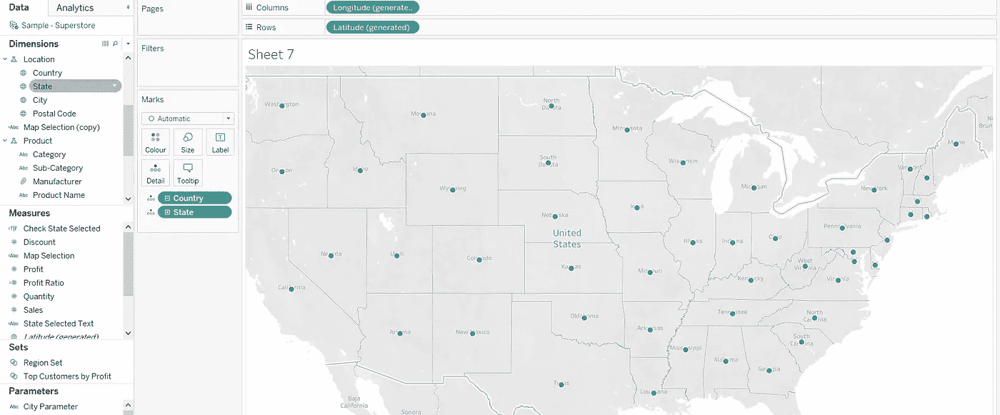

**第 2 步:**从标记卡下拉菜单中更改标记为地图，因为我们必须创建一个彩色地图。

**第三步:**将区域尺寸拖放到色卡上，这里我们已经准备好了基于底层区域的颜色图，在其上绘制密度标记。您可能已经注意到，Tableau 会自动为这些区域分配与您在为上一个组件中的区域准备滤镜堆栈时选择的颜色相同的颜色。这就是 Tableau 如何帮助我们在整个仪表板中保持统一的配色方案，并被视为仪表板构建的最佳实践之一，即在所有仪表板中为相同的尺寸/度量使用统一的配色方案。

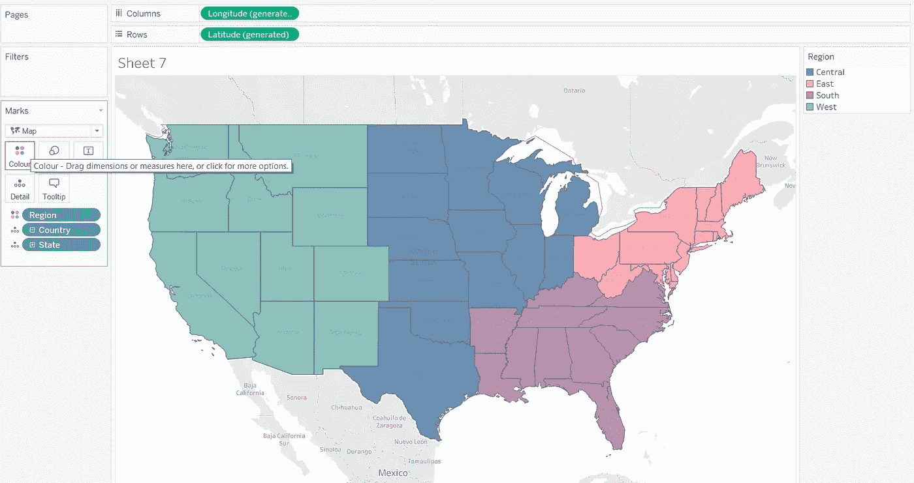

**第四步:**点击横排货架上的 latitude 药丸，按住 control 键并向右拖动药丸，创建一个重复的 latitude 药丸。很漂亮不是吗？这就是你如何为一个尺寸或尺寸动态创建一个复制药丸，并将其放到其他卡片/架子上。这就是地图现在的样子，即分成两个副本。您还会注意到，现在我们将标记卡分为三个部分，一个名为“ALL ”,通过它我们可以一次对两个地图进行更改，如果我们想单独进行更改，则为两个地图分别创建一个部分。

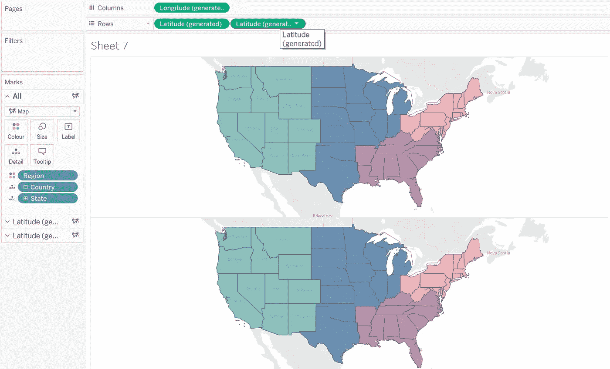

**第 5 步:**单击三个中最下面的纬度标记卡架部分，单击 State pill 前面的“+”号，向下钻取到层次结构中的城市级别。接下来，将利润率指标拖放到颜色卡上，并选择合适的配色方案。在这种情况下，我们有负和正值的利润率，所以我选择了一个发散的配色方案。这也是最佳实践之一，即在测量值为负值和正值的情况下，选择发散的配色方案。现在，从标记卡下拉菜单中选择密度。我们现在有了我们想要的两张地图，我们将在下一步使用双轴选项将一张叠加在另一张的上面。

**第 6 步:**单击我们创建的 rows shelf 上的第二个 latitude pill，然后选择双轴。

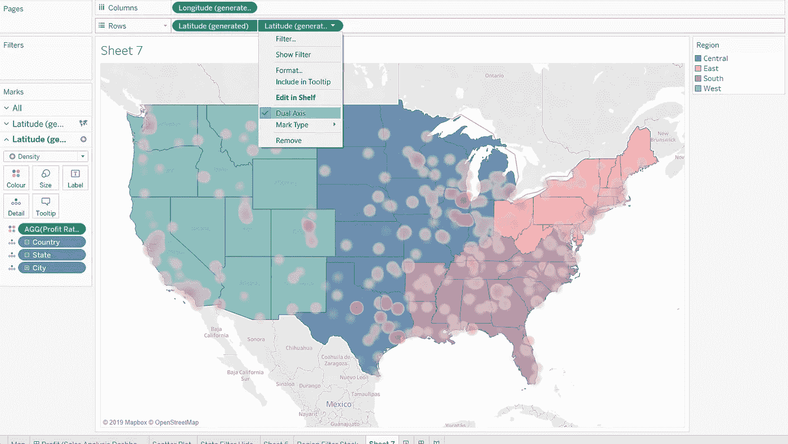

**步骤 7:** 要从地图上移除周围区域，点击地图工具栏，点击地图图层，在背景部分设置冲洗选项为 100%。这将删除地图的不必要的背景，使它看起来整洁。这有助于删除不必要的轴、标签、背景和标记，以保持数据-油墨比率。

在那里！我们基于密度标记的双轴地图！让我们继续保持#DataRockstar 的氛围，因为接下来还有另一个有趣的图表要开发。

**组件 3 —双轴散点图**

向散点图添加双轴基本上会使散点图更漂亮，并为您添加额外的颜色编码功能，即圆形轮廓。下面我们来探究一下截图，以便更好的理解。

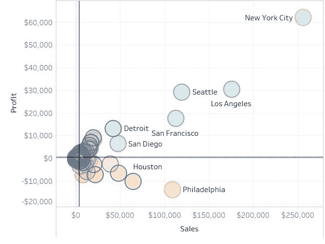

您可能已经注意到，每个圆圈代表一个有两种不同颜色的城市，即一个是代表该城市所属地区的圆圈轮廓，另一个是代表该城市利润率是负还是正的内圈颜色。因此，使用这种方法，我们一目了然，而不是通常的散点图，这看起来很整洁！让我们来看看创建这个的步骤:

**步骤 1:** 将“利润”和“销售”度量拖放到“行/列”架上，然后将“城市”维度拖放到“详细信息”卡上，如下图所示，并增加“大小标记”卡上圆形标记的大小:

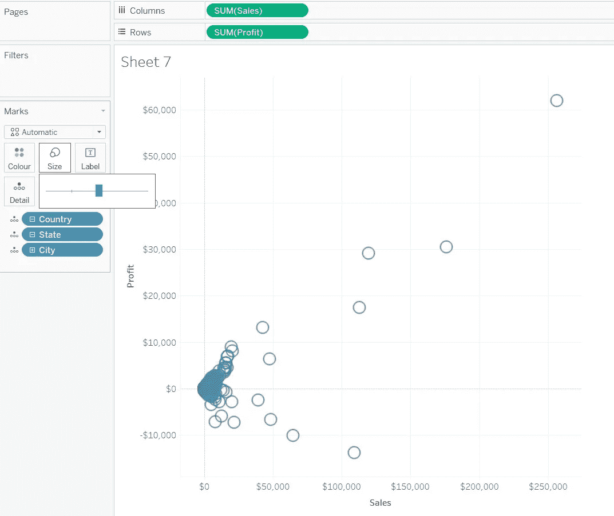

**第二步:**正如我们在双轴地图中所做的，按住 control 键，单击销售药丸并将其拖放到右侧，以创建一个重复的销售药丸。这将使双轴与 3 标记卡一起出现，一个代表散点图，一个代表每个单独的图表，如下所示。

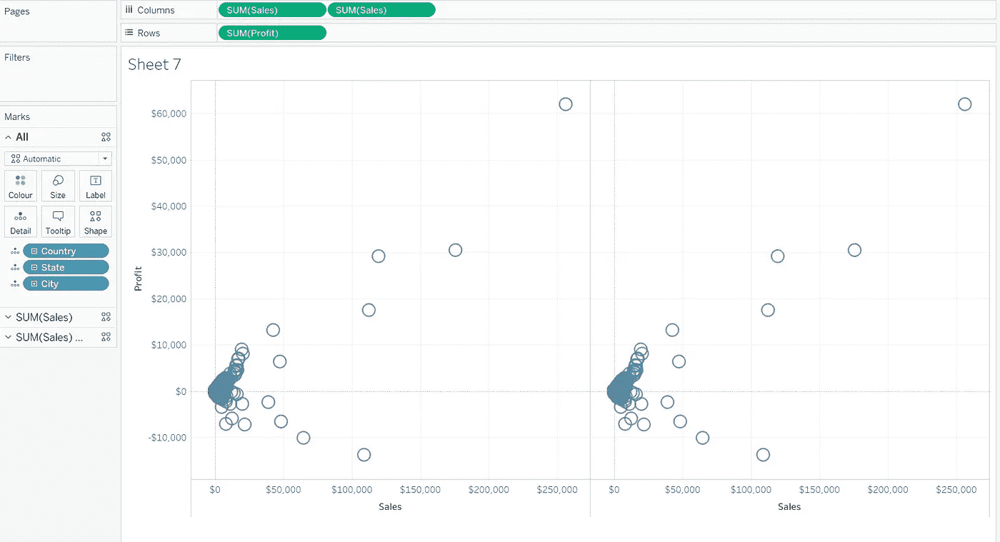

**第三步:**转到中间的 SUM(Sales)标记卡菜单，将利润率拖放到色卡上，将颜色不透明度降低到 40%，从下拉菜单中选择圆形标记。

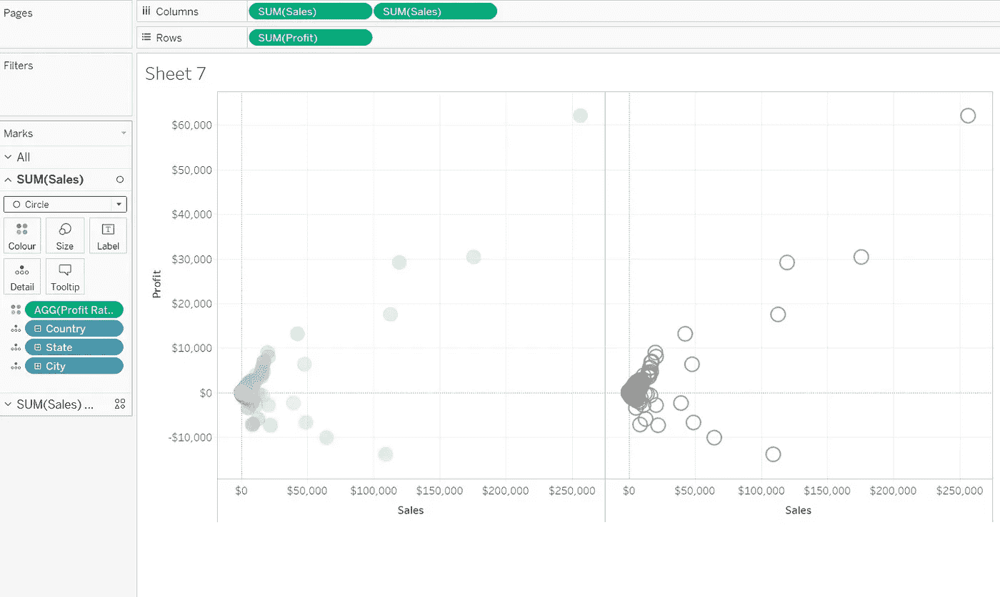

**第四步:**第二步，转到底部的标记卡菜单，将区域维度拖放到色卡，将城市拖放到标签卡。

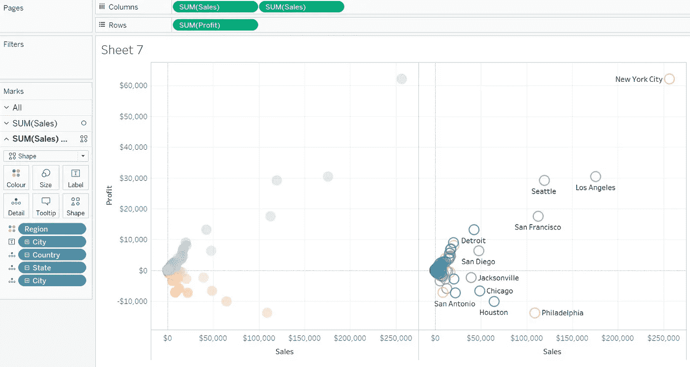

**第 5 步:**正如我们在双轴图中所做的，单击第二个销售药丸，选择双轴以合并两个散点图。接下来，单击上方的销售轴并选择同步轴，然后隐藏标题。同步轴也是一个最佳实践，以避免双轴图表中的任何歧义，因此，请确保您永远不会忘记这一点。

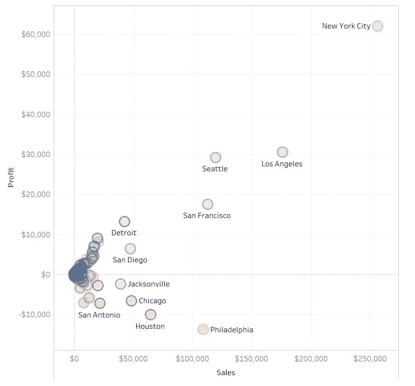

嘣！您已经完成了双轴散点图！很有趣，不是吗？你现在已经学会了一些有趣的技巧。

**总结**

1.  开发的组件——兼作图例的过滤器堆栈、带有密度标记的双轴地图和双轴散点图。
2.  整合了最佳实践—在整个仪表板中保持统一的配色方案，删除不必要的标签、轴、背景等，以在创建双轴图表时保持数据-油墨比率和轴的同步。
3.  分享的提示和技巧——按住 control 键并拖动药丸来复制它，并利用散点图中的双轴来表示额外的维度/度量。

在接下来的帖子中，我将提到同一个仪表板，并分享如何利用自定义计算使过滤器在仪表板中弹出，在仪表板上显示警告消息以显示哪些过滤器是活动的，并通过浮动容器在仪表板中获得布局。敬请关注。

进一步阅读的相关链接:

 [## 数据-油墨比

### 数据-油墨比是爱德华·塔夫特提出的一个概念，他的工作为…做出了重大贡献

infovis-wiki.net](https://infovis-wiki.net/wiki/Data-Ink_Ratio)  [## 创建层次结构

### 当您连接到数据源时，Tableau 会自动将日期字段分成层次结构，这样您就可以很容易地打破…

help.tableau.com](https://help.tableau.com/current/pro/desktop/en-us/qs_hierarchies.htm)  [## 调色板和效果

### 所有标记都有默认颜色，即使标记卡上没有颜色字段。对大多数标记来说，蓝色是…

help.tableau.com](https://help.tableau.com/current/pro/desktop/en-us/viewparts_marks_markproperties_color.htm)  [## 为数据可视化选择颜色时需要考虑什么

### 数据可视化可以定义为用形状来表示数字——不管这些形状看起来像什么…

academy.datawrapper.de](https://academy.datawrapper.de/article/140-what-to-consider-when-choosing-colors-for-data-visualization)  [## 过滤动作

### 筛选操作在工作表之间发送信息。通常，过滤器动作从选定的标记发送信息…

help.tableau.com](https://help.tableau.com/current/pro/desktop/en-us/actions_filter.htm)  [## 表格中地理字段的格式-表格

### 本文描述了如何为 Tableau 中的字段分配地理角色，以便您可以使用它来创建地图视图。一个…

help.tableau.com](https://help.tableau.com/current/pro/desktop/en-us/maps_geographicroles.htm) 

从我的 Tableau 公开个人资料链接到仪表板:

 [## Tableau 公共

### 随意分享和玩耍

public.tableau.com](https://public.tableau.com/profile/pavneet.singh#!/vizhome/ProfitSalesAnalysisacrossCitiesinUSA/ProfitSalesAnalysisDashboard)