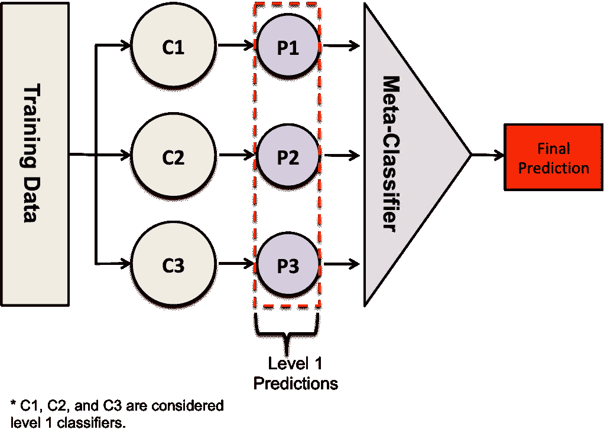
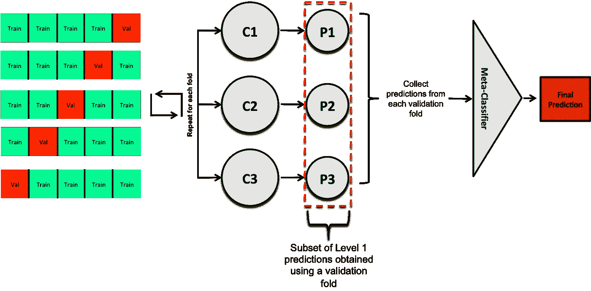
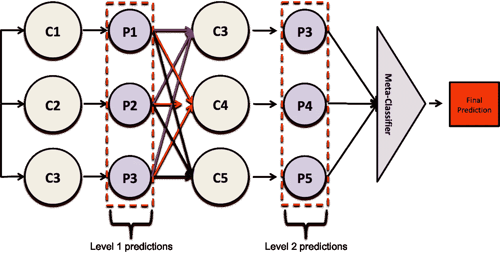
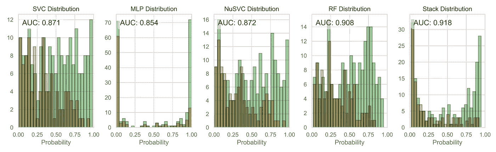

# 堆叠分类器以提高预测性能

> 原文：<https://towardsdatascience.com/stacking-classifiers-for-higher-predictive-performance-566f963e4840?source=collection_archive---------2----------------------->

## 利用多分类器的智慧提高性能


Photo by [Erwan Hesry](https://unsplash.com/@erwanhesry?utm_source=unsplash&utm_medium=referral&utm_content=creditCopyText) on [Unsplash](https://unsplash.com/search/photos/stack-suitcase?utm_source=unsplash&utm_medium=referral&utm_content=creditCopyText)

**目的:**这篇文章的目的是为读者提供必要的工具来实现称为堆叠的集成学习技术。

**材料和方法:**使用 [Scikit-learn](https://scikit-learn.org/stable/) ，我们为一个分类任务生成一个[类 Madelon 数据集](http://archive.ics.uci.edu/ml/datasets/madelon)。然后分别训练支持向量分类器(SVC)、Nu-支持向量分类器(NuSVC)、多层感知器(MLP)和随机森林分类器。每个分类器的性能将使用受试者操作曲线下面积(AUC)来衡量。最后，我们使用 [StackingCVClassifier](http://rasbt.github.io/mlxtend/user_guide/classifier/StackingCVClassifier/) 对象堆叠这些分类器的预测，并比较结果。

**硬件**:我们在配备英特尔酷睿 i7–8700 处理器(12 个 CPU，3.70 Ghz)和英伟达 GeForce RTX 2080 的工作站上训练和评估我们的模型。

**注意:**如果您是从零开始，我建议您按照这篇[文章](/i-want-to-be-the-very-best/installing-keras-tensorflow-using-anaconda-for-machine-learning-44ab28ff39cb)安装所有必要的库。最后，假设读者熟悉 Python、 [Pandas](https://pandas.pydata.org/) 、Scikit-learn 和 ensemble 方法。这篇文章的全部内容可以在[我的 GitHub](https://github.com/frank-ceballos/StackingClassifiers_Medium) 上找到。欢迎你来叉它。

**符号**:粗体文本将代表一个列表、字典、元组、一个 [Pandas DataFram](https://pandas.pydata.org/pandas-docs/stable/reference/api/pandas.DataFrame.html) e 对象，或者将引用一个图形或脚本。`This notation will be used to represent parameters in an object or command lines to run in the terminal.`


# 什么是堆叠？

最简单的堆叠形式可以描述为集成学习技术，其中多个分类器(称为一级分类器)的预测被用作训练元分类器的新特征。元分类器可以是您选择的任何分类器。**图 1** 显示了如何训练三个不同的分类器。它们的预测被叠加，并被用作训练元分类器的特征，元分类器做出最终预测。



**Figure 1** — Schematic of a stacking classifier framework. Here, three classifiers are used in the stack and are individually trained. Then, their predictions get stacked and are used to train the meta-classifier.

为了防止信息从目标(您试图预测的事物)泄漏到训练中，在堆叠分类器时应遵循以下规则:

1.  一级预测应该来自没有用于训练一级分类器的训练数据的子集。

一个简单的方法是将你的训练分成两半。使用训练数据的前半部分来训练一级分类器。然后使用训练好的一级分类器对训练数据的后半部分进行预测。然后，这些预测应该用于训练元分类器。

一种更可靠的方法是使用 k 重交叉验证来生成一级预测。这里，训练数据被分成 k 倍。然后，前 k-1 个折叠用于训练一级分类器。然后，验证折叠用于生成一级预测的子集。对每个独特的组重复该过程。**图 2** 说明了这个过程。



**Figure 2** — Schematic of k-fold cross validation used with a Stacking classifier framework.

热心的读者可能会想，为什么不堆叠另一层分类器呢？可以，但这会增加堆栈的复杂性。例如，考虑以下架构:



**Figure 3** — Schematic of a Stacking classifier with two layers of classifiers.

这开始看起来像一个神经网络，其中每个神经元都是一个分类器。第二级中使用的分类器的数量和类型不必与第一级中使用的相同——看看事情是如何很快失控的。例如，一级分类器可以是额外树分类器、决策树分类器和支持向量分类器，二级分类器可以是人工神经网络、随机森林和支持向量分类器。在本文中，我们将实现如图**图 2** 所示的堆叠分类器架构。


# 堆叠，还是不堆叠，这是个问题。

在开始堆叠分类器之前，建议您首先考虑所有其他选项，以提高您的预测性能。作为指导，请考虑以下问题，以确定是否应该开始堆叠:

*   你有可能掌握更多的数据吗？在机器学习中，数据为王(即通过收集更多数据可以实现性能的最大提升)；因此，如果这是一种可能性，你应该集中精力，把一个更大更多样化的数据集放在一起。
*   是否有可能向您的数据集添加更多功能？例如，您可以使用图像中的像素亮度值作为特征。您还可以从这些图像中提取纹理特征，这些特征考虑了像素亮度值在空间上的分布。从手头的问题中收集尽可能多的特征是很重要的。这样做只是因为你不知道这些特征中哪些是好的预测器。请记住，任何模型的预测能力应该主要来自用于训练它的特征，而不是来自算法本身。
*   您是否正确地预处理了所有数据？如果你把垃圾推进模型，垃圾就会出来。确保您在视觉上探索了您的所有功能，以便更好地理解它们。注意丢失的值、异常值，并确保您的数据集不会严重失衡。缩放您的功能，删除所有冗余功能，如果您的功能数量很大，请应用功能选择方法，并考虑[功能工程](/automated-feature-engineering-in-python-99baf11cc219)。
*   你用你的数据集探索过一大组分类器的预测性能吗？你仔细调过这些分类器吗？

如果你对所有这些问题的回答都是肯定的，并且你愿意做任何事情来提高性能，那么考虑堆栈。


# 安装必要的模块

实现如图**图 2** 所示的堆栈架构的最简单方法是使用 [MLXTEND](http://rasbt.github.io/mlxtend/) Python 库。要安装它，请阅读他们的 GitHub 自述文件[在这里](https://github.com/rasbt/mlxtend)。如果您在 Windows 上安装了 Anaconda，请启动 Anaconda 提示符，导航到要安装此模块的 conda 环境，然后运行以下命令:

```
conda install -c conda-forge mlxtend
```

或者您可以使用画中画:

```
pip install mlxtend
```

免责声明:我几乎可以肯定这不会破坏您的 Python 环境，但是如果真的破坏了，不要怪我。这里有一个关于如何使用 Anaconda 在 Windows 中安装基于 Python 的机器学习环境的指南，供感兴趣的读者参考。


# 数据集

我们将使用 Scikit-learn 为分类任务生成一个类似 Madelon 的合成数据集。这是我在 Medium 上发表的一篇文章[中用来探索各种模型性能的相同数据集。Madelon 数据集是一个人工数据集，包含放置在边长为 1 的五维超立方体的顶点上的 32 个聚类。聚类被随机标记为 0 或 1 (2 类)。](http://Model Design and Selection with Scikit-learn)

我们将生成的数据集将包含 30 个特征，其中 5 个将提供信息，15 个将是冗余的(但提供信息)，5 个将重复，最后 5 个将是无用的，因为它们将被随机噪声填充。数据集的列将按如下顺序排列:

1.  **信息特征—第 1–5 列**:这些特征是您构建模型时真正需要的唯一特征。因此，一个五维的超立方体。
2.  **冗余特征——第 6–20 列**。这些特征是通过线性组合具有不同随机权重的信息特征而形成的。您可以将这些视为工程特性。
3.  **重复特征——第 21–25 列**:这些特征是从信息特征或冗余特征中随机抽取的。
4.  **无用特征——第 26–30 列**。这些特征充满了随机噪声。

让我们从导入库开始。

Script 1 — Importing all libraries

现在我们可以生成数据了。

Script 2 —Generates the data set. The random_state parameter is fixed so that we can work with the same data.


# **分割和预处理数据**

一旦我们有了数据，我们就可以继续创建一个训练和测试集。

Script 3— Create train and test set. Notice we set the random_state parameter.

现在我们可以扩展我们的数据集。我们将通过 Z 分数标准化来实现。

Script 4 — Scaling the data.

我们已经完成了数据集的预处理。在这个例子中，我们不会去费力地去除高度相关的、冗余的和有噪声的特征。然而，重要的是，在你可能处理的任何项目中，你都要注意这一点。


# 分类器

出于说明的目的，我们将训练支持向量分类器(SVC)、多层感知器(MLP)分类器、Nu-支持向量分类器(NuSVC)和随机森林(RF)分类器——Scikit-learn 中提供的分类器。将设置这些分类器的超参数——我们将假设我们已经尽了最大努力来调整它们。坦率地说，如果你的分类器是垃圾，那么一堆分类器可能也是垃圾。此外，为了获得可重复的结果，每个分类器上的`random_state`已经固定。

Script 5— Initializing classifiers.


# 堆积分类器

为了堆叠它们，我们将使用 MLXTEND 中的 StackingCVClassifier。我建议你看一下[官方文档](http://rasbt.github.io/mlxtend/user_guide/classifier/StackingCVClassifier/)，因为它详细介绍了如何实现 StackingCVClassifier 的有用例子。例如，它向您展示了如何堆叠对不同特征子集进行操作的分类器——这太酷了。最后，我们将把 StackingCVClassifier 中的`use_probas`参数设置为 True。这意味着第一级分类器将通过概率预测，而不是二进制输出(0 或 1)。然而，这并不意味着您应该使用这个设置，如果您将`use_probas`设置为 False，可能会对您的工作更有好处；然而，知道这一点的唯一方法是实际去做。作为`meta_classifier`,我们选择一个 SVC 并使用它的默认参数。

Script 6— Initializing the stacking classifier.

最后，为了方便起见，我们将所有的分类器放在一个字典中。

Script 7— Saving classifiers in a dictionary.


# 训练分类器

我们训练每个分类器，并将其保存到标记为**分类器**的字典中。分类器被训练后，将被保存到同一个字典中。

Script 8— Training classifiers.


# 做预测

现在我们准备在测试集上进行预测。这里我们首先创建**结果**，一个 pandas DataFrame 对象。然后使用 for 循环，我们遍历训练好的分类器，并将预测存储在**结果**中。最后，在第 14 行，我们添加了一个标有“Target”的新列，其中包含实际的目标

Script 9— Making predictions on test set.


# 可视化结果

现在是想象结果的时候了。我们将通过创建一个有 5 个支线剧情的人物来实现。在每个子图上，我们将显示从每个分类器的测试集上获得的概率分布。我们还将报告受试者工作曲线下的面积(AUC)。

Script 10 — Visualizing results.



**Figure 4** — Probability distribution for each classifier. The AUC is also reported.

不错！每个分类器单独获得小于 0.909 的 AUC 然而，通过叠加它们，我们得到 AUC = 0.918。这是一个很好的提升，你不觉得吗？


# **调整堆积分类器**

StackingCVClassifier 为您提供了调整每个分类器以及元估计器的参数的选项。但是，我不建议使用 StackingCVClassifier 进行全面的搜索。例如，假设您想要使用四个分类器，每个都有 100 个点的参数网格—老实说，这是一个相当小的网格。探索这个空间需要多长时间？让我们做一个简单的计算:

100 * 100 * 100 * 100 =你必须适应的 1 亿个模型

假设每个模型需要 0.5 秒来拟合，那将需要 5000 万秒或更长时间，简单地说就是 1.6 年。没人有时间做那个。这个计算没有考虑到元分类器不是固定的，并且包含它自己的需要调整的参数。这就是为什么我建议您首先单独调优您的分类器。之后，您可以将它们堆叠起来，只对元分类器进行调优。如果您决定调整分类器堆栈，请确保您为每个分类器调整了参数空间中的最佳点。

在这个例子中，我们首先为元分类器——支持向量分类器——创建一个参数网格。然后，我们使用 [GridSearchCV](https://scikit-learn.org/stable/modules/generated/sklearn.model_selection.GridSearchCV.html) 进行彻底搜索，以确定参数网格中产生最高性能的点。结果被打印到控制台上。

Script 11 — Tuning the meta-classifier.

```
The AUC of the tuned Stacking classifier is 0.923
```

很好，通过调整元分类器，我们成功地将堆叠分类器 AUC 从 0.918 推至 0.923。然而，我们还没有完成。让我们看看我们是否能从堆叠分类器中得到更多。为此，我们将创建一组堆叠分类器，每个分类器在第一层都有唯一的分类器组合/堆叠。对于每个堆叠分类器，将调整元分类器。结果将被打印到控制台上。

Script 12— Stacking different classifiers and exploring their performance.

```
AUC of stack ('SVC', 'MLP'): 0.876
AUC of stack ('SVC', 'NuSVC'): 0.877
AUC of stack ('SVC', 'RF'): 0.877
AUC of stack ('MLP', 'NuSVC'): 0.876
AUC of stack ('MLP', 'RF'): 0.877
AUC of stack ('NuSVC', 'RF'): 0.877
AUC of stack ('SVC', 'MLP', 'NuSVC'): 0.875
AUC of stack ('SVC', 'MLP', 'RF'): 0.876
AUC of stack ('SVC', 'NuSVC', 'RF'): 0.879
AUC of stack ('MLP', 'NuSVC', 'RF'): 0.875
AUC of stack ('SVC', 'MLP', 'NuSVC', 'RF'): 0.923
```

事实证明，如果我们将所有分类器堆叠在一起，我们会获得最高的 AUC。然而，情况并不总是如此。有时堆叠较少的分类器会产生较高的性能。实际上，我花了整整一天的时间才弄明白应该将哪些分类器堆叠在一起才能获得这种提升。此外，我注意到，有时通过叠加，我获得了较低的性能。诀窍是堆叠分类器，这些分类器弥补彼此的错误，而不是彼此对立。


# 结束语

我开始这篇文章是为了向读者介绍堆叠技术。它本应该又短又快，但结果却很长。如果你能走到这一步，我很感激你的时间。我希望这对你的努力有所帮助。我想指出的是，堆叠分类器可能并不总是有效，对于小的提升来说，这可能是一个乏味的过程；然而，如果做得正确，运气站在你这边，你将能够获得性能的提升。我建议您首先探索其他选项来提高您的性能。堆积的过程应该留到最后，因为它可能很耗时，回报可能很少。最后，如果你堆放垃圾，垃圾很可能会出来。这篇文章的全部内容可以在[这里](https://github.com/frank-ceballos/StackingClassifiers_Medium)找到。祝一切顺利，继续学习！

你可以在 [LinkedIn](https://www.linkedin.com/in/frank-ceballos/) 找到我。