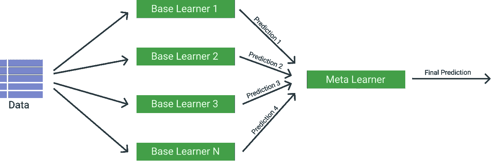
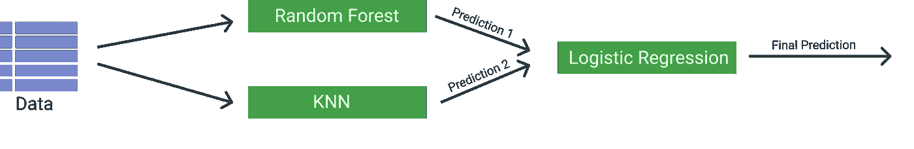
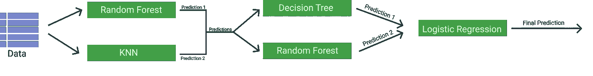

# Sklearn 让堆叠变得简单

> 原文：<https://towardsdatascience.com/stacking-made-easy-with-sklearn-e27a0793c92b?source=collection_archive---------7----------------------->

Photo by [Jeremy Thomas](https://unsplash.com/@jeremythomasphoto?utm_source=unsplash&utm_medium=referral&utm_content=creditCopyText) on [Unsplash](https://unsplash.com/s/photos/balance?utm_source=unsplash&utm_medium=referral&utm_content=creditCopyText)

## sci kit-学习

## 用几行代码创建一个 StackingClassifier

# 介绍

整体方法的基本原则是在统一中发现力量。通过组合多种方法，每种方法都有自己的优缺点，可以创建更强大的模型。

> 整体大于部分之和——亚里士多德

这句话尤其适用于堆叠，这是一种将许多不同的学习者组合成一个更强大的模型的方法。

写这篇文章的主要原因不是解释堆栈是如何工作的，而是演示如何使用 **Scikit-Learn V0.22** 来简化堆栈管道并创建有趣的模型。

# 1.堆垛

尽管有许多很棒的资料来源介绍了堆栈(这里的、这里的和这里的)，但是让我快速地让您了解一下。

堆叠是一种技术，它采用几个回归或分类模型，并使用它们的输出作为元分类器/回归器的输入。

本质上，堆叠是一种集成学习技术，很像随机森林，通过组合典型的弱模型来提高预测的质量。

Overview of a single level Stacking model

上图给出了堆叠原理的基本概述。它通常由许多弱基础学习或几个强基础学习组成。然后，元学习器基于每个基础学习器的预测输出进行学习。

# 2.Sklearn 堆叠

虽然有许多包可以用于堆叠，如 [mlxtend](http://rasbt.github.io/mlxtend/user_guide/classifier/StackingClassifier/) 和 [vecstack](https://github.com/vecxoz/vecstack) ，但本文将深入探讨 scikit-learn 新版本中新添加的堆叠回归器和分类器。

首先，我们需要确保将 Scikit-learn 升级到版本 0.22:

`pip install --upgrade scikit-learn`

我们要做的第一个模型是一个分类器，可以预测花的规格。该模型相对简单，我们使用随机森林和 k 近邻作为我们的基本学习器，使用逻辑回归作为我们的元学习器。

One-layer Stacking Model

编码堆叠模型可能相当棘手，因为您将不得不考虑您想要在不同步骤生成的折叠和交叉验证。幸运的是，新的 scikit-learn 版本只需几行代码就可以创建如上所示的模型:

基本上就是这样！只有几行代码的堆叠分类器。

# 3.交叉验证

堆叠的一个困难是您选择在哪里应用交叉验证。我们可以只在元学习者级别应用它，但是这可能会导致我们的模型过拟合，因为基础学习者的输出可能已经过拟合了。

尽管有许多解决这个问题的策略，但在 scikit-learn 中，堆栈的实现如下:

> 基础学习者适合于完整的`X`，而最终估计者则通过使用`cross_val_predict`的基础学习者的交叉验证预测来训练。

这意味着每个单独的基础学习者的预测被堆叠在一起，并被用作元学习者的输入来计算预测。然后通过交叉验证来训练这个元学习者。

交叉验证自动设置为 5 倍 CV，但可以手动调整:

但这还不是全部，您还可以加入任何您想要的交叉验证策略:

# 4.多层堆叠

在第 2 步中，我们已经创建了一个具有单层基本学习者的 StackingClassifier。但是如果你想用另一组基础学习者代替元学习者呢？你如何添加层来增加模型的复杂性？

这里，我们将在步骤 2 中向模型添加另一层学习者，以便了解如何编写解决方案。

在上图中，我们可以看到我们想要添加一个包含两个额外分类器的层，即一个决策树和一个随机森林。

为了做到这一点，我们创建了两个估计列表，每层一个。我们使用最终模型的第二层估计量，即逻辑回归，创建一个 StackingClassifier。然后，我们用第一层估计器创建一个新的 StackingClassifier 来创建完整的模型管道。

正如你所看到的，模型的复杂性随着每一层的增加而迅速增加。此外，如果没有适当的交叉验证，您很容易使用这么多的层来填充数据。

# 结论

堆叠可能是一个棘手的问题，因为它需要对数据泄漏有深刻的理解，以便选择正确的程序。确保总是对你的模型进行广泛的验证，以便理解它的普遍性。

如果你像我一样，对人工智能、数据科学或心理学充满热情，请随时在 [LinkedIn](https://www.linkedin.com/in/mgrootendorst/) 上添加我。