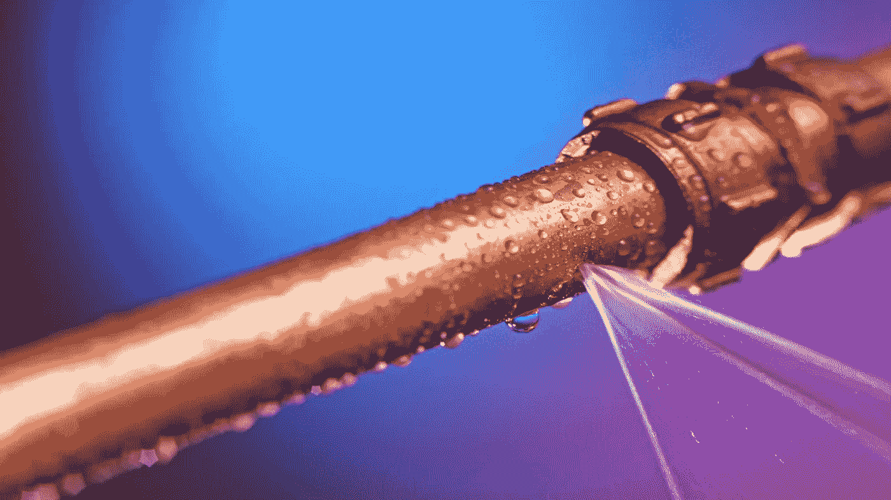
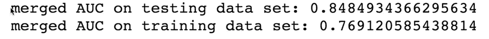
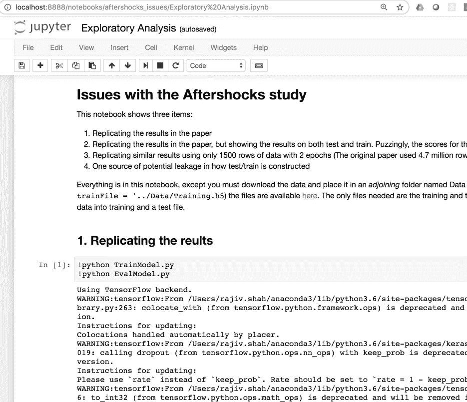

# 支持最佳实践:

> 原文：<https://towardsdatascience.com/stand-up-for-best-practices-8a8433d3e0e8?source=collection_archive---------6----------------------->

## **深度学习在《自然》杂志地震余震论文中的误用**

Source: Yuriy Guts selection from Shutterstock

# 机器学习炒作的危险

人工智能、机器学习、预测建模和数据科学的从业者在过去几年中有了巨大的增长。曾经由知识混合定义的利基领域正在成为一个快速发展的职业。随着围绕人工智能的兴奋继续增长，新一轮的 ML 增强、自动化和 GUI 工具将导致试图建立预测模型的人数进一步增长。

但问题是:虽然使用预测建模工具变得越来越容易，但预测建模知识还没有普及。错误可能是违反直觉的和微妙的，如果你不小心，它们很容易让你得出错误的结论。

我是一名数据科学家，以与数十个专家数据科学团队合作为生。在我的日常工作中，我看到这些团队努力构建高质量的模型。最好的团队一起检查他们的模型来发现问题。有许多难以检测的方法会导致有问题的模型(比如，允许[目标泄露](https://www.datarobot.com/wiki/target-leakage/)到他们的训练数据中)。

识别问题并不有趣。这需要承认令人兴奋的结果“好得难以置信”，或者他们的方法不正确。换句话说，**与其说是吸引眼球的性感数据科学炒作，不如说是一门严谨的科学学科**。

# 糟糕的方法会产生糟糕的结果

大约一年前，我在《自然》杂志上读到一篇文章，声称通过使用深度学习预测地震余震达到了前所未有的准确性。读了这篇文章，我内心的雷达对他们的结果产生了深深的怀疑。他们的方法根本不具备仔细预测模型的许多特征。

我开始深入调查。在此期间，这篇文章炸了，成了[广为人知的](https://blog.google/technology/ai/forecasting-earthquake-aftershock-locations-ai-assisted-science/)！它甚至被包括在 Tensorflow 的[发行说明中，作为深度学习可以做什么的例子。然而，在我的挖掘中，我发现了论文中的重大缺陷。也就是说，数据泄漏会导致不切实际的准确性分数和对模型选择的不重视(当一个更简单的模型提供相同水平的准确性时，您不会构建一个 6 层神经网络)。](https://medium.com/tensorflow/whats-coming-in-tensorflow-2-0-d3663832e9b8)

The testing dataset had a much higher AUC than the training set . . . this is not normal

对于我之前的观点:这些是微妙的，**但是难以置信的基本的**预测建模错误，它们可以使整个实验结果无效。数据科学家接受培训，在工作中识别和避免这些问题。我假设这只是作者忽略了，所以我联系了她，让她知道，以便她可以改进她的分析。尽管我们之前有过交流，但她没有回复我关于论文的邮件。

# 充耳不闻

那么，我该怎么办呢？我的同事告诉我只要发推特就可以了，但我想坚持良好的建模实践。我认为理性和最佳实践会占上风，所以我开始了为期 6 个月的过程来记录我的结果，并与自然分享。

在分享我的结果时，我在 2019 年 1 月收到了《自然》杂志的一份说明，尽管对数据泄露和模型选择的严重担忧使他们的实验无效，但他们认为没有必要纠正错误，因为“**德弗里斯等人主要关注的是使用机器学习作为一种工具来提取对自然世界的洞察力，而不是算法设计的细节**”。作者给出了更加严厉的回应。

你可以在我的 github 上阅读整个交流[。](https://github.com/rajshah4/aftershocks_issues)

仅仅说我很失望是不够的。这是一篇重要的论文(*这是自然！尽管使用了有缺陷的方法，但还是相信了人工智能的炒作并发表了一篇论文。*

然后，就在这个星期，我偶然看到阿诺·米格南和马尔科·布罗卡多写的关于他们在《余震》文章中发现的缺点的文章。这里还有两位擅长地震分析的数据科学家，他们也注意到了论文中的缺陷。我还将我的分析和可复制代码[放在了 github](https://github.com/rajshah4/aftershocks_issues) 上。

Go run the analysis yourself and see the issue

# 支持预测建模方法

我想澄清一点:我的目标不是丑化余震论文的作者。我不认为他们是恶意的，我认为他们会说他们的目标只是展示机器学习如何应用于余震。Devries 是一位有成就的地震科学家，她想将最新的方法用于她的研究领域，并从中发现了令人兴奋的结果。

但问题是:他们的见解和结果是基于有根本缺陷的方法。光说“这不是机器学习论文，这是地震论文”是不够的。**如果您使用预测建模，那么您的结果质量由您的建模质量决定。**你的工作变成了数据科学工作，你因为你的科学严谨性而上钩。

对使用最新技术和方法的论文有着巨大的需求。很难收回这些文件。

**但如果我们允许带有根本性问题的论文或项目取得进展，这将伤害我们所有人。它破坏了预测建模领域。**

请推回坏数据科学。向报社报告不好的发现。如果他们不采取行动，去推特，发布相关信息，分享你的结果，制造噪音。这种类型的集体行动有助于提高对 p 价值观的认识，并打击 p 黑客的流行。如果我们希望我们的领域继续增长并保持可信度，我们需要良好的机器学习实践。

**鸣谢:**我要感谢 [DataRobot](http://www.datarobot.com) 所有伟大的数据科学家，他们在过去的一年里给予了我合作和支持，其中包括:Lukas Innig、Amanda Schierz、Jett Oristaglio、Thomas Stearns 和 Taylor Larkin。