# 星巴克:分析咖啡

> 原文：<https://towardsdatascience.com/starbucks-analyze-a-coffee-b4eef811aa4a?source=collection_archive---------10----------------------->

星巴克拥有独特的方式与购买其产品的顾客建立联系并给予奖励。**星巴克奖励计划**允许该公司创建忠诚度计划，通过奖励购买特价产品的忠诚顾客。

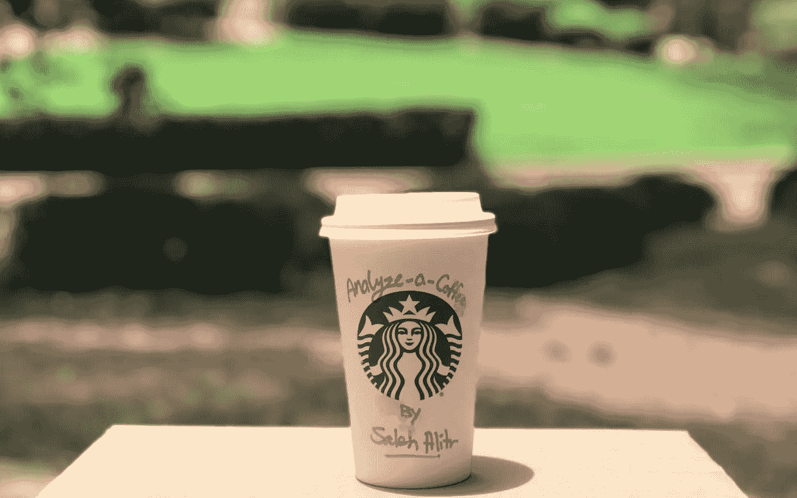

# 介绍

S tarbucks 是一家全球性咖啡公司，在 75 个国家销售咖啡、茶、浓缩咖啡、面包和外卖。该公司的价值观之一是“创造一种温暖和归属感的文化，欢迎每一个人。”因此，它利用多种渠道营销其产品，从社交媒体到电视插播和广告。星巴克通过运用营销媒体渠道的组合来执行其非凡的营销策略，创造品牌知名度。星巴克不仅了解它的产品和顾客，而且还了解顾客如何使用技术。**星巴克应用程序**使客户能够跟踪参与商店的优惠和欢乐时光交易。它允许客户赚取并收集**星**(每美元收集两颗星)，可在店内或通过该应用进行兑换。

> 星巴克执行副总裁兼首席战略官马特·莱恩表示:“由于每周有近 1 亿顾客光顾我们的门店，我们正在寻找更多直接和私人接触的机会，为他们提供有意义的特别福利和优惠。”。

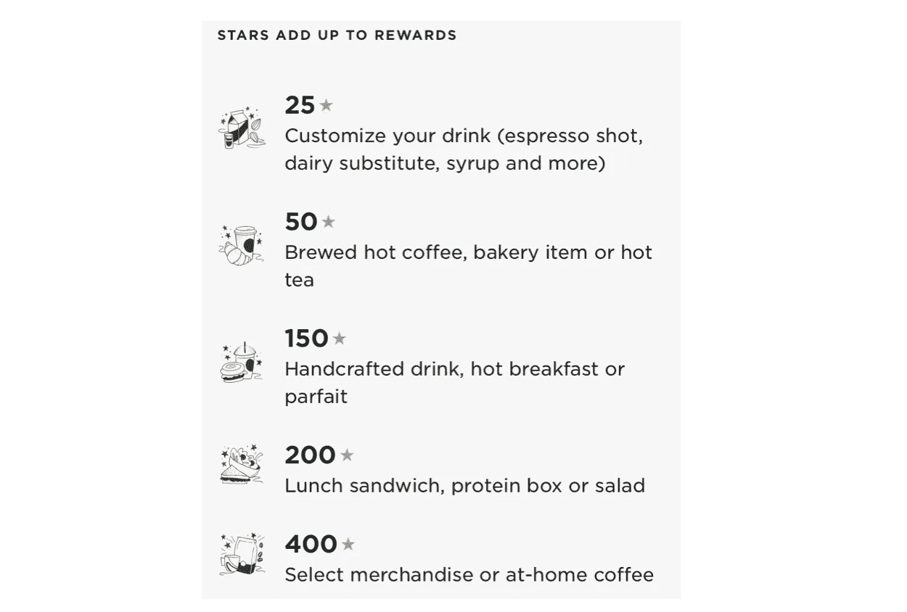

在这里，我们将调查和分析三个模拟人们如何做出购买决定以及促销活动如何影响这些决定的文件。A **清理分析后的最终数据的**潜行:该数据包含发送给 **14，825 客户**的 **8 个要约**的信息，这些客户在*完成至少一个要约*的同时进行了 **26，226 笔交易**。以下是两个例子，说明星巴克通过应用程序向顾客提供优惠，鼓励他们购买产品和收集明星。

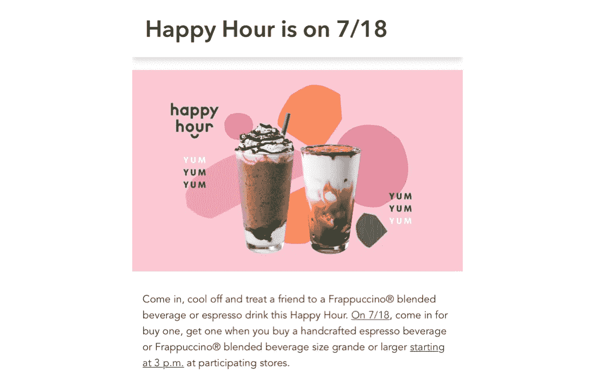

Buy One, Get One (**BOGO**) is one of the offers that will be analyzed in our data

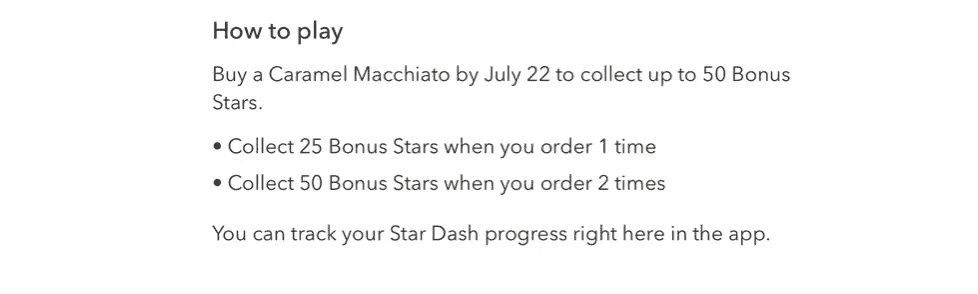

Another type of the offer that Starbucks sends to the customers

***奖金*** :下图是一个交互式的日爆图，显示了更多关于**交易数量的细节**客户收到要约，通过使用的渠道之一查看该要约，然后进行交易**在该要约期限结束前完成**要约*。*

Click on the interactive chart to see the number of transactions of two offer type, eight offer ID, and gender.

分析及其结果只是观察性的，不是正式研究的结果。下面列出了一般的业务问题，以指导我们通过分析开发一套启发式方法，其中的发现不能保证是最佳的或合理的。这是我的 [Github 库](https://github.com/salitr/starbucks_offers_analysis)，里面有所有需要的代码。

# 商业问题

分析的目的是检验星巴克的顾客对一个提议的反应，不管这个提议是 BOGO 还是折扣。并非所有的顾客都有相同的动机去查看报价，然后进行交易以完成报价。许多因素在影响客户如何做出购买决策方面发挥着重要作用；例如，一些客户更喜欢让他们收集越来越多的星星来获得独家津贴甚至免费产品。有时，特定年龄组的顾客更喜欢与其他年龄组不同的产品。此外，我们应该记住，女性顾客对报价的反应可能与男性顾客不同。可以从很多方面进行调查分析，寻找这类问题的答案。所有这些都将有助于星巴克锁定目标顾客，然后根据顾客群个性化定制产品。*可以问很多问题；下面是我们将要调查的一些内容*:

1.至少收到一份报价的客户数量是多少？
2。谁通常在星巴克消费更多，女性还是男性？
3。对于消费更多的顾客；谁的年收入更多？
4。就性别而言，大多数星巴克顾客的年龄是多少？
5。自优惠活动开始以来，顾客在任何时候都花了多少钱？
6。我们能否按年龄组或性别找到最受欢迎的优惠，然后将其与其他优惠，甚至另一个年龄组的优惠进行比较？
7。哪个优惠对星巴克最有利？BOGO 优惠和折扣优惠有区别吗？如果是这样，男性顾客对这两种报价类型的反应是否和女性顾客一样？

# 数据集

我们已经拥有和将要读取、清理和分析的数据集:

*   **portfolio.json** —文件中各变量的说明:
    -*id*:offer id
    -*offer _ type*
    -*难度*:完成一个要约所需的最低花费
    - *奖励*:完成一个要约所给的星级
    - *持续时间*:要约开放的时间，以天为单位
    -
*   **profile.json** —文件中各变量的解释:
    - *年龄*-*成为 _ 会员 _ 日期*:客户创建 app 账号的日期
    - *性别*
    - *id* :客户 id
    - *收入*
*   **transcript.json** —文件中各变量的解释:
    - *事件*:记录描述(交易、收到要约、查看等。)
    - *人*:客户 id
    - *时间*:自报价开始起的小时数
    - *值*:报价 id 或交易金额，视事件而定

# 数据准备

> 如果您想查看最终结果，而不想深入了解技术细节，请跳到**数据探索**部分。

***注*** *:* 在清洗过程中，一些变量的名称和顺序已经改变，以便于交流。

对这三个文件进行了许多修改和准备，以获得一个最终的干净数据集，该数据集包含每个变量所需的所有信息，从优惠类型到性别和年龄组。已经解决和解决的要点是:

## 1.第一部分

*   **简档**文件中的**年龄**变量包含一个最大值 *118* 岁，这被认为是一个不寻常的值，将进一步调查。结果，我们发现有 **2175 个客户**在收入和性别信息方面没有**值。配置文件中的所有空值都是年龄值为 **118** 的客户的一部分。因此，作为配置文件清理过程的一部分，值为 118 的行将被删除，这导致我们拥有 **14825 个客户**，而不是最初的 17000 个客户。**

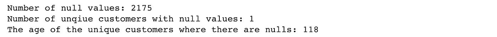

Printing the number of nulls, and then the age of customers who have nulls

*   **投资组合**文件中的**渠道**变量列出了一个字段中用于报价的所有渠道。因此，我们拆分渠道，其中每个渠道本身成为一个变量，如果它已被用作特定报价的渠道，则值为 **1** ，而值 **0** 表示它尚未被使用。

Code for splitting the channels

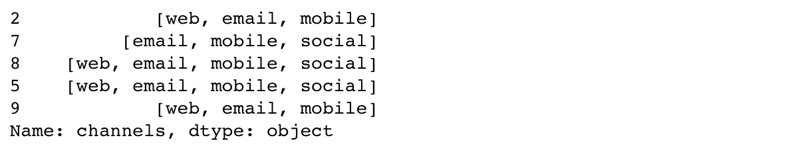

A view of the channels before being split into 4 variables

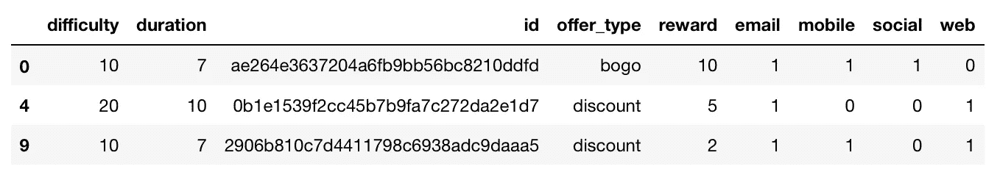

The portfolio data after splitting the channels

*   **组合**文件中的**持续时间**变量将在清理过程中发挥主要作用，它将与**抄本**文件中提供的每个抄本的**时间**进行比较。因此，它被转换为以**小时**表示，而不是以**时间**变量表示的天数。
*   **简档**文件中的**变成 _ 成员 _ 开**变量可用于查找大多数顾客加入星巴克应用程序的时间趋势。因此，首先，该列被转换为日期**而不是整数**，然后创建了一个按*月*的 **membership_period** ，其中显示了客户成为会员时的**月**和**年**。

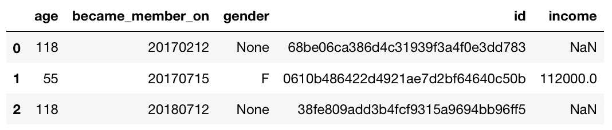

Before converting become_member_on variable

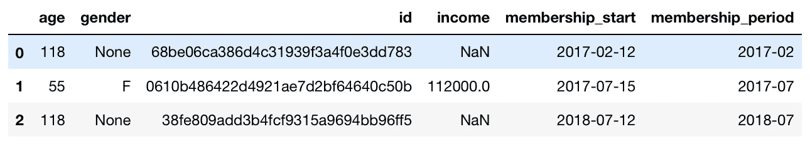

After converting the variable to date and creating membership period

*   在**抄本**文件中的**值**变量包含了一系列信息，这些信息取决于客户所做的事件。如果客户进行了交易，这意味着该值是交易金额。否则，我们将获得客户已经收到、查看或完成的优惠 id。因此，我们将**值**拆分为两列:**记录**(报价 id 或交易)和**记录 _ 值**(金额或 id)。因此，创建了两个新的数据集。第一个是**报价**，包括客户已收到、查看或完成的*客户 id* 和*报价 id* 等信息。另一个文件是具有*交易金额*而不是报价 id 的**交易**。

*   基于针对要约的事件变量创建的三个数据框架，创建了新的数据框架**offers _ count**；已接收、已查看或已完成。这三个集合被合并以创建完整的比较，该比较说明了接收、查看或完成报价的客户数量，包括完成百分比。

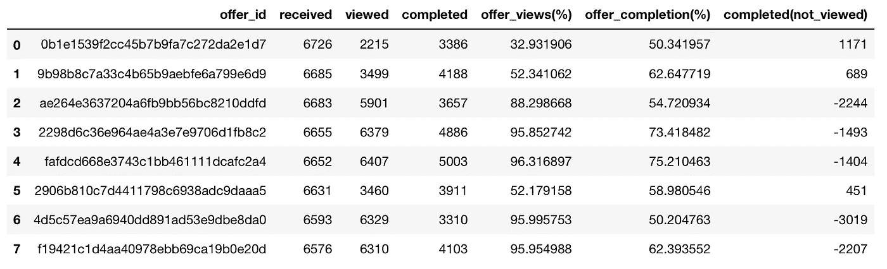

if complete(not_viewed) is positive that indicates some customers completed an offer without viewing it

## 2.第二部分

> 在浏览数据以找到*启发式*发现之前，让我们总结一下我们将在探索步骤中关注的重要文件，然后合并它们以创建一个最终的、干净的数据集用于进一步分析。

## A.轮廓

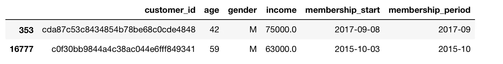

## B.处理

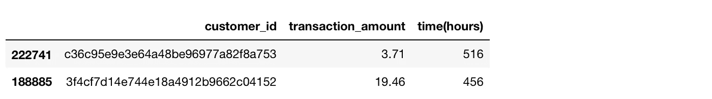

## C.提议

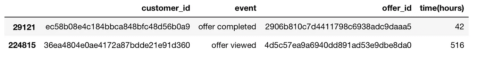

## D.报价比较

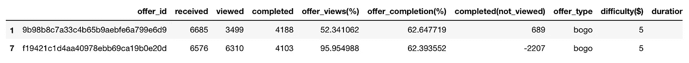

created by merging offers_count data and portfolio data after being clean

*   这四个数据集被合并以创建将被分析的**完整数据**。然后，根据我们想要使用的变量创建子数据集。例如，可以只为女性顾客创建一个子数据集，为只完成至少一个报价的女性顾客创建另一个子数据集。此外，我们还可以为 only offer 5 创建一个子数据集，其中只有男性客户完成了该报价，并且在报价结束前至少进行了一次交易。
*   **客户 id**和**报价 id**在整个数据集中进行了清理，以便在分析时有简单的数字，而不是散列。
*   通过比较交易的**时间**和要约的**持续时间**，我们删除了要约结束后发生的交易。

接下来，我们将检查从最终的干净数据集创建的每个子数据集，以回答之前发布的问题。

# 数据探索

> 请注意，所有图表都是**交互式的**，因为当**将**悬停在图表的任何部分时，您可以获得更多信息。此外，一些图表在左上角有**过滤器**，您可以通过**性别**或**报价 id** 过滤图表。

## 1.客户数量

甜甜圈图显示了*女性*客户占 **41.30%** 和*男性*客户占 **57.20%** 的数据总体情况，无论他们是否在要约结束前完成要约、达成交易。还有，选择*其他*为性别的客户只占 **1.43%** 。我们是否可以认为，男性顾客越多，就意味着他们的交易量就越大？接下来，我们将进一步调查这些数字。

## 2.按性别分列的收入

我们可以看到，平均而言，*男*顾客一年挣的**比*女*顾客少**。事实上，女性顾客的年收入高于所有性别类型的平均收入。当*女*顾客平均每年挣大约**7.1 万**时，*男*顾客平均每年挣大约**6.1 万**。

这里，该图表明，总体而言，我们的大多数客户收入在 **50k** 和 **75k** 之间。平均每收入率客户数为 **163 个客户**。因此，当*少数*人每年挣超过 **100k** 时，一些顾客挣不到 **50k** 而另一些挣在 **76k** 和 **100k** 之间。总体来看，我们可以看到大多数*女*客户赚在 **60k** — **75k** 之间，大多数*赚*客户赚 **45k** — **60k** 。接下来，我们将确认女性和男性客户收入比率之间的差异。

在这里，我们证实了以前的收入分布的发现。该图证实，所有性别类型的大多数顾客的收入在 **40k** 和 **60k** 之间。大多数*女*顾客的年收入在 **60k** 和 **80k** 之间，而大多数*男*顾客的年收入在 **40k** 和 **60k** 之间。

## 3.按性别划分的年龄

箱线图描述了按性别分列的年龄分布概况。他们显示，平均而言，女性顾客比男性顾客年龄大。

从另一个角度看按性别划分的年龄分布。箱线图证实了大多数男女顾客的年龄都在 40 岁到 60 岁之间。

## 4.交易的时间和金额

自优惠开始以来的交易趋势显示，平均而言，从优惠开始到 10 天内的任何时间，女性*顾客支付的金额都比男性*顾客*支付的金额多**。回到我们在第一张图中关注的问题；尽管*男性*顾客的数量更多，但*女性*顾客支付的费用比*男性*顾客支付的费用更多。唯一的**例外**是在要约开始后 **228 小时**后进行的交易。自优惠活动开始**以来，平均而言，所有顾客在任何时候支付的总金额为**16.55 美元**。**我们可以看到*女性*顾客支付的**比任何时候的平均**都多！而男性顾客支付的时间比平均水平少。*同样，我们可以观察到一些* ***高峰*** *随着时间的推移，男女双方平均比平时付出更多。这可能是在周末或白天的特定时间。****

该图显示了自这些优惠开始以来的任何时间在两个优惠上花费的平均金额。我们可以看到，平均而言，所有顾客对**优惠 5** 的反应和支付都比他们在任何时候对**优惠 7** 的反应和支付都多**。**

## 5.报价分析

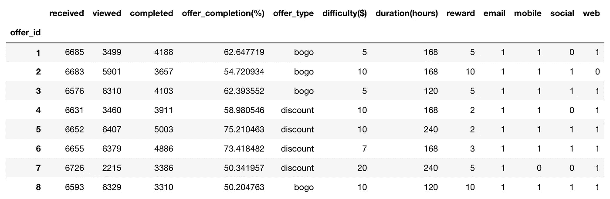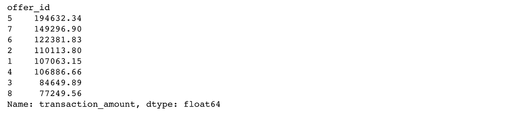

Top offers by the total transaction amount

在这里我们可以看到，**报价 5** 和**报价 7** 是所有**完成**报价并完成至少一笔交易的客户中支付的总交易金额最多的:分别为**$ 194632**和**$ 149296.9，**。接下来，我们将查看与优惠类型和性别相关的最高优惠。

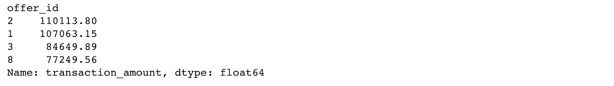

Top **BOGO** offers by the total transaction amount

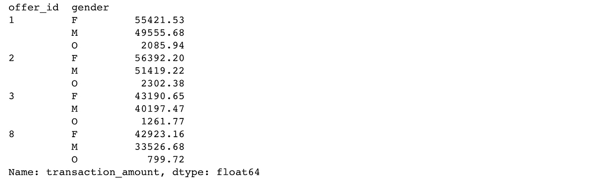

**BOGO** offers by the total transaction amount paid by gender

**优惠 2** 在四个 **BOGO** 优惠中获得最高金额，所有客户支付的总金额为 **$110113.8** 。总的来说，*女性*顾客支付的**比*男性*顾客支付的**要多 **BOGO** 的任何一项优惠。*女*和*男*顾客对**报价 2** 和**报价 1** 的支付最多。

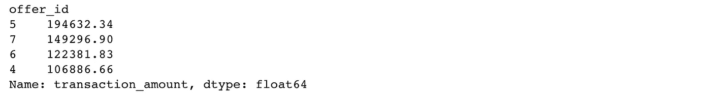

Top **Discount** offers by the total transaction amount

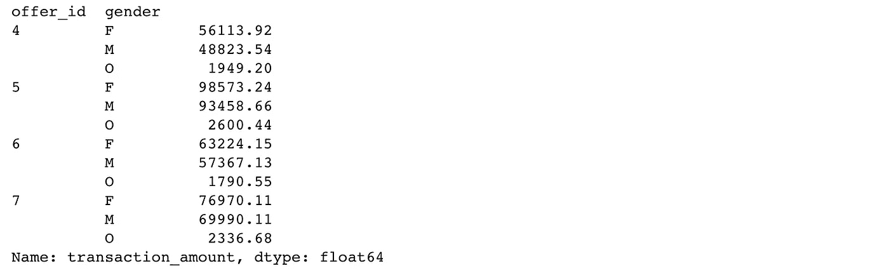

**Discount** offers by the total transaction amount paid by gender

**优惠 5** 是四个**优惠**中金额最高的，所有顾客共支付**194632.34 美元**。总体而言，在任何**折扣**优惠中，*女性*顾客比*男性*顾客支付的**多**。*女*和*男*顾客对**优惠 5** 和**优惠 7** 的支付最高。

## 6.提供完成率

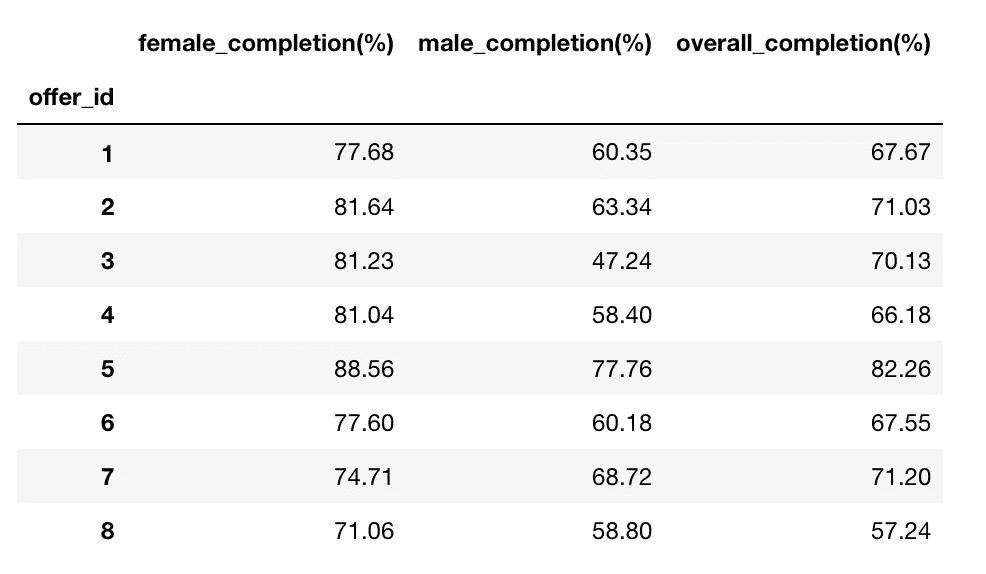

在之前的清理过程中对数据进行了进一步清理之后，下面是每个职位按性别划分的完成率比较。*完成百分比来自完成报价的客户数量与收到报价的客户数量。*所有客户的总体完成率；*女*、*男*、*其他*。 **Offer 5** 是最受欢迎的 Offer，完成率为 82%。显然，女性顾客对优惠的回应率总是高于男性顾客。两种性别都最喜欢出价 5 英镑。然而，尽管超过 80%的***女性*客户完成了**报价 3** 和 **4** ，但平均有 55%的*男性*客户完成了这些报价**。****

柱状图展示了之前发现的数字，从中我们可以看到*女性*顾客对优惠的行为和*男性*顾客行为之间的明显**差异**。总体来说， **offer 8** 是最不**的**热门 offer， **offer 5** 是最**的**热门 offer 男女通用。**报价 8** 是**最不受*女性*客户欢迎的报价，而**报价 3** 是**最不受**男性*客户欢迎的报价。***

该图显示了所有客户*女性*和*男性*的每个年龄组的每次报价完成率。比如在年龄层 **35 岁**， **offer 6** 有**最高**完成率 **82.61%** 。而年龄层 **25 岁**更喜欢**报价 5** 最多，完成率 **77.55%** 。

# 调查结果摘要

1.  向 14，825 名客户发送了八个优惠(4 个 BOGO 和 4 个折扣)，他们完成了 26，226 笔交易，同时*完成了至少一个优惠*。
2.  在所有数据中，女性客户占 41.30%，男性客户占 57.20%，无论他们是否在要约结束前完成要约、达成交易。
3.  平均来说，男顾客一年赚的钱比女顾客少。女性顾客的年收入高于所有性别类型的平均收入。女性顾客平均年收入约为 7.1 万英镑，而男性顾客平均年收入约为 6.1 万英镑。
4.  所有性别类型的大多数客户收入在 4 万到 6 万之间。大多数女性顾客年收入在 6 万到 8 万英镑之间，而大多数男性顾客年收入在 4 万到 6 万英镑之间。
5.  平均而言，女性顾客比男性顾客年龄大。男女顾客的年龄大多在 40 至 60 岁之间。
6.  平均而言，自优惠开始后的任何时候，所有客户支付的总金额为 16.55 美元。女性顾客在任何时候都比平均水平付出更多！而男性顾客大多数时候支付的费用低于平均水平。
7.  报价 5 和 7 是所有完成报价并至少完成一笔交易的客户支付的最大交易总额:分别为 194，632 美元和 149，296.9 美元。平均而言，所有客户对优惠 5 的反应和支付的费用几乎总是高于他们在任何时候对优惠 7 的反应和支付的费用。
8.  在 BOGO 的四个优惠中，优惠 2 的金额最高，所有客户支付的总金额为 110113.8 美元。女性顾客比男性顾客为 BOGO 提供的任何产品支付更多的钱。
9.  在四个折扣优惠中，优惠 5 的金额最高。女性顾客比男性顾客支付更多的折扣。优惠 5 是最受欢迎的优惠，完成率为 82%。
10.  就客户年龄而言，25 岁的客户完成率最高，为 77.55%。而 35 岁和 45 岁的客户更喜欢 offer 6，完成率分别为 82.61%和 83.33%。