# 星巴克优惠优化

> 原文：<https://towardsdatascience.com/starbucks-offer-optimisation-cdf9bcedd48a?source=collection_archive---------33----------------------->

# 介绍

促销优惠目前相当普遍。几乎每一家销售消费品的公司都会时不时地推出某种促销活动——无论是因为竞争加剧，还是为了扩大客户群或增加收入。由于发送这些报价是有成本的，所以通过设计有效的促销策略来最大化这些报价成功的可能性是至关重要的。

在本帖中，我们将分析模拟促销优惠数据，这些数据模拟了星巴克奖励移动应用程序上的客户行为，以获得商业见解，然后将这些发现转化为一个[“可解释的”机器学习](https://en.wikipedia.org/wiki/Explainable_artificial_intelligence)模型，该模型将预测客户是否会对优惠做出反应。目标是只向那些更有可能响应的客户发送报价，并且只发送那些最有可能成功赢得客户的报价。

对于这个项目，我们将遵循最广泛使用的分析过程模型 [CRISP-DM](https://en.wikipedia.org/wiki/Cross-industry_standard_process_for_data_mining) 。

# 商业理解

每隔几天，星巴克就会向手机应用程序的用户发出一次报价。优惠可以仅仅是饮料的广告，也可以是实际的优惠，如折扣或 BOGO(买一送一)。某些用户可能在特定的几周内收不到任何优惠。

并非所有用户都收到相同的报价，这是这个数据集要解决的挑战。

这个数据集是真实星巴克应用程序的简化版本，因为底层模拟器只有一种产品，而星巴克实际上销售几十种产品。

每个报价都有一个难度级别，并且在报价到期前有一个有效期。例如，难度级别为 7 的 BOGO 报价可能仅在 5 天内有效。这意味着如果顾客在优惠到期前消费 7 美元或更多，他将免费获得价值 7 美元的产品。信息优惠的难度级别为 0，因为它们不要求进行任何购买。它们也有有效期，即使这些广告只是提供产品信息；例如，如果信息性报价有 7 天的有效期，我们可以假设客户在收到广告后的 7 天内感受到了报价的影响。

然后是客户数据，其中包含人口统计信息，如年龄、性别、收入以及会员开始日期。

有交易数据显示用户在应用程序上进行的购买，包括购买的时间戳和购买的金额。该交易数据还包含用户收到的每个要约的记录，以及用户实际查看要约的记录。也有用户完成报价的记录。

我们将结合交易、人口统计和优惠数据，然后标记有效的客户-优惠组合。有效报价是指客户受到报价的影响并进行交易以完成报价的报价。接下来，我们将进行探索性数据分析，以培养对客户和/或与优惠有效性相关的优惠属性的直觉。我们将使用我们在数据分析阶段的发现来建立一个受监督的机器学习模型，该模型将客户和提供细节的组合作为输入，并预测它是否将是一个有效的组合。我们将只发送那些模型预测对客户有效的报价。

# 数据理解

在这一节中，我们将粗略地看一下数据，以便对数据形式的一切有一个高层次的了解。

数据包含在三个文件中:

*   portfolio.json —包含报价 id 和关于每个报价的元数据(持续时间、类型等)。)
*   profile.json —每个客户的人口统计数据
*   transcript.json 记录交易、收到的报价、查看的报价和完成的报价

以下是文件中每个变量的模式和解释:

*portfolio.json*

*   id(字符串)—优惠 id
*   offer_type (string) —优惠的类型，即 BOGO、折扣、信息
*   难度(int)——完成一项提议所需的最低花费
*   奖励(int) —为完成一项提议而给予的奖励
*   duration(int)-要约开放的时间，以天为单位
*   频道(字符串列表)

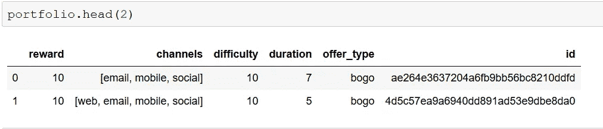

*profile.json*

*   年龄(整数)—客户的年龄
*   成为会员日期(int) —客户创建 app 帐户的日期
*   性别(str) —客户的性别(请注意，有些条目包含“O”代表其他，而不是 M 或 F)
*   id (str) —客户 id
*   收入(浮动)—客户的收入

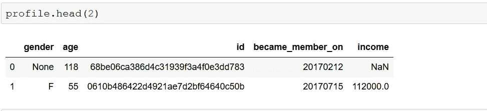

*抄本. json*

*   事件(str) —记录描述(即交易、收到的报价、查看的报价等。)
*   人员(字符串)—客户 Id
*   time (int) —测试开始后的时间，以小时为单位。数据开始于时间 t=0
*   value —(字符串字典)—报价 id 或交易金额，具体取决于记录

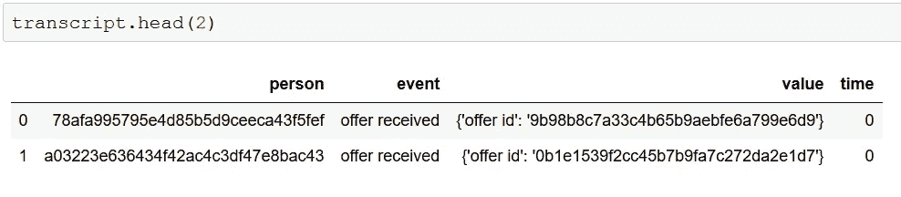

以下是数据概述:

*   有 10 个报价，这些报价的子集被发送给 17000 个客户。
*   报价有效期从 3 天到 10 天不等。
*   报价的难度从 0 到 20 不等。最容易的报价的购买金额阈值为 5，最难的报价的购买金额阈值为 20。
*   优惠相关事件和交易数据的有效期为 30 天。
*   最近一次会员是 2018 年 7 月，说明数据是 1 岁。

# 数据准备

在这里，我们将首先进行数据辩论，然后使用可视化进行数据分析。

## 数据清理

对于每个数据集，我们将评估数据的不一致性和特征，然后我们将使用清理功能一起解决这些问题。

在数据理解阶段，我们知道客户 Id 和报价 Id 列中的数据不是用户友好的格式。我们需要使用一个通用的映射函数将这些列转换成更易读的格式，该函数将唯一的整数值映射到每个 id。

根据我们的评估，以下是我们需要遵循的清洁步骤。

*投资组合*

*   将唯一的整数 id 映射到每个优惠 id。
*   将频道分成单独的列。
*   放弃电子邮件渠道，因为它是所有报价的公共渠道。

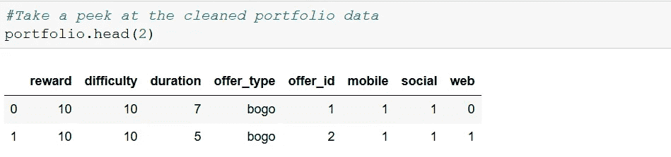

*简介*

*   将唯一的整数 id 映射到每个人。
*   删除 118 岁人员的概要文件，因为这是为缺少性别和收入数据的人员填充的默认年龄。
*   将“成为成员日期”转换为日期格式。
*   从“成为成员于”创建新列“成员资格 _ 持续时间”,因为“成为成员于”列在其当前格式下不是很有用。我们将以最近的“成为会员日期”作为参考，以天为单位计算会员持续时间。
*   删除“成为成员于”列

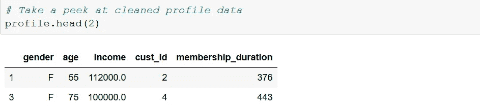

*成绩单*

对于抄本数据，清理过程稍微复杂一些。以下是初始步骤:

*   将唯一的整数 id 映射到每个人，并使用在清理个人资料和投资组合数据中使用的 id 映射字典提供
*   从值列提取金额、优惠 id 和奖励
*   隐蔽时间从几小时到几天。由于优惠持续时间以天为单位，这将帮助我们比较数据，并根据优惠接收日期和优惠持续时间得出优惠到期日期。
*   将抄本数据帧分割成包含交易和非交易数据的两个独立的数据帧。

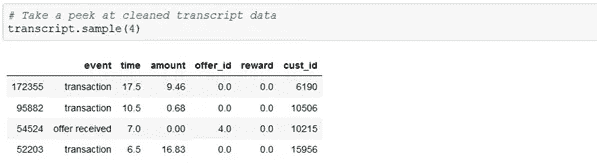

交易金额没有映射的优惠 id。因此，了解客户在特定优惠期间消费金额的唯一方法是，总结客户在优惠期间的交易金额。

让我们画出交易金额。

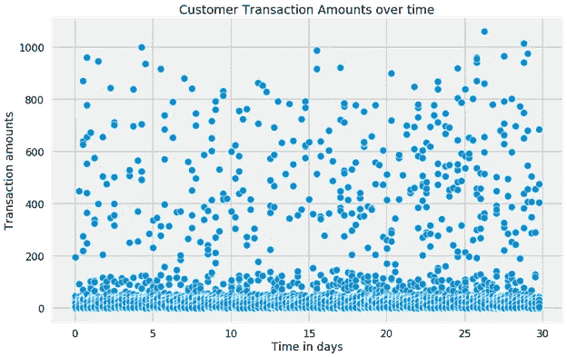

大多数购买金额在 100 美元以下。然而，有许多高价值交易，最大交易金额高达 1062 美元。我们从投资组合数据中得知，最困难的报价要求客户花费 20 美元或更多。因此，远远超过 20 美元的高价值交易可能是团体订单，不受促销优惠的影响。出于我们的分析和建模目的，我们将使用[四分位数范围](https://en.wikipedia.org/wiki/Interquartile_range)中的最大阈值将这些交易标记为异常值。在要约期内，如果客户有一笔或多笔异常交易，我们不会将其视为客户的有效要约。

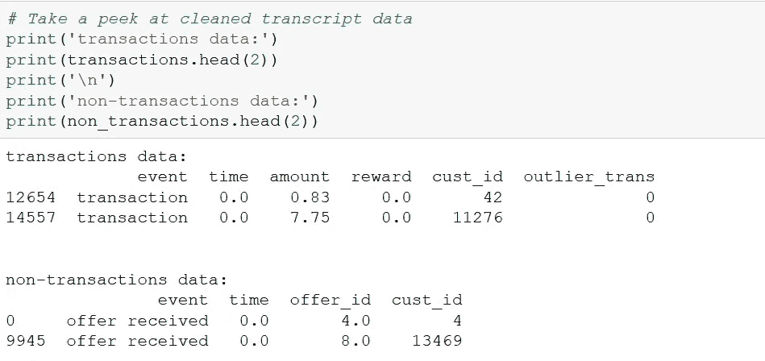

接下来，我们将按照以下步骤将所有数据集合并到单个数据帧中:

*   通过为事件创建单独的列，将 non_transactions 数据转换为[宽格式](https://pandas.pydata.org/pandas-docs/stable/user_guide/reshaping.html)。
*   根据交易数据，计算每位客户在 30 天促销期间的总消费金额。从该计算中排除异常交易。
*   使用通用客户和报价 id 列将所有数据集合并到一个数据框架中。
*   对于多次向客户发送相同报价的情况，我们将只考虑第一次。

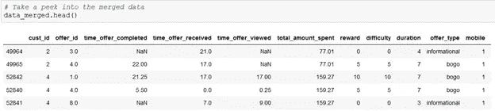

**识别受影响的客户**

在我们绘制数据以寻找趋势和模式之前，我们需要对客户进行分类，并提供有效和无效类别的 id 组合。

为此，我们将查看发送给客户的每份促销优惠，并确定该优惠是否影响了他/她。根据客户对促销活动的反应，可以分为四大类。

*   不受影响:如果客户看到了报价，但没有完成，那么他不受报价的影响。他知道该优惠，但没有受到影响而购买。
*   受影响:客户查看了报价并完成了交易。经验法则是，如果客户意识到该优惠，然后选择完成它，那么该优惠会影响他。但是，我们将排除那些符合此标准但在报价期间有异常交易的客户-报价组合。
*   完成但未查看:客户完成了报价但未查看，或者在报价完成后查看了报价。因为他不知道这个提议，所以这并没有影响到他。可能他或她是一个高级客户，不管促销优惠，他们的平均消费都比普通客户高。也可能只是普通顾客的一次性高额交易。无论哪种方式，它都不同于前两类客户报价组合。我们无法断定，如果顾客看到了报价，他是否会受到影响。
*   未查看未完成—这些是客户未查看或在到期后查看的不完整优惠。同样，我们也不能说如果顾客看了报价会有什么样的反应。

在合并的数据中，这些类别将分别映射到 0、1、2 和 3 值。

值得一提的是，这些不是客户分组，而是客户-报价组合，因为同一个客户对不同的报价会有不同的反应。此外，理想情况下，我们将清理与第三和第四类相关的数据。但在此之前，我们将绘制所有四个类别的数据，并看看它们如何相互比较。

这里要注意的另一件事是，由于信息提供从未完成，默认情况下，它们将属于“未受影响”类别。

## 数据分析

在本节中，我们将执行可视化数据分析，以获得对数据的一些关键见解，并找到与相关业务问题相关的答案。

我们将绘制一些客户和优惠属性，以直观地了解这些属性如何影响客户对促销优惠的反应。在我们对这些图进行视觉分析的过程中，我们将忽略信息提供的趋势。

***分类特征***

对于分类特征，我们将通过比较不同类别的响应比率(受影响与未受影响)来判断影响。

*报价类型*

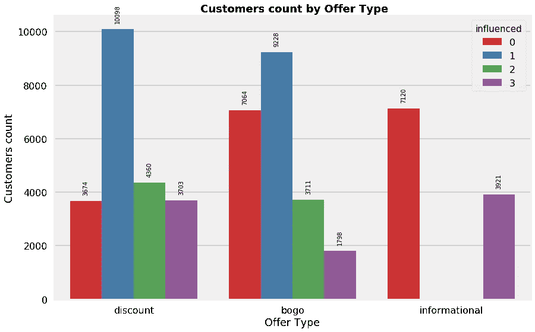

*   似乎顾客对折扣的反应比 BOGO 更好。

*优惠 Id*

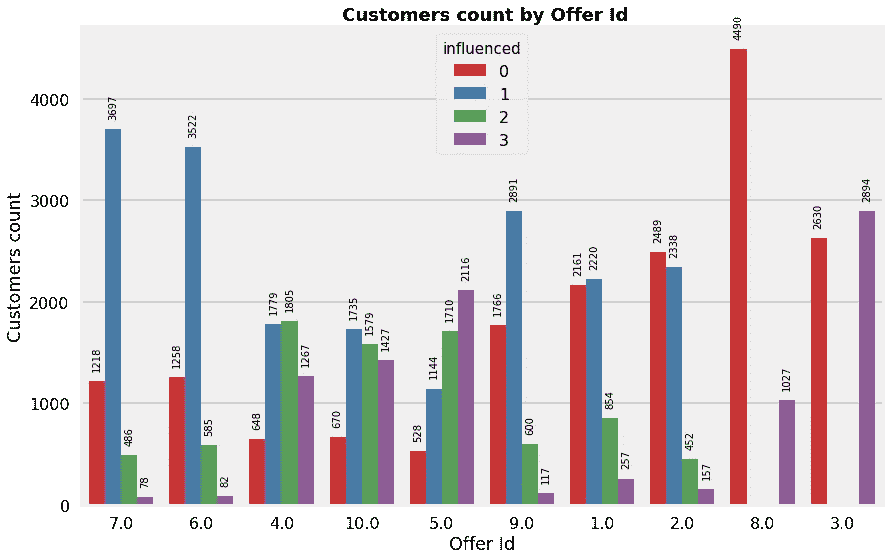

*   根据客户回应率，id 为 7、6 和 4 的优惠分别是前三名。以下是这些优惠的详细信息。

7:10 天内消费 10 美元，获得 2 美元作为折扣。

6:7 天内消费 7 美元，获得 3 美元作为折扣。

4:7 天内消费 5 美元，免费获得价值 5 美元的产品。

*   这里要注意的一个有趣的点是，BOGO 的出价与出价 id 7 的难度相同(出价 id 1 和 2 ),即使奖励比率更高，成功率也更低。消费者似乎更喜欢以折扣价购买产品，而不是免费获得额外的产品。

*难度*

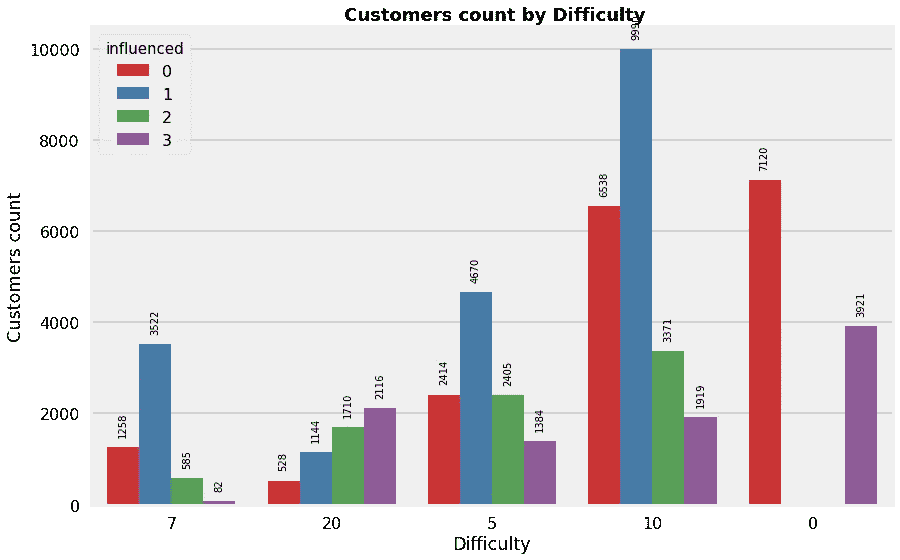

*   难度为 7 级的提议有最好的回应率。
*   对于具有最高难度级别的报价，大多数报价没有被客户查看。但是，难易程度和回答率之间没有明确的相关性。

*持续时间*

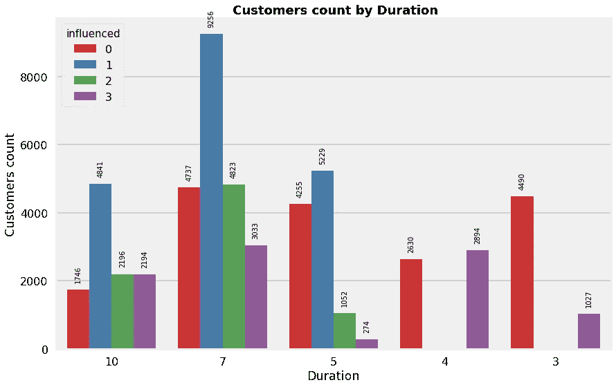

*   持续时间越长的优惠成功率越高，可能是因为顾客有更长的时间购买更多的东西。

*性别*

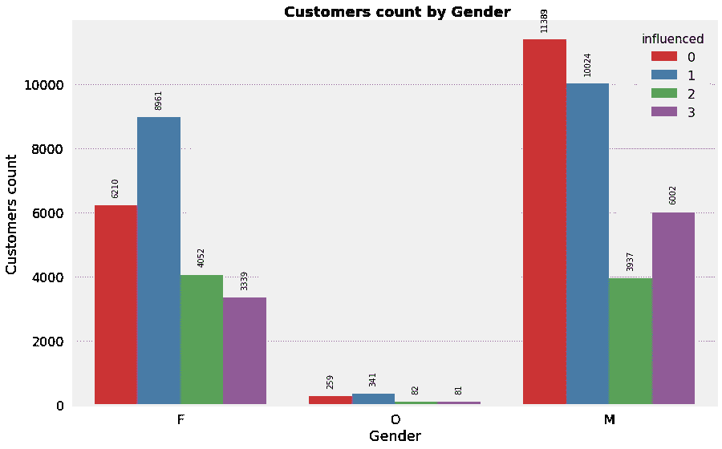

*   女性比男性有更好的回应率。
*   尽管属于“其他”性别的顾客数量相对较少，但他们的回应率高于男性。

***数值特征***

接下来，我们将通过比较回应和非回应要约的分布来探讨数字特征在成功要约中的影响。

*总花费金额*

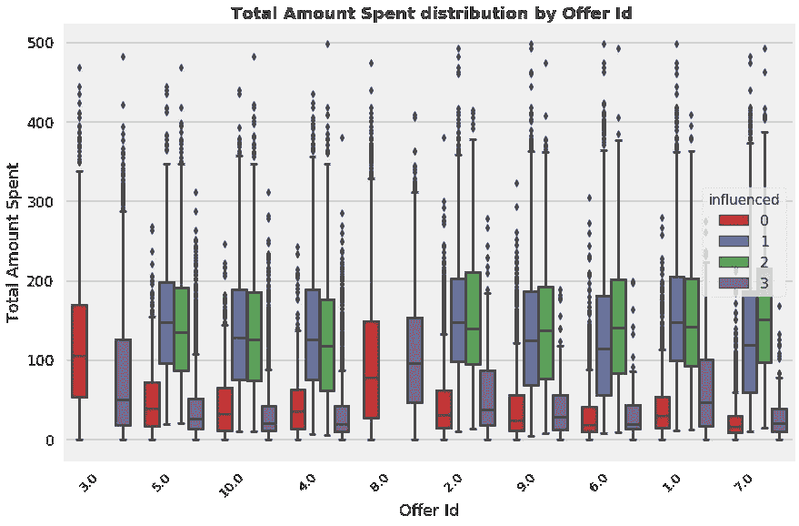

*   受优惠影响的顾客平均每小时花费的时间比没有响应的顾客多得多。这在预期行上。
*   总花费几乎总是在 200 美元以下。
*   难度级别分别为 20 和 10 的出价 Ids 5 和 10 的总花费金额略高。
*   似乎有两大类。完成报价的人(第 1 类和第 2 类)和没有完成报价的人(第 0 类和第 3 类)。
*   0 和 1 的支出总额分布相似，段 2 和 3 也是如此。
*   并且没有明显的趋势来将观看的和未观看的片段彼此区分开来。让我们看看这一趋势是否适用于其他客户属性，如年龄、收入和会员资格期限。

*收入*

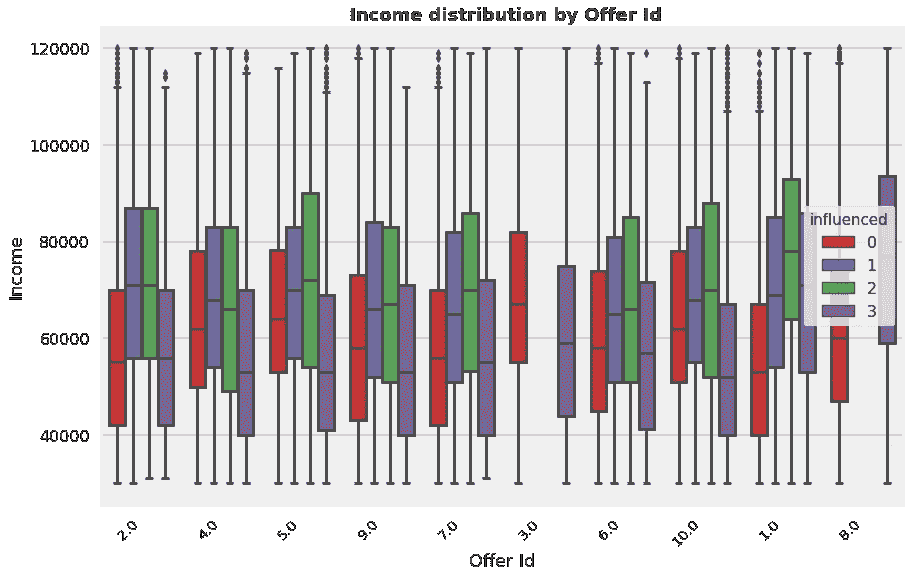

*   大多数优惠都发给了收入在 40-80，000 之间的客户。
*   在所有报价中，受影响的部分比不受影响的部分属于高收入群体。可以有把握地推测，属于高收入群体的客户更有可能对促销优惠做出反应，而不管优惠种类如何。
*   就像“支出总额”一样，细分市场 1 和 2 与细分市场 0 和 3 具有相似性。这种相似性没有我们在“总支出”中看到的那么深刻。
*   与“总支出”不同，已完成和未完成部分之间没有明确的界限。

*年龄*

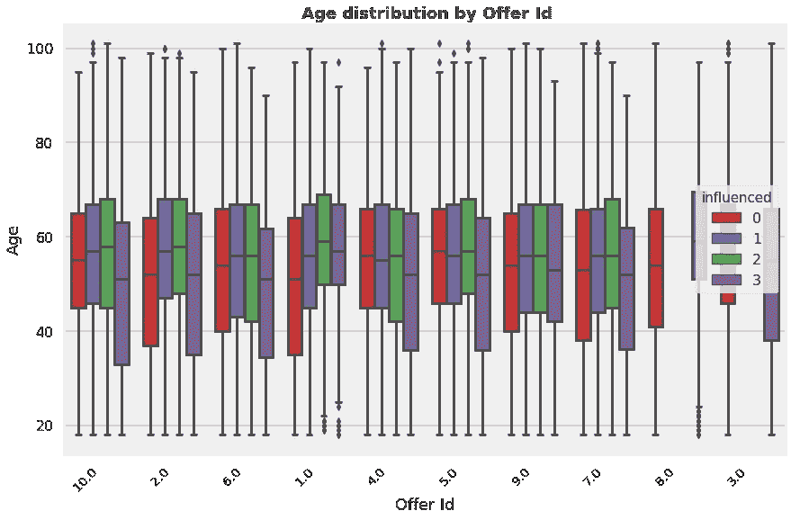

*   大多数优惠都是发给 40 到 70 岁的顾客。
*   不同细分市场之间的“年龄”分布差异不如收入和支出总额的差异大。然而，与其他类别相比，第 3 类似乎总是属于较低的年龄组。最年轻的会员更有可能不查看和/或不完成报价。

*会员期限*

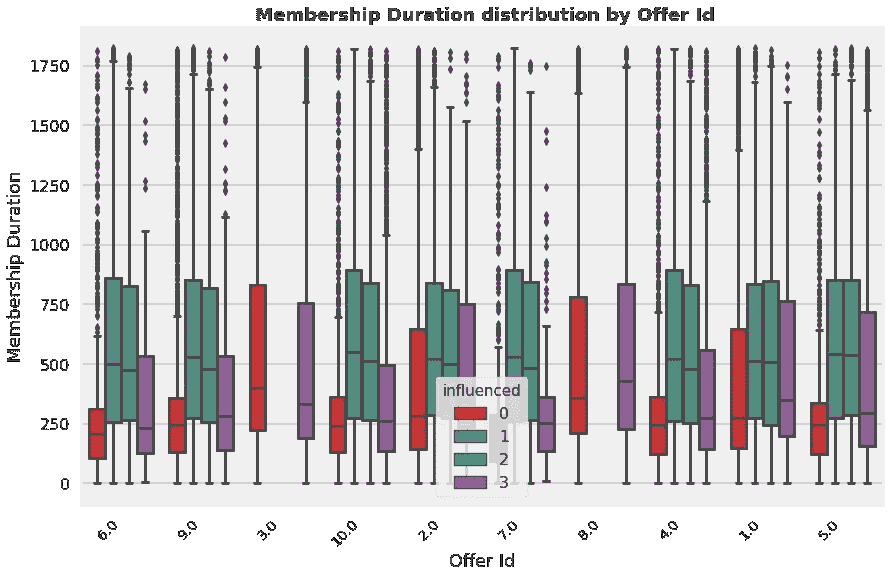

*   大多数优惠是发给会员资格不到 2 年的客户的。
*   平均而言，对优惠活动做出回应的顾客成为会员的时间比没有做出回应的顾客长。
*   成员资格期限很好地分离了不同的部分。这似乎是决定客户对报价作出反应的可能性的一个重要特征。
*   此外，在“每小时花费的金额”中观察到的趋势似乎或多或少也适用于此，即类别 1 和类别 2 具有相似性。类别 0 和 3 也是如此。然而，类别 3 比类别 0 具有更广泛的成员分布。

**特征创建**

从上面的可视化扩展，我们将创建一些更多的功能，将年龄，收入和成员资格持续时间等连续功能分离到不同的人口统计组。

我们将比较这些人口统计群体，以了解他们中的哪一个对优惠的反应更好。

*难度比*

难度比是由出价难度除以持续时间得出的。

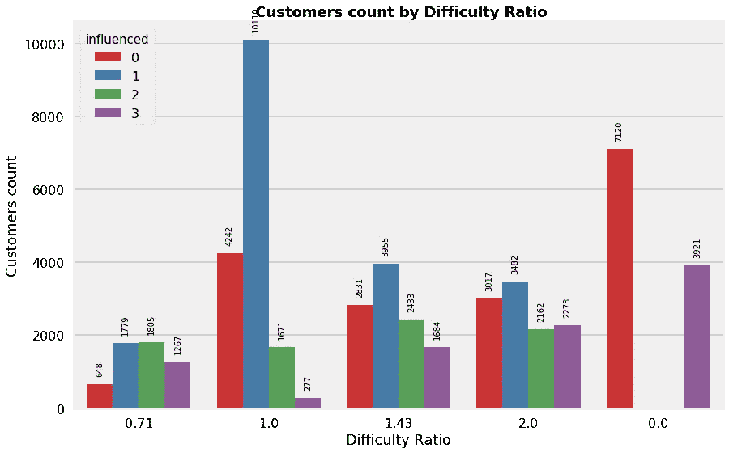

*   难度比较低的报价似乎有更好的响应率。

*收入群体*

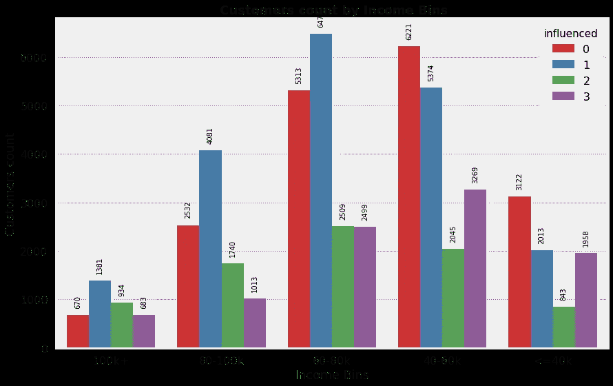

*   收入在 100，000 以上的客户的回答率最高，其次是收入在 80-100，000 之间的客户。
*   从上面的图像中可以清楚地看出收入和客户反应之间的正相关关系。
*   我们可以有把握地推断，收入超过 6 万英镑的人更有可能对这些提议做出回应。

*会员范围*

*   会员时间不到 1 年的客户是响应最慢的客户。
*   响应最快的客户是那些拥有 1 至 2.5 年(365-900 天)会员资格的客户，其次是拥有 2.5-4 年会员资格的客户。
*   在会员资格达到 1-2.5 年后，回复率会随着会员资格持续时间的增加而持续下降。

*年龄组*

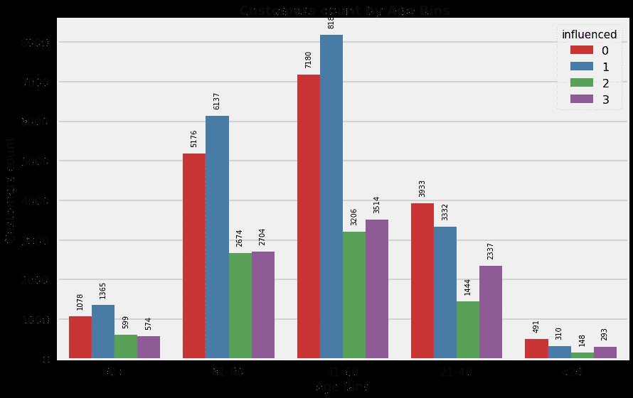

*   80 岁以上年龄组的客户回答率最高，其次是 61-80 岁年龄组的客户。
*   年龄和客户的反应之间存在正相关关系。老年顾客似乎比年轻顾客有更好的回应率。
*   可以有把握地推断，40 岁以上的顾客更有可能对这些优惠做出反应。

# 建模和评估

在这一部分，我们将建立一个预测模型，预测客户是否会对报价做出反应。由于发送报价会增加组织的成本，我们不想向不太可能做出回应的客户发送报价。此外，我们不想错过向真正会做出回应的客户发送报价的机会。由于我们需要优化精确度和召回率，我们将使用 F1 分数作为模型评估指标。

**为预测模型选择特征**

作为第一步，我们需要只为模型选择相关的特性。我们的目标是建立一个预测模型，根据客户的人口统计数据和优惠属性，对客户和优惠 id 组合是否有效进行分类。我们将删除所有与交易数据相关的内容，包括“总消费金额”。尽管“总支出”很好地区分了“受影响”和“不受影响”的类别，但将其作为一个独立的特征将导致[数据泄露](https://machinelearningmastery.com/data-leakage-machine-learning/)。

此外，从数据分析部分，可以有把握地推测，没有明显的趋势将类别 2 与其他类别分开。尽管类别 1 和类别 2 有相似之处，但我们不能将它们合并，因为类别 2 中可能有一些高价值客户，他们的平均支出高于普通客户。向这些客户发送报价没有太大的商业意义。我们不能将类别 2 与“未受影响”组合并，因为这两个组之间没有相似之处。

但是，我们可以合并类别 0 和类别 3，因为它们具有相似的特征，并且可以不向没有查看报价的客户发送报价，即使在查看后也很可能不会做出响应。

**朴素预测器**

我们将从一个简单的分类器开始，该分类器对所有客户进行随机分类，并提供“受影响”或“不受影响”的 id 组合。

这仅仅是为了展示一个没有智能的基本模型将如何运行。我们可以用这个来比较我们将要构建的机器学习算法的性能。

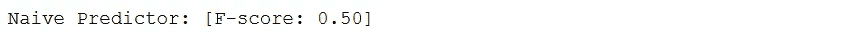

似乎如果我们随机分配报价，有 50%的机会获得成功报价。

**准备建模数据**

当要素处于相对相似的规模并且接近正态分布时，许多机器学习算法会工作得更好。通常的过程是应用变换，例如，从数字特征中去除偏斜的对数变换。此外，最好是[one-hot-encode](https://machinelearningmastery.com/why-one-hot-encode-data-in-machine-learning/)e 分类特征，以避免在名义变量中引入平凡性等原因。

对于我们的初始模型，我们将不应用数值变换。稍后，我们将探讨这个选项来提高模型性能。

**初始模型评估**

我们将考虑以下监督模型，并查看哪种模型最能概括数据集:

*   逻辑回归
*   Ada 增强
*   随机森林
*   轻型 GBM

对于这些模型中的每一个，我们将使用 5 重交叉验证来查看模型分数在不同的数据子集上如何变化。现在，我们将保留模型参数的默认设置。

结果如下:

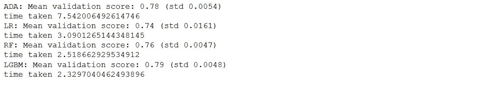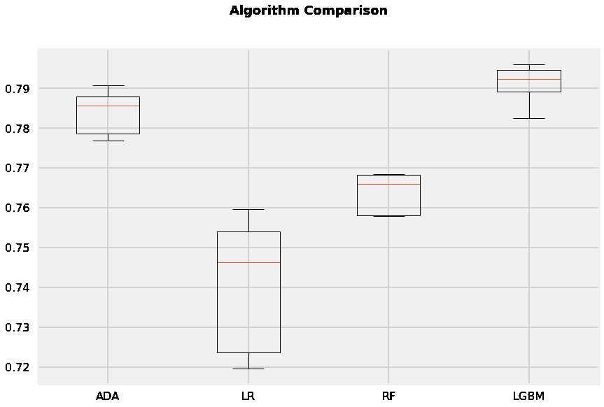

LightGBM 是这里的赢家。它具有最佳的平均交叉验证分数，并且交叉验证分数的低标准偏差值表明模型在输入数据变化时的稳健性。

**特征重要性和模型可解释性**

我们将使用[排列重要性](https://eli5.readthedocs.io/en/latest/blackbox/permutation_importance.html)来检查模型的特征重要性。它通过删除变量或移动行来检查模型结果的变化量，从而确定输入变量的权重。

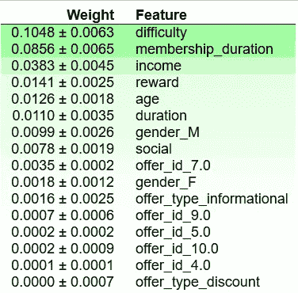

报价难度、会员时长、收入、报酬、性别似乎是最重要的特征。

接下来，我们将查看一个使用 [lime](https://github.com/marcotcr/lime) 的预测示例，以解释模型如何进行预测。

验证数据行预测的示例说明:

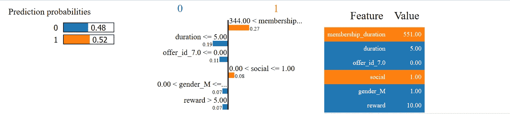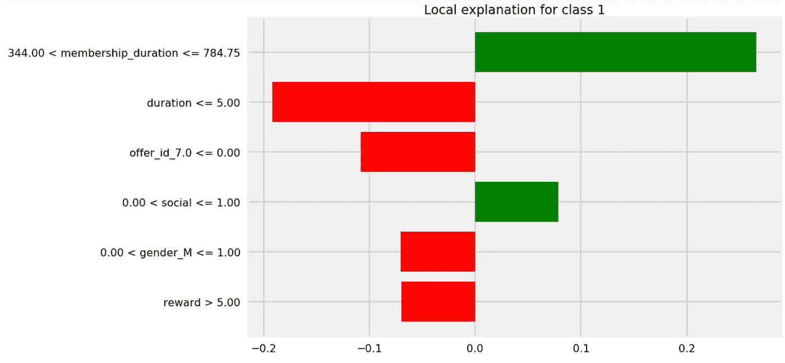

决策界限似乎或多或少地证实了我们在 EDA 阶段开发的直觉。

**性能调整**

在本节中，我们将使用 [RandomizedSearchCV](https://scikit-learn.org/0.17/modules/generated/sklearn.grid_search.RandomizedSearchCV.html) 通过[调整 LightGBM](https://lightgbm.readthedocs.io/en/latest/Parameters-Tuning.html) 模型的参数来进一步提高模型得分。

*   num_leaves:较大的 num_leaves 值有助于提高准确性，但可能会导致过度拟合。为了防止这种情况，我们应该让它比 2^(max_depth).小
*   min_data_in_leaf:其最优值取决于训练样本数和 num _ leaf。将其设置为较大的值可以避免树长得太深，但可能会导致欠拟合。实际上，对于大型数据集，将其设置为数百或数千就足够了。
*   max_depth: max_depth 用于显式限制树的深度。
*   boosting _ type:“dart”通常提供更好的准确性

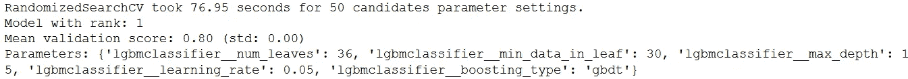

与使用默认参数的未优化模型的分数(0.79)相比，我们可以优化模型以获得更好的分数(. 80)。如果我们与朴素预测相比，使用这种模型可以大大提高我们成功报价的机会，而不仅仅是随机分配报价。

# 结论

*倒影:*

*   清理抄本数据是这个项目最具挑战性的方面之一。
*   优惠的难度和奖励金额以及会员期限、收入和客户年龄是决定优惠成功几率的最重要因素。
*   折扣优惠类型、更长的持续时间、更低的难度是增加成功优惠概率的一些优惠属性。
*   一些客户认为增加响应概率的原因是更高的收入(> 60 k)、更长的会员资格(甜蜜点在 1 到 2.5 年的范围内)、女性和更高的年龄(> 40 岁)。

*改进空间:*

*   仍然有进一步改进模型性能的空间。我们可以简单地尝试其他高性能模型，如 XGboost、Catboost，看看它们是否比 LightGBM 更通用。另一个常用于提高模型性能的策略是[将一堆模型堆叠在一起](https://www.kdnuggets.com/2017/02/stacking-models-imropved-predictions.html)。此外，由于这是一个不平衡的数据集，我们当然可以探索的另一个选项是[SMOTE](https://imbalanced-learn.readthedocs.io/en/stable/generated/imblearn.over_sampling.SMOTE.html)——从少数类中过采样数据。
*   使用交易数据来预测客户的反应会导致数据泄露。但是，与客户购买量相关的历史数据可以帮助我们更好地预测客户对报价的反应。例如，如果一个客户的平均支出比普通客户高得多，向他们发送低难度的报价就没有多大的商业意义。我们宁愿把高难度的报价发给他们。此外，根据目前的数据，很难判断信息提供是否有任何影响。将客户的历史平均消费率与优惠期的平均消费率进行比较有助于我们确定信息性优惠的效果。
*   有很多情况下，顾客没有看就利用了优惠。从商业角度来看，我们最好避免发送这些报价。在我们的分析中，我们找不到有助于预测这部分客户的属性。然而，一个解决办法是提供优惠券。这样，只有希望利用优惠的客户才会完成优惠。
*   由于所有的优惠都没有发送给所有的用户，我们可以通过将所有的优惠映射到所有的客户来创建一个数据集，然后预测客户对每个优惠的反应。如果一个客户可能会对多个报价做出反应，我们只需要选择那些能带来最大业务的报价，例如，难度最高或报酬率最低的报价。

*本次实现的全部代码可以在* [*这里*](https://nbviewer.jupyter.org/github/samardolui/StarbucksOfferOptimization/blob/master/Starbucks_Offers_Optimization.ipynb) *访问。*