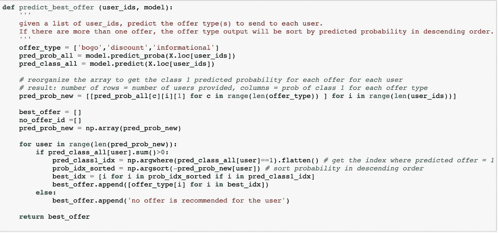
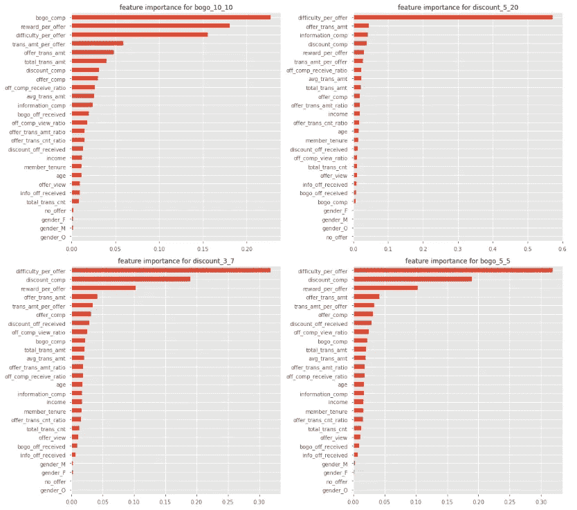

# 星巴克的个性化服务——给正确的顾客提供正确的服务

> 原文：<https://towardsdatascience.com/starbucks-offer-personalization-sending-the-right-offer-to-the-right-customer-14d4fbc20575?source=collection_archive---------15----------------------->

## 基于机器学习的个性化营销

星巴克可以说是世界上最成功的咖啡连锁店之一。早在 2010 年，谷歌就率先推出了自己的奖励应用。客户可以获得促销优惠通知，通过移动应用程序订购和支付，并为其订单赢得奖励积分。这使得星巴克不仅可以直接联系顾客，提高品牌忠诚度，还可以收集有价值的第一手顾客信息以及他们的交易行为。

但问题是，所有的用户都得到同样的优惠吗？假设你是星巴克的一名数据科学家，你会如何确定向每位客户发送最有效的优惠，以提高用户参与度？

# **目标**

在这个项目中，我接受了这个挑战，我的目标是使用通过 rewards 应用程序收集的用户人口统计和行为属性来预测向个人客户发送什么样的最佳个性化报价，以最大限度地提高转化率。

此外，我想看看在整个客户群中是否有任何独特的子群，它们表现出特定的人口统计和购买行为模式，这使它们彼此区分开来。

# **数据集概述**

有三个数据文件:

**portfolio . JSON**——包含每个报价的报价 id 和元数据。它包含以下属性:

*   id(字符串):报价 id
*   offer_type (string):优惠的类型，即 BOGO(买一送一)、折扣、信息(一种饮料的广告)
*   难度(int):完成出价所需的最低花费。只有最低 BOGO 和折扣优惠，但没有信息。
*   奖励(int):为完成一项提议而给予的奖励
*   duration (int):报价开放的时间，以天为单位
*   渠道(字符串列表):手机、电子邮件等。

**profile.json** —每个客户的人口统计数据。

*   id (str):客户 id
*   年龄(整数):客户的年龄
*   become _ member _ on(int):客户创建应用帐户的日期
*   性别(str):客户的性别(有些条目包含“O”表示其他，而不是 M 或 F)
*   收入(浮动):客户的收入

**transcript.json** —交易记录和优惠使用记录。

*   人员(字符串):客户 id
*   事件(str):记录描述(即交易、收到报价、查看报价、完成报价)
*   time (int):测试开始后的时间，以小时为单位。数据开始于时间 t=0
*   值:(字符串字典)-根据记录，可以是优惠 id 或交易金额

抄本数据是我将用来设计用户行为特征的主要数据集。它包含模拟数据，模拟星巴克奖励应用程序上的真实客户购买和优惠使用情况，包括购买时间戳和购买金额。该交易数据还包含用户收到的每个要约的记录，以及用户实际查看要约的记录。当用户完成报价时，也有记录。

这是棘手的部分。在要约到期之前，每个要约都有一个有效期。用户可能会收到“买 10 美元买 2 美元优惠”，但用户在 10 天的有效期内从未打开过该优惠。顾客在那十天里花了 15 美元。数据集中会有要约完成记录；然而，客户并没有受到报价的影响，因为客户从未看过报价。对于信息性要约，如果用户在查看要约后的有效期内进行交易，他将被视为完成要约。

# 挑战

鉴于要约完成的规则和例外，数据清理和特征工程部分变得特别重要和棘手。

该项目的关键部分是从按时间顺序排列的活动日志中总结每个客户的交易行为，以将正确的交易归因于正确的优惠类型，并在用户级别上跟踪它们对不同优惠的转换。然后，这些设计的功能将与用户档案信息(如收入、年龄、性别和他们的会员资格何时开始)相结合，以提供每个客户的整体视图。

考虑到这一点，我解决问题的方法将遵循以下步骤。

# (尤指为开车者设计的) 公路交通图

1.**探索性分析&数据清洗:**了解三个数据集，准备数据集

2.**特性工程:**在用户级从事务日志中创建属性

3.**机器学习:**建立一个多输出分类模型，以确定每个客户的最佳报价类型，按照转换的可能性排序

4.**聚类:**找出顾客中的子群体，星巴克可以根据每个群体不同的人口统计学或行为模式来确定不同的目标。

# 一.探索性分析和数据清理

**一、简介数据**

***年龄和收入分布***

年龄分布中有一些异常值——在 17000 名顾客总数中，超过 2000 人的年龄超过 110 岁，这似乎是不正确的。我将用 NaN 替换它们，然后填入中值年龄。收入有一个普遍但总的来说，看起来不错。有 2150 个 NaN 记录，稍后我也将填入收入中值。

**成员任期**

下面的左图显示，在大多数年份，男性顾客的增长远远超过女性。我将成员资格开始日期转换为任期的月数，作为一个数字人口统计属性。右边的直方图显示了分布情况。

**二。投资组合数据**

总共有 10 行 10 种优惠类型，因为这是真实星巴克优惠的简化版本。数据非常直观。

portfolio data snippet

**三世。成绩单数据**

这是我将使用的最重要的数据集。这是它最初的样子。

“值”列是一个字典，这里是唯一的键。

我们可以看到“优惠 id”出现了两次——当它带有“奖励”时，事件列显示“优惠已完成”，否则，事件要么是“优惠已收到”，要么是“优惠已查看”。当“金额”不为空时，事件始终为“交易”。

我将字典键分为 3 列:“offer_id”、“amount”和“reward”。两个“offer_id”键被合并为一列。

frequency of events after the clean-up

然后，我将脚本数据与 offer_id 上的投资组合数据连接起来，以查看不同报价类型之间的事件分布。

让我们检查一个人的旅程，以便更好地了解他完成要约时的事件顺序。在这种情况下，客户通过两次交易进行了两次报价转换。另外五笔交易是在没有报价的情况下完成的。

# 问题定义

## 有效报价转换的理由

为了使要约有效，导致转化的事件将按以下顺序发生:
1 .收到报价- >已查看报价- >交易- >已完成报价(BOGO 和折扣报价)
2。已收到报价- >已查看报价- >交易(信息性报价，但交易必须在有效报价期限内发生)

只有遵守了这两个转换顺序，我们才能认为要约已经完成。

还有几种情况被视为无效报价:
1。收到报价，但客户没有采取任何行动
2。offer received->transact->offer viewed-这也是无效的，因为此人没有在交易中使用该要约
3。在没有报价的情况下交易——这种类型的人无论有没有报价都会交易。从商业角度来看，我们可能根本不需要向他们发送报价。

记住这些，并知道我的目标是预测我们应该发送给每个客户的最佳报价，以最大限度地提高报价转化率，我需要建立一个用户级数据集，其中包括从脚本日志中提取的用户人口统计数据和每个用户的交易行为特征，以及他们对每种报价类型的响应。

# **二。特征工程**

详细地说，这些是我想在用户层面上为机器学习模型设计的功能。

1.  每种报价类型被接收的次数——用户是否执行报价:`bogo_off_received`、`info_off_received`、`discount_off_received`
2.  交易总数——交易是否受要约激励:`total_trans_cnt`
3.  总交易金额—总交易金额之和:`total_trans_amt`
4.  收到的总奖励—从任何优惠类型收到的奖励总和:`total_rewards_received`
5.  平均交易金额—总交易金额/总交易笔数:`avg_trans_amt`
6.  无要约交易次数——用户在无要约完成事件的情况下交易的次数:`trans_cnt_no_offer`
7.  要约完成的交易次数—要约完成事件后用户交易的次数:`trans_cnt_offer`
8.  任何报价的交易金额—报价完成事件的总交易金额:`trans_amt_offer`
9.  要约激励的交易笔数比率—要约完成的交易次数/总交易笔数:`offer_trans_cnt_ratio`
10.  要约激励的交易金额 raio 要约完成事件的总交易金额/总交易金额:`offer_trans_amt_ratio`
11.  报价完成与报价浏览比率—完成的报价数/浏览的报价数:`off_comp_view_ratio`
12.  要约完成与要约接收比率—完成的要约数量/接收的要约数量:`off_comp_receive_ratio`
13.  每笔报价交易金额—包含报价的总交易金额/包含报价的交易笔数:`trans_amt_per_offer`
14.  每次报价的奖励—收到的总奖励/完成的报价数:`reward_per_offer`
15.  bogo 报价完成数—查看 BOGO 报价后，BOGO 报价类型的“报价完成”事件数:`bogo_comp`
16.  折扣优惠完成数—查看折扣优惠后，折扣优惠类型的“优惠完成”事件数:`discount_comp`
17.  信息报价完成次数——在报价有效期内，查看信息报价后发生“交易”事件的次数:`information_comp`
18.  bogo 报价转换率—完成的 bogo 报价数/收到的 bogo 报价数:`bogo_conv_rate`
19.  折扣优惠转换率—完成的折扣优惠数/收到的折扣优惠数:`discount_conv_rate`
20.  信息报价转换率—完成的信息报价数/收到的信息报价数:`info_conv_rate`

模型的 3 个二元目标变量:

*   `bogo_offer` (0/1):如果用户在查看报价后，曾经有过 BOGO 报价类型的“报价完成”事件，则 1 否则 0
*   `discount_offer` (0/1):如果用户在查看优惠后曾有折扣优惠类型的“优惠已完成”事件，则 1 否则 0
*   `information_offer` (0/1):如果用户曾经有过“交易”事件，之后是“报价已查看”，则信息报价类型为 1 否则为 0
*   `no_offer`:如果用户从未回复过任何报价，只是在没有报价的情况下交易，那么我们可能没有任何报价推荐。这可以从上面三个报价类型中有三个 0 推断出来。这个变量不会在模型中使用，但可以用作参考。

正如我在开始时提到的，这一过程中最大的挑战是根据优惠类型，通过遵循导致优惠完成的特定事件顺序来识别正确有效的优惠。

本质上，所有有效报价相关特征都可以基于`offer completion count`和`transactions amount from the offer conversion.`来计算

特征工程的完整脚本相当长。基本步骤是:

1.  对于配置文件数据中的每个用户 id，按照时间顺序从脚本日志中获取他们的活动。
2.  遍历每个客户的交易记录。如果发现“收到要约”事件，根据要约持续时间计算其到期日期。
3.  对于有效的 BOGO 和折扣优惠，如果“offer_completed”发生在“offer _ viewered”事件之后和到期之前，则在 BOGO/折扣优惠完成中加 1，并合计 offer _ viewered 和 offer_completed 之间的交易金额。
4.  对于有效的信息要约，由于没有明确的要约转换事件，所以比较棘手。如果有交易发生在“要约 _ 已查看”事件之后，并且在要约持续时间内，那么我们可以假设这些交易是在信息要约的影响下进行的，因此我们将信息要约完成计数加 1，并将要约收到时间和到期时间之间的交易金额相加，作为要约交易金额的一部分。

在这个过程之后，我将用户人口统计数据与工程特性结合起来，作为用户属性的最终面板。

# 三。机器学习

计划是构建一个多输出分类模型，使用 3 种优惠类型作为目标变量 Y，使用上述工程要素(排除最后 6 个要素，因为这会导致信息泄露)以及个人资料数据集中的人口统计要素作为 x 来预测最佳优惠类型。请注意，用户可能在预测结果中有多个 1，在这种情况下，概率较高的优惠类型将在建议中优先考虑。

因为有多个输出，所以支持多输出的分类器的选择是有限的——决策树家族通常都支持多输出模型。

我会选择随机森林，原因如下:

*   使用自举来选择每棵树的数据样本，并且在每个节点处仅使用特征的随机子集来决定最大化信息增益的最佳分裂。特征和数据样本选择中的随机化可以显著减少模型方差，从而不容易过度拟合。这是随机森林相对于决策树模型的最大优势。
*   并行构建一组树，每个数据点分类的最终决定基于多数投票。该过程提供了对特征重要性的更好估计，即从林中的所有决策树计算出的平均杂质减少量。
*   它不假设目标变量和特征之间的线性关系，使其在识别非线性类边界时更加灵活。此外，树模型在运行模型之前不需要太多的特征预处理，例如标准化或规范化。

**模型结果**

model performance metrics

模特表演非常好。区分每种优惠类型的转换者和非转换者的最重要特征是什么？

**特征重要性**

feature ranking from random forest

似乎`reward_per_offer`和`offer_trans_amt`是最重要的特性。三种产品类型的每种功能有何不同？

X 轴上的标签分别对应于三种报价类型。当它为 1 时，表示使用该优惠类型的人。例如，(1，1，0)表示对 BOGO 和折扣优惠有反应的人，但对信息性优惠没有反应。

很明显，使用所有三种优惠类型的人不仅在优惠上花费最多，而且交易总额也最高。这意味着我们越鼓励顾客使用优惠，他们就越有可能在店内消费。

此外，总的来说，BOGO 优惠比折扣和信息性优惠推动了更多的销售，因为总交易量较高的三个组都对 BOGO 优惠做出了回应。同样值得注意的是，使用 BOGO 和折扣优惠的人实际上平均花费了超过一半的交易总额。这些是星巴克最活跃、最有价值的顾客。这是一个积极的迹象，证明给予我们的优惠和奖励确实可以提高客户的参与度，从而推动整体销售。

现在，让我们来看看总体优惠完成率、由优惠推动的交易金额比率以及每次优惠的奖励是如何受到用户统计数据的影响的。

**按人口统计提供使用情况**

从上面的散点图中获得的关键信息:

1.  要约完成率在开始时随着任期的增加而稳步增长，当男女用户任期在 20-30 个月之间时达到峰值，然后随着任期的增加而略有下降，尤其是对于男性客户。事实上，随着新用户习惯于应用程序并开始更频繁地利用好处，优惠转化率将会增长。在那个阶段之后，转换率变得平稳。
2.  在收入达到 80000 英镑之前，报价完成率似乎也与收入呈正线性关系。之后随着收入的增加开始下降。当顾客的收入低于一定水平时，他们更倾向于使用优惠。超过这一收入水平后，使用要约激励交易的效果就会下降。
3.  一般来说，女性客户的报价完成率高于男性客户，尤其是在任期早期和低收入阶段。
4.  随着收入的增加，每次报价的平均回报稳步增长。
5.  在几乎所有的任期、年龄和收入范围内，女性客户也倾向于在每次报价中获得更高的回报。部分原因是女性的录用完成率高于男性。这也意味着女性用户更倾向于使用 BOGO 或折扣优惠来获得奖励，因为信息性优惠不会给出奖励。

接下来，我想检查不同的人口统计群体对三种优惠类型的反应是否不同。

**按人口统计的优惠类型**

从这组散点图中有一些有趣的见解。

1.  收入和任期似乎对出价转换率有显著影响，而年龄则没有。
2.  在不同的年龄、收入和任期中，女性客户对 BOGO 要约的转化率稳定较高，而在大多数任期中，信息性要约往往对男性客户更有效(图 6)。
3.  按任期划分的 BOGO 要约转换率显示出与整体要约完成率非常相似的模式——当用户的任期在 20-30 个月之间时达到峰值，然后开始急剧下降。另一方面，折扣优惠转换率随着任期的增加而稳定增长。
4.  BOGO 和折扣转换率都随着收入的增加而增加，在用户收入达到 8000 后略有下降。然而，随着收入的增长，信息报价的转换率持续下降。这是一个非常有趣的趋势，它实际上是有意义的，因为与 BOGO 和折扣优惠不同，信息优惠没有任何最低交易金额，使得使用信息优惠的难度比其他两种优惠小得多。这就是为什么它在低收入群体中更受欢迎。这也解释了为什么上图中每次优惠的奖励随着收入的增加而持续增加——BOGO 和折扣优惠通常都有奖励和使用优惠的最低交易金额，因此它们在高收入群体中更受欢迎。

**预测任何给定客户的最佳*优惠类型***

如果模型预测客户有多种优惠类型，则根据概率的降序对建议进行排序。

以下是从测试集中随机选择的 20 个客户 id 的推荐优惠类型，较高概率的优惠在前面。如果客户只有交易，以前从未使用过任何优惠，模型将显示“不推荐任何优惠”。在商业环境中，如果用户愿意花 10 美元，我们甚至不需要给他“买 10 美元减 2 美元”的折扣。

# **更深一层—具体报价预测**

既然我们可以预测最佳报价类型，我想知道我是否可以将它带到一个更细粒度的级别—使用与 X 相同的功能集来预测将哪个特定报价 id 发送给每个客户。我们的想法是，对于只喜欢使用低难度(最低交易)报价的客户，我们可能希望根据报价难度级别而不是宽泛的报价类型向他/她发送报价，因为同一报价类型的难度级别可能在相当大的范围内变化。

组合表中有 10 个报价 ids 个用于信息，4 个用于折扣，4 个用于 BOGO。如果用优惠类型+奖励+难度组合来表示每个优惠 id，可以得到 6 个唯一的优惠名称:“bogo_10_10”、“discount_5_20”、“discount_3_7”、“bogo_5_5”、“discount_2_10”、“informational_0_0”。

由于一些优惠 id 被映射到相同的优惠名称，它们被合并到一列中。如果用户曾经转换过同一类型+奖励+难度组合下的任何优惠 id，则该优惠名称将被标记为 1 else 0。

还是和以前一样，我把 3 个报价类型替换为 6 个报价名称 Y，在 X 中没有太大变化，除了我包括了 3 个在上一个模型中被排除的功能以避免信息泄漏:BOGO 的完成计数、折扣和信息。此外，我创建了一个名为“难度/报价”的新功能，它是使用每个已完成报价的最小交易(难度)的总和/报价完成的总数。我相信这一新功能在很大程度上说明了客户对享受优惠的最低消费的容忍度。

**模型性能**

有了这些额外的新特性，模型性能甚至从将报价类型切换到作为目标变量的实际报价得到了改进。为了确保高分不是仅由 0 类中的高准确性引起的，让我们打印每个报价模型的分类报告，它们看起来都不错。

**特征重要性**

正如我所料,“难度/报价”显然占据了几乎所有报价模型的主要特性。

**预测任何给定客户的最佳*报价***

以下是使用与上次相同的预测函数从测试集中随机选择的用户的推荐优惠。

# 四。使聚集

在对发送给每位顾客的最佳优惠类型进行预测后，我想知道在整个星巴克顾客群中，是否有任何针对特定子群体的行为和人口统计属性的通用模式，将他们彼此区分开来。这种方式让我们不仅在个人层面上，而且在市场细分的背景下了解客户，这将有助于针对不同的客户群体制定不同的营销策略，使目标更加精确和有效。

cluster inertias vs. number of clusters

我在标准化的用户属性上拟合了 KMeans 聚类模型，使用了不同数量的聚类，并在每次迭代中提取惯性。使用肘方法，我决定使用 3 个集群，虽然折线图是非常模糊的。在用 n_clusters= 3 再次拟合模型后，我将数据反向转换回原始比例。

下面是 3 个分类的每个属性的分类中心。

cluster centers

从聚类中心，我们可以看到三个聚类的平均年龄几乎相同。集群 1 男性远多于女性，平均收入、交易金额和要约完成率最低。集群 0 和 2 在平均成员任期、总交易量和每次报价的交易量方面非常相似。然而，它们对于不同的报价类型明显表现出不同的偏好模式——我们可以通过一些可视化来证实这一点。

**集群可视化**

income vs. total transaction amount by cluster

第 0 类和第 2 类有一些高收入的高消费人群。

offer completion rate vs. transaction amount with no offer

集群 1 通常对出价没有反应。集群 2 似乎具有最高的平均报价完成率，而集群 0 在没有报价的情况下比集群 2 花费最多。

群组 0 的信息报价转换率为 0，而群组 2 的人显然在 3 组中最喜欢信息报价。

transaction amount per offer vs. rewards per offer

集群 0 显然平均每份报价有更高的回报，这意味着他们更倾向于使用回报更高的报价以及相应的更高的最低交易量。

**集群描述**

从上面的可视化和集群中心，我们可以看到每个集群在他们的交易行为和对不同报价的反应方面都有一套独特的属性，尽管他们在年龄、收入和成员任期方面有着非常相似的人口统计数据。

*   第 0 类:这一类人受到折扣和 BOGO 等奖励的高度激励，几乎从不回应信息性的优惠。他们的平均收入最高，总交易量与集群 2 相似。虽然他们的报价完成率可能没有第 2 类高，但他们实际上在没有报价的情况下比有报价的情况下花费更多。这个群体是星巴克的常客，他们平均花费最多，对他们来说最有效的优惠是折扣，然后是 BOGO 优惠。
*   第 1 组:这一组主要是休眠账户，他们通常不经常购物，对报价没有反应，交易也比其他两组少得多。事实上，这个群体中的许多人都被贴上了“无优惠”客户的标签。他们偶尔会使用星巴克的应用程序，但绝对不是星巴克的核心客户群。不出所料，这一群体中男性顾客的比例要高得多，这与我们在按性别划分的报价转化率图表中发现的结果一致。
*   群组 2:最后一个群组是另一个活跃群组，它在三个群组中具有最高的出价完成率。聚类 0 和聚类 2 之间的最大区别在于，尽管 BOGO 和折扣优惠转换率低于聚类 0，但该组具有非常高的信息优惠转换率。这意味着这部分客户更倾向于使用没有最低交易限制的优惠，我们可能希望优先向他们发送他们更有可能使用的难度较低的优惠。因此，要发送的优惠类型的顺序可能是信息->折扣-> BOGO。

# 最后的想法

当我第一次开始这个项目时，我的目标只是预测每个客户的最佳*报价类型*。随着项目的进展，我提出了更多的问题和更多的角度来分析用户行为，这导致了更细粒度的个性化*报价*推荐和客户细分聚类。

正如我所料，整个项目最具挑战性的部分是特性工程步骤。提取和总结正确的交易和报价使用的用户行为属性集在随后的预测和聚类模型中起着关键作用。

尽管在第一个和最后一个分类的人口统计数据中没有观察到太多的差异，但是分类模型成功地根据客户在行为属性上的差异将他们分开。如果我们可以从其他来源获得更多的用户统计信息，我们可以将 KMeans 识别的组映射回来，以更好地描述每个用户群。

我们还可以通过交叉检查来确认聚类结果是否准确，例如，分类模型是否向聚类 2 中的用户推荐了信息提议。如果结果令人满意，则在可以收集足够的数据用于报价个性化之前，拟合的聚类模型可以用作市场细分的第一步。

我们对客户行为研究得越多，我们就能更好地发送个性化的报价，从而产生更高的转化率，客户参与度和用户粘性也就越高。这是大多数企业努力的目标。