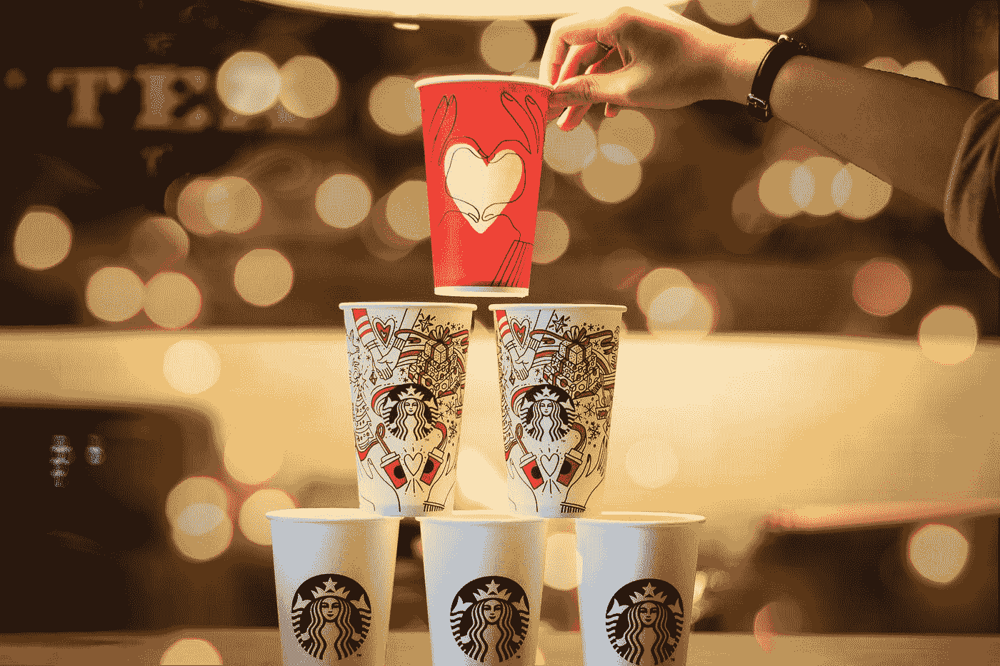
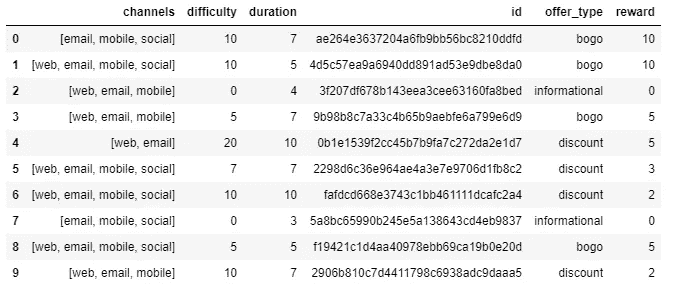
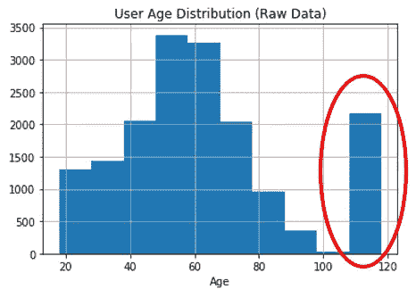
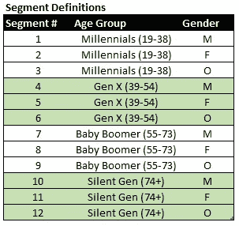
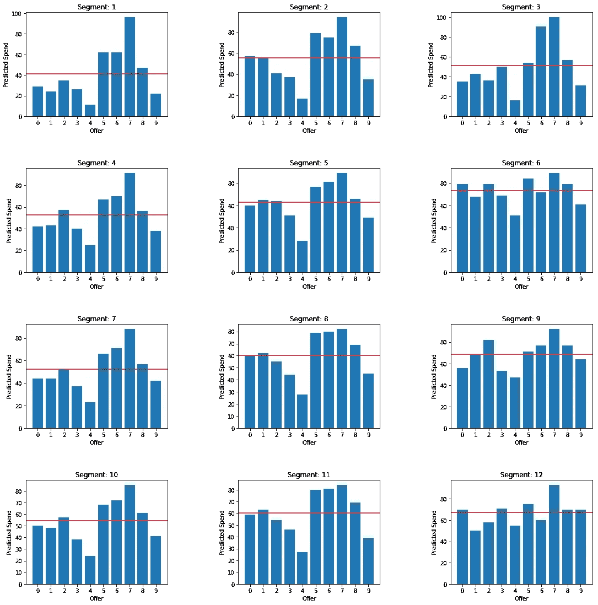
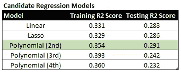
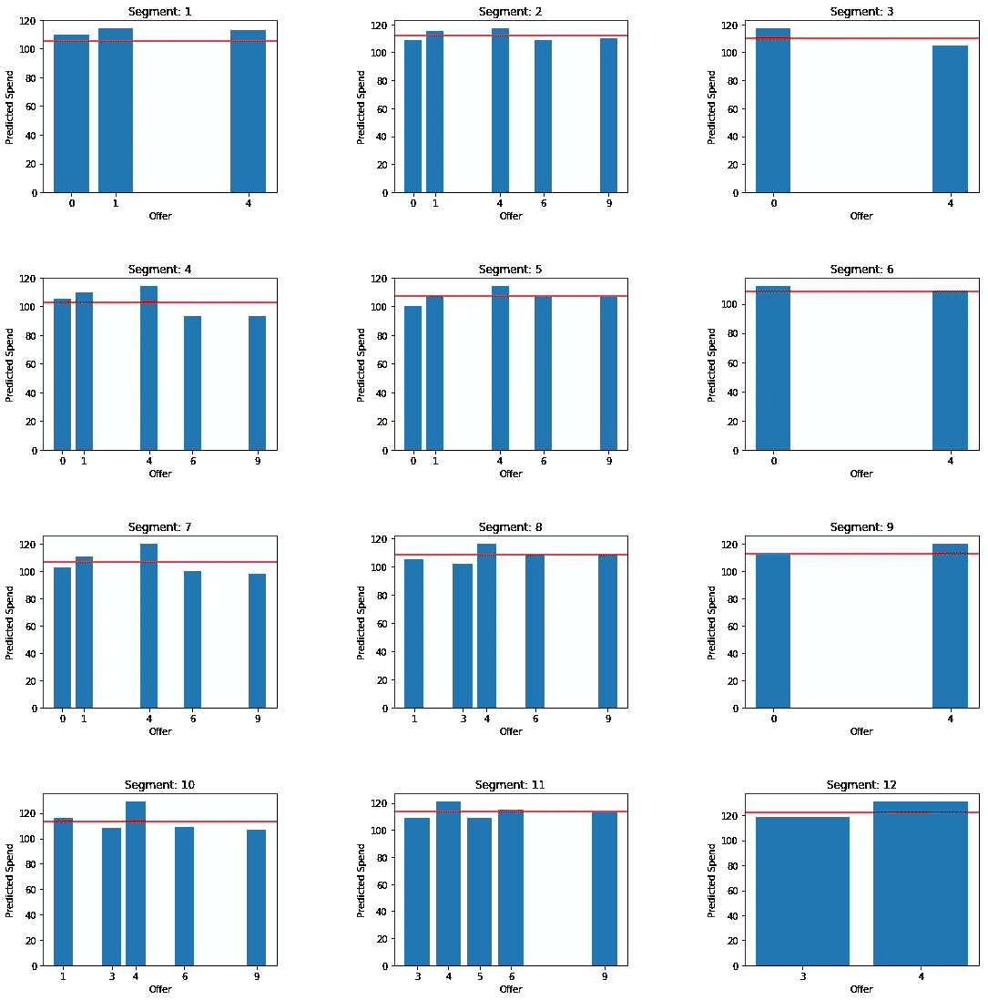
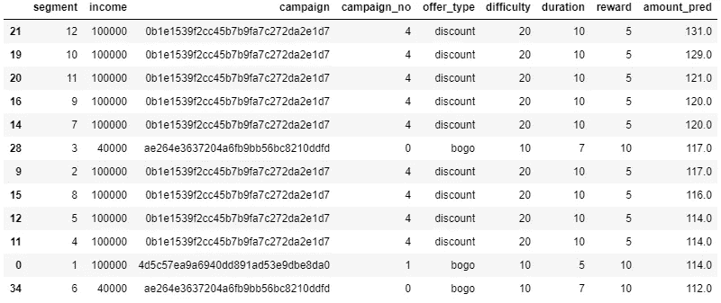
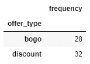
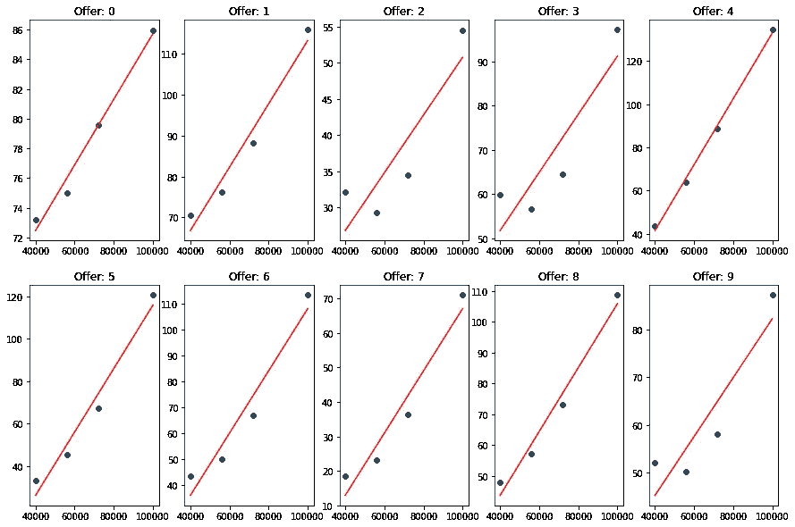

# 星巴克促销优化

> 原文：<https://towardsdatascience.com/starbucks-promotion-optimization-ca56e29fb584?source=collection_archive---------33----------------------->

## 星巴克促销和用户交易数据的探索性回归分析

Photo by [quan le](https://unsplash.com/@quanle2819?utm_source=medium&utm_medium=referral) on [Unsplash](https://unsplash.com?utm_source=medium&utm_medium=referral)

# 介绍

作为星巴克奖励系统的长期粉丝(时不时给我免费早餐🥪)，我很好奇它在引擎盖下工作。具体来说，可能有无数的活动可能性(通过结合不同的价格、产品、持续时间、内容等)，星巴克的数据科学家必须从中找出表现最佳的活动。

此分析的目的是更好地了解用户人口统计和活动之间的关系，以最大限度地增加收入。🔎

# 目标

分析的目的是确定优惠和人口统计细分之间的关键关系。总共有 10 个报价，如下所示:

Promotional Offers

为了缩小与每个细分市场相关的促销活动的范围，我们对 10 个促销活动与我们确定的细分市场之间的关系进行了启发式回归分析。

具体来说，我们希望:

1.  确定每个细分市场最能**响应**的促销活动。
2.  根据**预期收入**确定向每个细分市场发送哪些促销活动。

# 第 0 部分—预处理和勘探

任何数据分析的第一步都是检查数据集的质量，并进行预处理以解决可能混淆分析的问题。

根据数据研究，最大的奇怪之处是用户数量异常高，年龄显示为“118”。巧合的是，这些用户也没有标明收入值。我的猜测是，这些用户的年龄和收入数据缺失。因此，这些只有在考虑“性别”对购买行为的影响时才有帮助。

由于我们的细分将考虑年龄和收入(除了性别之外)，我将把这些用户排除在分析之外。在验证观察数据集的大小和分布后，最合适的细分方式似乎是按年龄组和性别。虽然从技术上来说，我们可以进一步细分(例如，按收入、按加入日期)，但这可能足以获得对关系的适当理解。

此外，还有几个数据预处理步骤，以确保数据集可用于分析，包括:

*   转换分类变量→虚拟变量
*   日期格式
*   特征提取(从对象数据格式)
*   特征工程(确定细分市场)

# 第 1 部分—促销响应

为了确定每个细分市场对 10 个报价的响应度，我们需要观察与已查看报价相关的报价完成数。具体来说，这不包括与用户没有看到的报价相关联的报价完成(即，他们无论如何都要花那么多美元)。

对于促销优惠(即没有“完成”的内容)，我通过“查看”优惠的用户进行区分，以便观察促销的影响。

Offer Responses by User Segment

从上面可以看出一些重要的观察结果:

**通用**

*   在所有细分市场中，**报价 5-8 似乎有最好的回复率**。巧合的是，这些报价都是通过**社交渠道**(以及网络、电子邮件、手机等其他渠道)传递的。通过观察社交渠道回应率的差异来检验这一假设可能是值得的。
*   **优惠 7 的回复率特别高**，因为它只是一个促销优惠(即“已浏览”的优惠)。然而，与其他促销活动(#2)相比，回应率存在明显差异，这进一步加强了社交渠道的**有效性。**
*   **优惠 4** ，难度最高(10 天内最低消费 20 美元)且奖励最高(5 美元折扣)的折扣优惠，在**的回复率**中遥遥领先。这很有可能是因为**它只通过网络&手机**进行交付。

**特定于细分市场的**

*   **女性群体(2、5、8、11)似乎总体上比男性群体有更好的平均回应率**，尤其是通过移动社交渠道提供的报价&。
*   第一部分(千禧一代，男性)的回复率似乎特别低(大约 40%，而大多数其他人是 50%)。
*   “其他”性别部分(3、6、9、12)的回复率分布似乎相当不同，这很可能与它们的样本量非常低有关。

从本质上讲，最高的回复率似乎与通过社会渠道提供的服务有关，特别是针对女性群体。

# 第 2 部分—哪些促销？

由于促销响应只是整个故事的一部分，我们需要更好地了解每个细分市场的财务影响。为了评估财务指标，需要进行回归分析。

从考虑的候选模型中，最合适的一个似乎是**二次多项式**，因为它的训练&测试分数相对较高:

使用二次多项式回归，我确定了每个细分市场的最高预期支出:

Expected Spend for each offer, by User Segment

此外，我还仔细研究了每个细分市场的最高报价:

Top offer for each segment

从这些结果中可以得出一些重要的结论:

*   **优惠# 4(10 天内消费 20 美元，享受 5 美元折扣)似乎是大多数细分市场最有效的活动**。
*   总的来说，**的报价 0、1 和 9 似乎也表现强劲**(紧随#4 之后)。
*   所有细分市场的 10 大解决方案包括**“折扣”和**优惠(几乎平分)。

# of offer_types in top 10 for all segments

*   一般来说，收入似乎与支出金额有直接的正相关关系(这与直觉有关)。

Expected Spend vs Income (by Offer)

*   **【沉默的一代】**似乎有最高的预期收益，**紧随其后的是【婴儿潮】**和【千禧一代】。

总的来说，这揭示了高潜力的报价(#4)，由于其交付渠道和要关注的报价和细分市场(A/B 测试等),这些报价可能表现不佳。).

# 结论

这一分析揭示了一些关键的见解，将非常有助于缩小未来的分析和整体推广战略。

就目前的优惠组合而言，最佳促销策略似乎是**针对高收入女性(尤其是“千禧一代”和“沉默一代”)**的优惠 0 & 1，因为她们有更高的真实优惠完成率，同时也有相对较高的预期支出。

然而，在确定一个强有力的推广策略之前，还有一些出色的实验和分析要做。这些是:

1.  验证完成率和渠道之间的关系。具体来说，如果你**通过社交渠道**提供报价#4(最高回报，最低完成率)，会发生什么？
2.  对于每个细分市场，发送哪个**最佳报价组合**？
3.  探索“意外完成”的**价值**(未查看，但已完成的报价)——它能导致未来消费行为的改变吗？
4.  执行**分类分析**(例如 K-Means 聚类)以验证/强化已识别的细分市场。
5.  有没有办法**提高男性的毕业率**(特别是他们有很高的预期支出)？
6.  对具有较大样本使用数据的“其他”性别段(3、6、9、12)进行分析。

你可以在这里找到 GitHub 回购[。](https://github.com/jbbae/starbucks_promotion_strategy)