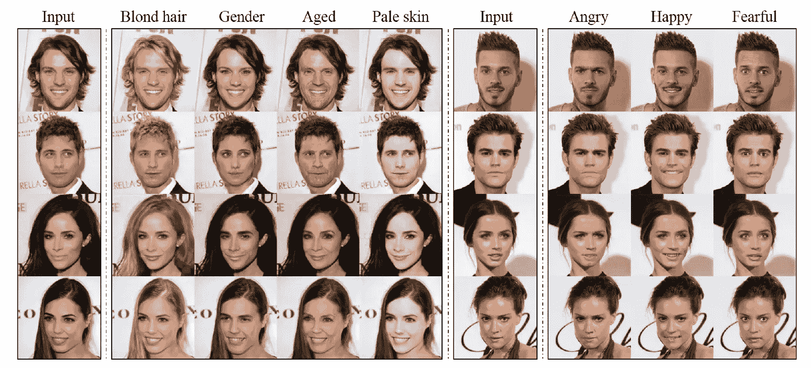
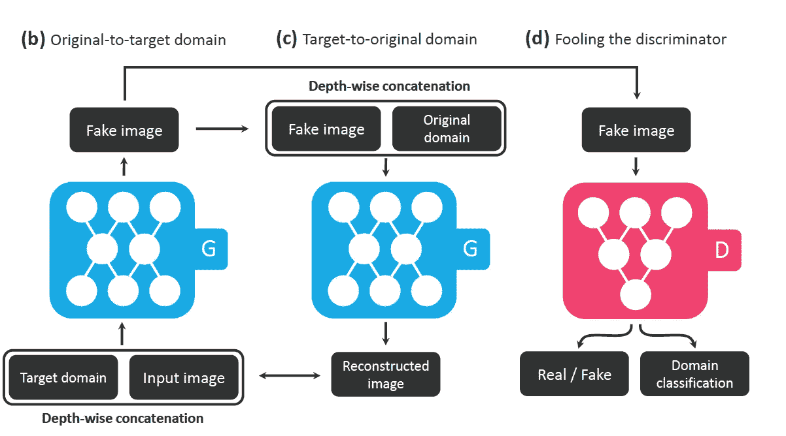
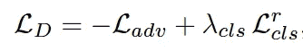
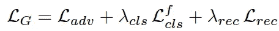

# StarGAN —图像到图像的翻译

> 原文：<https://towardsdatascience.com/stargan-image-to-image-translation-44d4230fbb48?source=collection_archive---------10----------------------->

# 星际之门是用来做什么的？

给定来自两个不同领域的训练数据，这些
模型学习将图像从**一个领域翻译到
另一个领域。**

比如——将一个人的**发色**(属性)从**黑色**(属性值)改为**金色**(属性值)。

我们将域表示为共享相同属性值的一组图像。黑发人是一个领域，金发人是另一个领域。

# 斯塔根

1.  g 将**图像**和**目标域** **标签**作为输入，并生成假图像。(二)
2.  g 试图从给定原始域标签的**伪图像**中重建**原始图像**。
3.  这里，鉴别器不仅告诉我们**伪造性**，而且将图像分类到其**对应的域**，从而 G 试图生成**与真实图像**无法区分并且**可被 D** 分类为目标域的图像。即最终将学会生成对应于给定目标域的真实图像。(四)

# 歧视者的目标

这里，鉴别器有两件事要做，

1.  它应该能够识别一个图像是不是假的。
2.  在 D 之上的**辅助分类器的帮助下，鉴别器还可以预测作为输入给 D 的图像的域。**

## **辅助分类器有什么用？**

利用辅助分类器，D 从数据集中学习原始图像及其对应域的映射。当 G 生成以目标域 c(比如金发)为条件的新图像时，D 可以预测生成图像的域，因此 G 将生成新图像，直到 D 将其预测为目标域 c(金发)。

Loss function of Discriminator

# 生成器的目标

发电机有三个用途—

1.  调整发生器权重，以使生成的图像逼真。
2.  调整生成器权重，使得生成的图像可由 d 分类为目标域。
3.  g 尝试从给定原始域标签的伪图像重建原始图像。我们使用单个生成器两次，首先将
    原始图像转换成目标域中的图像，然后从转换后的
    图像重建原始图像。

Loss function of Generator

# **数据集**

CelebA。名人面孔属性(CelebA)数据集
包含 202，599 个名人的面部图像，每个图像都有 40 个二元属性的注释
。

Radboud 人脸数据库(RaFD)由从 67 名参与者收集的 4824 张图片组成。每个参与者
在三个不同的凝视
方向上做出八个面部表情，这些表情是从三个不同的角度拍摄的。

# 参考

StarGAN:用于多领域图像到图像翻译的统一生成对抗网络