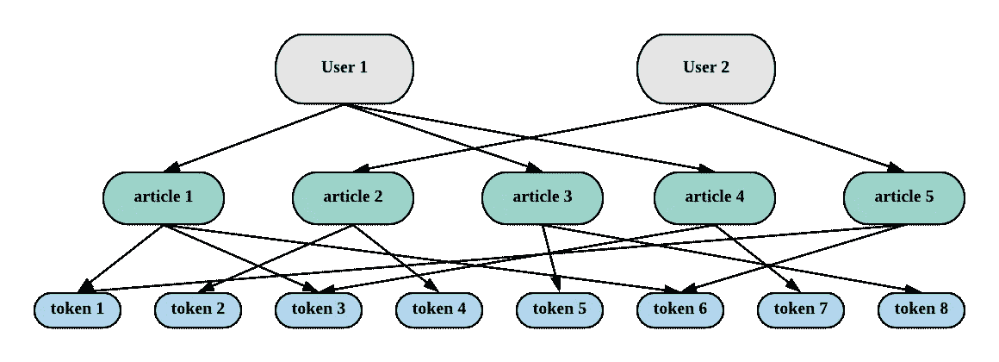
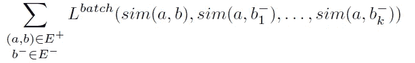

# StarSpace 算法:挖掘和嵌入用户兴趣

> 原文：<https://towardsdatascience.com/starspace-mining-and-embedding-user-interests-28081937f95?source=collection_archive---------11----------------------->

## 如何使用脸书 Starspace 算法进行用户嵌入

Photo by [Max McKinnon](https://unsplash.com/@maxmckinnon?utm_source=medium&utm_medium=referral) on [Unsplash](https://unsplash.com?utm_source=medium&utm_medium=referral)

数据科学家总是希望更多地了解他们的客户。如果我们了解我们的客户，我们可以:

1.  基于用户兴趣推广活动
2.  预测用户属性
3.  查找用户相似性并进行聚类

听起来不错？棘手的问题是，所有这些下游任务都需要高度信息化的用户嵌入，以便您可以使用机器学习算法。当然，你可以在没有用户嵌入的情况下进行机器学习，只需简单地将用户与算法相匹配。问题是，通常，关于用户的数据是高度非结构化的，甚至是可变长度的。编码这种杂乱数据的预处理步骤并不简单。

借助 StarSpace，我们可以根据用户行为获得高度信息化的用户嵌入。

## 背景

StarSpace 是脸书提出的一种算法[1]。

> StarSpace 是一个通用的神经模型，用于有效学习实体嵌入，以解决各种各样的问题

所以，关键词是*【通用】**【实体嵌入】*。换句话说，你可以通过 StarSpace 嵌入任何你想要的东西，包括用户。实际上，HK01 数据团队也利用 StarSpace 做文章嵌入，与其他嵌入算法并行。

 [## 使用脸书空间学习文档嵌入

medium.com](https://medium.com/@LouisKitLungLaw/documents-embeddings-using-facebook-s-starspace-67b8d1feba32) 

怎么会这么泛？秘密是:StarSpace 学会将实体及其组件表示到同一个向量空间中。使用 StarSpace 的唯一要求是您应该提供实体和组件之间的链接。以链接作为训练数据，StarSpace 可以学习组件之间的相似性，进而学习实体之间的相似性。

## 直觉

接下来的问题是什么组件可以代表用户。在 HK01 中，用户由阅读的文章表示。

Three levels of entities. All mapped into the same space

上图说明了不同级别实体之间的联系。用户由阅读的文章表示，而文章由令牌表示。特别地，用户由他/她的阅读历史中的令牌包来表示。

背后的直觉是，每一层的信息都可以传播到上下游各层。通过链接，StarSpace 可以发现文章之间的相似性，因为它们共享令牌。同样，用户之间的相似性因此可以被学习。

## 结果

只有 50 维的 StarSpace 学习的用户嵌入，在下游任务中可以提供与原始用户嵌入不相上下的性能，原始用户嵌入有 20000 多维。

## 理论

到目前为止，我们仍然不知道 StarSpace 是如何工作的。StarSpace 的创新之处在于提出了一个新的损失函数:

The loss function of StarSpace

别担心。背后的想法是，StarSpace 被训练为正面样本分配比负面样本高一个幅度的相似性。损失函数称为边际排序损失，类似于铰链损失。相似性函数可以是余弦相似性。

比如在用户嵌入中，每个实体对 *(a，b)* 都是由*(用户，令牌)*构成的。正实体对是实际的连锁，而负实体对是通过负采样产生的。StarSpace 被训练成将用户映射到实际记号而不是负采样记号附近的位置。

## 参考

[1]:吴，于，等，“星际空间:嵌入所有的东西！."*第三十二届 AAAI 人工智能大会*。2018.