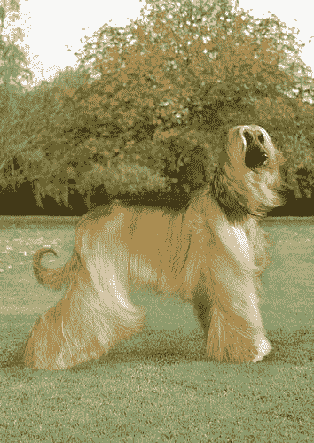

# 开始版本控制您的机器学习数据集

> 原文：<https://towardsdatascience.com/start-version-controlling-your-machine-learning-datasets-2b872e109856?source=collection_archive---------18----------------------->

## 使用开源工具使您的机器学习和数据科学项目具有可重复性。

在我过去一年参与的许多机器学习项目中，我的数据集在整个实验过程中改变了几次。例如，当我处理生物医学数据时，几乎每周都会收到新数据。在我用[图像分割做的一些实验中，](https://pudding.cool/2019/11/big-hair/)我一直在使用一种叫做[主动学习](https://www.kdnuggets.com/2018/10/introduction-active-learning.html)的技术来逐渐增加我的训练数据集。

所有这些都让我有些不安，虽然我的代码是用 git 进行版本控制的，但我的数据集和训练模型通常不是(由于文件大小的限制，以及 [git 对二进制文件](https://news.ycombinator.com/item?id=13560074)不理想的事实)。每当我用新的数据重新训练我的模型时，我要么覆盖我现有的模型，要么在我的项目目录中填入许多稍有不同的版本的训练模型，文件名也稍有不同。像这样:

```
Model_v1.h5
Model_v2morepics.h5
Model_v3evenmorepics.h5
```

好吧，我会尽量选择更好的文件名。但是，这种方法是不系统的，并且很难精确复制。感觉*不科学。我最近了解了 DVC，这是一个开源版本控制系统，与 git 配合使用，可以跟踪大型数据集和模型文件的变化(剧透:我将于 2020 年 1 月加入 DVC！).我试用了它，非常喜欢它给动态 ML 问题增加结构的方式——有点像采用 git 如何鼓励我采取更好的编码实践。我想分享一些关于如何为 ML 实验版本化数据集的信息。*

# 问题是

先说一个玩具问题。我有一个数据目录，里面全是来自斯坦福狗数据集的图片，这是一个很棒的狗图片库，按品种分类。假设我想建立一个分类器来区分两种毛茸茸的狗，阿富汗猎犬和马耳他狗。



*Left: Sample image of the Afghan Hound. Right: The Maltese. From the Stanford Dogs dataset.*

首先，我有每个品种的 100 张图片(构建这个数据集的[脚本在 GitHub](https://github.com/andronovhopf/Dog_Breed_Classifier) 上，所以如果你愿意的话，可以克隆这个 repo)。但我知道数据集在未来可能会改变:可能会添加更多的图像，我可能会决定排除一些图像，或者我(或我团队中的某个人)可能会意外删除一个文件。这些变化中的每一个都会对适合我们数据的模型产生影响。

对于这样一个非常小的数据集，我可以想象使用 git。对于更大的数据集，我可以转移到 git-lfs(尽管这也有空间限制——而且，根据我在大学医院处理生物医学研究数据的经验，如果不经过审计程序，一些机构是不会允许的)。但是，想象一个大得多的数据集——更不用说我将要生成的大型训练模型文件了——您可以开始看到这种方法变得棘手的地方。

# 设置版本控制

这就是 DVC 的切入点。DVC 是一个围绕 git 构建的版本控制系统，所以语法非常相似——一旦您在本地机器上创建了一个存储项目代码(比如 ML 模型)的文件夹，您就可以运行

```
$ git init
$ dvc init
```

请注意，如果您按照我们提供的代码进行操作，您会将整个斯坦福狗数据集下载到您的项目目录中——我们不关心跟踪这个，所以运行

```
$ echo '/Images' >> .gitignore
```

接下来，你需要选择一个位置，在那里 DVC 将处理你的数据和模型的各种版本的存储，称为数据远程。远程可以是您选择的存储位置——我将使用 S3 存储桶，但是您也可以使用 GCP 存储桶、Azure blob 存储、您自己的内部文件服务器，甚至是本地目录。使用外部存储的一个好处是，不同机器上的新用户(比如说，合作者)可以很容易地进入并开始复制您的 ML 项目。特别是，云存储的伸缩性很好，所以您可以避免随着数据集的增长而耗尽磁盘空间的沮丧(这种情况发生在我身上，真的是度过一个下午的最糟糕的方式)。一句话:只要有可能，我建议您为数据科学项目使用云存储。

以下是我们如何添加 S3 桶作为这个项目的遥控器:

```
$ dvc remote add -d s3remote s3://bucket-of-dogs
$ git commit .dvc/config -m "Configure my S3 remote"
```

接下来，我们开始跟踪数据集。在我们的代码示例中，数据集当前位于项目目录中名为“data”的子目录中。

```
$ dvc add data
```

这将创建一个. dvc 文件，这是一个轻量级的文本文件，用于索引数据集的当前状态(如果您有兴趣，可以在文本编辑器中打开它！).这个。像任何其他文本文件一样，使用 git 跟踪 dvc。

最后，我们将 git commit 和 DVC push——运行这些命令后，git 现在通过。dvc 文件，数据文件的内容现在在 S3 桶中。

```
$ git add .
$ git commit -m "Add initial dataset"
$ dvc push
```

有关为您的特定工作流程配置 dvc 的更多详细信息，请查看[入门](https://dvc.org/doc)文档。

# 训练模型

现在，让我们对数据集运行一个分类器。这一个使用预训练的 VGG-16 权重来为每个图像创建特征，然后训练一个完全连接的层来将这些特征映射到一个类别标签(你可以在这里看到[代码](https://github.com/andronovhopf/Dog_Breed_Classifier/blob/master/breed_classifier.py))。分类器的细节——语言、架构和框架的选择——对于这个例子并不重要。

```
$ PYTHONHASHSEED=0 python breed_classifier.py
Validation Accuracy: 0.950
```

(为什么我们指定 PYTHONHASHSEED=0？您不必这样做，但是如果您继续这样做，它将确保您得到与我完全相同的结果——我们保持随机数种子的一致性)。

在模型训练之后，您将在项目目录中拥有一个模型文件。保存的模型也可以用 DVC 跟踪。让我们 dvc 添加，然后 git commit 来做。

```
$ dvc add model.h5
$ git add .
$ git commit -m “Trained model”
$ dvc push
```

# 更改数据集

假设一个动物收容所突然给我们发送了更多的狗的照片，我们想要重新训练我们的模型来利用这些新数据。现在，我们将每个品种的另外 100 张照片添加到数据目录中(如果您在自己的机器上跟随，那么[项目 repo](https://github.com/andronovhopf/Dog_Breed_Classifier) 中的脚本 grow_dog_dataset.sh 将会做到这一点！).我们可以通过运行以下命令来确认这一点

```
$ ls data | wc -l
400
```

这些图像还没有被 DVC 跟踪，所以让我们添加它们:

```
$ dvc add data
$ git add .
$ git commit -m "Added new dogs"
$ dvc push
```

让我们再次训练这个模型。太好了，看起来我们有进步了。

```
$ python breed_classifier.py
Validation Accuracy: 0.988
```

同样，我们可以 dvc add 和 git commit 来跟踪. h5 模型文件。由于最近的提交既跟踪了已训练模型的最新版本，也跟踪了已训练模型的数据集，因此它们在项目的历史中被有效地绑定在一起。

# 发现了一个错误

所以我准备生产这个神奇的马耳他/阿富汗猎犬分类器，对我遇到的所有狗进行分类，直到我意识到我犯了一个错误。也许收容所不小心给我发了一堆彭布罗克柯基的照片，被误标为麦芽酒，我在训练前没有注意到。但是，因为我们已经对数据集进行了版本控制，所以这种错误很容易解决(并且不会导致不可跟踪的、不可逆的文件删除)。


Not supposed to be here.

有两种方法可以解决这个问题…

**选项 1。**删除 CORBA。

如果我们确切地知道哪些文件是错误的，我们可以只删除那些图像。然后，用更新项目的状态

```
$ dvc add data
$ git add .
$ git commit -m "Remove pesky corgis"
```

我们自然希望重新训练模型，使其与数据集保持同步。

**选项 2。**将项目恢复到以前的状态。

如果我们不知道哪些图像是有问题的，我们可能想放弃我们最近对项目的所有更改，并恢复到最后一波狗图片到来之前的版本。为此，我们可以使用 git checkout 和 dvc checkout:

```
$ git log --oneline
17746b7 Added new dogs
45e678d Trained model
df11d07 Add initial dataset$ git checkout 45e678d
$ dvc checkout
```

现在查看数据目录:同样只有 200 个文件(每个品种 100 个)。

```
$ ls data | wc -l
200
```

我们项目目录中的训练模型也反映了数据集的这个版本。

# 底线

ML 项目很少直线前进——不仅仅是因为找到正确的模型不是线性的，还因为数据集本身是变化的。当然有一些自制的方法来跟踪和管理这些变化，但 DVC 可以在几个方面提供帮助:

*   如果你已经在使用 git，DVC 是一个简单的插件。
*   作为一名研究人员，跟踪模型文件和数据集的能力对我来说是很直观的。我不希望经过训练的模型和训练数据集在没有某种联系的情况下发生变化。
*   能够配置自己的数据存储对我参与的许多数据科学项目来说是一件大事(特别是生物医学数据，因为还没有人愿意付钱让我分析狗)。

除了所有这些实际的原因，我的主要原因是*版本控制仅仅是好的实践*。我努力做到系统化和谨慎，但有时在实验过程中，我会忘记我的数据集是如何变化的。像 git 一样，DVC 帮助我坚持可复制、可共享科学的最佳实践。