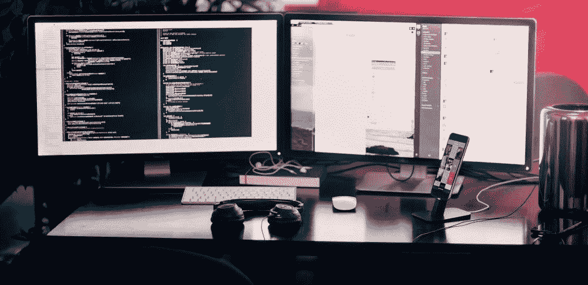

# 数据科学入门:从未编码

> 原文：<https://towardsdatascience.com/starting-out-data-science-never-coded-b79ed985e661?source=collection_archive---------29----------------------->

好吧，这篇文章是写给任何刚开始写代码并且需要一点指导的人的。以下是我从没有编程经验到成为一名成熟的副总裁，一家财富 30 强公司的数据科学家所做的事情。

# 寻找动力

当你开始一个新的大项目、爱好或其他什么的时候，你需要从你的为什么开始。如果你不知道你为什么要做某件事，你在那个选定项目中的工作不会持久。想想吧。你有没有做过没有深层原因的长期工作？大概不会。

美妙的是你的“为什么”可以成为激励你的任何理由。就我而言，我对我的目标或大项目进行逆向工程。基本上，我会选择一些我想做的事情，这些事情需要花一段时间，然后从最终目标开始，回溯到我认为我需要做什么来完成它。在这个阶段，你不必把一切都做好。你只需要把它记下来，每天复习。关于如何逆向工程目标的更多内容，我从《6 个月到 6 位数》一书中获得了灵感。既然你正在读这篇关于编码的文章，你可能应该把它设定为获得 X(数据科学家，web 开发人员…)工作，赚 Y(8 万美元，15 万美元…)钱，等等。

# 参加斗争

我不想撒谎。编码很难。在你学习了任何语言的编码基础之后，现实世界中的编程是艺术和科学的结合。你有编码的元素，但它们是如此的无定型。我的意思是，有许多方法可以自动化一个预测性的分析模型，这取决于你这个开发人员如何实现它。还有编码本身的过程。你的代码永远不会 100%完美。你必须调试，客户要求改变，你发现更好的东西，等等。编码中的挫折和挣扎总是存在的，但是完成任务是非常值得的。为了度过通往成功之路的挣扎，我强烈推荐雷伊·达里奥*【2】*的《原则》一书。戴洛解释说，学习一项新技能或获得专业知识就像一个反馈环。你尝试一些事情，得到环境的回应，你调整你的行动，然后你再试一次。冲洗，并重复卓越。

# 养成习惯

我们都听说过，养成一个习惯大约需要 21 天，误差在几天之内。这是你成功编码的最关键的一点。在《引爆点》中，Gladwell 给出了大规模事件在达到临界质量水平之前不会发生的例子。对于你的编码来说，它会持续到 21 天。除了每天审视你的目标来推动你实现之外，也要改变你的编码环境。例如，我喜欢奇多，但我知道它们对我来说不太健康。所以，我家里根本就没有。虽然听起来很傻，但即使在我家对面有一家杂货店的时候，这种方法仍然有效。编码也是一样。把你的笔记本电脑放在一个好地方，放上一杯好咖啡和你最好的毛绒拖鞋。

# 复合技能

这是最后一点，以防上面所有的东西都没有帮到你。从《天才密码*【4】*这本书来看，顶尖高手都是后天培养出来的，不是天生的。让我给你省下 3 个小时的阅读时间，给你那本书的要点。每天至少花 20 分钟为**编写代码**。出于某种原因，当我们不断努力时，我们的大脑就会变得非常擅长某事。书中一个类似的例子是，他们让学生在一年中每天练习一种乐器 20 分钟，而另一组学生在半年中每天练习同样的时间，总共是 20 分钟。坚持练习一年的学生比练习六个月的学生表现更好。我是说，想想看。即使学习了同样多的时间，日复一日的练习也胜过集中练习。

# 结论

为了长期发展高水平的编码技能，首先要从目标开始。为什么要编码？每天提醒自己为什么。把它作为一个目标写下来，并列出达到目标所需的所有步骤。基本上，你必须每天提醒自己为什么想要它。目标召唤你所需的能量，帮助你跨越失败的障碍。接下来，半信半疑地面对编码的挣扎。这种痛苦是你成长为更好的编码者过程的一部分。其实有点像健身。一旦你把这些都记下，开始做至少 20 天。方法不重要，但要坚持做下去。我的建议是让你每天编码变得非常容易。让它成为你想去编码的好地方。最后，时间和你做的时间很重要。每天至少练习 20 分钟编码。这部分很重要。死记硬背一项技能是不起作用的。你的头脑需要时间和持续的练习来适应你想要成为的人，或者，在这种情况下，你想要拥有的技能。

所有这些，帮助我从不知道如何从代码中打印文本，到建立自动化预测分析模型。如果我从一无所知到精通代码，你也可以。只需承诺并步入更好的你——每次 20 分钟。

如果你想和我联系，请给我发一条信息到 LinkedIn。

*免责声明:本文陈述的所有内容均为我个人观点，不代表任何雇主。*

[1] P. Voogd， *6 个月到 6 位数* (2014)，游戏改变者公司

[2] R .达利奥，*原则:生活与工作* (2017)，西蒙&舒斯特

[3] M .格拉德威尔，*《引爆点:小事情如何能产生大影响》* (2006)，利特尔·布朗公司

[4] D. Coyle，*天才法则:伟大不是天生的。它长大了。以下是方法。* (2009)，矮脚鸡