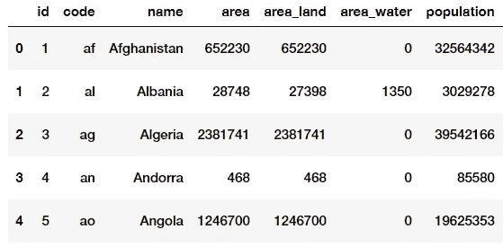
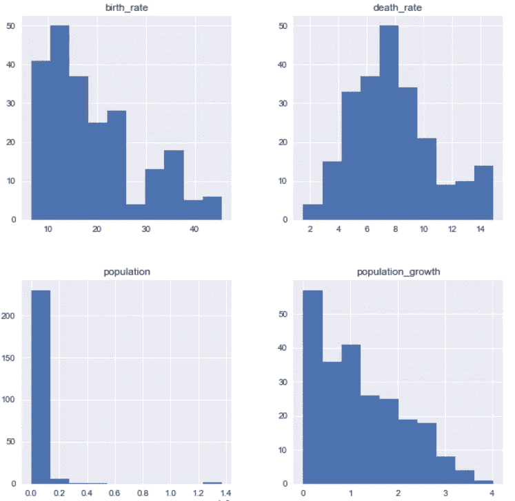

# 从 Python 中的 SQL 开始

> 原文：<https://towardsdatascience.com/starting-with-sql-in-python-948e529586f2?source=collection_archive---------1----------------------->

## 这是用 Python 在 Jupyter 笔记本中启动和运行 SQL 的介绍。


Photo by [Christopher Gower](https://unsplash.com/@cgower?utm_source=medium&utm_medium=referral) on [Unsplash](https://unsplash.com?utm_source=medium&utm_medium=referral)

使用 Python 运行 SQL 查询的一个快速简单的方法是使用 [**SQLite**](https://www.sqlite.org/index.html) 。SQLite 是一个利用 SQL 数据库引擎的库。它的执行速度相对较快，并已被证明是高度可靠的。 [SQLite 是测试环境中最常用的数据库引擎。](https://pynative.com/python-sqlite/)

以下是简单的入门步骤。

# 步骤 1 —导入 SQLite 和 Pandas

首先，我们需要将 SQLite 导入到 Jupyter 笔记本中。

```
import **sqlite3** import pandas as pd
```

# 步骤 2 —连接数据库

使用 **connect()** 函数允许您在自己的环境中创建一个数据库。这有助于用户命名他们的数据库，以便稍后在 Python 中调用。connect()函数在您使用数据库时保持连接。

需要注意的重要一点是，当您连接到数据库时，其他用户将无法同时访问它。这就是为什么当你完成时，关闭()连接是必要的(我将在最后讨论关闭连接)。

对于这个例子，我将引用一个名为“factbook.db”的中情局数据库。

```
sql_connect = sqlite3.**connect**('factbook.db')
```

# 步骤 3 —光标对象

**cursor()** 函数用于帮助执行我们的 SQL 查询。

```
cursor = sql_connect.**cursor**()
```

使用 cursor()返回与我们要查询的数据库相对应的游标实例是很重要的。

# 步骤 4 —编写查询

使用 SQLite 和 Python，SQL 查询将需要通过一个[字符串](https://www.geeksforgeeks.org/python-strings/)传递。虽然这不是必需的，但我认为将查询保存到变量中是一种好的做法，这样以后就可以引用它，而不必重写整个查询。

我们的 factbook.db 文件中的表叫做*事实*。

1.  将 SQL 查询保存为字符串

```
query = "SELECT * FROM factbook;"
```

2.使用前面的游标变量执行查询。这会将结果转换为元组，并将其存储为局部变量。为了得到所有的结果，我们使用 *fetchall()。*

```
results = cursor.execute(query).**fetchall**()
```

# 步骤 5-运行查询

为了运行我们之前保存的关于 pandas 的查询，我们执行以下操作。

```
pd.**read_sql_query**(query,sql_connect)
```

**输出**:



A snippet of the output from our query

# 步骤 6 —关闭您的连接

请记住，完成后关闭连接是非常重要的。关闭连接将授予其他人访问数据库的权限。

```
sql_connect.**close**()
```

这里有一个很好的 SQLite 思维过程的模板。

```
1\. connection open
    2\. transaction started
        3\. statement executes
    4\. transaction done
5\. connection closed
```

# 第 7 步——奖励(为什么使用 Python 和 SQL？)

如果你像我一样，那么你可能想知道为什么在 Python 中运行 SQL 查询，而在 PostgreSQL 或 MySQL 中运行它们似乎更容易。

Python 有大量的库(例如，Pandas、StatsModel 和 SciPy)用于可测量的科学分析。这些库同样致力于不断完善抽象，因此你不必手工计算所有的基本数学。此外，您可以迅速获得结果，因此您可以迭代地利用 Python 来调查您的信息。( [Janbansk 训练](https://www.janbasktraining.com/blog/use-sql-with-python/))

下面是用 Python 和 SQL 查询绘制直方图的片段。

```
import matplotlib.pyplot as plt
import seaborn as sns
%matplotlib inlinefig = plt.figure(figsize=(10,10))
ax = fig.add_subplot(111)**query = '''
SELECT population, population_growth, birth_rate, death_rate
FROM factbook
WHERE population != (SELECT MAX(population) FROM facts)
AND population != (SELECT MIN(population) FROM facts);
'''**pd.read_sql_query(query, sql_connect).hist(ax=ax)
```



# 资源:

*   [Github 资源库](https://github.com/jasonmchlee/statistical-analysis/tree/master/CIA%20Factbook)