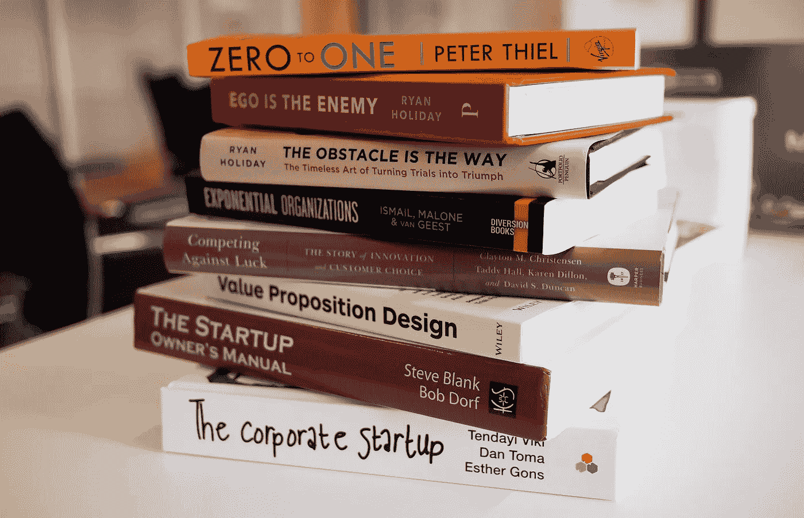
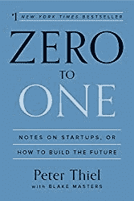
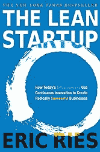
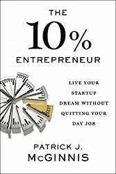
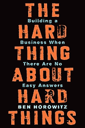
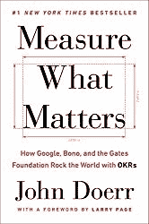
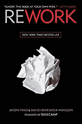
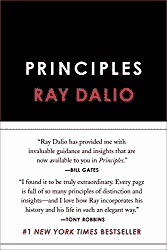
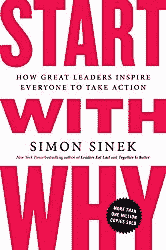

# 2020 年你应该读的创业书籍

> 原文：<https://towardsdatascience.com/startup-books-you-should-read-in-2020-ba8684000128?source=collection_archive---------21----------------------->

## 如何成长一家初创企业？每日阅读！

读书是成功的首席执行官们经常提到的活动之一。我们的经济变成了一个由一群热心人士和专家管理的中小型公司进行创新的地方。如果你是他们中的一员，或者如果你想成为他们中的一员，阅读是为冒险做准备的最好方式，那就是建立你自己的公司。

The best startup books to read in 2020

以下是 2020 年值得一读的 8 本创业书籍:

[零比一](https://amzn.to/2Qvw40F)是贝宝联合创始人、亿万富翁彼得·泰尔的经典之作。这本书简明扼要地探讨了与众不同意味着什么，以及如何建立一个有潜力成为独角兽的公司。

[精益创业公司](https://amzn.to/2KCfcSh)将精益方法引入商业世界，并展示如何使用它从零开始建立一个伟大的公司。这篇文章发表后，精益方法获得了成千上万的追随者。我们名单上的另一个经典。

[《10%的企业家:实现你的创业梦想而不放弃你的日常工作》](https://amzn.to/2pwpGeo)是对企业家精神的一种不同看法，也是一种非常需要的看法。作者提出了在你的全职工作之外建立一个企业的论点和用例，而不要放弃它(至少在开始的时候)。这很好地补充了启动建设的精益方法。

困难的事情的困难之处:在没有简单答案的情况下创业作者是安德森·霍洛维茨公司的传奇创始人，该公司是硅谷最好的风险投资公司之一。作者经历了一个人在成长过程中不得不面对的困境，并用自己生活中的例子来说明。

[衡量什么是重要的:谷歌、博诺和盖茨基金会如何用 OKRs 震撼世界](https://www.amazon.com/gp/product/0525536221/ref=as_li_tl?ie=UTF8&camp=1789&creative=9325&creativeASIN=0525536221&linkCode=as2&tag=petacrunch-20&linkId=58cc0fdb1b7cbb5f67ac0dbbe513e67a)是一位亿万富翁风险投资家和企业家写的书，他推广了客观关键结果的方法论。这是理论与来自世界上最伟大的公司的非常实际的使用案例的奇妙结合。

[Rework](https://www.amazon.com/gp/product/0307463745/ref=as_li_tl?ie=UTF8&camp=1789&creative=9325&creativeASIN=0307463745&linkCode=as2&tag=petacrunch-20&linkId=50f6fbbbd98a29a7adc2f1df3fcb09e5) 是一本关于通过质疑现状，以不同的方式做事并使之有效的书。作者通过与一个偏远的团队合作，多次从零开始重建一切，并违背流行的信念，建立了一个成功的初创企业。

[原则:生活与工作](https://www.amazon.com/gp/product/1501124021/ref=as_li_tl?ie=UTF8&camp=1789&creative=9325&creativeASIN=1501124021&linkCode=as2&tag=petacrunch-20&linkId=7e0c8eafe47c026e1c548facda6905f1)由一位亿万富翁对冲基金经理撰写，展示了一种伟大的公司文化如何让你取得惊人的成就。作者经常强调，如果不首先建立适当的文化，他就不会成功。

[从为什么开始:伟大的领导者如何激励每个人采取行动](https://www.amazon.com/gp/product/1591846447/ref=as_li_tl?ie=UTF8&camp=1789&creative=9325&creativeASIN=1591846447&linkCode=as2&tag=petacrunch-20&linkId=8bedccd2cb6431b1af2bade1e9ac21f4)是一本关于如何成为领导者的很棒的辅导书。它分析了“魅力”和其他企业家的属性，并用很好的生活例子来说明它们。

这些书是开启你创业之旅的绝佳方式。他们每个人都表现出不同的角度，因此他们在大多数时候是互补的。

如果你更倾向于技术，看看你应该在 2020 年阅读的[人工智能书籍清单](https://medium.com/p/artificial-intelligence-books-you-should-read-in-2020-4d3cecd21efa)。

 [## 加入我的技术简讯

### 让我们保持联系，了解更多关于技术和人工智能的新闻。](https://creative-producer-9423.ck.page/c3b56f080d)