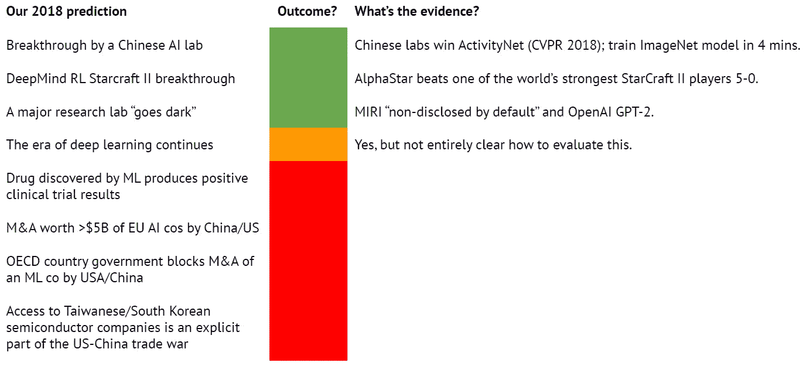

# 2019 年人工智能状况报告已经出炉

> 原文：<https://towardsdatascience.com/state-of-ai-report-for-2019-is-out-b5178dc8f320?source=collection_archive---------32----------------------->

## 《人工智能状况报告》捕捉了过去 12 个月人工智能的指数级进展及其最有趣的影响和发展。

## 这是什么？

该报告概述了人工智能的进展，重点是过去 12 个月的发展。这份报告汇集了人工智能领域发生的最有趣的事情，其目的是引发一场关于人工智能现状及其对未来影响的知情对话。这一版本建立在 2018 年人工智能报告的创始状态基础上，可以在这里找到。

> “我们相信，人们越来越需要关于人工智能在几个方面(研究、工业、人才、政治和中国)的状态的可访问、详细和准确的信息。我们报告的目的是推动关于人工智能进展及其对未来影响的知情对话。” **—贝奈希在采访中对**[**【ZDNET】**](https://www.zdnet.com/article/the-state-of-ai-in-2019-breakthroughs-in-machine-learning-natural-language-processing-games-and-knowledge-graphs/)

## 谁编写这份报告？

[Source](https://www.slideshare.net/StateofAIReport/state-of-ai-report-2019-151804430?from_action=save)

该报告借鉴了一些知名人士的专业知识，如谷歌人工智能研究员兼 Keras 深度学习框架负责人 Franç ois Chollet，风投和人工智能思想领袖李开复，脸书人工智能研究员 Sebastian Riedel 等。

## 报告的主要内容是什么？

1.  **研究:**技术突破及其能力。
2.  **人才:**在该领域工作的人才的供给、需求和集中度。
3.  **行业:**人工智能驱动创新的今天和明天的大型平台、融资和应用领域。
4.  **中国:**有两个截然不同的互联网，AI 在中国有自己的类别。
5.  **政治:**AI 的舆论，经济含义和 AI 的新兴地缘政治。

## 他们的预测有多准？

从问责和诚实的角度来看，该报告从他们在 2018 年报告中预测的实现和没有实现的内容开始。

True vs False

## 报告在哪里？

整份报告嵌在下面，是一个明确的必读。快乐阅读！

State of AI Report