# 数据科学和机器学习的现状

> 原文：<https://towardsdatascience.com/state-of-data-science-machine-learning-e8bdd4f21b6b?source=collection_archive---------12----------------------->

> “数据科学回答独立于数据科学而存在的问题”——Hugo bow ne-Anderson。

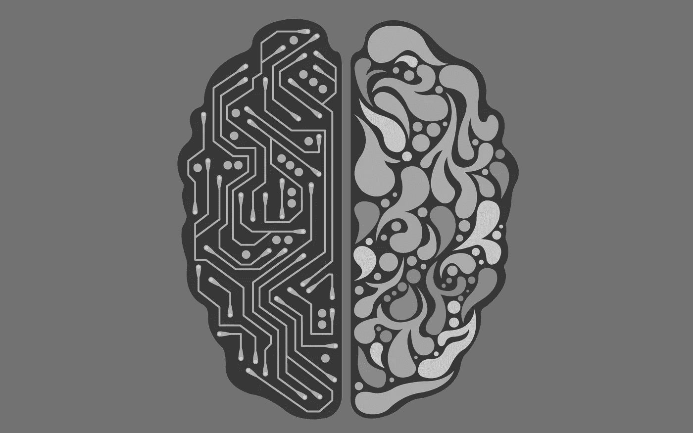

> **简介**

D *ata 科学、机器学习、深度学习、人工智能都是新兴的学科，并且经常与小说纠缠在一起。*

*当我第一次开始从传统软件开发过渡到数据科学领域时，我面临着许多挑战，我有很多问题:我应该回到学校吗？MOOC 好还是新兵训练营好？应该学习哪些新的编程语言？应该熟悉哪些框架和工具？我如何证明我的专业知识？如此等等。*

*作为一个新兴领域，很少有实证证据来回答这些常见的问题。在我研究弥合知识差距的过程中，我偶然发现了 Kaggle 数据科学家&机器学习调查。*

*Kaggle 在 2017 年发起了一项全行业调查，该调查真实全面地展示了数据科学和机器学习的现状。2018 年，该研究在 10 月份进行了一周的直播，并收集了 23，859 名个人的回复。*

*这个博客的目标受众是学生、软件开发人员、产品经理、招聘人员以及任何对数据科学的现状感兴趣的人&机器学习。*

> **调查对象的人口统计数据**

*在分析调查反馈之前，让我们先看看调查参与者是谁。*

*为了推断一般人群的调查反馈，理想的调查对象应代表(但不限于):*

1.  *多个地理位置*
2.  *所有性别和成年年龄组*
3.  *多样的学术&专业背景*

来自 147 个国家和地区的个人参与了调查，大约三分之一的调查者来自美国和印度。

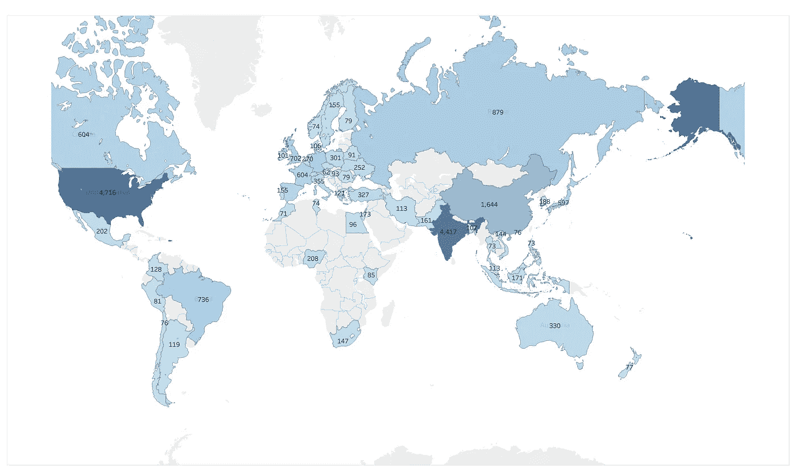

**Demographic Location of Survey Respondents**

所有年龄段的成年人都有代表。几乎一半的受访者年龄在 30 岁以下，三分之二的受访者认为自己是男性。

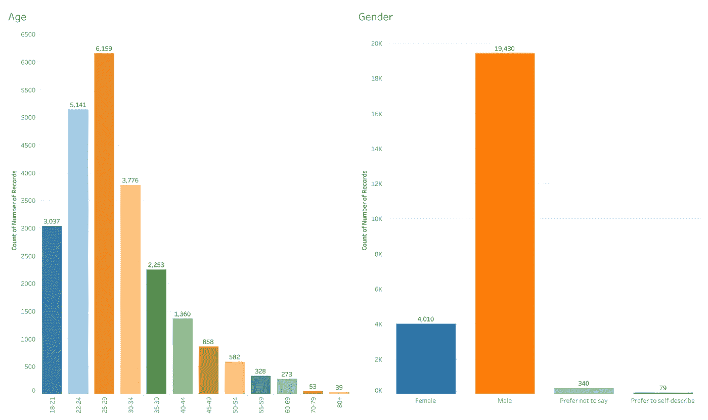

**Age & Gender Distribution**

*这项调查收集了来自不同行业、不同职位的个人的反馈。*

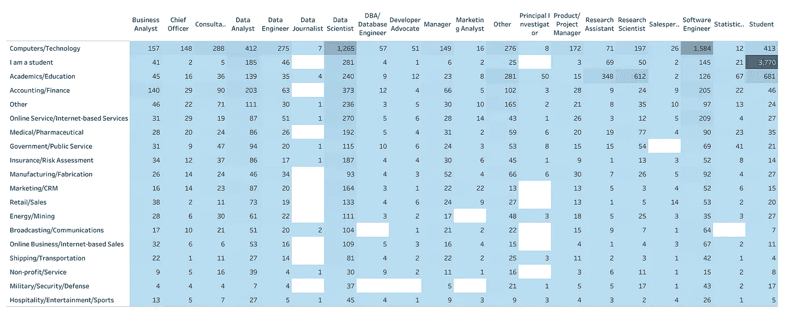

**Job title count by business domain**

*大多数受访者目前在软件和学术领域工作。*

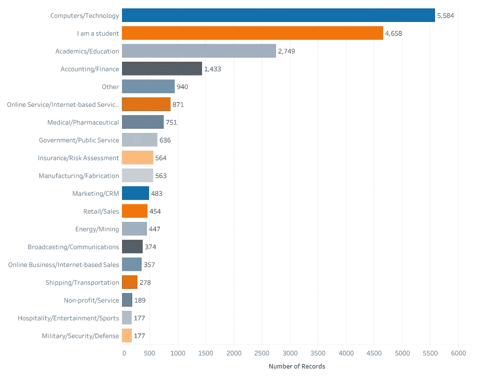

**Business Domain of the respondents**

*年度薪酬取决于被调查者工作的业务领域。与其他领域相比，软件领域的回报最高。*

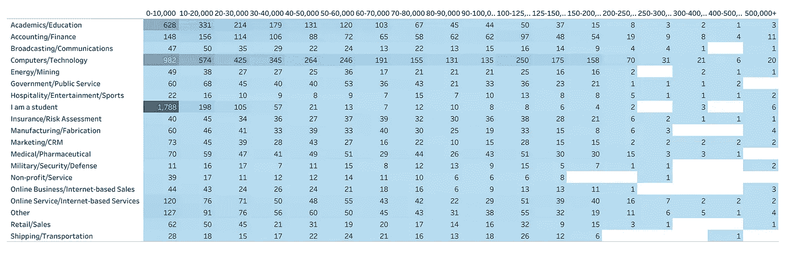

**Annual Compensation in USD by Business domain**

职位名称因公司而异。大多数调查受访者声称自己是学生，其次是数据科学家、软件工程师和数据分析师。

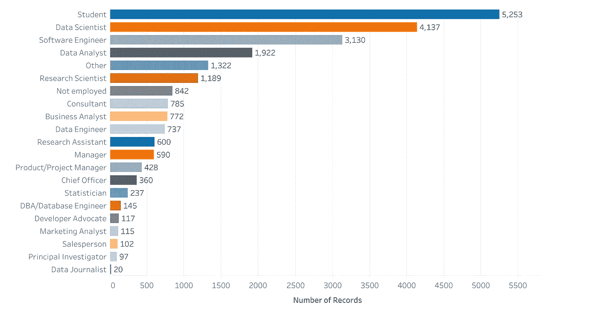

**Current Job title**

就像商业领域一样，职称在年度薪酬中也起着至关重要的作用。

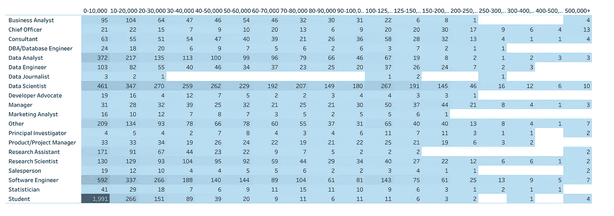

**Annual Compensation in USD by Job title**

*当被问及受访者是否认为自己是数据科学家时，超过一半的受访者回答是。*

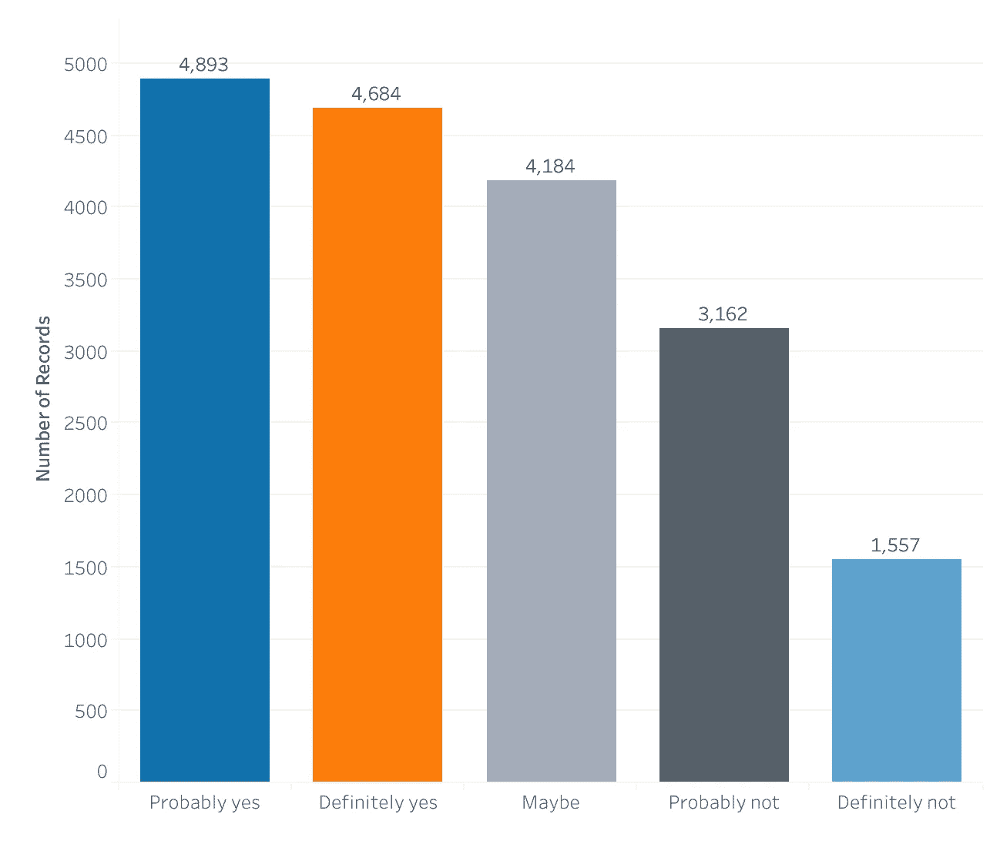

**Do you consider yourself a Data Scientist?**

*Kaggle 是许多有抱负的数据科学家的乐园。尽管受访者并不认为自己是数据科学家，但就目前而言，我已经考虑了所有的回答，以获得一个整体的观点。*

*几乎所有的调查对象都在工作中参与了一些编码活动。*

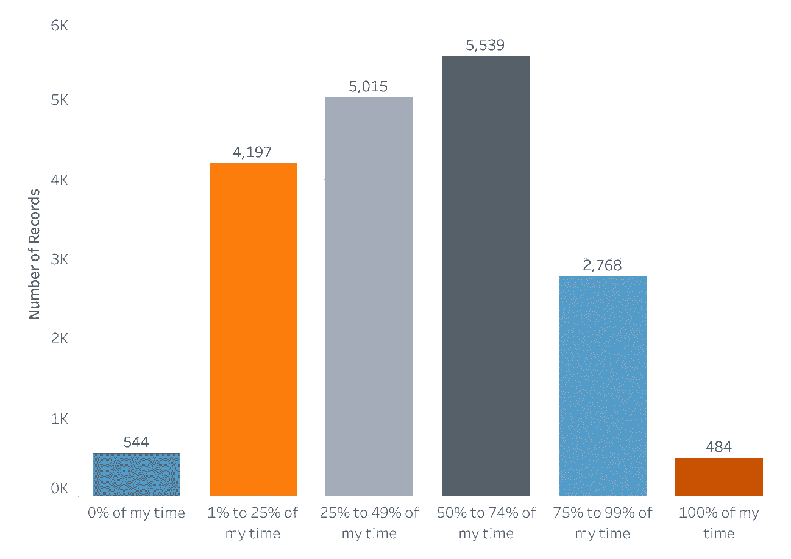

**Active coding percentage**

*说到经验，大多数调查对象的编码经验不到 5 年，机器学习经验不到 3 年。有相当多的人，他们没有事先的编码和机器学习知识，但热衷于学习。*

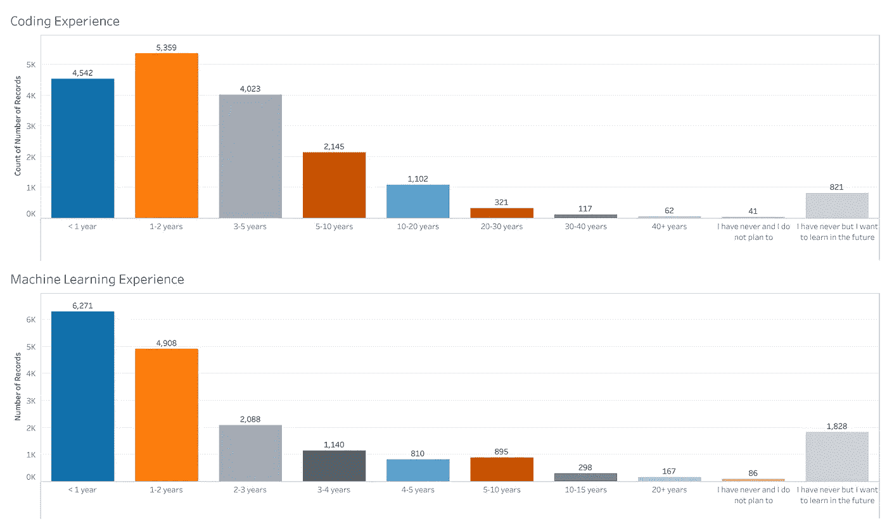

**Coding and Machine Learning Experience**

*鉴于调查的规模和多样性，我们可以自信地将调查趋势推断到一般人群。*

> **成为数据科学家**

*在这一部分，我们将分析数据科学的知识来源和调查对象的学术背景。*

*从历史上看，开设数据科学/机器学习专业的大学和学院并不多。正因如此，数据科学家&机器学习工程师的学术背景非常多样。*

通常，许多从业者有不止一个知识来源。

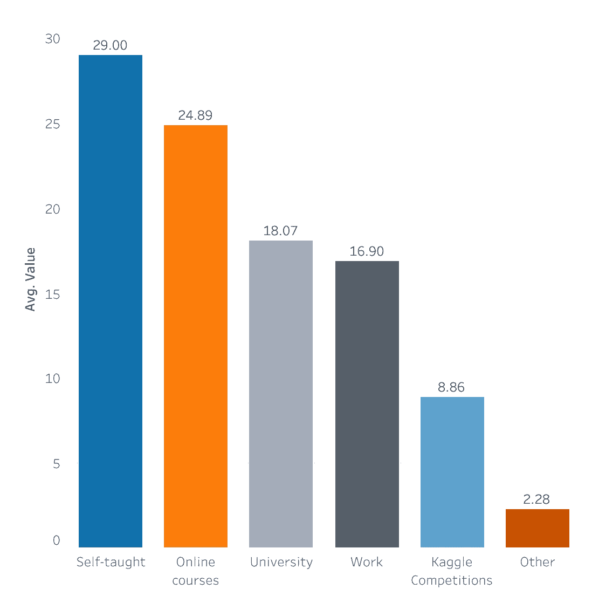

**Data Science knowledge source**

从调查反馈来看，典型的数据科学家通过自学和在线课程获得了超过一半的知识。

为了满足市场需求，许多知名大学和学院已经开始开设数据科学专业。然而，对于许多职场人士来说，由于地理和时间的限制，重返校园并不总是一个选择。然而，由于灵活的注册和访问，在线学习平台已经成为一种可行的替代知识来源。

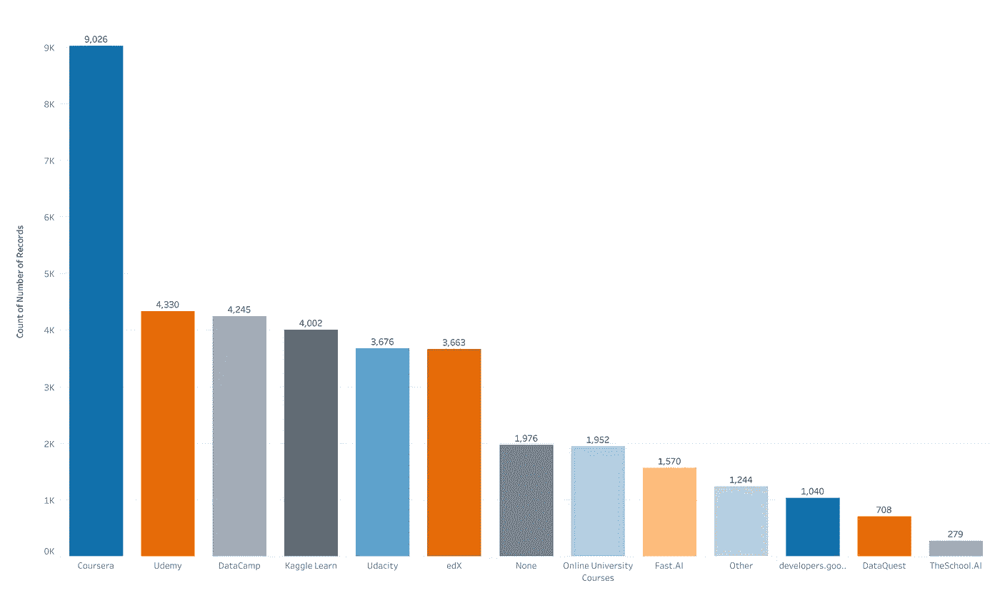

**Online Resources**

Coursera 是注册人数最多的在线资源，其次是 Udemy。大多数在线资源都有多样化的课程目录，并且有灵活的注册开始日期。有些甚至提供同行评议、测验和指导来模仿传统教育。

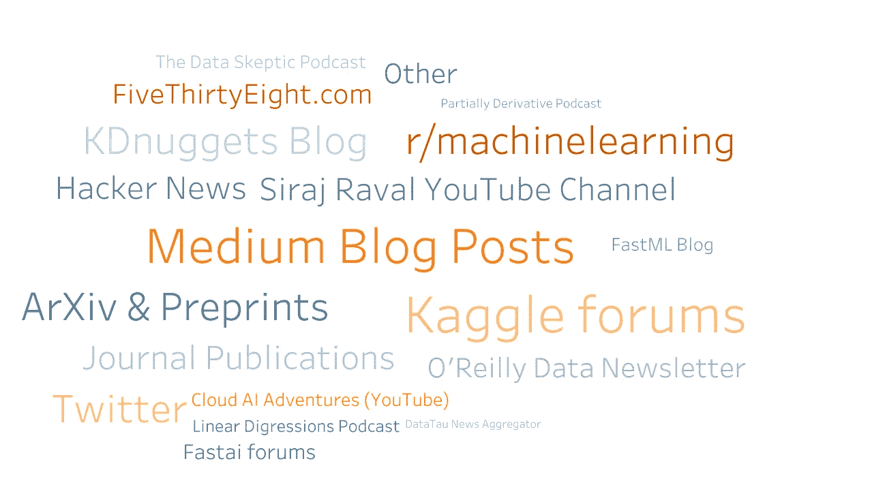

**Alternative Online Resources**

在线资源的一个主要缺点是，随着技术环境的不断变化，一些课程可能会过时。论坛、博客、YouTube 频道、时事通讯和播客系列都是用来更新的。

新兵训练营是数据科学和机器学习培训的另一个受欢迎的资源。通常情况下，新兵训练营都是面对面的，需要全天参与。

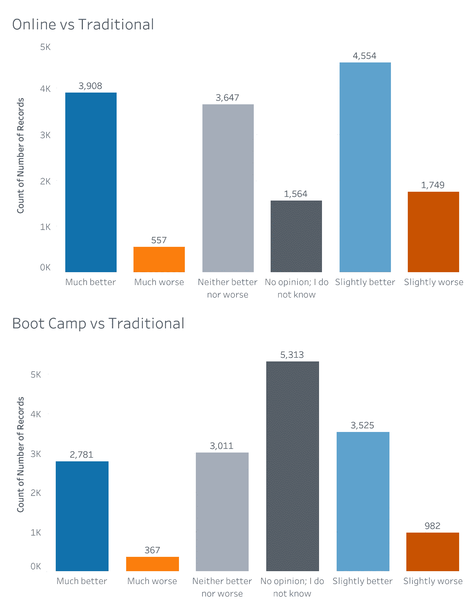

**Online & Boot Camp vs Traditional Education**

新兵训练营提供传统(面对面培训)和在线教育(灵活的时间框架)的精华。同时，新兵训练营非常昂贵，只有在大城市才有。

*大多数受访者投票认为在线课程比传统教育更好或一样好。另一方面，许多参与者没有接触过新兵训练营的训练。*

*作为一名数据科学家，应该具备领域知识、软件工程技能和统计知识。没有一个在线课程或训练营能够教授所有这三个方面。坚实的学术基础为填补知识空白指明了正确的方向。*

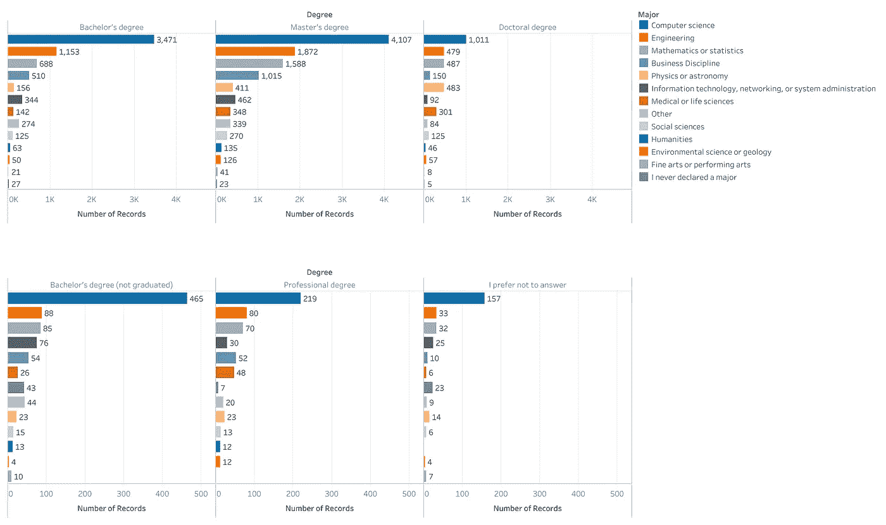

**Highest level of formal education and Undergraduate Major of survey respondents**

与普遍的看法相反，拥有博士学位的受访者人数少于拥有其他最高水平正规教育的人数。大多数受访者的本科专业是计算机科学，其次是工程学。

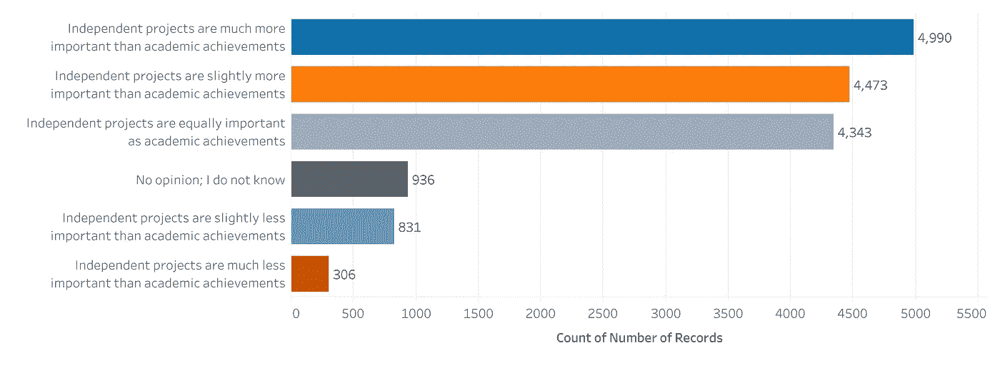

**Independent Projects vs Academic achievements**

*如图所示，数据科学家的学术背景非常多样化，因此，在雇用数据科学家时，学术成就并不总是合适的衡量标准。或者，分析独立项目可能是评估潜在员工技能的最佳方式。*

> **数据科学家军火库**

*数据科学和机器学习技术的前景正在不断扩大。人类不可能精通所有可用的框架、平台和方法。*

*该调查收集了参与者使用和建议的编程语言、框架、工具&平台。忽略边缘情况，这应该给一个有抱负的数据科学家一个好主意，告诉他应该精通什么技术。*

***提及的技术是累积性的，因项目而异。*

**编程语言**

绝大多数的回答者都建议将 Python 作为第一个要学习的编程语言。

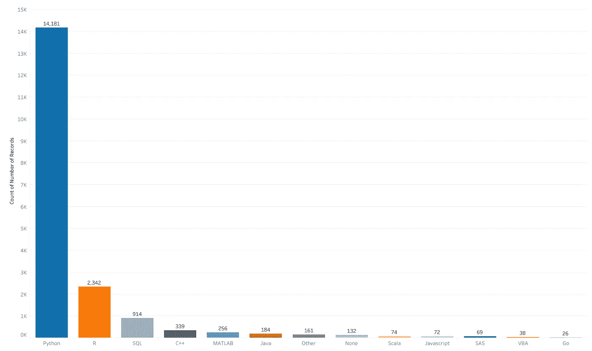

**First language for newbies**

*以下是我认为 Python 值得推荐的几个原因:*

1.  Python 是一种开源的模块化编程语言，学习曲线很短。
2.  Python 是许多流行的数据分析、机器学习和深度学习包的首选编程语言。
3.  Python 拥有庞大的开发者支持基础和第三方库。

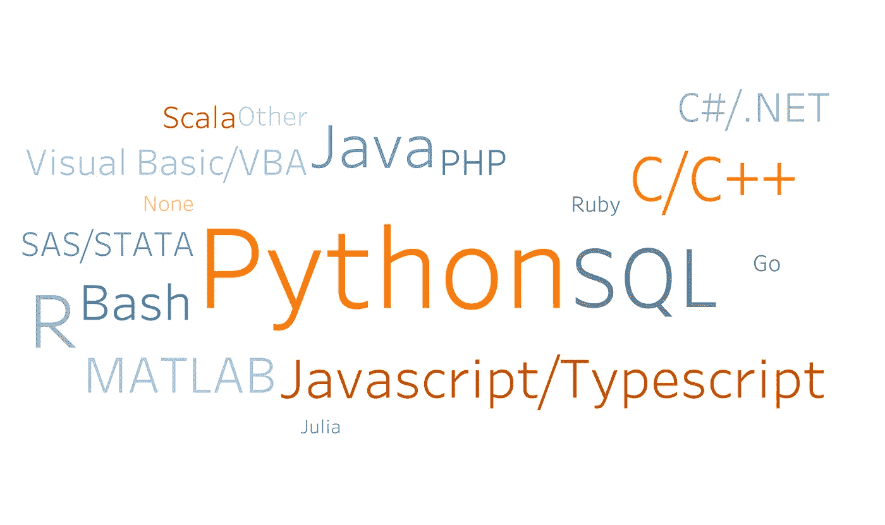

**Popular programming languages**

知道多种编程语言总是一个好主意。有了不止一种编程语言的知识，我们可以模块化地设计应用程序，以利用不同语言和各自支持的框架所提供的功能。

*受访者对其他编程语言的建议与调查对象给出的第一语言建议相结合。*

例如，在开发信用卡欺诈检测应用程序时，我将使用 Apache Spark (Scala)管道进行数据转换，并使用 Scikit (Python)模型进行机器学习。

*虽然 Spark 有 Python (PySpark)支持，但使用 PySpark 时有一个潜在的权衡，如果你想使用自定义用户定义函数(UDF)来实现基于上下文的逻辑，数据需要不断地序列化和反序列化。为了避免这种情况，我选择 Scala Spark 进行数据转换。*

***如果上述示例中的技术术语令人困惑，请忽略该示例。*

## 框架和库

学习语言本身并不足以成为一名成功的数据科学家或数据工程师。框架和库的知识是必要的。框架和库提供了可重用和可扩展的代码托盘。

*在典型的工作中，数据科学家利用各种框架和库来探索、可视化和训练数据集。*

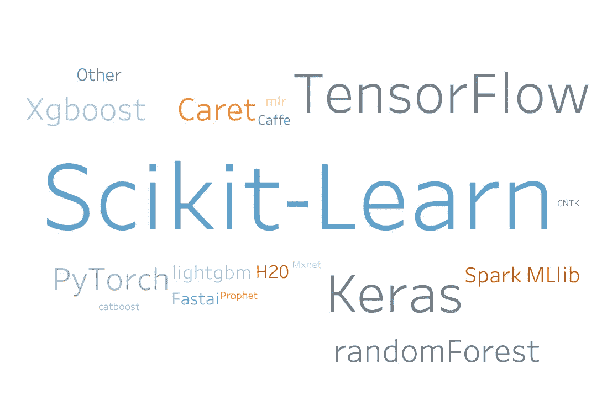

**Machine Learning Frameworks**

*机器学习框架提供了监督、非监督和深度学习算法的抽象实现。不是每个框架都提供所有的算法。*

*机器学习框架的选择取决于团队使用的语言和基础设施等参数。*

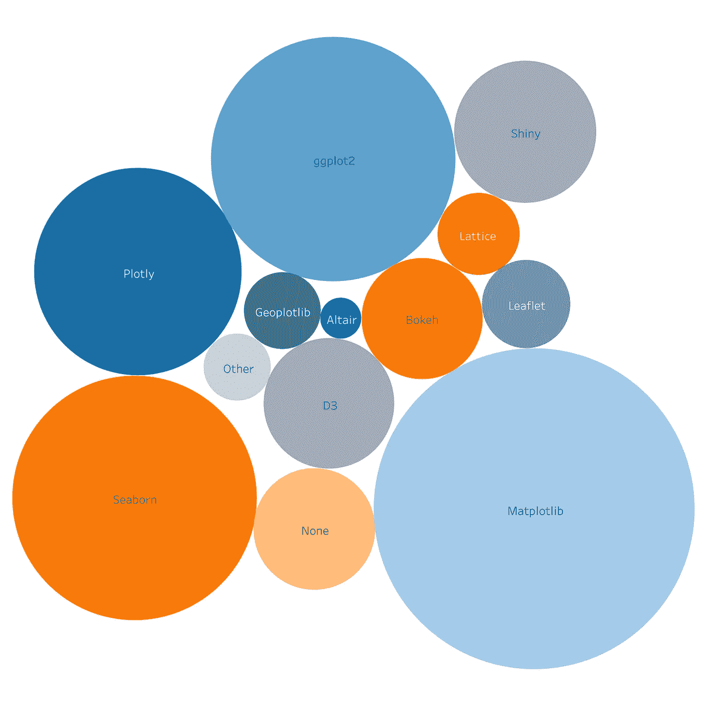

***Visualization Frameworks***

***“一张图胜过千言万语”，*** *用图表和图形(正如我在这篇文章中所做的)传达信息比用文字描述更直接。可视化框架将数据作为输入，并产生易于理解的可视化效果。*

*可视化库的选择取决于语言、用法和熟悉程度。*

## 工具

从人类诞生之日起，人类就致力于开发新的工具来让生活变得更容易。数据科学家使用技术工具来简化他们的日常工作。

每种语言都有其句法和语义，作为人类，要记住它们是不可能的。开发集成开发环境(ide)是为了避免语法和语义错误并提高生产率。

大多数企业使用 ide 进行开发。ide 有助于提高开发人员的整体生产力:

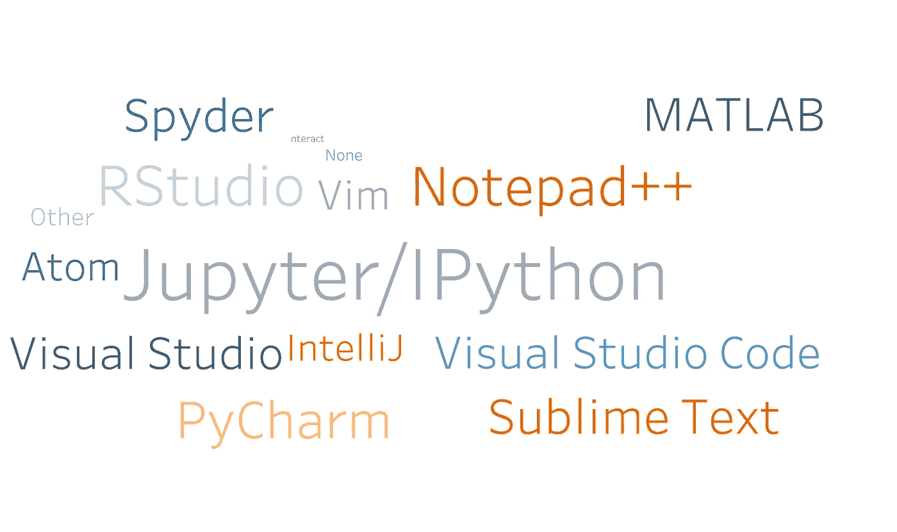

**Popular IDEs**

1.  在开发过程中提供语法和语义验证。
2.  *第三方库的文档。*
3.  *与终端、GIT 等外部工具集成。*

*通常，IDE 的选择取决于所使用的编程语言和开发团队的偏好。*

*在数据科学项目的初始实验阶段，笔记本内核为探索、分析和概念化数据提供了一个交互式环境。笔记本还提供了一种以多种格式记录和分享发现的简单方法。*

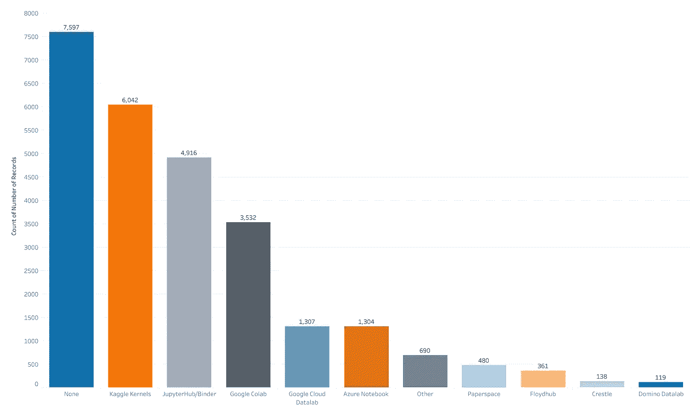

**Notebook Kernels suggested by respondents**

*根据调查结果，使用笔记本内核的受访者并不多。这可能是因为大多数公司使用集成开发环境。根据我的经验，如果你开始从事数据科学，熟悉笔记本内核是试验数据和代码的一个很好的方法。*

## 公用事业

*编程语言，框架&库提供逻辑处理，我们仍然需要其他工具来存储和计算数据。*

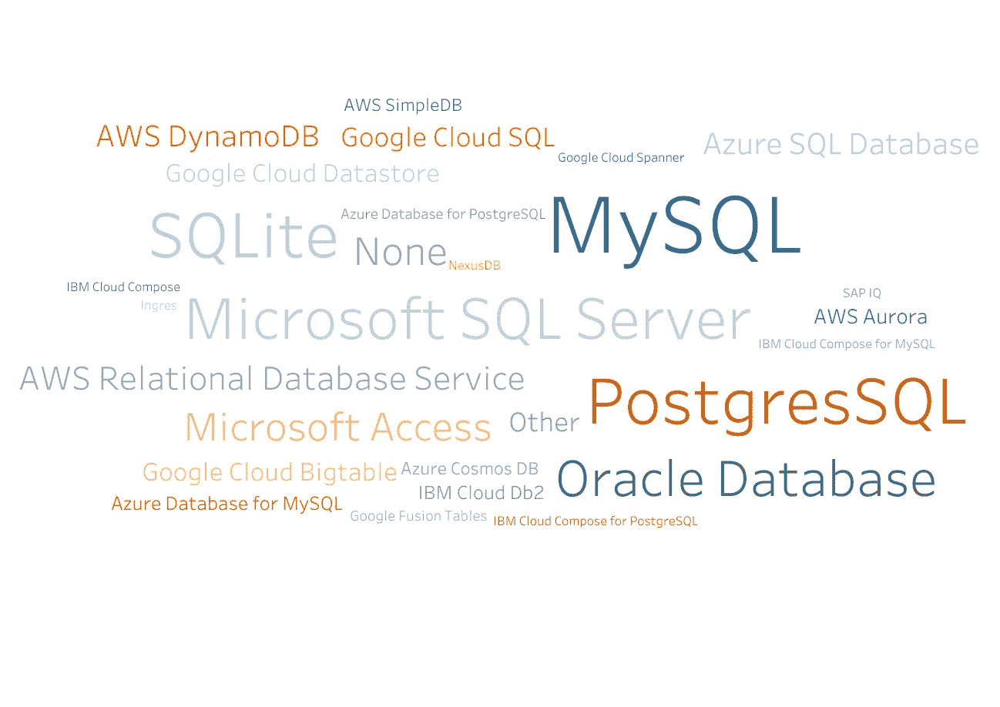

**RDBMS systems**

关系数据模型是关系数据库管理系统背后的基本原理。

*每个 RDBMS 都包含表，每个表由行和列组成。表和列结构是预定义的。*

*RDBMS 在软件应用中广泛用于存储数据。结构化查询语言(SQL)用于访问和操作数据。即使在今天，许多公司仍然高度依赖这个系统。*

*数据科学家应该熟悉 RDBMS 和 SQL。RDBMS 有许多实现方式，如 Oracle、MySQL、DB2 等。并根据团队使用的应用程序框架和库进行选择。*

几乎所有的 RDBMS 都有支持编程语言直接交互的框架和库。

***请注意即使调查中关系数据库下提到* [*AWS 迪纳摩 DB*](https://docs.aws.amazon.com/amazondynamodb/latest/developerguide/Introduction.html) *(如上图所示)，迪纳摩 DB 也是一个非 SQL 数据库。*

*在从事数据科学和机器学习项目时，我们很有可能会在开发终端或调配的服务器资源上遇到有关存储和计算能力的瓶颈场景。*

云平台在共享的服务器网络上提供存储和计算能力。理论上不应该缺少存储空间&计算能力。

*云计算服务和产品提供了广泛的硬件容量和软件产品，能够在短时间内灵活扩展。*

*例如，我正在开发一个深度学习网络，我预计只训练这个网络 1 周。要训练一个深度学习网络，我需要 GPU。但是，同时在 GPU 上投资一周的任务没有任何意义。相反，我可以使用云 GPU 一周，并根据我使用它的时间支付费用。*

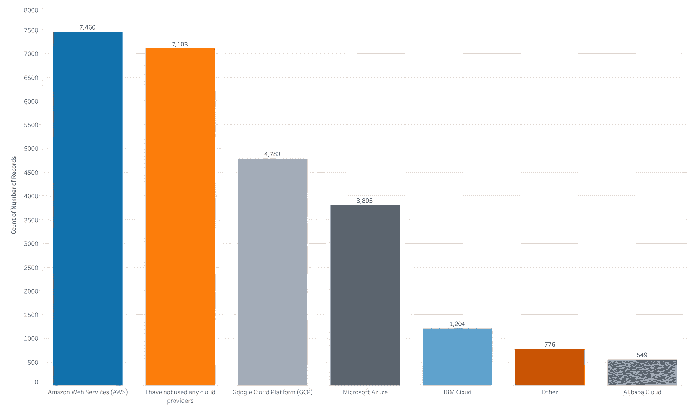

**Cloud Platforms**

*AWS 是受访者使用最多的云平台。*

*尽管云平台有其固有的优势，但许多受访者都提到他们没有接触过云平台。*

*大多数云平台通过产品即服务(PaaS)架构提供计算、机器学习和分析产品。这些产品专门为云供应商开发。*

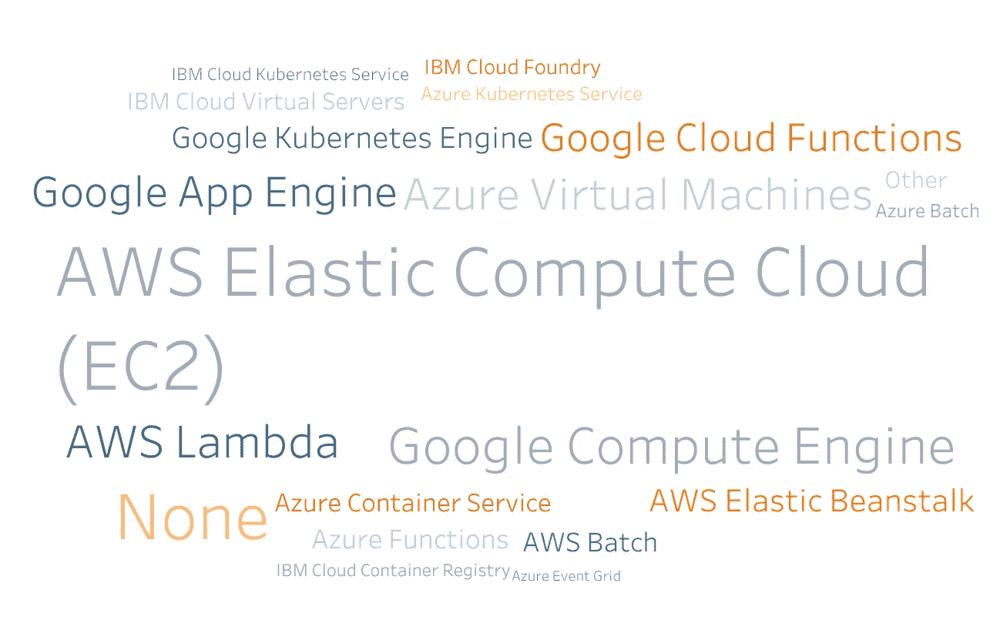

**Cloud Computing Services**

*云平台以平台即服务的形式提供虚拟机(VM)和容器，具有硬件和软件调整的灵活性。使用云，我们可以按需添加或删除虚拟机和容器。*

*根据受访者的说法，亚马逊 EC2 和 AWS Lambda 是最常用的两项服务。*

*许多云供应商通过 API 提供预训练的机器学习模型。*

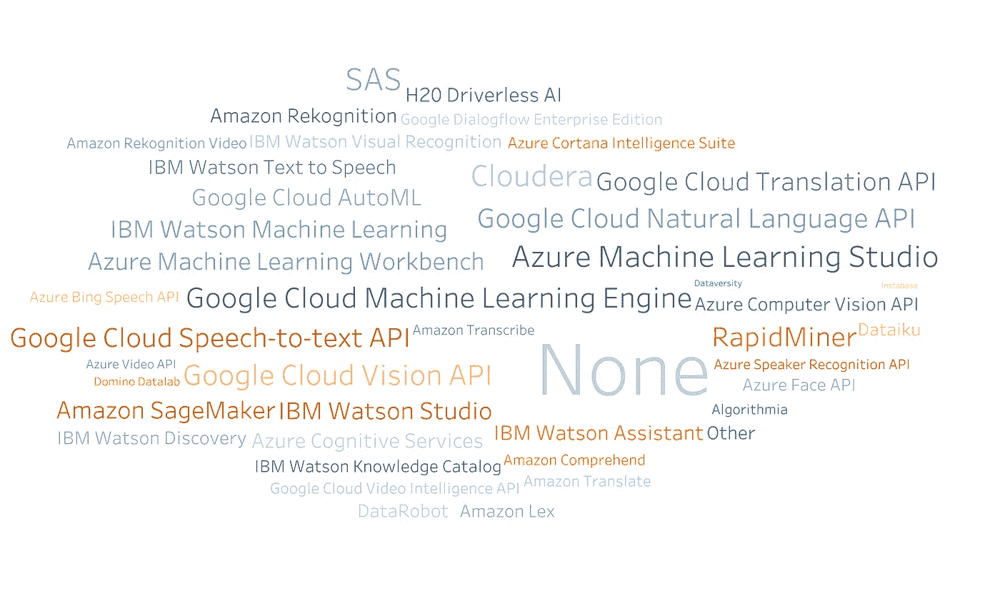

**Cloud Machine Learning Products**

使用经过训练的模型，开发人员可以轻松地将 ML 模型集成到应用程序代码中。通过这种方法，具有最少或没有机器学习知识的开发者可以在应用中实现 ML。

> **数据科学家的一天**

*到目前为止，本文的重点是数据科学家的人口统计、专业、学术和技术背景。接下来，我们将分析数据科学家的一天是什么样的。*

*从高层次来看，典型的数据科学项目分为收集、清理、分析和建模数据。*

**Data Science Project Activity Time Proportion.**

收集数据是第一步。数据不仅从内部数据源收集，还使用 API 交互和 Web 报废从外部数据源收集。这一步由数据科学家或数据工程团队执行，具体取决于团队的规模和结构。

*清理数据包括选择数据中哪些特征是有用的，以及如何处理丢失的值。项目的成功直接取决于这一步。糟糕的数据清理选择会导致糟糕的数据和错误的见解。*

*在分析阶段，干净的数据被转换成可视化数据，用于与利益相关者交流见解。*

*模型选择阶段包括为问题选择正确的机器学习算法，并调整超参数以实现偏差和方差之间的最佳平衡。这个阶段不是所有数据科学项目的一部分。当需要时，这个阶段是耗时的。*

数据科学家的日常活动源自高级数据科学项目阶段。

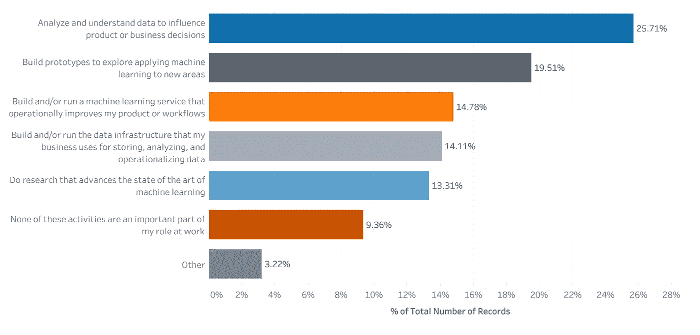

**Daily activities of a Data Scientist**

*从调查反馈来看，理解领域和模式知识花费了大部分时间，其次是模型&超参数选择和实施。*

> **来自数据科学家 Vantage 的机器学习**

在调查中，受访者被问及如何评价公平偏差、可重复性和解释模型输出的重要性。

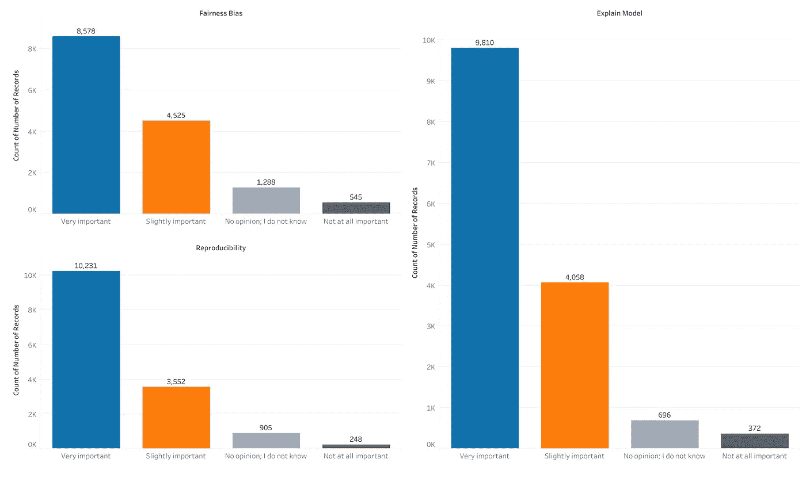

**Importance of Fairness Bias, *Reproducibility and Explaining the model output***

*机器学习模型使用输入数据进行预测，如果输入数据本身有偏差或不公平，同样会传播到模型预测中。*

*一个现实世界的例子是，现在废弃了歧视女性的亚马逊人工智能招聘工具。你可以在* [*路透社*](https://www.reuters.com/article/us-amazon-com-jobs-automation-insight/amazonscraps-secret-ai-recruiting-tool-that-showed-bias-against-women-idUSKCN1MK08G) *新闻文章中了解更多相关信息。*

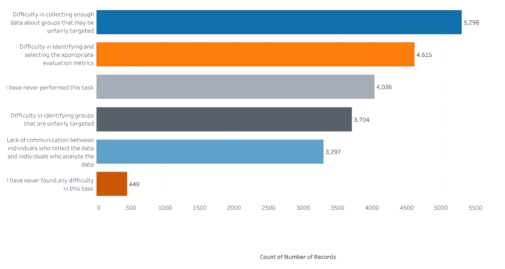

**Reasons of Bias in training data**

寻找无偏见的数据总是一个挑战。好的一面是大多数数据科学家都意识到了这个问题，坏的一面是没有多少数据科学家投入时间来减少偏差。

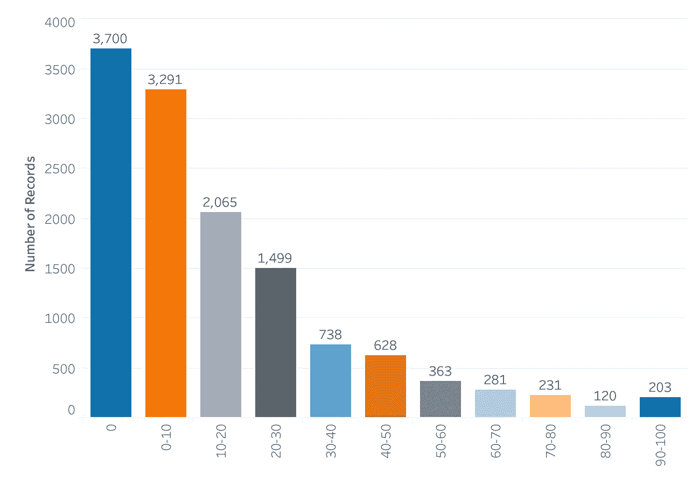

**Percent of data projects involved exploring unfair bias in the dataset and/or algorithm**

*机器学习库具有简化的模型训练和超参数调整过程；问题是有时很难解释模型的结果。*

*只有四分之一的受访者有信心能够解释机器学习模型的输出。*

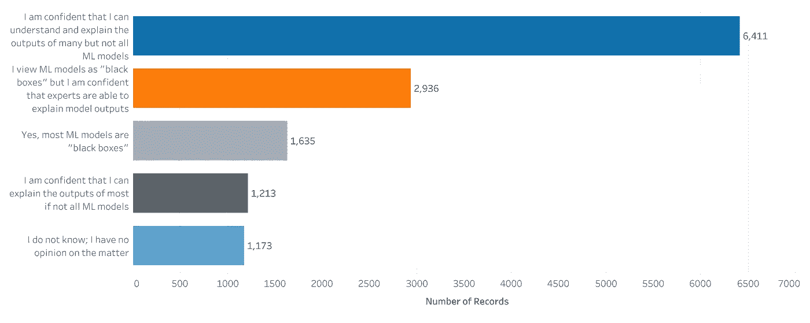

**ML Black-box**

*再现性对于成功的 ML 模型至关重要。一旦模型被调优，只要输入是常数，它就必须产生相同的结果，而不管它在哪个机器上被执行。下图中提到的工具和方法用于使您的作品易于访问和复制。*

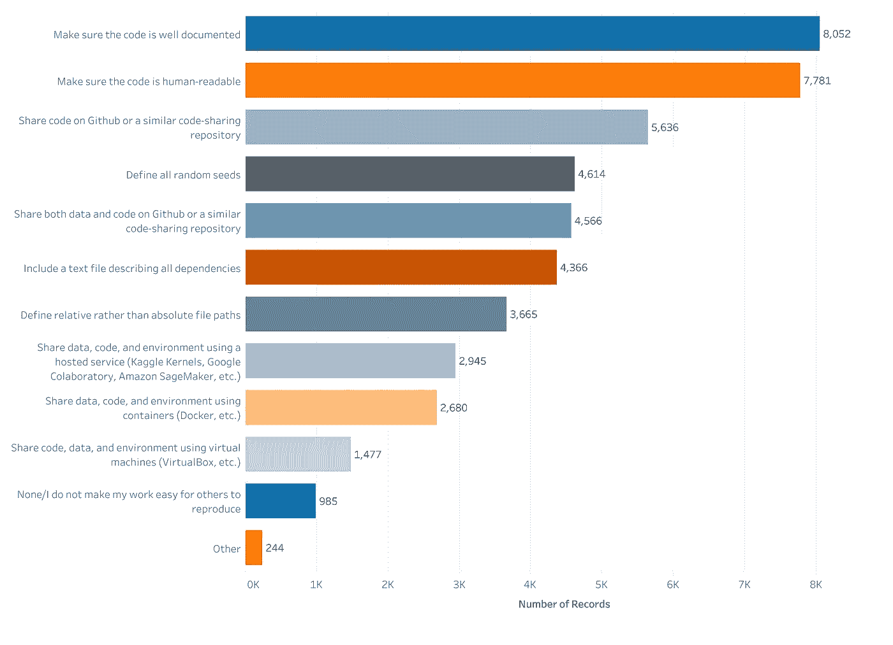

**Tools and Methods to reproduce ML**

ML 模型的一个优点是一个模型的输出可以作为另一个模型的输入，创建一个模型管道。

*值得注意的是，在深度学习的情况下，这是非常有利的。当利用训练好的层开发图像识别算法时，我们可以节省大量的时间和计算能力。*

受访者被问及是什么阻碍了他们让自己的作品更容易被重用和复制。

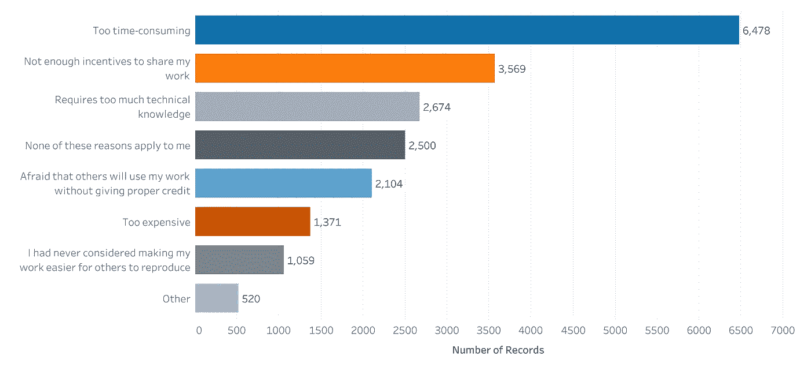

Barriers to accessible ML models.

> **商业华帝的机器学习**

不是所有的项目都实现机器学习。在数据科学项目中实现机器学习是不可行的，原因有很多。

*从调查反馈来看，不到 10%的受访者就职于在生产中成功实施机器学习模型超过 2 年的公司。*

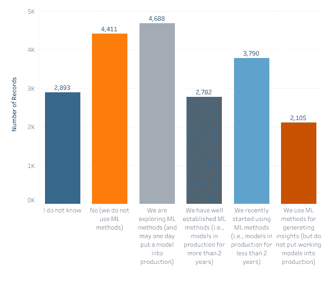

**ML in Use**

*每个企业都有自己的衡量标准来衡量机器学习的成功实施。对于大多数企业来说，准确性与收入和业务目标一样，是实施 ML 的关键驱动因素。*

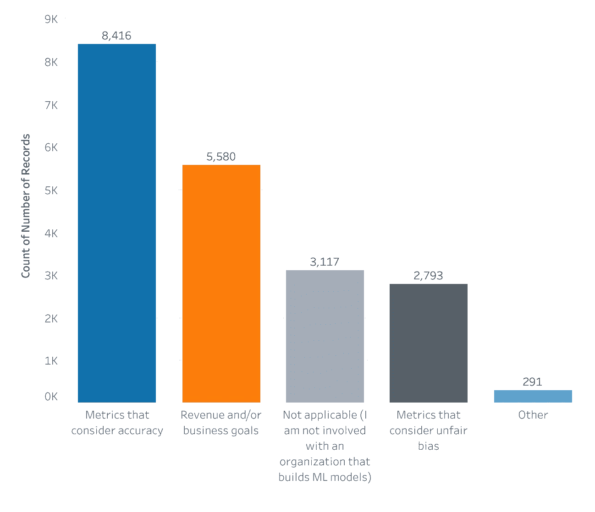

**Metrics of successful ML implementation.**

> **结论**

Kaggle 真正掌握了数据科学和机器学习的全面状况。这个博客对任何有兴趣进入数据科学和机器学习领域的人来说都是一个指南针。

*人们可以将这篇博客作为进一步分析的起点——将调查结果与* [*2017 年 Kaggle 调查数据*](https://www.kaggle.com/kaggle/kaggle-survey-2017) *以及*[*stack overflow*](https://insights.stackoverflow.com/survey/2018/)*调查数据(改天)进行比较。*

*此分析的源代码托管在*[*GIT*](https://github.com/ramsaran-vuppuluri/kaggle-survey-2018)*上，可视化托管在*[*Tableau Public*](https://public.tableau.com/profile/ram.saran.vuppuluri#!/)*上。*