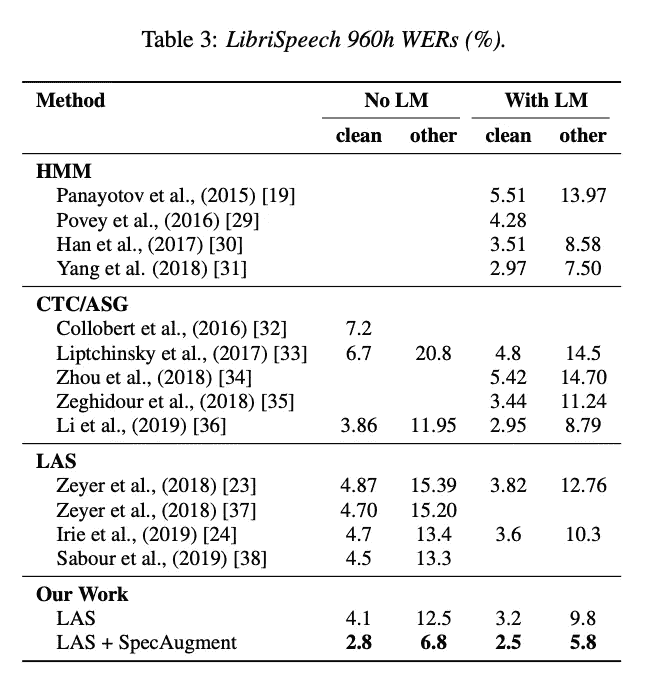
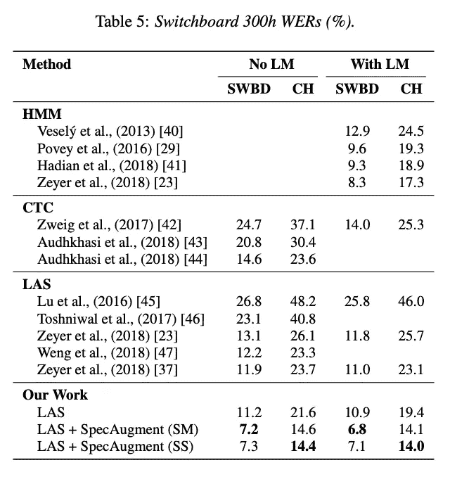
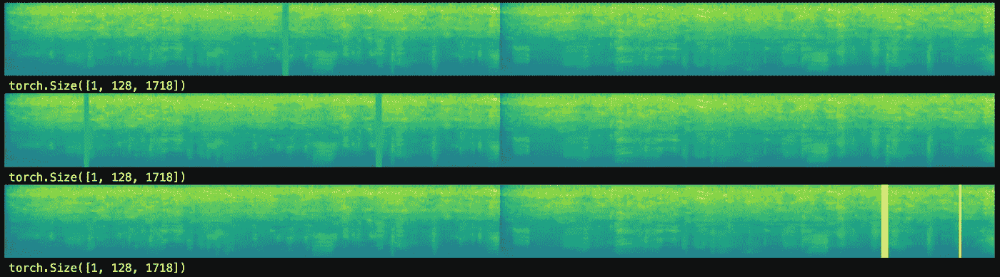
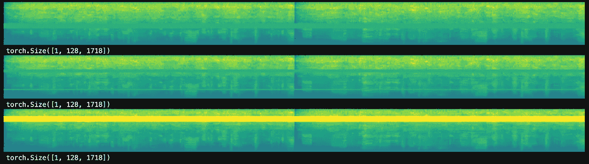
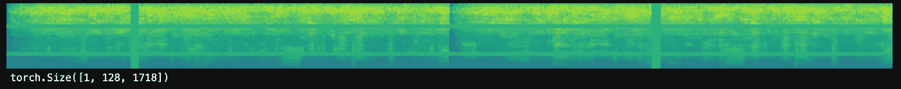

# 使用 Google Brain 的 SpecAugment 和 Pytorch 增强最先进的音频数据

> 原文：<https://towardsdatascience.com/state-of-the-art-audio-data-augmentation-with-google-brains-specaugment-and-pytorch-d3d1a3ce291e?source=collection_archive---------15----------------------->

Photo by [Steve Harvey](https://unsplash.com/photos/wt2tFjoTRcw?utm_source=unsplash&utm_medium=referral&utm_content=creditCopyText) on [Unsplash](https://unsplash.com/search/photos/audio?utm_source=unsplash&utm_medium=referral&utm_content=creditCopyText)

## 使用 Pytorch 和 TorchAudio 实现 SpecAugment

谷歌大脑最近发布了 [SpecAugment:一种用于自动语音识别的新数据增强方法](http://ai.googleblog.com/2019/04/specaugment-new-data-augmentation.html)，它在各种语音识别任务上取得了最先进的结果。

不幸的是，谷歌大脑没有发布代码，似乎他们在 TensorFlow 中编写了他们的版本。对于喜欢 Pytorch 的从业者，我已经发布了使用 Pytorch 的伟大伙伴库 [torchaudio](https://pytorch.org/audio/) 和一些从与其他 FastAI 学生的持续合作中借来的功能 [fastai-audio](https://github.com/zcaceres/fastai-audio) 的 SpecAugment 的实现[。](https://github.com/zcaceres/spec_augment)

## SpecAugment 基础

在语音识别中，原始音频通常被转换成基于图像的表示。这些图像是典型的[频谱图](https://en.wikipedia.org/wiki/Spectrogram)，它以一种许多模型都觉得更容易学习的格式对声音的属性进行编码。

SpecAugment 没有对原始音频信号进行数据增强，而是借鉴了计算机视觉的思想，对频谱图进行操作。SpecAugment 工程。[谷歌大脑报告了奇妙的结果](https://arxiv.org/abs/1904.08779):

SOTA results using SpecAugment

SpecAugment 有三个增强功能。

## 时间隧道

time warping a spectrogram

简而言之，时间扭曲通过使用插值技术在随机选择的方向上挤压和拉伸数据来及时移动频谱图。

时间扭曲是 SpecAugment 最复杂、计算量最大的增强。深度学习工程师 [Jenny Cai](https://www.linkedin.com/in/caijenny/) 和我一起完成了 Tensorflow 的`[sparse_image_warp](https://www.tensorflow.org/versions/r1.9/api_docs/python/tf/contrib/image/sparse_image_warp?hl=en)` 功能，直到我们有了 Pytorch 的支持。

如果你对细节感兴趣，你可以查看[回购](https://github.com/zcaceres/spec_augment)中的`SparseImageWarp.ipynb`。谷歌大脑的研究表明，时间扭曲是最无效的增强，所以，如果性能是一个问题，你可能会考虑先放弃这个。

## 频率和时间掩蔽

频率屏蔽和时间屏蔽类似于计算机视觉中常用的[剪切数据增强技术](https://arxiv.org/abs/1708.04552)。

简而言之，我们用频谱图的平均值，或者，如果你喜欢，零，来屏蔽随机选择的频带或时间步长。

X 轴为时间，Y 轴为频段，时间屏蔽如下所示:

time masking a spectrogram

这是频率掩蔽:

frequency masking a spectrogram

自然，您可以在一个声谱图上应用所有三种增强:

All three augmentations combined on a single spectrogram

希望这些新的 Pytorch 函数将在您的深度学习工作流程中证明有用。感谢阅读！