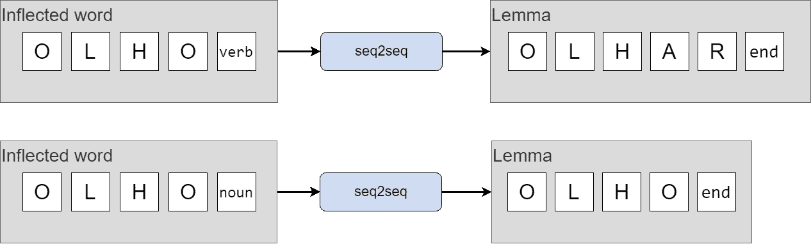
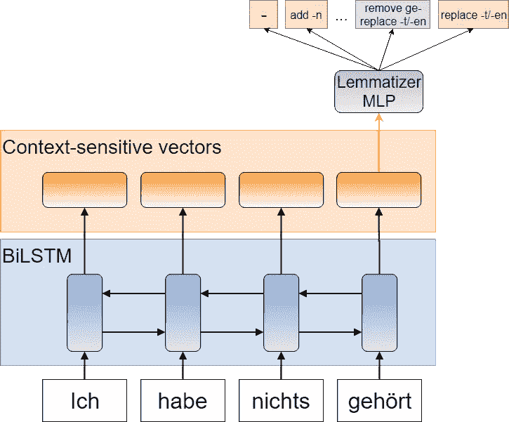
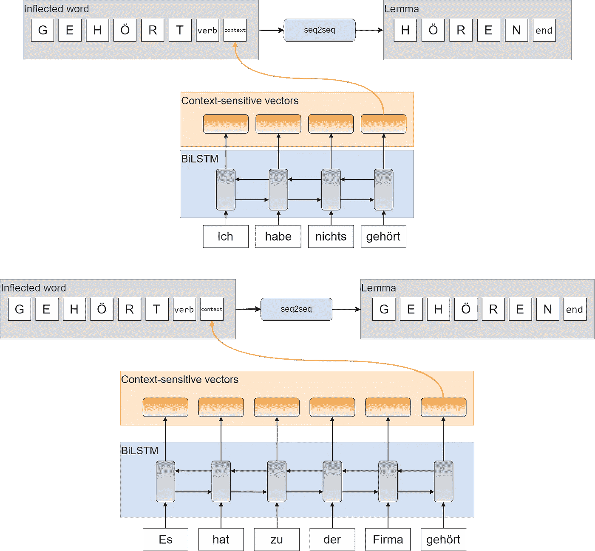

# 最先进的多语言词汇化

> 原文：<https://towardsdatascience.com/state-of-the-art-multilingual-lemmatization-f303e8ff1a8?source=collection_archive---------12----------------------->

## 对适用于数十种语言的最先进的分类器的分析

我发现变元化是一项有趣的 NLP 任务，在这项任务中，我们必须找到处理人类语言的丰富性和任意性的方法。在这篇文章中，我总结了令人印象深刻的多语言 lemmatizers 的最新技术，为该领域的从业者和新手提供了一些有用的提示，并指出它们的局限性。

# 词干:低成本，低回报

当我们处理文本数据时，有时需要减少词汇:如果您正在搜索*“二手车价格”*，包含*汽车价格*和*汽车价格*的文档很可能是相关的。

这个问题的一个常见策略是*词干*，从单词中去除前缀和后缀，直到我们只剩下它的*词干*，它承载了大部分的意思。于是，*车*被词干为*车*，*重播*至*播放*，*出租车*继续为*出租车*。它只是通过字符串编辑来执行，没有任何类型的预处理或机器学习。

词干提取因其简单性已被许多搜索引擎成功使用。然而，这种简单性也是一个限制因素:甚至没有一个关于单词词干是什么的精确定义。*重播*的梗可能是*戏*，但*排练*的梗肯定不是*灵车*。认为*关心*的梗是*关心*，而不是*车*是有道理的；但是为了实现这一点，我们需要一个更复杂的算法，知道何时插入一个 final *-e* 。对于其他语言来说，这可能会变得更加混乱。

底线是任何只基于字符串编辑的方法都缺乏语言的一致性。当这是一个问题时，我们转向*术语化*。

# 词汇化

词条化是确定给定单词的*词条*(即词典形式)是什么的过程。拿前面的例子来说，*车*的引理是*车*，而*回放*的引理是*回放*本身。这是一个定义明确的概念，但与词干提取不同，它需要对文本输入进行更精细的分析。

对于英语这种几乎没有词形变化的语言来说，这相当简单。但是对于大多数语言来说，词汇化既重要又困难。请看这个捷克语例句:

> 由 v . kabin ce stujím tr valo překročit řeku 波托马克 asi čtyři minuty 编写。

将每个单词替换为它的引理，得到如下结果:

> *studie****proveditelnost*******odhadovat****e****bút****v****卡比娜*******cestující*****

***(如果你想知道，它的意思是“可行性研究估计，乘客乘坐平底船穿越波托马克河大约需要 4 分钟。”)***

***在我们的捷克语例子中，15 个单词中有 8 个与词条不同！那几乎是句子中所有的实词。NLP 中的大多数研究使用英语数据，但是正如您所看到的，这是一个糟糕的语言选择，不能反映其真正的挑战。***

***然而，随着 [CoNLL 2017](http://universaldependencies.org/conll17/) 和 [2018](http://universaldependencies.org/conll18/) 共享任务的出现，我们已经为超过 50 种语言发布了大量带有词条注释的数据。参与者被要求，除了其他事情之外，提出适用于这种广泛语言的 lemmatizer 模型。这些数据为评估 lemmatizers 提供了一个很好的基准。***

## ***困难***

***单词变形有很多规律，这可能会让你想到开发一套规则来恢复单词的引理。但是，由于一些因素，这可能会非常困难:***

*   ***不规则表格。你必须一个一个地治疗他们。***
*   ***看起来有屈折变化，但实际上没有的单词。例如 *bring* 不是不可认动词 *to bre* 的屈折形式。***
*   ***不同引理共有的屈折形式。如德语中，*gehrt*可以是*hren*(听到)的分词，也可以是*gehren*(属于)的分词，只有语境才能消除歧义。***
*   ***变形规则的数量可能太多，或者您可能对正在使用的语言没有足够的了解。***

***如您所见，设计手写的词汇化规则甚至对英语来说也很麻烦。所以，像往常一样，我们求助于机器学习。更具体地说，是指一直存在的神经网络。***

# ***神经旅鼠是如何工作的？***

***使用神经网络对单词进行词汇化的方法不止一种，但让我们坚持使用效果最好的方法，这也是最简单的方法。它使用序列到序列(seq2seq)神经网络，逐字符读取单词，然后逐字符输出它们的词条。这是 Turku NLP 小组使用的模型，该小组在 2018 年的 CoNLL 中在词汇化方面取得了最好的结果。***

***我将不详细介绍 seq2seq 是如何工作的。我在这里关注的是 lemmatizers 的实际用法；有很多解释 seq2seq 的好帖子。[其中一个](https://medium.com/@devnag/seq2seq-the-clown-car-of-deep-learning-f88e1204dac3)风趣地称其为深度学习的小丑车，因为它可以在看似很少的参数中容纳大量信息。***

******

***An overview of the seq2seq lemmatizer architecture***

****结束*符号，也表示为< /s >，用于表示该型号何时完成生产输出。如果没有它，seq2seq 将无限期地生成字符。***

***模型输入不需要只有单词。我们还可以包含一些元数据，比如 POS 标签，这有助于确定哪个是歧义表单的正确引理。记住每个字符都被编码成一个嵌入向量，这个向量是和其他神经网络参数一起学习的。因此，只要我们能在相同维度的向量中编码我们的标签，我们就可以做得很好。***

***让我们看一个 POS 标签很重要的例子。在葡萄牙语中， *olho* 可以是名词，意为*眼*，也可以是屈折动词，意为*看*；在后一种情况下，应该将其引理为 *olhar* 。***

******

***Additional information about the inputs can help disambiguate***

***这允许很大的灵活性。该模型可以学习某些单词形式看起来一点也不像它们的词条(例如， *was* / *be* )，一些单词形式从不改变(语法单词，如介词和连词)，而对于大多数其他单词形式来说，这是改变前缀、中缀或后缀的问题。它还可以学习将某些变形模式与某些 POS 标签相关联。***

## ***处理歧义***

***然而，大多数当前最先进的实现都没有完全解决词条歧义的问题。诸如 [StanfordNLP](https://stanfordnlp.github.io/stanfordnlp/) 和 [Turku Parser](https://turkunlp.org/Turku-neural-parser-pipeline/) 之类的模型独立地对每个单词进行词汇化，同时考虑其词性和词法标签(如性别、数字、时态、格等)。)，而不是句中的其他词。这足以解决上面例子中的情况，其中名词和动词有不同的词条，但当单词、词性标签和形态变化的相同组合仍然可以映射到一个以上的词条时就不行了——就像我前面提到的*gehrt*。***

> ***顺便说一句，不要把引理歧义误认为词义歧义！在引理化中，我们只对书面的引理感兴趣，对意义不感兴趣。因此，你不需要知道*球棒*是指会飞的动物还是棒球中使用的棍子，只要你知道它的引理是*球棒*。***

**但是为什么这些模型是那样的呢？基本上，因为这种情况非常罕见。在本文中，来自图尔库的研究人员认为，对于大多数树银行来说，这种现象只发生在不到 1%的令牌上。即使是在常见的语言中，比如西班牙语(14%)、印地语(22%)和乌尔都语(36%)，也有一个词条出现的频率比其他词条高得多。例如，形式 *fue* 出现了几十次，标记为 AUX(助动词)，并以 *ser* (to be)作为引理，而少数情况下，标记相同，但引理 *ir* (to go)。**

> **最重要的是，许多这种歧义可能是注释错误。我检查了西班牙语树库，发现许多模糊的单词/标签组合实际上有拼写错误或者没有正确地进行词汇化。不幸的是，我不知道任何乌尔都语重复检查，但我不会惊讶地发现相同的。**

**这并不意味着不值得去发现两者之间的差异——恰恰相反。问题是，由于例子太少，统计模型很难学习正确的引理。因此，如果我们真的想准备我们的模型来消除所有的 *fue* 、*gehrt*等词的歧义，我们需要准备针对这些词的数据集。**

**但是，至少在理论上，有一些实现能够消除它们的歧义。 [UDPipe Future](https://github.com/CoNLL-UD-2018/UDPipe-Future) 和 [Combo 解析器](https://github.com/360er0/COMBO)就是其中的两个，尽管没有使用 seq2seq，但它们的基本原理与之兼容。下图描述了 UDPipe 架构，但这里重要的是递归神经网络(RNN)的使用，Combo 也采用了它。**

****

**The lemmatizer architecture in UDPipe Future. A bidirectional LSTM encodes words in context-sensitive vectors.**

**双向 LSTM 是 RNN 的常见选择，它读取整个输入句子，并产生上下文相关的向量来编码每个单词。之后，一个词条解释器 MLP 将每个单词分类到一个自动生成的词条解释规则中，该规则包括移除、添加和替换子字符串。**

**这种表示并不是他们的模型所独有的；这在 NLP 中是相当标准的。Turku 和 Stanford 系统也有自己的 BiLSTMs，但是它们只用于其他的 CoNLL 任务(词性标注、形态标注和语法分析；我打算在接下来的帖子中更多地谈论它们)。**

**然而，事实证明，上下文感知并不一定转化为更好的词汇化性能。在 [CoNLL 评估](http://universaldependencies.org/conll18/results-lemmas.html)中，Turku 和 Stanford 系统在拥有合理数据量的树库中获得了最好的结果。即使是在歧义标记更常见的树银行中，结果也不是很清楚:**

*   **对于乌尔都语和印地语，图尔库模型的结果最好，紧随其后的是 UDPipe Future 和 Combo**
*   **对于西班牙语，UDPipe Future 和 Combo 的效果最好，其次是 Turku**

**考虑到不明确的标记/标签组合是多么罕见，区分它们的能力在结果中扮演了一个非常边缘的角色。与 UDPipe 中使用的分类器相比，seq2seq 架构更有可能对这种任务更有效。当然，我们仍然可以结合这两个领域的优点，设计一个 seq2seq lemmatizer，它以与额外的标记元数据相同的方式包含一个上下文表示:**

****

**The context-sensitive output of an RNN can help disambiguate when even POS and morphological tags are the same**

**上图第一句话的意思是*我没有听到任何消息*，第二句话*是属于事务所的。在每种情况下，双向 LSTM 将能够捕捉特定的句子上下文，为 seq2seq 引理器提供更多信息，seq 2 seq 引理器反过来将能够(至少在理论上)预测正确的引理。如果没有上下文向量，词条解释器永远不会为同一个单词产生两个不同的词条。***

**但同样，我们会遇到数据瓶颈。由于不明确的例子非常少，这个改进的模型没有足够的例子来学习和利用它的架构。**

# **神经旅鼠有多好？**

**现在我们已经看到了这个简洁的 lemmatizer 架构，下一个自然的问题是它实际上有多好。我之前提到的 [CoNLL 2018 记分牌](http://universaldependencies.org/conll18/results-lemmas.html)给了我们一个很好的概述，但这些数字应该谨慎阅读。**

**第一个表，*All tree bank*，包括只有几千个单词的树银行的结果。这不足以学习正确的词汇化规则，并且根据随机初始化，这些树库的性能会有很大的差异。**

**第二个表格是*大树库 only* ，过滤掉了那些非常小的树库(事实上，这里的*大*可能会产生误导，因为这些树库中的一些仍然非常小；但是*不是极小的树银行*听起来不是一个好名字)。在这些剩余的树库上训练的分类器更适合生产使用。**

**那里的数字看起来相当不错:大多数语言都在 90%以上。您还可以注意到，尽管总体上 Turku 模型是最好的，但对于某些语言来说，其他模型做得更好。但是请记住，每种语言中都有大量完全没有屈折变化的词，如连词和介词，这些值被夸大了。还记得本文开头的捷克例子吗？捷克语有很多词形变化，但是在那个句子中，15 个单词中有 7 个看起来和它们的引理一模一样。**

**无论如何，我在这里提到的 lemma tizer 的性能对于生产应用来说似乎很好——至少如果您正在处理的文本看起来像 lemma tizer 被训练的树库。因此，如果你需要使用其中的一个，这里有一些警告和实用的提示。**

## **外部知识**

**基于机器学习的分类器面临的最大挑战是不规则形式。这并不奇怪:它们对人类也有挑战性，有时甚至是用他们的母语，正是因为它们的不可预测性。因此，如果你的模型在训练数据中从未看到*禁止*是*禁止*的过去式，它可能会认为*禁止*听起来像是一个很好的引理。**

**如果你真的想提高你的 lemmatizer 的性能，在你使用的语言中有一个不规则单词的补偿列表是一个好主意。然而，这个列表应该有*(词尾变化形式，词性标记，词条)*的元组，否则你可能会遇到歧义问题。虽然单词/词性/引理歧义非常罕见，但正如我之前提到的，即使在英语中，也只有单词/引理是一个问题:例如，想想*中的名词-动词歧义【锯】*、*思想*、*射击*。**

## **看不见的变化**

**现在，一些变形规则可能非常有规律，但是如果它们从未出现在训练数据中，那么没有基于机器学习的系统会学习它们。由于 UD 数据集中的许多语料库来自报纸文本，一个共同的特点是第二人称动词总体上相当罕见。例如，在德语训练树库中，有近 3 万个动词，只有 13 个是第二人称动词。其中一个芬兰的树库，大小差不多，有 462 棵，稍微好一点——但那只是总数的 1.5%！**

**因此，如果你使用一个在 CoNLL 数据上训练的 lemmatizer，并注意到它在某些特定的变调中表现很差，很可能它没有足够的例子来学习。如果这是一个问题，您将不得不提出更具代表性的数据来重新训练模型，或者实现一些手动规则来覆盖自动输出。**

# **结论**

**我已经展示了最先进的 lemmatizers 已经开发了非常有趣和高效的体系结构。*单词/词性标签/形态标签*模糊组合的情况仍然是一个问题，但这种情况非常罕见，在实践中几乎不用担心。然而，处理训练数据中不存在的不规则单词和变化更令人担忧。**

**尽管如此，如果你说的语言具有丰富的词法，尝试一下我在这里提到的系统，你会惊讶于它们消除屈折变化的能力！**

**我写的检查西班牙 UD 树库的脚本可以从 Github 获得[。您可以使用它来检查其他树库的不明确的词条和可能的注释错误。](https://gist.github.com/erickrf/b3ede1e817c58d0df71dc81ad6f5d8dc)**