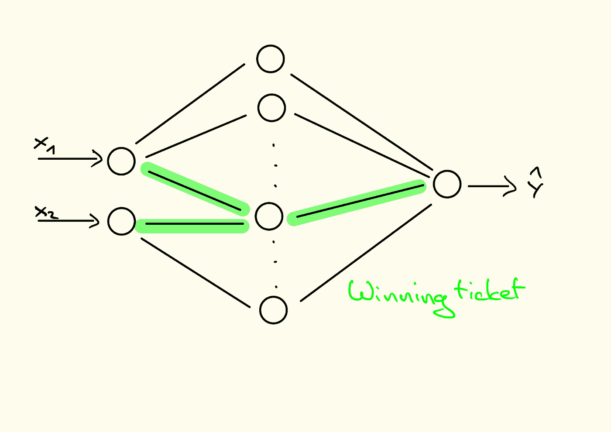
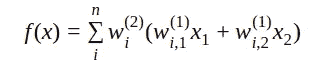
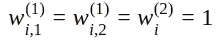
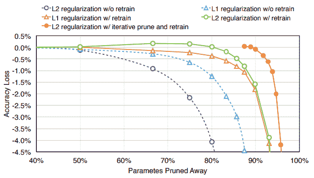
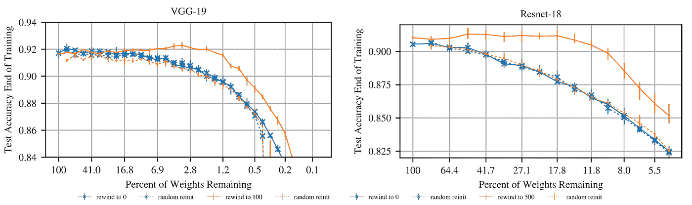

# 彩票的现状

> 原文：<https://towardsdatascience.com/state-of-the-lottery-e705984e4df?source=collection_archive---------27----------------------->

**旁注——卢卡斯·加尔克**

> 在这一期中，我们为您带来一篇由 [**MTank**](http://www.themtank.com) 团队成员撰写的文章，该文章研究了降低神经网络训练成本的技术。通过在训练早期识别子网络的学习强度，即**挑选一个获胜的子网络**，我们可能会降低现代深度学习研究人员&从业者的计算成本。

除了我们的连载博客， [**艾酒厂**](https://medium.com/mlreview/ai-distillery-part-1-a-birds-eye-view-of-ai-research-cf934f20ef6b)&[**杯具意识**](/from-cups-to-consciousness-part-1-how-are-cups-related-to-intelligence-8b7c701fa197)’之外，我们还会偶尔发布一些&材料作为单机版或短期系列。说到题外话，与我们的其他出版物相比，这些材料的性质有些模糊，我们选择称之为“旁注”。

> “旁注”就是这样。我们认为我们的读者可能会喜欢的与 [MTank](http://www.themtank.org) & AI 相关的辅助作品。格式会有所不同，但可能包含所有内容。把它看作是额外项目、会谈&想法的总称。

## 介绍

神经网络变得越来越大，使用多达数十亿个参数。研究人员开始量化在云计算平台上训练这些大规模模型的努力，以$$$的数量，甚至以吨的碳排放量。通常的理解是，过度参数化的网络容量更大，但也更容易过度拟合训练数据。最近的研究表明，过度参数化实际上起到了正则化的作用，并提高了泛化性能[Arora et al. 2018]。

> 然而，在训练之后，这种大规模模型的大部分可以被修剪掉，而不会损害模型的准确性。修剪技术可以追溯到【LeCun 1990】关于**最佳脑损伤**。修剪的动机是减少模型大小，从而减少内存需求、推理时间和能量消耗。一种修剪技术是*幅度修剪*，它修剪那些具有最低幅度的权重，因此对网络输出的影响最低【韩等，2015】。

在**彩票假说(LTH)**【Frankle&Carbin 2019】之前，普遍的经验是修剪过的架构更难从头开始训练。现在，LTH 声称，某些子网可以被训练得与原始的、未经训练的网络的准确度相当，甚至更好。**关键的想法是迭代地训练一个网络，修剪它的参数，直到只剩下一小部分参数。**在每次迭代中，幸存的权重被重置为它们的初始化。然后可以在可比较的时间内训练产生的子网，以匹配原始网络将达到的精度。这些子网被称为*中奖彩票。*

> ***彩票假设。*** *随机初始化的密集神经网络包含一个子网络，该子网络被初始化为:当被隔离训练时，它可以在最多相同次数的迭代训练后匹配原始网络的测试精度。[Frankle & Carbin 2019]*

> 在 LTH 的论文中，作者发现中奖彩票的大小只有密集彩票的 10-20%。有了更多的剩余参数，获胜的门票甚至可以达到比原始网络更高的测试精度。

为什么这很重要？LTH 建议，如果我们能够在训练过程的早期识别出获胜的门票，就没有必要训练一个完整的模型。如果这是可能的，它可以为我们节省美元和吨的碳排放。

在下文中，我们将首先考虑一个思维实验，以获得关于中奖的直觉。随后，我们将概述如何在 LTH 报纸中识别中奖彩票。最后，我们将经历彩票假说的一些后续工作。

## 一个最小的例子:两个输入的和

为了直观地了解 LTH，让我们考虑一下计算两个输入之和 y = x0 + x1 的简单任务。我们想用一个两层的线性神经网络来逼近真实值“y ”,这个网络有 n 个隐藏单元，没有偏差。

对于人类来说，两个输入之和的中奖票很容易确定。这样的中奖票将会是

对于一些剩余权重为零的“I”。这将确保在第一层计算两个输入的实际和，并通过第二层传递。

因此，这张成功的入场券甚至可以推广到培训数据领域之外。无论我们选择的隐藏层大小‘n’有多大，我们的中奖票都将 ***由三个非零权重*** 组成。因此，我们可以在不损害准确性的情况下，删除除这三个权重之外的所有权重。当我们开始使用仅由这三个非零参数组成的掩码进行训练时，网络最终会学习到正确的权重。

## 如何识别中奖票

为了证明中奖彩票的存在，弗兰克尔和卡宾采用了以下程序:

1.  **用参数** θ₀ **以及设置为全 1 的掩码 m 初始化模型**
2.  **为 j 次迭代训练屏蔽模型**
3.  **删除最低幅度权重，并相应地更新掩码 m**
4.  **将**θ**【m】复位到它们在** θ₀ **中的值，将所有其他参数固定为零。**
5.  **从步骤 2 开始重复，除非满足稀疏性或验证准确性的停止标准(迭代修剪)**

> 结果是子网(由掩码 m 给出)及其初始化，这可以执行多一次训练。在他们对图像分类的实验中，作者将中奖彩票的准确性与整个模型和随机彩票进行了比较。随机票证共享相同的结构，但随机重新初始化。主要的结果是获胜的票始终比随机的票导致更高的分数，并且还可以匹配甚至优于完整的模型。

因此，随机彩票与中奖彩票具有相同的结构，但中奖彩票会产生更高的分数。这意味着初始化值对于中奖票的成功非常重要。当我们有更多的参数时，我们得到更多的初始值。我们还获得了更多的可能性来将好卷的子集组合成稀疏的子网。作者推测，优化器会特别关注一组已经接受了良好初始化的参数。可能的组合越多，优化器就越容易找到初始化良好的参数的子集。

**迭代幅度修剪**

Figure 1: Taken from [Han et al. 2015]. Comparison of different pruning techniques and regularization methods. L2 reg. is better than L1 reg. as soon as the parameters are retrained. Iterative pruning outperforms all other methods.

LTH 论文的作者反复修剪和重新训练他们的模型。这是基于[韩等人，2015]的结果。Han 等人比较了一次性修剪、修剪和再训练以及使用不同正则化项的迭代修剪和再训练(见图 1)。主要结果是迭代修剪效果最好。 **Frankle 和 Carbin 观察到，与一次性修剪相比，使用迭代修剪可以识别更小的中奖票。**

> 为了验证彩票假说，弗兰克尔&卡宾应该找到与原始网络的准确性相匹配的子网络，当*单独训练*时。这意味着他们不能利用完整模型从以前的培训中获益。因此，他们通过将(非修剪的)权重值重置为初始化时的值来修改训练和修剪过程。

## 全局修剪与局部修剪

在修剪期间，可以在每一层修剪到期望的权重分数，或者将所有层的权重放入一个池中并进行全局修剪。在 LTH 的论文中，作者对 LeNet 和 Conv-2/4/6 使用了*局部剪枝*，而对更深层次的模型:Resnet-18 和 VGG-19 使用了*全局剪枝*。这个想法是，在更深的模型中，一些层的权重可能更重要，以保持[Morcos et al. 2019]。在视觉上，这些可以是充当特征检测器的第一层，并且可能不会像后面的层那样接收相同数量的修剪单元，后面的层可能具有更多冗余连接。

## 后期重置

学习率热身可以帮助找到更深入模型的中奖门票【Frankle & Carbin 2019】。在后续工作中，作者引入了一种不同的技术来处理更深层次的模型:后期重置[Frankle et al. 2019]。对于后期重置，权重不是重置为第一次训练迭代之前的值，而是重置为训练过程中非常早期的一些值(大约一到五次迭代之后)。当使用后期重置时，学习率预热不再必要。

## 赢得图像域之外的门票

彩票现象是使用前馈卷积网络进行监督图像分类的人工产物，还是会推广到其他领域？[Yu et al. 2019]可以表明，在强化学习和自然语言处理架构中也存在中奖票。他们的实验包括经典控制问题、雅达利游戏、LSTMs 和变形金刚。他们可以找到所有这些架构的中奖门票，这表明 LTH 现象并不局限于监督图像分类，而是可能是深度神经网络的一个普遍特征。

## 获奖入场券可以跨任务转移

> 到目前为止，识别中奖门票的程序仍然很昂贵，因为它涉及几个完整的培训通行证。我们怎么还能从中奖的门票中获益？我们能否将它们转移到其他任务中，以便只需要为目标任务学习一小部分权重？

两篇论文已经解决了这个问题:[Mehta 2019]和[Morcos et al. 2019]。这两项工作都停留在图像领域，并在不同的对象识别任务之间转移获奖门票。因为[Mehta 2019]打算充分利用源任务。在这种情况下，他将延迟重置扩展到源任务训练期间的任何地方。

他的结果表明**只要至少全连接层被微调，中奖彩票是可以转让的。**在迁移学习场景中，微调最终的全连接层是强制性的，因为不同的任务有不同的类。

[Morcos et al. 2019]也对图像域内的迁移学习进行了实验。该研究考虑了 CIFAR-10/100、FashionMNIST 和 MNIST 上的 VGG19 和 ResNet50 架构，同时还改变了优化器(SGD 和 Adam)。

他们的结果表明，赢得入场券**并不特定于某个优化器。**例如，通过 SGD 训练获得的中奖彩票可用于初始化 Adam 训练的砝码。关于跨任务的迁移，作者比较了从其他数据集获得的中奖票和从同一数据集获得的中奖票。

**令人惊讶的是，从其他数据集获得的门票几乎与从同一数据集获得的门票一样好。他们的关键结果是，更大的数据集产生了更多通用的中奖彩票。**

## 中奖票是什么样子的？

[周等 2019]对中奖彩票的性质进行了细致的调查。它们表明**初始化值的一个至关重要的元素是它们的符号。**初始化值的实际大小似乎不太重要。这可能会给优化者一个线索，让他们努力将消极的归因调整为积极的归因，反之亦然。

他们进一步假设将某些权重屏蔽为零类似于执行训练迭代。某个特征将与当前分类任务无关的信息与进行实际的训练迭代一样珍贵。

在分析了不同的剪枝和变更标准后，作者进一步声称**当初始化接近它们的最终形式时，稀疏子网工作得特别好。在这个假设的基础上，作者更进一步发展了超级掩码的概念，超级掩码仅仅是根本没有经过训练的掩码和值的初始化。**

**有趣的是，这些超级任务产生的准确度分数远远好于偶然性。**

## 修剪和剔除

Dropout 是一种众所周知的正则化方法，它通过将权重或隐藏单元的随机分数设置为零来鼓励训练期间的稀疏性容限。虽然丢弃概率是均匀随机绘制的，但修剪会专门移除低幅度的权重。[Gomez et al. 2019]追求改善辍学和修剪的交互作用的想法。这个想法是，丢失可以针对可能被删除的单元，即那些具有低幅度的单元。

**在本文中，作者不仅分析了标准的单位丢失，还分析了权重丢失(又名 DropConnect ),这更接近于所采用的剪枝技术。**

## 移动修剪

赢得入场券的圣杯是在训练过程中尽早识别它们。[Dettmers & Zettlemoyer 2019]提出了一种无需昂贵的再培训就能识别中奖门票的技术。他们利用梯度的动量来确定训练过程中权重变化的速度，以及他们可以降低训练误差的一致性。然后，在每个训练时期之后，它们修剪那些不能一致地减少误差的权重，并且在剩余的参数之间动态地重新分配它们的值。

在他们的实验中，他们所谓的稀疏动量技术优于所有被认为是稀疏学习的基线，甚至可以与密集模型竞争，所有这些都在一次训练迭代中完成。

## 限制

一些研究挑战**彩票假说**:【Gale et al . 2019】用 transformers 进行机器翻译的稀疏神经网络与 ResNet-50 进行图像分类的大规模比较。一方面，他们的结果证实了朴素量级剪枝[Han 2015]是比较中最好的剪枝技术。另一方面，他们报告说，LTH 的方法无法为这些更深层次的架构找到制胜的入场券。[Liu et al. 2018]表明，通过精心选择的学习率，随机门票可以与“中奖门票”一样好地执行，这就质疑了初始化的价值。然而，这两部作品都还没有使用后期重置[Frankle et al. 2019]，这有助于找到获胜的门票，尤其是在深度架构中。

## **结论**

彩票假说指出，密集神经网络包含稀疏子网络，这些子网络可以被隔离训练以匹配密集网络的性能。这种现象为过度参数化提供了一种新的解释，过度参数化导致彩票开奖次数成倍增加。为了从它们的存在中受益，人们需要找到方法来尽早识别中奖彩票，而根本不需要训练整个模型。一些方法已经解决了这一问题，而其他方法则专注于使神经网络更易于后期修剪的训练方法。

> 如果我们能够尽早识别出成功的入场券或将它们转移到其他领域，我们将节省大量的培训工作。赢得的入场券有时甚至胜过原来的网络，这可能会对我们理解和设计架构及其初始化方案产生影响。

## 奖励材料

*   一个干净且通用的 pytorch 实现(迭代)幅度修剪，以我们的[思想实验](http://www.lpag.de/blog/2019/the-lottery-ticket-hypothesis/#thought-experiment-sum-of-two-inputs)为特色。

## 参考

1.  阿罗拉、桑吉夫、纳达夫·科恩和埃拉德·哈赞。[“深度网络的优化:过度参数化的隐式加速”ICML 2018 年奥运会。](https://arxiv.org/abs/1802.06509)
2.  放大图片作者:LeCun，Yann，John S. Denker 和 Sara A. Solla .[“最优脑残”](http://papers.nips.cc/paper/250-optimal-brain-damage.pdf)神经信息处理系统进展，第 598–605 页。1990.
3.  韩，宋，等.【高效神经网络的权值和连接学习】 NeurIPS 2015。
4.  弗兰克、乔纳森和迈克尔·卡宾。彩票假说:寻找稀疏的、可训练的神经网络 ICLR 2019。
5.  Morcos，Ari S .，et al. [“一张彩票赢所有人:在数据集和优化器中推广彩票初始化”arXiv 预印本 arXiv:1906.02773 (2019)。](https://arxiv.org/abs/1906.02773)
6.  等着，[《彩票规模假说》](https://arxiv.org/abs/1903.01611) arXiv 预印本 arXiv:1903.01611 (2019)。
7.  余，郝楠，等[“用奖励和多种语言玩彩票:RL 和 NLP 中的彩票”](https://arxiv.org/abs/1906.02768) arXiv 预印本 arXiv:1906.02768 (2019)。
8.  梅塔，拉胡尔。[“通过中奖彩票实现稀疏迁移学习”](https://arxiv.org/abs/1905.07785) arXiv 预印本 arXiv:1905.07785 (2019)。
9.  周，海蒂，贾妮斯兰，刘莎妮和杰森约辛斯基。[《解构彩票:零、符号和超级面具》](https://arxiv.org/abs/1905.01067) arXiv 预印本 arXiv:1905.01067 (2019)。
10.  Gomez，Aidan N .等人[“使用定向辍学学习稀疏网络”](https://arxiv.org/abs/1905.13678) arXiv 预印本 arXiv:1905.13678 (2019)。
11.  我是泽特勒莫耶。[《从零开始的稀疏网络:更快的训练而不损失性能》](https://arxiv.org/abs/1907.04840) arXiv 预印本 arXiv:1907.04840 (2019)。
12.  盖尔，特雷弗，埃里希·埃尔森和萨拉·胡克。[“深度神经网络中的稀疏状态。”](https://arxiv.org/abs/1902.09574) arXiv 预印本 arXiv:1902.09574 (2019)。
13.  刘、庄、孙明杰、周廷辉、、特雷弗·达雷尔。[“重新思考网络修剪的价值”](https://arxiv.org/abs/1810.05270) arXiv 预印本 arXiv:1810.05270 (2018)。