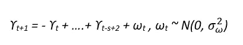

# 时间序列预测的状态空间模型和卡尔曼滤波

> 原文：<https://towardsdatascience.com/state-space-model-and-kalman-filter-for-time-series-prediction-basic-structural-dynamic-linear-2421d7b49fa6?source=collection_archive---------1----------------------->

## 基本结构模型&动态线性模型

## 利用金融数据进行时间序列预测


Image by author

[https://sarit-maitra.medium.com/membership](https://sarit-maitra.medium.com/membership)

T **ime** 系列由四大部分组成:季节变动(SV)、趋势变动(TV)、周期变动(CV)、随机变动(RV)。这里，我们将使用 ***状态空间模型*** 对单变量时间序列数据进行预测分析。该模型具有连续的隐藏和观察状态。

# 状态空间模型

让我们使用斯伦贝谢有限公司(SLB)自 1986 年以来的历史数据。


## 线形图

```
df1 = ts(df1$Open, start= c(1986,1), end = c(2019,12), frequency = 12)
xyplot(df1, ylab = “Price (US $)”, main = “Time series plot for Schlumberger price”)
```

这里，为了便于计算，数据是按月频率(12 个月)计算的。


线形图显示价格始终在波动，波动性很大。

## 密度和 Q-Q 图

下面由密度和正常 QQ 图组成的分布图清楚地表明数据分布不正常。

```
par(mfrow=c(2,1)) # set up the graphics 
hist(df1, prob=TRUE, 12) # histogram 
lines(density(df1)) # density for details 
qqnorm(df1) # normal Q-Q plot 
qqline(df1)
```


## 描述性统计


# 平稳性检验

让我们对原始数据进行平稳性检验(ADF，菲利普-佩龙& KPSS)。

```
stationary.test(df1, method = “adf”)
stationary.test(df1, method = “pp”) # same as pp.test(x)
stationary.test(df1, method = “kpss”)Augmented Dickey-Fuller Test 
alternative: stationary 

Type 1: no drift no trend 
     lag   ADF p.value
[1,]   0 0.843   0.887
[2,]   1 0.886   0.899
[3,]   2 0.937   0.906
[4,]   3 0.924   0.904
[5,]   4 0.864   0.893
[6,]   5 1.024   0.917
Type 2: with drift no trend 
     lag     ADF p.value
[1,]   0 -0.1706   0.936
[2,]   1 -0.0728   0.950
[3,]   2 -0.0496   0.952
[4,]   3 -0.0435   0.952
[5,]   4 -0.0883   0.947
[6,]   5  0.3066   0.978
Type 3: with drift and trend 
     lag   ADF p.value
[1,]   0 -2.84   0.224
[2,]   1 -2.83   0.228
[3,]   2 -2.72   0.272
[4,]   3 -2.79   0.242
[5,]   4 -2.96   0.172
[6,]   5 -2.96   0.173
---- 
Note: in fact, p.value = 0.01 means p.value <= 0.01 
Phillips-Perron Unit Root Test 
alternative: stationary 

Type 1: no drift no trend 
 lag Z_rho p.value
   5 0.343   0.768
----- 
 Type 2: with drift no trend 
 lag   Z_rho p.value
   5 -0.0692   0.953
----- 
 Type 3: with drift and trend 
 lag Z_rho p.value
   5 -11.6   0.386
--------------- 
Note: p-value = 0.01 means p.value <= 0.01 
KPSS Unit Root Test 
alternative: nonstationary 

Type 1: no drift no trend 
 lag  stat p.value
   4 0.261     0.1
----- 
 Type 2: with drift no trend 
 lag  stat p.value
   4 0.367  0.0914
----- 
 Type 1: with drift and trend 
 lag  stat p.value
   4 0.123  0.0924
----------- 
Note: p.value = 0.01 means p.value <= 0.01 
    : p.value = 0.10 means p.value >= 0.10
```

## 数据标准化

我已经使用均值和标准差对数据集进行了归一化。戴夫。


# 自相关函数

## 确定不同时间滞后的相关性是否为 0

稳定=高斯噪声，一个趋势=高斯噪声的累积和。

这里，我们将通过查看每个信号的自相关函数来检查每个信号的平稳特性。对于平稳信号，我们期望 ACF 在每个时间延迟(τ)达到 0，因为我们期望不依赖于时间。


我们可以看到，稳态信号很少滞后于 ACF 的 CI。这种趋势导致几乎所有的滞后都超过了置信区间。可以断定 ACF 信号是稳定的。但是，趋势信号不是静止的。平稳序列在平均水平附近具有更好的方差，峰值是原始序列中干预的证据。

我们将进一步分解时间序列，包括水平、趋势、季节性和噪声成分的组合。分解有助于在分析和预测过程中更好地理解问题。

# 分解时间序列

我们可以应用差分数据或对数转换数据来消除趋势和季节性。如果我们只关心预测，这样的过程也许不是缺点。然而，在统计学和计量经济学应用的许多背景下，这一组成部分的知识具有潜在的重要性。趋势和季节的估计可以通过最大化残差均方差从差分序列中恢复，但这不如直接建模组件有吸引力。我们必须记住，实数列从来都不是稳定的。

这里，我们将使用时间序列的简单移动平均平滑方法来估计趋势分量。

```
df1SMA8 <- SMA(df1, n=8) # smoothing with moving average 8
plot.ts(df1SMA8)
```


```
df1Comp <- decompose(df1SMA8) # decomposing
plot(df1Comp, yax.flip=TRUE)
```


该图显示了原始时间序列(顶部)、估计趋势分量(从顶部数第二个)、估计季节分量(从顶部数第三个)和估计不规则分量(底部)。

我们看到，估计趋势分量显示从 1997 年的约 9 小幅下降到 1999 年的约 7，随后从那时起稳步上升到 2019 年的约 12。

## 季节性调整

```
df1.Comp.seasonal <- sapply(df1Comp$seasonal, nchar)
df1SeasonAdj <- df1 — df1.Comp.seasonal
plot.ts(df1SeasonAdj*)*
```


我们也将探讨卡尔曼滤波器在预测之前的系列滤波和平滑的目的。

## 结构模型

结构时间序列模型是(单变量)时间序列的(线性高斯)状态空间模型。当考虑状态空间架构时，通常我们有兴趣考虑三个主要方面:

*   *预测，即预测状态*的后续值
*   *滤波，从过去和当前的观察值中估计状态的当前值*
*   *平滑，即在给定观察值的情况下估计状态的过去值*

我们将使用卡尔曼滤波器来进行各种类型的推断。

> 过滤有助于我们在每次观察到来时更新对系统的了解。平滑有助于我们根据整个样本来估计感兴趣的数量。

# 基本结构模型(BSM)

结构模式的优点是使用简单，非常可靠。它给出了最大似然法拟合时间序列结构模型的主要工具。

结构化时间序列状态空间模型，基于将序列分解为若干部分。它们由一组误差方差指定，其中一些方差可能为零。我们将使用一个基本的结构模型来拟合随机水平模型进行预测。构成状态空间模型的两个主要部分是(1)观察到的数据和(2)未观察到的状态。

最简单的模型是局部级别模型，它有一个基础级别 t，它通过以下方式发展:


我们需要看到观察结果，因为系统噪声对我们隐藏了状态。观察值是当前状态和一些称为测量噪声的附加随机变化的线性组合。观察结果是:


它实际上是一个 ARIMA(0，1，1)模型，但是对参数集有限制。这是随机变化的水平*(随机游走)*用噪声观察到的。

局部线性趋势模型具有相同的测量方程，但是对于 t 具有动态时变斜率，由下式给出


有三个方差参数。这里εt，ξt，ζt 是独立的高斯白噪声过程。基本结构模型是一个带有额外季节性成分的局部趋势模型。因此，测量公式为:


其中γt 是具有动态的季节性分量



## 训练/测试分割


## 模型拟合和预测

最好的做法是检查结构化过程的收敛性。与任何结构化过程一样，我们需要有适当的初始起点，以确保算法将收敛到正确的最大值。


```
autoplot(training, series=”Training data”) + autolayer(fitted(train, h=12), series=”12-step fitted values”)
```


## 交互效度分析

交叉验证是时间序列分析的一个重要步骤。

*   将模型拟合到数据 y1，.。。，yt
*   生成提前一步的预测-yt+1
*   计算预测误差 e∫t+1 = yt+1yˇt+1
*   对于 t = m，重复步骤 1–3。。。，n-1，其中 m 是适合模型的最小观察值
*   根据 e∫m+1，计算预测 MSE。。。，e *

残差 Ljung-Box 检验的 p 值为 0.2131015 >显著水平(0.05)；因此，不建议使用交叉验证的结果，因为该模型明显不符合数据。


# 基础诊断学

我们进行任何统计分析的第一个诊断是检查我们的残差是否符合我们假设的误差结构。在单变量状态空间模型中，我们有两种类型的误差:过程误差，wt，和观察误差，vt。它们不应该有时间趋势。

# 模型.残差

vt 是 t 时刻的数据与预测数据之差:vt = yt Zxt a

在状态空间模型中，xt 是随机的，模型残差是随机变量。yt 也是随机的，尽管不像 xt 那样经常被观察到。模型残差随机变量为:Vt = Yt ZXt a

Vt 的无条件均值和方差为 0，R

```
checkresiduals(train)
```


# 卡尔曼滤波器

卡尔曼滤波算法使用一系列随时间观察到的测量值，包含噪声和其他不准确性，并产生未知变量的估计值。这种估计往往比仅基于单个测量结果更准确。使用卡尔曼滤波器并不假设误差是高斯的；然而，在所有误差都是高斯的特殊情况下，滤波器产生精确的条件概率估计。

> 卡尔曼滤波是一种寻找过程估计值的方法。过滤来自于减少或“过滤掉”不想要的变量的原始用法，在我们的例子中是估计误差。

```
sm <- tsSmooth(train)
plot(df1)
lines(sm[,1],col=’blue’)
lines(fitted(train)[,1],col=’red’)# Seasonally adjusted data
training.sa <- df1 — sm[, 1]
lines(training.sa, col=’black’)
legend(“topleft”,col=c(‘blue’, ’red’, ‘black’), lty=1,
 legend=c(“Filtered level”, ”Smoothed level”)
```


```
x <- training
miss <- sample(1:length(x), 12)
x[miss] <- NA
estim <- sm[,1] + sm[, 2]
plot(x, ylim=range(df1))
points(time(x)[miss], estim[miss], col = ’red’, pch = 1)
points(time(x)[miss], df1[miss], col = ’blue’, pch = 1)
legend(“topleft”, pch = 1, col = c(2,1), legend = c(“Estimate”, ”Actual”))
```


```
plot(sm, main = “”)
mtext(text = “decomposition of the basic structural”, side = 3, adj = 0, line = 1)
```


## 预言；预测；预告

```
sm %>%
 forecast(h=12) %>%
 autoplot() + autolayer(testing)
```

下图显示了预测的斯伦贝谢数据以及 50%和 90%的概率区间。


正如我们所看到的，BSM 模型能够很好地提取季节成分。*我们可以在这里试验基于 SMA 的分解(如前所示),并比较预测准确性。*

# 带有卡尔曼滤波器的动态线性模型

dlm 模型是状态空间模型的特殊情况，其中状态和观察分量的误差是正态分布的。这里，卡尔曼滤波器将用于:

*   状态向量的过滤值。
*   状态向量的平滑值，
*   预测提供了未来观测值和状态的均值和方差。

我们必须在拟合 dlm 模型之前定义参数。这些参数是 V，W(分别是测量和状态方程的协方差矩阵)，FF 和 GG(分别是测量方程矩阵和转移矩阵)，以及 m0，C0(状态向量的先验均值和协方差矩阵)。

但是，在这里，我们通过编写一个如下所示的小函数来启动 dlm 模型:


我考虑了具有 dlm、多项式 DLM(局部线性趋势是二阶多项式 DLM)和季节成分 12 的局部水平模型。检查 MLE 过程的收敛性是一个好的实践，而不是最佳实践的一部分。

卡尔曼滤波器和平滑器也被应用。


我们可以看到，dlm 模型的预测精度相当不错。过滤器和平滑线在系列中几乎是一起移动的，彼此没有太大区别。这里忽略了季节因素。预测序列和原始序列的线非常接近。

状态空间模型与时间序列分析的一个很好的例子可以在这里找到[](http://gradientdescending.com/state-space-models-for-time-series-analysis-and-the-dlm-package/)*。*

# *摘要*

*状态空间模型有多种风格和处理大量时间序列模型的灵活方式，并提供了处理缺失值、似然估计、平滑、预测等的框架。单变量和多变量数据都可以用来拟合状态空间模型。在本练习中，我们展示了一个基本级别的模型。*

****我可以到达****[***这里的***](https://www.linkedin.com/in/saritmaitra/) *。***

***参考:***

1.  **德宾，j .，&库普曼，S. J. (2012)。用状态空间方法进行时间序列分析。牛津大学出版社。**
2.  ***Giovanni Petris&Sonia Petrone(2011)，R 中的状态空间模型，统计软件杂志***
3.  **G . Petris、S . Petrone 和 P . Campagnoli(2009 年)。带有 R. Springer 的动态线性模型**
4.  ***Hyndman，R. J .，& Athanasopoulos，G. (2018)。预测:原理与实践。OTexts。***