# 时间序列分析的平稳性

> 原文：<https://towardsdatascience.com/stationarity-in-time-series-analysis-90c94f27322?source=collection_archive---------1----------------------->

## 平稳性的概念和类型综述

这篇文章旨在提供一个简明而全面的综述，介绍平稳性的概念，以及在处理时间序列分析的学术文献中定义的不同类型的平稳性。

未来的帖子将致力于提供类似的简要概述，介绍时间序列数据中非平稳性的[检测，以及将非平稳时间序列转换为平稳时间序列的不同方法。](/detecting-stationarity-in-time-series-data-d29e0a21e638)

# 为什么平稳性很重要？

在深入研究平稳性的正式定义及其相关概念之前，有必要考虑一下为什么平稳性的概念在时间序列分析及其各种应用中变得如此重要。

从最直观的意义上来说，平稳性意味着生成时间序列的过程的统计特性不会随时间而改变。这并不意味着这个系列不会随着时间而改变，只是它改变的*方式*本身不会随着时间而改变。因此，代数等值可能是一个线性函数，而不是一个常数；线性函数的值随着𝒙的增长而变化，但是它变化的方式保持不变——它有一个恒定的斜率；一个能捕捉到变化率的值。

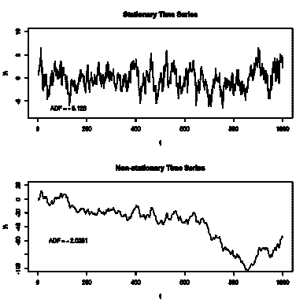

Figure 1: Time series generated by a stationary (top) and a non-stationary (bottom) processes.

为什么这很重要？首先，因为平稳过程更容易分析。没有生成时间序列数据的过程的正式定义(还没有；它们被称为随机过程，我们一会儿就会讲到)，已经很清楚，平稳过程是一个更广泛的现实可能模型家族的一个子类。这个子类更容易建模和研究。上面的非正式定义也暗示了这样的过程应该是可以预测的，因为它们变化的方式是可以预测的。

虽然这听起来有点像路灯效应，简单的理论或模型应该变得更加突出，但这实际上是科学中相当常见的模式，而且有充分的理由。在许多情况下，简单的模型会令人惊讶地有用，要么作为构建更复杂模型的基础，要么作为复杂现象的有用近似。事实证明，这也适用于平稳过程。

由于这些性质，平稳性已经成为时间序列分析中许多实践和工具的共同假设。其中包括趋势估计、预测和因果推断等。

因此，平稳性的重要性的最后一个原因是它在时间序列分析中的普遍性，使得理解、检测和建模的能力对于时间序列分析中许多重要工具和程序的应用是必要的。事实上，对于许多涉及时间序列的情况，您会发现您必须能够确定数据是否是由平稳过程生成的，并可能对其进行转换，使其具有由这种过程生成的样本的属性。

如果你想处理时间序列数据，希望我已经说服你理解平稳性是重要的，我们可以更正式地介绍这个主题。

# 随机过程的形式定义

在介绍更正式的平稳性概念之前，需要一些先驱性的定义。本节旨在提供进一步阅读所需的时间序列分析和随机过程理论的基本概念的快速概述。如果你熟悉他们，请随意[跳过](#6f65)。

**时间序列:**通常，时间序列 *(x* ₁ *，…，xₑ)* 被认为是从时间 *t=1* 到时间 *t=e* 在连续的等间距 [⁶](#0970) 时间点所取的一系列实数值。

**滞后**:对于某个特定的时间点 *r* ，观测值 *x* ᵣ₋ᵢ ( *i* 周期回退)称为 *x* ᵣ.的 *i* -th *滞后*将另一个时间序列 *X* 后移 *i* 时间步长产生的一个时间序列 *Y* 有时也称为 *X 的*I*th*滞后*，*或 *X* 的 *i 滞后*。这种变换既称为*后移算子*，通常表示为 *B* (∙)，也称为*滞后算子*，通常表示为*L*(*∙*)；于是，*l*(*x*ᵣ)*= x*ᵣ₋₁*。*经营者的权力定义为:lⁱ(*x*ᵣ】*= x*ᵣ₋ᵢ.

## 随机过程

时间序列数据分析的一种常见方法是将观察到的时间序列视为*随机过程*的*实现*的一部分。在定义随机过程之前，需要两个粗略的定义。

**概率空间:** A [概率空间](https://en.wikipedia.org/wiki/Probability_space)是三元组*(ω，F，P)* ，其中
(I)*ω*是非空集，称为[样本空间](https://en.wikipedia.org/wiki/Sample_space)。
(ii) *F* 是ω的子集的[*-代数*](https://en.wikipedia.org/wiki/Sigma-algebra)*，即关于ω的可数并闭和补的子集族。
(iii) *P* 是为 *F* 的所有成员定义的[概率测度](https://en.wikipedia.org/wiki/Probability_measure)。*

***随机变量:** A *实* [*随机变量*](https://en.wikipedia.org/wiki/Random_variable) 或*实随机变量*在*(ω，f，P)* 上是一个函数*x:ω→*ℝ，使得任意区间 *(-∞，a】【t40)的逆像属于*f*；即[可测功能](https://en.wikipedia.org/wiki/Measurable_function)。**

*我们现在可以定义什么是随机过程。*

***随机过程:**一个*实随机过程*是一族实随机变量𝑿=*{ x*ᵢ*(ω)；i* ∈ *T}* ，都定义在同一个概率空间上*(ω，F，P)* 。集合 *T* 称为流程的*索引集合*。如果 *T* ⊂ℤ，那么这个过程叫做*离散随机过程*。如果 *T* 是ℝ的一个区间，那么这个过程叫做*连续随机过程*。*

***有限维分布:**对于有限整数集合 T *={t₁，…，tn}* ，𝑿= *{X* ᵢ *(ω)的联合分布函数；i* ∈ *T}* 定义如下*

*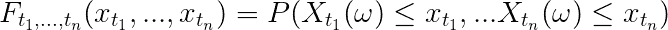*

*Equation 1: The joint distribution function.*

*对于随机过程，𝑿通常也表示为:*

*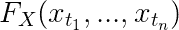*

*随机过程的*有限维分布*于是被定义为任意大小 *n* 的所有此类有限整数集 *T* 的所有此类联合分布函数的集合。因此，对于离散过程，集合为:*

*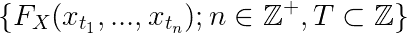*

*Equation 2: Finite dimensional distribution for a discrete stochastic process.*

*直观地说，这代表了流程在有限维向量空间上的投影(在这种情况下，是一组有限的时间点)。*

# *平稳性的定义*

*有了随机过程的基本定义，我们现在可以引入平稳性的概念。*

*直观上，*平稳性*是指过程的统计性质不随时间变化。然而，多年来在计量经济学文献中已经提出了几种不同的平稳性概念。*

*在深入这些定义之前，要做的一个重要区分是**平稳性——任何种类——是随机过程**的属性，而**不是它的任何有限或无限实现的**(即值的时间序列)。*

## *强平稳性*

*[*强平稳性*](https://en.wikipedia.org/wiki/Stationary_process) 要求随机过程的有限维分布具有平移不变性(在时间上)。这意味着随机过程的随机变量的有限子序列的分布在我们沿着时间索引轴移动它时保持不变。比如所有的 [i.i.d.](https://en.wikipedia.org/wiki/Independent_and_identically_distributed_random_variables) 随机过程都是平稳的。*

*形式上，离散随机过程𝑿=*{ x*ᵢ*；i∈ℤ}* 是否*静止*如果*

*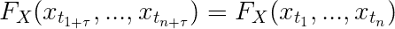*

*Equation 3: The stationarity condition.*

*对于 *T* ⊂ *ℤ* 与 *n* ∈ℕ与任意τ∈ *ℤ* 。[考克斯&米勒，1965]对于连续随机过程来说条件是类似的，用 *T* ⊂ℝ、 *n* ∈ℕ和任何一个τ∈ℝ 代替*。**

*这是平稳性最常见的定义，通常简称为*平稳性。*有时也被称为*严格意义上的平稳性*或*强意义上的平稳性*。*

> ***注:**该定义不假设构成随机过程的随机变量的任意时刻的[存在/有限性](https://www.statlect.com/fundamentals-of-probability/moments)！*

## *弱平稳性*

*[*弱平稳性*](https://en.wikipedia.org/wiki/Stationary_process#Weak_or_wide-sense_stationarity) 只需要一阶矩和交叉矩(自协方差)的平移不变性(在时间上)。这意味着该过程在所有时间点都具有相同的均值，并且任意两个时间点的值 *t* 和*t k*之间的协方差仅取决于两个时间点之间的差值 *k* ，而不取决于沿时间轴的点的位置。*

*形式上，流程*{ x*ᵢ*；i∈ℤ}* 是*弱平稳*如果:
1。 *x* ᵢ的一阶矩不变；即 *∀t，e【x*ᵢ*]=𝜇*t23】2。对于所有 t， *x* ᵢ的二阶矩是有限的；即 *∀t，e【x*ᵢ*<∞*(这其中当然也隐含着*e[(x*ᵢ*-𝜇)]<∞*；即对于所有的 *t* )
3，方差是有限的。交叉力矩——即自协方差——仅取决于差值*u-v*；即 *∀u,v,a、cov(xᵤ、xᵥ)=cov(xᵤ₊ₐ、xᵥ₊ₐ)**

*第三个条件意味着每个滞后𝜏*∑*ℕ都有一个与之相关联的恒定协方差值:*

*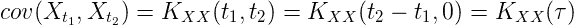*

*注意，这直接意味着过程的方差也是常数，因为我们得到所有 t *∈* ℕ的方差*

*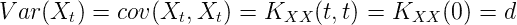*

*这为弱平稳过程描绘了一幅特殊的图画，即那些具有恒定均值和方差的过程。它们的属性与下面图 2 中的对应属性形成了鲜明的对比。*

*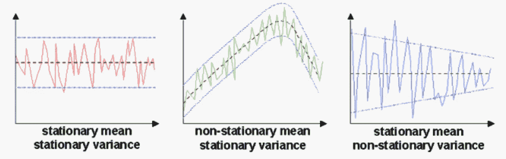*

*Figure 2: Constancy in mean and variance.*

*弱平稳的其他俗称有*广义平稳、* *弱意义平稳*、*协方差平稳*和*二阶平稳* 。令人困惑的是，根据上下文，它有时也被简单地称为*平稳性*(参见【Boshnakov，2011】中的例子)；例如，在地理统计文献中，这是平稳性的主要概念。[迈尔斯，1989 年]*

> ***注意:**强平稳性并不意味着弱平稳性，后者也不意味着前者(见例[此处](https://stats.stackexchange.com/questions/282635/why-is-weak-stationarity-equivalent-to-strict-stationarity-only-when-distributio))！高斯过程是一个例外，对于它来说，弱平稳性意味着强平稳性。
> 强平稳性并不意味着弱平稳性的原因是，它并不意味着过程必然有一个有限的二阶矩；例如，具有标准柯西分布的 IID 过程是严格平稳的，但是没有有限二阶矩 [⁴](#b796) (参见【Myers，1989】)。的确，对于强平稳过程的弱平稳性，有一个有限的二阶矩是一个充分必要条件。*

*[**白噪声过程**](https://en.wikipedia.org/wiki/White_noise) **:** 白噪声过程是一个序列不相关的随机过程，均值为零，方差恒定且有限。*

*形式上，流程*{ x*ᵢ*；i∈ℤ}* 是*t18】一个*白噪声过程*如果:
1。 *x* ᵢ的一阶矩始终为零；即 *∀t，e[x*ᵢ*= 0*
2。对于所有 t， *x* ᵢ的二阶矩是有限的；即 *∀t，e[(x*ᵢ*-𝜇)]<∞*
3。当 u≠v 时，交叉力矩*e[xᵤxᵥ】*为零；即 *∀u,v w. u* ≠v、 *cov(xᵤ、xᵥ)=0***

*注意，这意味着每个白噪声过程都是弱平稳过程。此外，如果每个变量 xᵢ遵循具有零均值和相同方差的正态分布 *σ* ，则该过程被称为*高斯白噪声过程*。*

## *n 阶平稳性*

*非常接近于强平稳性的定义， *N* 阶平稳性要求随机过程的任意 *n* 个样本的分布的平移不变性(在时间上)，对于所有 *n* 阶 *N* 阶。*

*因此，需要相同的条件:*

**

*Equation 4: The N-th order stationarity condition.*

*对于 *T* ⊂ *ℤ* 与 *n* ∈ *{1，…，N}* 与任意τ∈ *ℤ* 。*

*自然，对某一阶 N 的平稳性并不意味着任何更高阶的平稳性(但反之亦然)。在 *mathoverflow* 中的一个[有趣的线程展示了一个一阶平稳过程(不是二阶平稳)的例子和一个二阶平稳过程(不是三阶平稳)的例子。](https://mathoverflow.net/questions/42141/a-stochastic-process-that-is-1st-and-2nd-order-strictly-stationary-but-not-3r)*

*注意，对于 *N=2* 的第 *N* 阶的平稳性令人惊讶地不等同于弱平稳性，即使后者有时被称为二阶平稳性。[Myers，1989]与强平稳性一样，𝑿的任意两个样本的分布的二阶平稳性所设定的条件并不意味着𝑿具有有限的矩。同样，具有有限的二阶矩是二阶平稳过程也是弱平稳过程的充分必要条件。*

## *一阶平稳性*

*一阶平稳性这个术语有时用来描述一个序列，它的均值永远不会随时间变化，但其他任何时刻(如方差)都可能发生变化。[Boshnakov，2011 年]*

*再次注意，这个定义并不等同于 N=1 的 *N* 阶平稳性，因为后者需要 *x* ᵢ对于进程𝑿= *{x* ᵢ *都是同分布的；我* ∈ *ℤ}* 。比如一个过程，其中 *x* ᵢ~𝓝(𝜇， *f(i)* )其中 *f(i)=1* 为偶数的 *i* 和 *f(i)=2* 为奇数的，在时间上具有恒定的均值，但是 *x* ᵢ不是同分布的。因此，这种过程属于一阶平稳性的特定定义，但不属于 *N=1* 的 *N* 阶平稳性。*

## *循环平稳性*

*如果任意样本集的联合分布在 *mP，*的时移上不变，则随机过程是循环平稳的，其中*m*∑*ℤ*和 P∈ℕ是过程的周期:*

*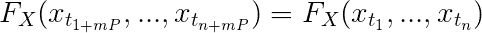*

*Equation 5: The cyclostationarity condition.*

*循环平稳在信号处理中非常重要。*

*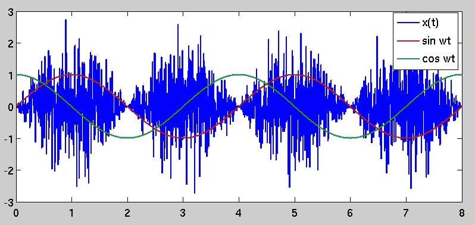*

*Figure 3: A white noise process 𝑛(𝑡) modulated by sin2𝜔𝑡 produces the cyclostationary process 𝑥(𝑡)=𝑛(𝑡)sin2𝜔𝑡*

## *趋势平稳性*

*如果一个潜在的趋势(仅仅是时间的函数)可以被移除，留下一个平稳的过程，那么一个随机过程就是*趋势平稳的*。含义，该过程可以表示为*y*ᵢ=*f(I)*+*ε*ᵢ，其中 *f(i)* 是任意函数*f*:ℝ→ℝ*ε*ᵢ是均值为零的平稳随机过程。*

*在存在冲击的情况下(序列值的显著和快速的一次性变化)，趋势平稳过程是均值回复的；即，随着时间的推移，该序列将再次向增长(或收缩)均值收敛，这不受冲击的影响。*

*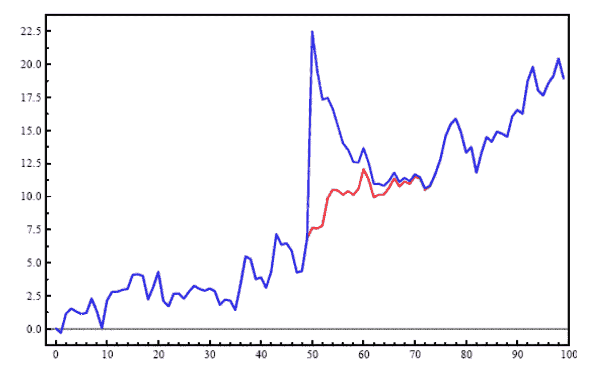*

*Figure 4: Trend stationary processes revert to their mean after a shock is applied.*

## *联合平稳性*

*对于随机过程对，上述所有类型的平稳性都有直观的扩展。例如，对于一对随机过程𝑿和𝒀，联合强平稳性是由强平稳性的相同条件定义的，但是简单地强加于两个过程的联合累积分布函数。弱平稳性和 *N* 阶平稳性可以用同样的方法扩展(后者扩展到 *M* - *N* 阶联合平稳性)。*

## *内在假设*

*弱平稳性的一种较弱形式，在[地质统计学](https://en.wikipedia.org/wiki/Geostatistics)文献中较为突出(例如，参见【Myers 1989】和【Fischer 等人 1996】)。*内在假设*适用于随机过程𝑿={Xᵢ}，如果:*

1.  *由距离 *r* 分开的任意两个地方的值之间的期望差为零: *E[xᵢ-xᵢ₊ᵣ]=0**
2.  *由*var[x*ᵢ-*x*ᵢ₊ᵣ*】*给出的差的方差是存在的(即它是有限的)，并且只取决于距离 *r* 。*

*这个概念暗示了差分 Xᵢ-Xᵢ₊ᵣ的弱平稳性，并通过定义 *N 阶内在假设*进行了扩展。*

## *局部平稳随机过程*

*一类重要的非平稳过程是局部平稳(LS)过程。[【Cardinali&Nason，2010】](https://onlinelibrary.wiley.com/doi/full/10.1002/sta4.125)给出了 LS 过程的一个直观定义，即它们的统计特性随时间缓慢变化。或者，[【达尔豪斯，2012】](https://arxiv.org/abs/1109.4174)将它们(非正式地)定义为在每个时间点局部上接近于平稳过程，但其特征(协方差、参数等)是平稳的过程。)随着时间的推移以一种不确定的方式逐渐变化。正式定义见[Vogt，2012 年]，T28，[达尔豪斯，2012 年]，T29 对该主题进行了严格审查。*

*LS 过程非常重要，因为它们在一定程度上弥合了参数非平稳过程的彻底探索子类(见下一节)和更广泛的非参数过程家族的未知水域之间的差距，因为它们已经接受了严格的处理和一套相应的分析工具，类似于参数过程所享有的那些工具。关于这个主题的一个很好的在线资源是 Guy Nason 教授的主页，他把 LS 过程作为他的主要研究兴趣。*

## *平稳概念的类型学*

*下面的类型图，虽然可能是局部的，但可以帮助理解我们刚刚讨论过的不同的平稳性概念之间的关系:*

*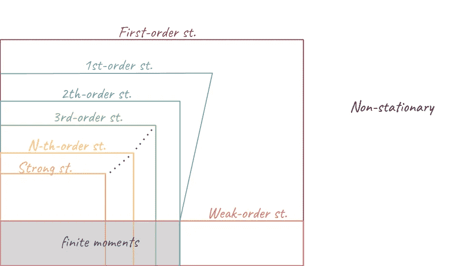*

*Figure 5: Types of non-stationary processes*

# *非平稳性的参数概念*

*到目前为止，平稳性的定义是非参数的；也就是说，他们没有假设数据生成过程的模型，因此适用于任何随机过程。然而，差分平稳性和单位根过程的相关概念需要简单介绍随机过程建模。*

*随机建模的主题也是相关的，因为各种简单的模型可以用来创建随机过程(见图 5)。*

*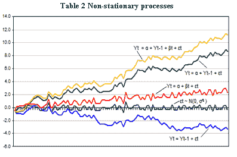*

*Figure 6: Various non-stationary processes (the purple white noise process is an exception).*

# *随机过程建模中的基本概念*

*未来值的预测是时间序列数据研究中的一项常见任务。要进行预测，需要对数据生成过程(DGP)和生成数据的机制做出一些假设。这些假设通常采用过程的显式模型的形式，并且在为其他任务(如异常检测或因果推断)建模随机过程时也经常使用。我们将讨论三种最常见的模型。*

*[**自回归(AR)模型**](https://en.wikipedia.org/wiki/Autoregressive_model) **:** 使用 AR 模型建模的时间序列被假设生成为其过去值的线性函数，加上随机噪声/误差:*

*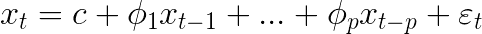*

*Equation 4: The autoregressive model.*

*这是一个基于记忆的模型，在这个意义上，每个值都与前面的 *p* 值相关；具有滞后 *p* 的 AR 模型用 *AR(p)* 表示。系数𝜙 *ᵢ* 是衡量这些在前值对值 x*【t】的影响的权重，c* 是常数截距，ε *ᵢ* 是单变量*白噪声过程*(通常假设为高斯)。*

*[*向量自回归(VAR)*](https://en.wikipedia.org/wiki/Vector_autoregression) 模型将 AR 模型的单变量情况推广到多变量情况；现在，长度为 k 的向量*x【t】*的每个元素可以被建模为过去的向量 *p* 的所有元素的线性函数:*

*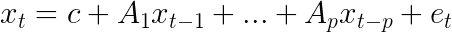*

*Equation 5: The vector autoregressive model.*

*其中 ***c*** 为 *k* 常数(截距)的向量， *Aᵢ* 为时不变的 *k×k* 矩阵，***e***=*{ e*ᵢ*；i∈ℤ}* 是一个*白噪声多变量过程*的 *k* 变量。*

*[**移动平均(MA)模型**](https://en.wikipedia.org/wiki/Moving-average_model) **:** 一个使用移动平均模型建模的时间序列，用 *MA(q)* 表示，被假设为由ε *ᵢ、*单变量*白噪声过程*产生的最后一个 *q+1* 随机冲击的线性函数；*

*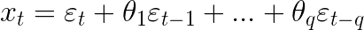*

*Equation 6: The moving average model.*

*像自回归模型一样，向量泛化，VMA，是存在的。*

*[**自回归移动平均(ARMA)模型**](https://en.wikipedia.org/wiki/Autoregressive%E2%80%93moving-average_model) **:** 使用 *ARMA(p，q)* 模型建模的时间序列被假设为由ε *ᵢ、*单变量*白噪声过程*产生的最后 *p* 值和最后 *q+1* 随机冲击的线性函数；*

*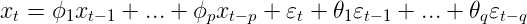*

*Equation 7: The ARMA model.*

*ARMA 模型可以以多种方式推广，例如处理非线性或外生变量、多变量情况(VARMA)或处理(特定类型的)非平稳数据(ARIMA)。*

# *差分平稳过程*

*有了对常见随机过程模型的基本理解，我们现在可以讨论差分平稳过程和单位根的相关概念。这个概念依赖于这样一个假设，即所讨论的随机过程可以写成一个阶为 *p、*的[自回归](https://en.wikipedia.org/wiki/Autoregressive)过程，表示为 *AR(p):**

*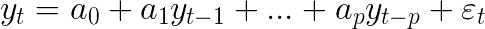*

*Equation 8: An autoregressive process of order p, or AR(p).*

*其中ε *ᵢ* 通常是不相关的白噪声过程(对于所有时间 *t* )。我们可以将相同的过程写成:*

*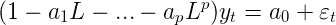*

*Equation 9: An AR(p) model written using lag operators.*

*左边括号内的部分称为过程的[特征方程](https://en.wikipedia.org/wiki/Characteristic_equation_(calculus))。我们可以考虑这个等式的根:*

*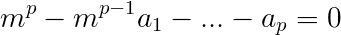*

*Equation 10: The characteristic equation of a AR(p) model.*

*如果 m=1 是方程的根，那么这个随机过程被称为是一个*差分平稳*过程，或者是*积分*。这意味着通过对其应用某种类型的变换，该过程可以被转换成弱平稳过程，称为[差分](https://en.wikipedia.org/wiki/Finite_difference)。*

*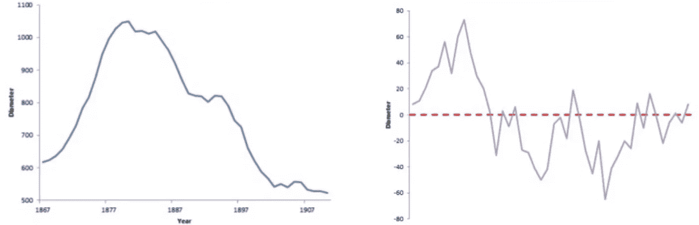*

*Figure 7: A time series (left) and a the series after differencing (right)*

*差分平稳过程有一个[积分阶](https://en.wikipedia.org/wiki/Order_of_integration)，这是差分算子必须应用于它的次数，以便实现弱平稳性。一个必须被微分 *r* 次的过程被称为按照顺序 *r、*被积分，用 *I(r)* 表示。这正好与[根的重数](https://en.wikipedia.org/wiki/Multiplicity_(mathematics)#Multiplicity_of_a_root_of_a_polynomial) *m=1* 相吻合；也就是说，如果 *m=1* 是特征方程的重数 *r* 的根，那么这个过程就是 *r* 阶的积分。*

## *单位根过程*

*差分平稳过程的一个常见子类型是一阶积分过程，也称为*单位根过程。这种过程最简单的例子是下面的自回归模型:**

*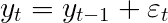*

*单位根过程和一般的差分平稳过程是有趣的，因为它们是非平稳过程，可以很容易地转化为弱平稳过程。因此，虽然这个术语不能与非平稳性互换使用，但关于它们的问题有时是可以互换的。*

*我认为这里值得一提，因为有时检查一个过程是否有单位根的测试和过程(一个常见的例子是 Dickey-Fuller 测试)被错误地认为是测试非平稳性的过程([在本系列的后面一篇文章中会提到](/detecting-stationarity-in-time-series-data-d29e0a21e638))。因此，重要的是要记住这些是不同的概念，虽然每个具有单位根的过程都是不稳定的，集成到订单 *r > 1* 的每个过程也是不稳定的，但相反的情况远非如此。*

## *半参数单位根过程*

*另一个有趣的定义是非平稳过程的更广泛、参数更少的子类，可以称为半参数单位根过程。该定义是在[Davidson，2002]中介绍的，但可以在[Breitung，2002]中找到它的简明概述。*

*如果你对平稳性的概念感兴趣，或者在处理时间序列数据时无意中发现了这个主题，那么我希望这篇文章是对这个主题的一个很好的介绍。下面是一些参考资料和有用的链接。*

*正如我提到的，[本系列的后一篇文章提供了非平稳性检测方法的类似概述](/detecting-stationarity-in-time-series-data-d29e0a21e638)，另一篇文章将提供非平稳性时间序列数据转换的类似概述。*

*另外，如果你对这篇文章或这个话题有任何意见和想法，请随时[联系我](http://www.shaypalachy.com/)。*

# *参考*

## *学术文献*

*   *[博什纳科夫，2011 年] G .博什纳科夫。 [*关于随机系数模型的一阶和二阶平稳性*](http://www.maths.manchester.ac.uk/~goran/research-reports/psrr03-2009.pdf) 。线性代数应用 434，415–423。2011.*
*   *[Breitung，2002 年] [*单位根与协整的非参数检验。*](https://pdfs.semanticscholar.org/e31b/c65824cc156d43d25b6ece0e9613b398233d.pdf) 《计量经济学杂志》，108 卷 2 期，第 343–363 页。*
*   *[卡迪纳利和纳森，2010 年]局部平稳时间序列的协同性。*时间序列计量经济学杂志*， *2* (2)。*
*   *[考克斯和米勒，1965 年]考克斯博士；和 H. D .米勒，1965,《随机过程理论》,伦敦，398 页。*
*   *[达尔豪斯，2012 年]达尔豪斯河(2012 年)局部平稳过程。在*统计手册*(第 30 卷，第 351-413 页)中。爱思唯尔。*
*   *戴维森，2002 年。 [*建立非线性和半参数时间序列过程中泛函中心极限定理的条件*](http://people.exeter.ac.uk/jehd201/nedprops2.pdf) ，《计量经济学杂志》106，243–269。*
*   *【Dyrhovden，2016】Dyrhovden，Sigve Brix。2016. [*随机单位根过程*](http://bora.uib.no/bitstream/handle/1956/12650/144801902.pdf?sequence=1) 。卑尔根大学。*
*   *[费希尔等人，1996 年]费希尔，m .斯霍尔滕，H. J .和昂温，d .编辑。[*GIS 的空间分析视角*](https://books.google.co.il/books?id=yNSNDwAAQBAJ) 。宾夕法尼亚州布里斯托尔:泰勒&弗朗西斯——吉斯达；4.*
*   *[迈尔斯，1989]迈尔斯博士，1989。 [*生存还是毁灭。。。静止的？那就是问题*](http://www.u.arizona.edu/~donaldm/homepage/my_papers/MathGeology_21_1989_347-363.pdf) 。数学。地理 21，347–362。*
*   *【Nason，2006】[Nason，GP](https://research-information.bristol.ac.uk/en/persons/guy-p-nason(c22adede-c5fc-4692-9b91-24afa15868b6).html) 2006，[平稳与非平稳时间序列](https://research-information.bristol.ac.uk/en/publications/stationary-and-nonstationary-time-series(c0005c54-b407-414e-944c-92fca5df2a2b).html)。在 H Mader&SC Coles(eds)*火山学中的统计学。*地质学会，第 129–142 页。*
*   *[Vogt，2012 年] Vogt，M. (2012 年)。局部平稳时间序列的非参数回归。*统计年鉴*， *40* (5)，2601–2633。*

## *在线参考*

*   *[在](https://www.analyticsvidhya.com/blog/2018/09/non-stationary-time-series-python/) [Analytics Vidhya](https://www.analyticsvidhya.com) 用 Python 处理非平稳时间序列的温和介绍*
*   *[单位根](https://en.wikipedia.org/wiki/Unit_root)在维基百科*
*   *[第 4 课:平稳随机过程](http://www.phdeconomics.sssup.it/documents/Lesson4.pdf)来自翁贝托·特里亚卡的随机过程课程*
*   *[特征方程的根与其逆的根的倒数](https://stats.stackexchange.com/questions/185200/roots-of-characteristic-equation-reciprocal-to-roots-of-its-inverse)*
*   *[随机过程特征](https://www.mathworks.com/help/econ/stationary-stochastic-process.html)*
*   *[趋势平稳与差异平稳过程](https://www.mathworks.com/help/econ/trend-stationary-vs-difference-stationary.html)*
*   *[盖伊·纳森教授的主页](https://people.maths.bris.ac.uk/~magpn/Research/LSTS/LSTS.html)*

# *脚注*

1.  *这里的措辞并不严格准确，因为——正如我们很快会看到的——时间序列本身不可能是静态的，只有产生它们的过程才能是静态的。然而，我使用它是为了不假设开头的段落有任何知识。 [**↺**](#4f75)*
2.  *弱意义平稳性的常见同义词二阶平稳性可能与*二阶随机过程*的概念有关(但不应与之混淆)，二阶随机过程被定义为具有有限二阶矩(即方差)的随机过程。 [**↺**](#5b3d)*
3.  *注意，反之则不然。不是每个平稳过程都是由 IID 变量组成的；平稳性是指变量的联合分布不依赖于时间，但它们仍可能相互依赖。 [**↺**](#88f0)*
4.  *这也是一个很好的例子，说明 IID 并不意味着弱平稳性；然而，由于它确实意味着强平稳性，所以它具有与它意味着强平稳性相同的充分必要条件:具有有限的矩。 [**↺**](#eb28)*
5.  *平稳性的一个次要但有趣的概念是[*p*——平稳过程](https://link.springer.com/article/10.1007/BF00319110)。*
6.  *也有正式的方法来处理样本间隔不相等的时间序列。 [**↺**](#4267)*