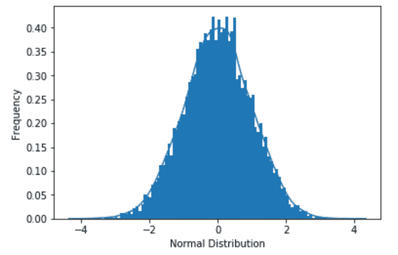
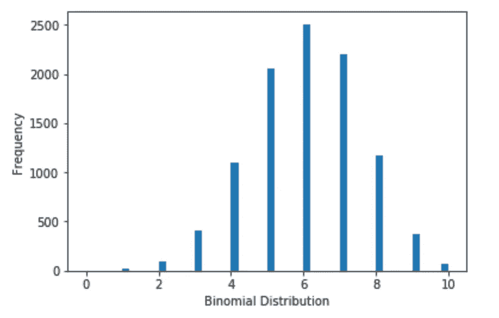
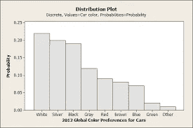
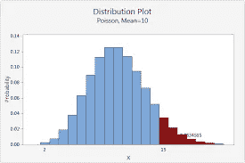
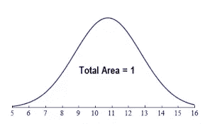
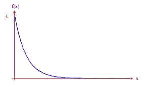
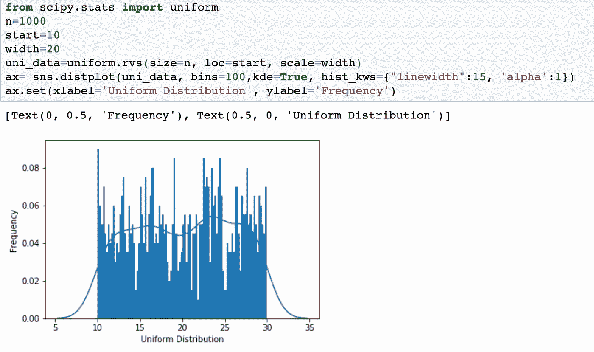
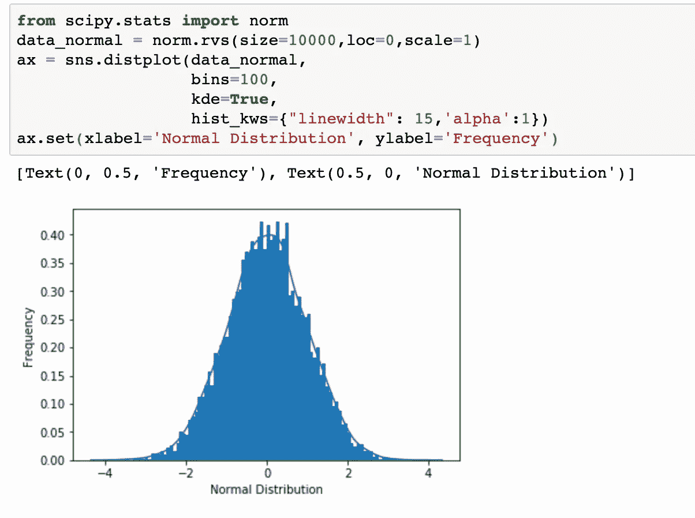
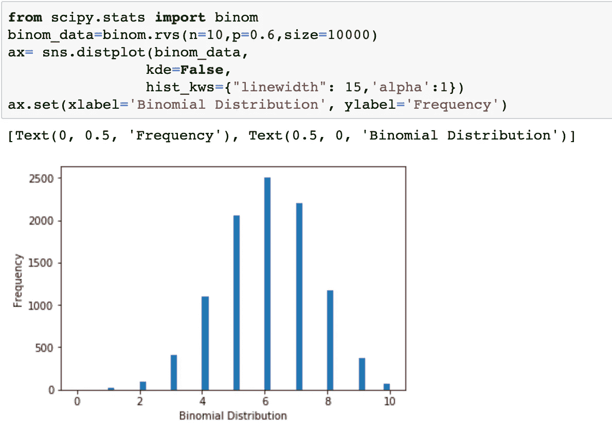
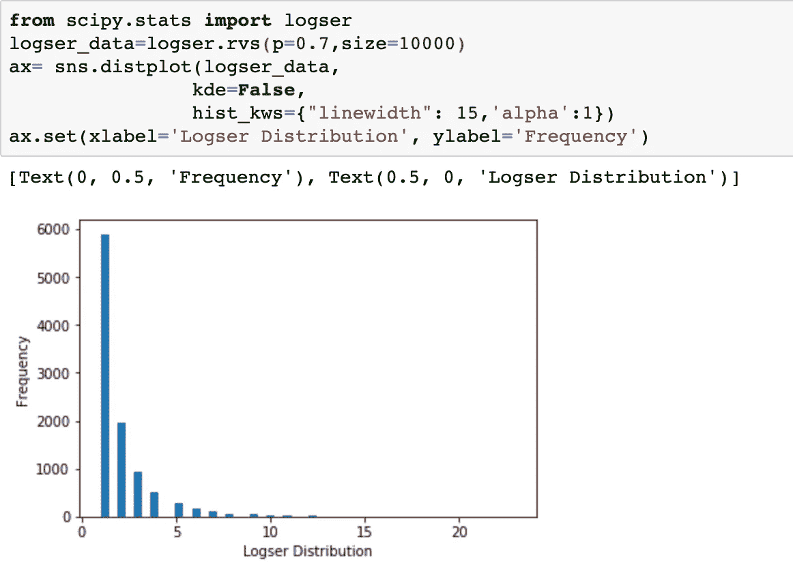

# 统计分布

> 原文：<https://towardsdatascience.com/statistical-distributions-24b5b4ba43cc?source=collection_archive---------10----------------------->

## 分解离散和连续分布，研究数据科学家如何最有效地应用统计数据。

## 什么是概率分布？

概率分布是一种数学函数，它提供了实验中各种可能结果出现的概率。概率分布用于定义不同类型的随机变量，以便根据这些模型做出决策。有两种类型的随机变量:离散的和连续的。根据随机变量所属的类别，统计学家可能决定使用与该类随机变量相关的不同方程来计算平均值、中值、方差、概率或其他统计计算。这很重要，因为随着实验变得越来越复杂，用于计算这些参数(如平均值)的标准公式将不再产生准确的结果。

A continuous distribution (Normal Distribution) vs. a discrete distribution (Binomial Distribution)

# 离散分布

离散分布显示了具有有限值**的随机变量**的结果的概率，并用于模拟离散随机变量**。**离散分布可以用表格来表示，随机变量的值是可数的。这些分布由*概率质量函数定义。*

概率质量函数(或 pmf)计算随机变量采用一个特定值的概率:Pr(X=a)。下面显示了一些离散分布的图示示例。对于离散框架中的任何 x 值，都有一个概率对应于特定的观察结果。

# 连续分布

连续分布显示具有无限值**的随机变量**的结果的概率范围，并用于模拟连续随机变量**。**连续分布衡量一些东西，而不仅仅是计数。事实上，这些类型的随机变量是不可数的，在一个特定点上连续随机变量的概率为零。连续分布通常由*概率分布函数描述。*

概率密度函数(或 pdf)是用于计算连续随机变量小于或等于其计算值的概率的函数:Pr(a≤X≤b)或 Pr(X≤b)。为了计算这些概率，我们必须分别在[a-b]或[0-b]范围内对 pdf 进行积分。下面显示了一些连续分布的图形表示示例。可以观察到，这些图具有曲线性质，每个 x 值没有不同的值。这是因为，在任何给定的特定 x 值或连续分布中的观察值，概率为零。我们只能计算一个连续的随机变量位于一个**值范围**内的概率。还应注意，曲线下方的面积等于 1，因为这代表所有结果的概率。

# 期望值或平均值

每种分布，无论是连续的还是离散的，都有不同的相应公式，用于计算随机变量的期望值或均值。随机变量的期望值是随机变量集中趋势的度量。描述期望值的另一个术语是“第一时刻”。这些公式中的大部分通常不像人们直观预期的那样工作，这是由于分布将我们置于其中。重要的是要记住期望值是人们对随机变量的期望值。

为了手动计算离散随机变量的期望值，必须将随机变量的每个值乘以该值的概率(或 pmf)，然后对所有这些值求和。例如，如果我们有一个离散随机变量 X，它具有(值，概率):[(1，0.2)，(2，0.5)，(3，0.3)]，那么 E[X](或 X 的期望值)等于(1 * 0.2) + (2 * 0.5) + (3 * 0.3)= 2.1。这个策略可以被认为是对 X 可以假设的所有值进行加权平均。

为了“手动”计算连续随机变量的预期值，必须在 x 的整个定义域上对 x 乘以随机变量的 pdf(概率分布函数)进行积分。如果您还记得，pdf 在整个定义域上的积分结果是值 1，因为这是在假设随机变量在其定义域中的任何值的情况下计算随机变量的概率。这类似于这样一个概念:如果我们将离散随机变量 X 的每个值的所有概率相加，而不乘以 X 的每个对应值，那么总和将等于 1。在积分中乘以 x，可以让我们考虑这个值，就像在离散变量求和中乘以 x，可以让我们考虑这个值一样。当我们将 pdf 乘以 x 时，我们得到了随机变量 x 的所有可能观测值的加权平均值。

# 差异

每个定义的随机变量也有一个与之相关的方差。这是对随机变量中观察值的集中程度的度量。这个数字将告诉我们观察值与平均值相差有多远。常数的方差为零，因为常数的均值等于常数，只有一个观测值恰好是均值。标准差也很有用，它等于方差的平方根。当计算方差时，想法是计算随机变量的每个观察值离它的期望值有多远，平方它，然后取所有这些平方距离的平均值。方差的公式如下:

开始学习统计和概率的时候，分布的个数和它们各自的公式会变得非常令人应接不暇。值得注意的是，如果我们知道一个随机变量遵循一个定义的分布，我们可以简单地使用它们的均值或方差公式(有时甚至是它们的参数)来计算这些值。然而，如果随机变量并不明显遵循定义的分布，最好使用应用求和与积分的基本公式来计算平均值和方差，或您分析中可能需要的任何其他值，其中随机变量 x 乘以每个观察值的 pmf 或 pdf，并分别求和或积分。为了找到方差，请遵循方差公式，并通过使用与第一个矩相同的程序获得随机变量的第二个矩，但是，用 x 替换 x。例如，有时通过一些检查很容易发现，或者我们被告知某个随机变量遵循某个分布，而其他时候我们只得到可能不熟悉的 pmf 或 pdf，以匹配已知的分布。

随着使用这些随机变量的实践，识别随机变量的 PMF 和 pdf 变得更加容易。能够在实践中快速识别各种分布是有利的，因为它可以节省大量时间，并帮助统计学家和精算师变得更有效率。

然而，对于数据科学家来说，Python 中的 scipy.stats 库为您需要处理的每种概率分布都提供了方便的类，可以用来轻松地可视化和处理这些分布。我们能够生成遵循特定分布的随机变量，并以图形方式显示这些分布。下面显示了使用 Python 代码获得离散和连续分布可视化的一些示例。

First, matplotlib.pyplot and seaborn should be imported

From there, we are able to import the distribution we want to examine, define it’s parameters, and plot the distribution using seaborn’s distplot. Here, we look at the continuous distribution called Uniform Distribution.

Here we examine one of the most common continuous distributions, the Normal Distribution.

Here we look at a discrete distribution called the Binomial Distribution.

Here we look at another discrete distribution that may be less common, the Logser Distribution.

scipy.stats 中还内置了“屏蔽统计函数”,使我们能够快速计算随机变量的不同特征(均值、标准差、方差、变异系数、峰度等。).最后，通过使用这个 Python 库，我们能够轻松地对数据应用不同的变换，例如 BoxCox 变换或 z-score 变换。

我们来连线:

[https://www.linkedin.com/in/mackenzie-mitchell-635378101/](https://www.linkedin.com/in/mackenzie-mitchell-635378101/)

 [## 麦肯齐米切尔 6 -概述

### 在 GitHub 上注册您自己的个人资料，这是托管代码、管理项目和与 40…

github.com](https://github.com/mackenziemitchell6) 

参考资料:

 [## 统计函数(scipy.stats) - SciPy v1.3.0 参考指南

### 这个模块包含了大量的概率分布以及不断增长的统计函数库。

docs.scipy.org](https://docs.scipy.org/doc/scipy/reference/stats.html#random-variate-generation)  [## 教练精算师

### 你具备成为精算师的条件。我们有备考工具来帮助您有效地利用视频…

www.coachingactuaries.com](https://www.coachingactuaries.com/)  [## Python 中的概率分布

### 概率和统计是数据科学的基础支柱。事实上，机器的基本原理…

www.datacamp.com](https://www.datacamp.com/community/tutorials/probability-distributions-python)