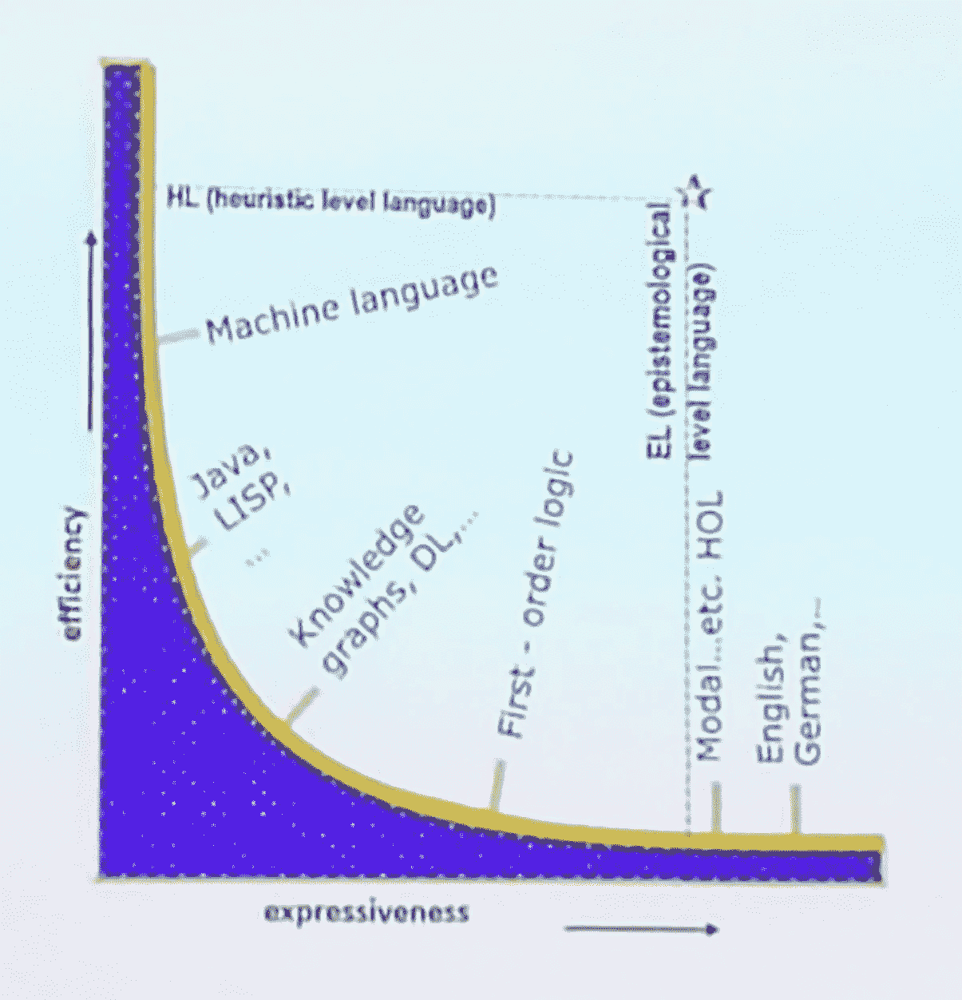

# 统计学习和知识工程

> 原文：<https://towardsdatascience.com/statistical-learning-and-knowledge-engineering-all-the-way-down-1bb004040114?source=collection_archive---------34----------------------->

## 结合机器学习和知识库的途径

Photo by [Joao Tzanno](https://unsplash.com/@jtzanno?utm_source=medium&utm_medium=referral) on [Unsplash](https://unsplash.com?utm_source=medium&utm_medium=referral)

Cycorp，Inc .的首席执行官兼 AAAI 研究员道格·勒纳特，在[AAAI Make 会议](https://www.aaai-make.info/program)期间，在斯坦福大学 AAAI 之春研讨会上做了一个有趣的主题演讲。

当前的社会趋势与人们受教育程度越来越高的普遍看法相反。的确，事实表明，我们生活在这样一个时代，我们可以看到:

*   **平均人口中猖獗的算术**(即，对数学相关问题的无知，包括非常基本的概念)，与年龄、性别和社会阶层无关。举个例子，请看这个案例:“为什么我们在麦当劳买 1/3 磅肉和 1/4 磅肉要花同样的钱？你多收了我们的钱。”
*   与现实和知识的联系减少，最终导致对事实的无知(因为你可以依靠谷歌！)
*   人们普遍不相信存在(并且可能存在)一个真实的客观现实
*   假设问题的**答案总是可用的**，

## 今天，人们依靠机器获取知识，而当前的引擎不具备将来自许多不同来源的知识整合在一起并得出结论或答案的逻辑。

Photo by [Lacie Slezak](https://unsplash.com/@nbb_photos?utm_source=medium&utm_medium=referral) on [Unsplash](https://unsplash.com?utm_source=medium&utm_medium=referral)

例如，埃菲尔铁塔比美国国会大厦高吗？在谷歌上无法完全自动找到答案，因为没有现有的网页明确讨论这一点，尽管答案的各个部分都是可用的。

这是由于机器学习的困难:

*   专家对结果意见不一的情况
*   确认偏差的风险
*   荒谬的答案或中间结论
*   可用的少量数据
*   当答案暗示“常识”时
*   当顶级专家比普通人强很多的时候

对于理解问题和答案，机器学习可以对人类生成的文本(从社交媒体到莎士比亚的情节，如罗密欧与朱丽叶)做一些事情，通过使用不同的有限逻辑:从命题逻辑到完全一阶逻辑。但是，相对于随便阅读文本或观看情节表演或电影的人所能回答的问题而言，人类能够提出和我们能够回答的问题的数量是极其有限的(至今仍然如此)。最重要的是，有一个悬而未决的问题，人工智能很难回答:为什么？

大多数时候，一阶逻辑的计算速度不够快(更不用说二阶或更高阶逻辑了)。

Doug 提出的想法包括将推理中的两个重要成分分开，以处理表达能力和效率之间的权衡:

*   认识论方面
*   启发式方面

通过将两者分开，您可以将非常高效的语言用于启发式部分，而将非常强大(和不太高效)的语言用于认识论部分。因此我们在游戏中有两种语言:**启发式层次语言(HL)** 和**认识论层次语言(EL)** 。

对推理的另一个有趣贡献是语境:**语境应该是知识过程中的一等公民**，因为知识在不同的语境中可能是不同的。

该系统能够使用[溯因推理(或溯因推理](https://en.wikipedia.org/wiki/Abductive_reasoning))来提出答案中可能的可能性，例如为什么故事中会发生什么。

这与道格和赛克公司的历史有关。早在七十年代，斯坦福的一群朋友就在为人工智能概念而奋斗。他们决定加入逻辑、人工智能和专家系统，并致力于解决 EL-HL 分裂的工作方法和工程解决方案。

这项工作主要是通过教授事实和逻辑规则来教育系统，然后设计推理方法，该项目历时 30 年，预算超过 200 MLN 元，能够建立包含数亿条断言的知识资产。

## 将机器学习和知识库结合起来的途径是利用它们潜在的协同作用。

[Google doodle about Bach’s music](https://www.google.com/doodles/celebrating-johann-sebastian-bach), where ML was **not** combined with KE.

实际上，这包括以下选项:

*   实现商定的自定义 API
*   使用知识库作为机器学习系统的大量训练数据的生成器。因为我们知道 80%的事实实际上可以从三重模型中产生，这已经是一笔巨大的财富了。
*   使用机器学习来生成假设，然后使用知识库来检查不良形式或矛盾(可以使用这种方法的一个例子是改进最近关于巴赫音乐的[谷歌涂鸦](https://www.google.com/doodles/celebrating-johann-sebastian-bach)，其中巴赫风格的一些基本概念化可以避免生成的音乐中的重大错误，这产生了音乐专家的[巨大反斜杠](https://slate.com/technology/2019/03/google-doodle-bach-ai-music-generator.html))。

但是 AI 和 KB 结合的实际价值真的更广阔。

这一贡献的主要长期破坏性影响之一是使分析能力从相关性转移到因果关系成为可能。这可能会给整个领域带来全新的味道。

Photo by [dylan nolte](https://unsplash.com/@dylan_nolte?utm_source=medium&utm_medium=referral) on [Unsplash](https://unsplash.com?utm_source=medium&utm_medium=referral)

这个故事的灵感来自于 Cycorp，Inc .的首席执行官兼 AAAI 研究员 Doug Lenat 在斯坦福大学 AAAI 之春研讨会上的一次演讲。