# 统计建模——实用指南

> 原文：<https://towardsdatascience.com/statistical-modeling-the-full-pragmatic-guide-7aeb56e38b36?source=collection_archive---------14----------------------->

第 2 部分—解释机器学习模型

继续我们关于如何解释机器学习算法和预测的系列文章。

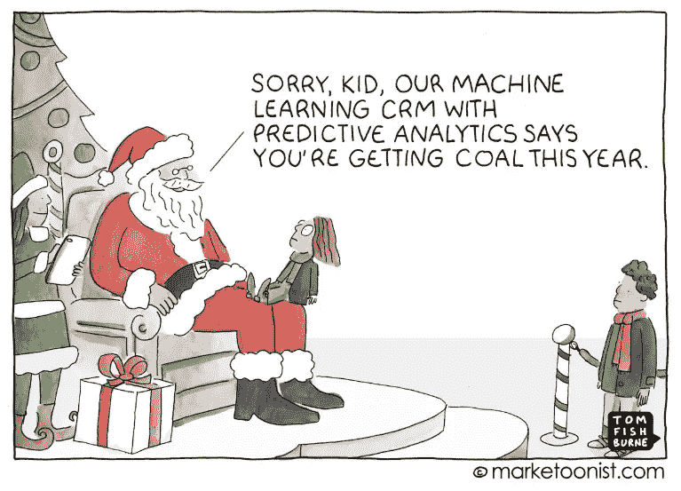

About the importance of explaining predictions.

第 0 部分(可选)— [什么是数据科学和数据科学家](https://medium.com/swlh/data-science-and-the-data-scientist-db200aac4ea0)
第 1 部分— [可解释性介绍](/interpreting-machine-learning-model-70fa49d20af1)
第 1.5 部分(可选)— [统计学简史](/a-brief-history-of-statistics-36cfdac9439f)(可能对理解本帖有用)
**第 2 部分—(本帖)解读高偏倚和低方差模型。线性回归。**
第 3 部分——解读低偏差和高方差模型。
第 4 部分——有可能解决偏倚和方差之间的权衡吗？
第 5 部分——可解释性的本地方法。
[第 6 部分——可解释性的全局方法。](https://medium.com/@marcos.silva0/the-ultimate-guide-using-game-theory-to-interpret-machine-learning-c384cbb6929?sk=8817fb3b75f2da2030cee7a699c8854b)利用沙普利终于打开了黑盒！

在本帖中，我们将关注高偏差和低方差模型的解释，正如我们在上一帖中解释的，这些算法是最容易解释的，因此假设数据中有几个先决条件。让我们选择线性回归来代表这组算法。如果你不知道什么是线性模型，你可能想看看文章[统计简史。](/a-brief-history-of-statistics-36cfdac9439f)

该职位的所有代码可在 [Kaggle](https://www.kaggle.com/sn3fru/intepreting-machine-learning-linear-regression) 上获得。

这里的目的不是解释这些线性模型是什么或它们是如何工作的，而是如何解释它们的参数和估计，但简单介绍一下可能会有帮助。线性模型可以是简单回归，如 OLS，可以是常规回归，如拉索和岭，
它们可以是分类模型，如逻辑回归，甚至是时间序列模型，如 ARIMA 过滤器。它们都有一个共同的事实，即它们具有线性参数，也就是说，当我们估计变量的“权重”时，它们对于任何水平都是恒定的。有趣的是，如果神经网络的激活层是线性的(f (x) = x)，它也可以是线性模型，这样的单层网络将类似于我们在这里使用的简单线性回归，但效率低得令人难以置信。

Linear models, well Spacious, high bias and low variance and Neural Networks that adapt to any behavior.

让我们创造一个理论世界，在那里我们有兴趣解释各种变量对人们收入的影响。在我们假设的世界里，我们的最低工资是 1000 美元，每受一年教育，月薪平均增加 500 美元。因为我们的世界是随机的(不是确定性的)，所以我们有随机性。

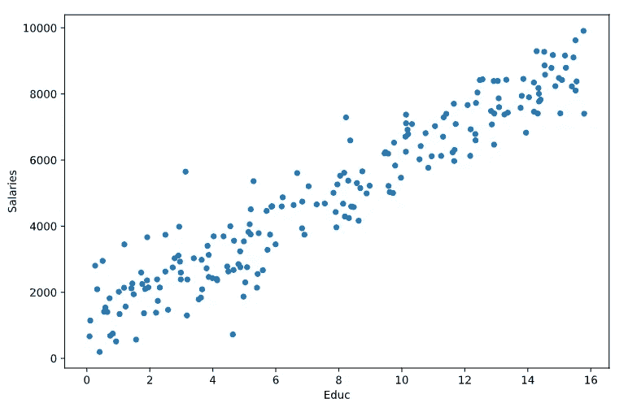

ScatterPlot Salary x Education

运行回归模型时，我们得到产生最小可能误差的直线:yhat = x * 496 + 1084。也就是说，该模型能够“理解”我们创建的现实，并估计斜率系数约为 496(非常接近创建的 500 美元),截距约为 1084，这种情况下的解释非常简单。他确定了最低工资(当教育等于零时)和当一年的教育改变人们的收入时，500 美元。

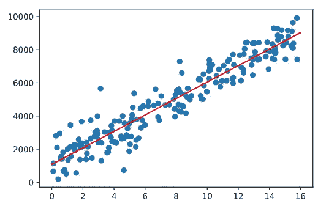

Best fit line (which produces the smallest error).

但是这个案例很简单，离现实很远。顺便说一下，这种情况非常类似于高尔顿在十九世纪创建的模型，相关系数' R '与 R 相同(只是平方)。在现实世界中，我们有许多解释工资的变量，所以让我们在这个模型中插入更多的变量。

在我们的“世界 v2”中，我们将有以下更像现实的行为:

> *工资由以下三个部分解释:
> - Grit =范围从 0 到 16 的随机变量。
> -教育=从 0 到 16 的随机变量+努力的一部分，因为努力影响你自己受教育的程度。
> -实验=从 0 到 25 的随机变量。*

*=*毅力* * 200 +经验* 200 + *学历* * 300 +随机部分*

*查看变量之间这些关系的一种方法是通过热图中的关联图:*

*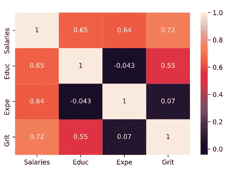*

*HeatMap with correlations between variables*

*看第一列，我们会认为最重要的变量是毅力/爪，因为它与工资的相关性最高，我们会说经验和教育有几乎相等的影响。*

*显示变量之间行为的另一种方式是通过图表，这是我更喜欢的方式，但仍然不能普及，其中每个节点都是一个变量，边的颜色强度是它们相关性的“强度”:*

*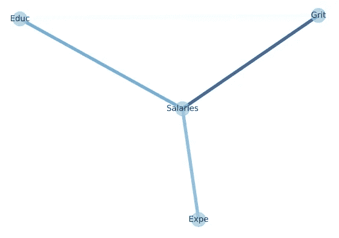*

***Alternative way to represent the correlations between the variables, developed by the author.***

*我们可以更清楚地看到，工资是中心变量，教育和爪是相互关联的，所以通过估计爪和工资的相关性，我们可能捕捉到了教育的一部分效果，高估了爪的效果，低估了爪的效果。教育。我们说这种相关性被“污染”了。
如何解决？*

# *偏相关*

*解释线性回归的一大诀窍是理解偏相关是如何工作的。如果你深刻理解这一点，那么开始做另一篇文章主题的因果分析就成功了一半。要做到这一点，让我们用维恩图创建一种“统计语言”，如下所示:*

*   *每个圆圈代表一个变量。*
*   *圆圈的大小代表这个变量的方差；*
*   *圆圈之间的交点代表这些变量的协方差。我们可以解释为相关性而不失一般性。*

*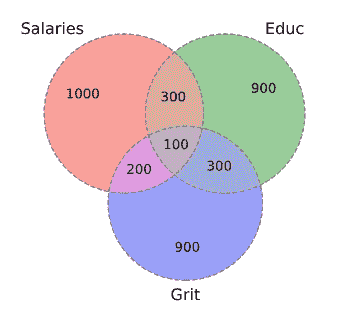*

*Venn diagram representing Variance and Covariance.*

*我们如何解读这种表述？基本上，工资有一个方差，可以用教育和毅力来解释，但由于教育和毅力是相关的，它们可以解释相同的方差，即有重复计算。当我们使用这种偏相关时，基本上我们正在做的是扔掉这种重复计算，只捕捉纯相关性，它与任何其他模型变量都不相关。在这种情况下，我们将使用由 Grit 和 Educ 解释的数字 100，我们将只留下 200 (Grit -> $)和 300 (Educ -> $)。这正是线性回归为我们做的:*

*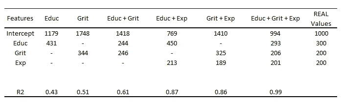*

*Each column is a model that has been run and each row is a variable. Values ​​are estimates for the effect of variables.*

*让我们播放它。当在没有教育变量或没有砂砾变量的情况下回归时，我们注意到它们捕捉到了彼此的影响，即，为了预测工资，移除变量不会干扰太多，因为它们是相关的，部分影响被剩余的变量捕捉到了。为了解释这些影响，理想情况下，我们把所有重要的变量都放进去，否则估计的影响会被污染。在 Exp 变量的情况下(它是在与其他变量不相关的情况下构建的)，部分相关性与传统相关性非常相似，因为没有联合效应。使用文氏图:*

*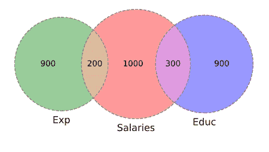*

*Venn diagram showing orthogonal / independent variables.*

# *统计建模及其解释。*

*正如我们多次重复的，这个模型有许多先决条件，所以让我们开始分解它们并解释它们。*

***非线性行为。***

*最强有力的假设之一是，变量(X)对目标(y)的回报必须是常数，因此线性模型的名称(因为估计的参数是线性的)。但是如果行为不完全是线性的呢？我们必须求助于其他模式吗？简单的回答是否定的，
我们可以通过对问题建模来理解非线性。让我们来看例子:*

*让我们想象一下，相对于工资，教育回报率不再稳定，而是实际上达到峰值，然后开始下降。也就是说，它不仅不会永远增加，而且增加的速度会降低，直到发生逆转。这是一个非常容易接受的假设，可以用真实数据观察到。在估计这个新现实的线性模型时，我们有一个相当奇怪的结果:*

*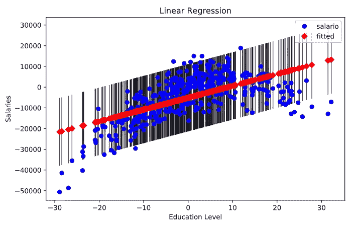*

*Adjustment of a linear regression by a quadratic behavior. Don’t mind the numbers, it’s simulated data.*

*看起来不太合适，对吧？这在问题的本质中是很常见的，我们的影响会随着变量的变化而变强或变弱，我们处理它的方式是通过两次添加教育变量，一个线性(原始)部分和一个二次部分，因此线性模型可以理解非线性行为:*

*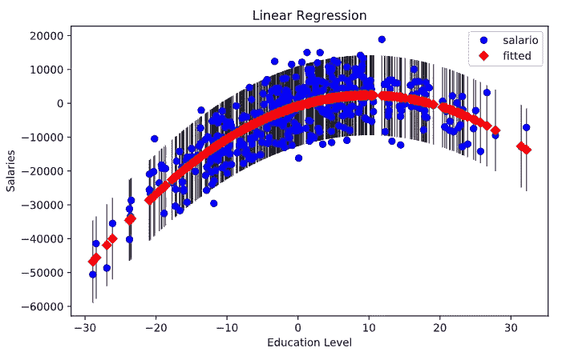*

*Linear Regression Adapting to Nonlinear Behaviors*

*由于模型继续估计偏相关，为了解释这些变量，我们需要同时考虑教育的两个部分，估计的线性和二次部分是:648 和-32，而实际数据是 600 和-30。例如，我们可以通过取曲线的最大值来计算使工资最大化的教育程度。*

# *弹性模型。*

*另一个非常常见的非线性效应的例子是，变量不是具有恒定的名义效应，而是具有恒定的百分比效应。一个例子是估计人数(X)对面包店产量(y)的影响。如果只有一个员工，生产率就很高。当你多雇一个人，产量就会增加很多，他们可以轮流工作，而一个人满足另一个人补充库存，等等。随着我们增加更多的员工，生产率在下降，增加第十个员工不再那么有效率，而是增加了产量。我们称之为边际递减效应，对此问题建模的一种方法是应用自然对数(ln)。当你有 1 个员工时，多一个员工是 100%的增长，而当你有 10 个员工时，多一个员工只是 10%的增长。
除了纠正这种百分比增加行为之外，日志记录还有助于减轻左侧不对称分布、异常值的影响，并且通常会将这种分布转换为与正态分布非常相似的分布。*

*通过对数变换后，我们如何解读这个新变量？基本上是百分比变化而不是名义变化。让我们来看例子:*

*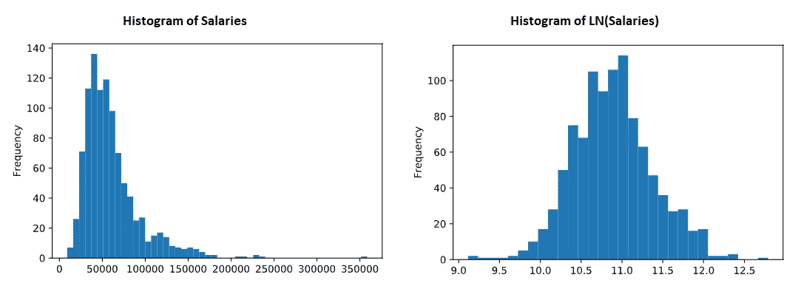*

*Histograms of the annual salary variable. No logging in the left corner and logging in the right side. The interpretation must be a percentage interpretation!*

*当我们对 1990 年的工资进行回归时，会发生两件事。首先是 R2 从 0.065 增加到 0.125(翻了一倍！)，意味着我们的建模走上了正轨。但是当我们看教育的估计值时，我们看到它从 300 到 0.0062，如何解释它呢？百分比变化！新的解释是，多受一年教育而不是增加 300 美元的工资，这个模型增加了 0.0062%，我们称之为对数水平，估计值变成了半弹性。如果我们记录这两个变量，这将是一个逻辑模型。记录和解释将是:对于教育 1%的增长，增加变量 y 的估计百分比值。我们称之为效应弹性(等于我们在定价团队中经常看到的价格弹性)。*

# *分类变量*

*我们已经从其他模型中知道了如何添加分类变量，我们需要将其建模为虚拟变量(0 或 1)并用这个新变量进行回归，让我们在我们的工资模型中创建一个这样的变量，它将代表该个人是否出生在巴西，因为我们的制度不是最好的，对于具有相同经历、教育和努力的同一个人来说，在巴西生活的“仇恨”是(在我们的理论世界中)1000 美元。*

*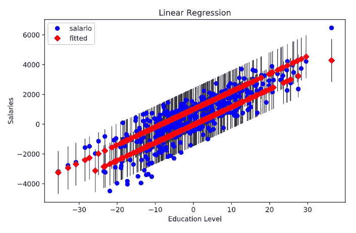*

*ScatterPlot representing the actual (blue) points and the red predicted values. The differences between the lines is caused by the dummy that affects only the intercept and not the inclines.*

*请注意，预测值是平行的，这表明线的斜率完全由教育给出，出生或不出生在巴西只是将整个曲线下移。*

*假人超级强大，可以帮助控制许多复杂的效果，包括时间，但这是一个因果张贴的问题。*

# *变量之间的相互作用。*

*最后，我们需要纠正一个相当复杂的自然行为，即变量之间的相互作用。这方面的一个例子是前一种情况，不管其他变量如何，教育回报率是一样的吗？在巴西生活与否应该不会影响这次回归吧？如果是这样的话，这个模型，因为它非常简单，它不理解这个行为，我们需要再次建模，以便模型能够理解。*

*在我们的示例中，变量“巴西”将与变量 Education 交互。为了让模型理解这种行为，我们只需要创建第三个变量，它是两个变量的乘积。请注意，我们乘以 1 和 0，因此当观察值等于 1 时，新变量将具有重复教育列，否则将为零，回归结果如下:*

*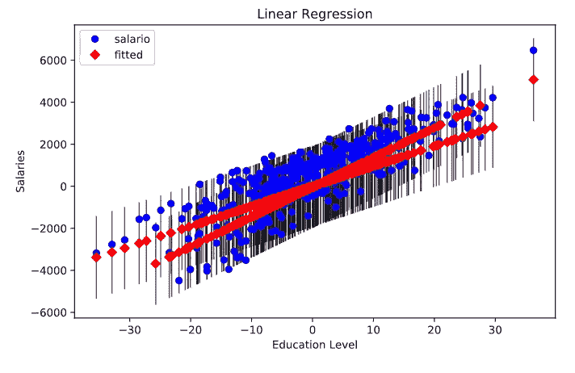*

*Inclination of the return of education interacting with the variable “Brazil”, making the inclination different for each situation.*

*允许模型与两个变量相互作用允许教育的回报因情况而异。现在的解读将是，虽然出生在巴西有负面影响(保持一切不变)，但巴西的教育回报比巴西以外更高(线更倾斜)。也就是说，我有一个估计的教育倾向(例如 300)，一个估计的巴西出生率(例如-1000)，一个估计的巴西人的教育价值(例如 50)，当我们想要分析巴西的教育回报时，我们需要加上 300(来自每个人)+作为巴西人的回报 50。*

*所有代码和图形都可以在 [Kaggle](https://www.kaggle.com/sn3fru/intepreting-machine-learning-linear-regression) 中找到。*

*帖子系列:*

*   *[统计简史](http://A Brief History of Statistics)；*
*   *[为数据科学家推荐书籍、课程和电影。](/how-to-become-a-data-scientist-2a02ed565336)*
*   *[数据科学](https://medium.com/swlh/data-science-and-the-data-scientist-db200aac4ea0) [的范围是什么；](https://medium.com/beacon-insight/ci%C3%AAncia-de-dados-e-o-cientista-de-dados-72634fcc1a4c)*
*   *[解释机器学习。](https://medium.com/@marcos.silva0/the-ultimate-guide-using-game-theory-to-interpret-machine-learning-c384cbb6929?sk=8817fb3b75f2da2030cee7a699c8854b)*

*[*LinkedIn*](https://www.linkedin.com/in/marcosviniciusenator/) GitHub*