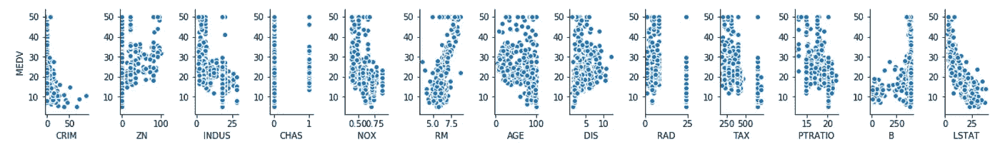
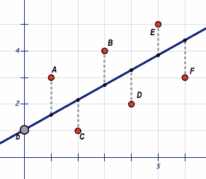

# 线性回归的统计概述(Python 中的示例)

> 原文：<https://towardsdatascience.com/statistical-overview-of-linear-regression-examples-in-python-80a38680e053?source=collection_archive---------4----------------------->


在统计学中，我们经常寻找方法来量化现实生活中的因素和反应之间的关系。

也就是说，我们可以把我们想要理解的反应大致分为两种类型:分类反应和连续反应。

对于分类案例，我们正在研究某些因素是如何影响我们在一组选项中做出哪种反应的决定的。

例如，考虑一个关于脑瘤的数据集。在这种情况下，这些因素包括肿瘤的大小和患者的年龄。另一方面，反应变量必须是肿瘤是良性的还是恶性的。

这些类型的问题通常被称为分类问题，实际上可以通过一种称为逻辑回归的特殊类型的回归来处理。

然而，对于连续的情况，我们正在观察我们的因素在多大程度上影响我们的反应变量的可测量的变化。

在我们的特定示例中，我们将查看广泛使用的波士顿住房数据集，该数据集可以在 scikit-learn 库中找到

虽然该数据集通常用于预测性多元回归模型，但我们将专注于统计处理，以了解房间大小增加等特征如何影响住房价值。

# 模型符号和假设

线性回归模型表示如下:


其中:


为了“拟合”线性回归模型，我们建立关于随机误差的某些假设，一旦这些假设适用，这些假设将确保我们对实际现象有一个很好的近似。

这些假设如下:


# 探索性研究

为了这个模型的目的，我们将把 MEDV 作为响应变量。MEDV 是以 1000 美元为单位的自有住房的中值

在这里，我们将会看到在 y 轴上有 MEDV 的那一行。也就是说，我们将查看房屋价值与数据集中所有其他要素之间关系的散点图。

你可以在这里找到所有数据集名称的完整描述:
[https://www . cs . Toronto . edu/~ delve/data/Boston/Boston detail . html](https://www.cs.toronto.edu/~delve/data/boston/bostonDetail.html)



All Features vs the Median Value of Owner Occupied Homes

一个特别突出的线性关系是每个住宅的平均房间数(RM)。

让我们仔细看看:


# 简单线性回归

最简单的线性回归形式只包含截距和单因子项。

在这种情况下，我们将使用最小二乘法拟合模型。

## 最小二乘法



当我们说“适合”模型时，我们的意思是找到最适合给定数据的因子项的估计值。在回归的情况下，这意味着我们找到最小化回归线和每个观察数据点之间距离的距离。

也就是说，我们将平方误差降至最低，数学上表示为:


其中 sigma 是数据集中所有行的总和。

下面是我们如何使用 python 库 statsmodel 拟合模型。

我们首先导入库:

```
import statsmodels.api as sm
```

我们现在准备安装:

请注意，我们必须添加一列称为“截距”的数字。

这是因为我们可以使用线性代数重写我们的模型，以便:


所以 1 列是 X 矩阵的第一列，所以当我们乘以因子系数向量时，我们得到了每个方程的截距值。

这种形式用于扩展多元回归的情况，但我们不会在本文中广泛涉及这种数学。

# 适合摘要


slr_results.summary()

这些是因子系数的估计值。考虑截距术语的解释通常是没有意义的。例如，在我们的例子中，截距项与房子有 0 个房间的情况有关…房子没有房间是没有意义的。

另一方面，RM 系数有很多含义。它表明，每增加一个房间，业主自住房屋的中值就会增加 9102 美元。

**P > |t|:** 这是一个双尾假设检验，其中零假设是 RM 对 MEDV 没有影响。由于 p 值很低，接近于零，因此有强有力的统计证据来否定 RM 对 MEDV 没有影响的说法

**R 平方:**这是模型解释的方差，通常被认为是对模型拟合程度的衡量。然而，这个因素可以被抛弃，因为它可以通过增加因素的数量而被人为地夸大，即使这些因素并不重要。因此，我们还必须考虑调整的 R 平方，它调整计算以适应因子的数量。然而，在简单的线性回归中，这两者是相同的。


How our line fit’s the data

# 多元线性回归:

## 当我们加入其他因素时会发生什么？

既然我们没什么别的事可做，为什么不干脆把它们都扔了呢
(免责声明:也许你不应该在家里尝试…..尤其是如果你有成千上万的功能…)

*   除了 CHAS:因为它是二进制的*


好吧…我为那张汇总表有多长而道歉:/

请注意，R 平方和调整后的 R 平方显著增加。然而，也请注意，现在有一个强有力的统计证据支持它不影响 MEDV 的说法。

这一特点是年龄，我们将删除它从我们的模型和改装。

我们将继续修剪和比较，直到我们有所有的统计显著特征。


Red: Dropped, Black: R-squared, Green: Adjusted R-squared

正如我们所看到的，列 Age 和 Indus 对模型的拟合没有贡献，最好不要考虑它们。

**Prob(F-statistic):** 是与整体模型的显著性检验相关联的 p 值。在这种情况下，零假设是模型总体上不显著。由于我们的值远低于 0.01，我们可以拒绝零假设，而支持另一种选择，即该模型具有统计学意义。

***注意* * *

对于多元线性回归，β系数的解释略有不同。

例如，RM coef 建议，对于每一个额外的房间，我们可以预期自有住房的中值增加 3485 美元，**所有其他因素保持不变**。还要注意，系数的实际值也发生了变化。

# **模型诊断**

此时，您可能想知道我们可以做些什么来提高模型的拟合度。由于 adj. R-squared 为 0.730，当然还有改进的空间。

我们可以考虑的一件事是，我们可以向数据集添加哪些对我们的模型可能很重要的新功能。

除此之外，我们还需要进行测试，看看首先应用线性回归实际上是否合理。

为此，我们寻找剩余图。


这里的好处是残差是对模型中随机误差的一个很好的估计。也就是说，我们将能够绘制残差与特征(或预测值)的关系图，以了解残差的分布情况。

我们预计，如果模型假设成立，我们将看到一个完全分散的图，点的范围在某个恒定值之间。这意味着残差是独立的，正态分布的，具有零均值和恒定方差。


standard residual plot

然而，在我们的单反案例中，我们有 RM


这里我们可以看到，有一些非线性模式的迹象，因为残差图似乎在底部是弯曲的。

这违反了我们的模型假设，我们假设模型具有恒定的方差。

事实上，在这种情况下，方差似乎是根据其他函数而变化的。我们将使用 **box-cox** 方法来处理这个问题。

我们可以通过创建一个 QQ 图来进一步检验我们的正态性假设。对于正态分布，QQ 图将趋向于直线。

但是请注意，这条线明显是倾斜的。


## 博克斯-考克斯方法

这是一个过程，通过这个过程，我们可以找到最合适的变换的最大似然估计，我们应该应用于响应值，以便我们的数据能够具有恒定的方差。

使用 scipy.stats 实现后，我们得到的 lambda 值为 0.45，我们可以将它用作 0.5，因为它不会在拟合方面产生巨大的差异，但它会使我们的答案更具可解释性。

```
import scipy.stats as stats
df.RM2,fitted_lambda = stats.boxcox(df.RM)
```

下面你会发现一个常见的 lambda 值及其建议的响应转换表。


Common Lambda Values — taken from statistics how-to

此后，我们相应地改变我们的回应:

```
df.MEDV2 = np.sqrt(df.MEDV)
```

然后我们将模型拟合到 MEDV2，它是 MEDV 的平方根。


在特征数量相同的情况下，我们的 R 平方值和调整后的 R 平方值都上升了不少。有点酷吧？

此外，我们的剩余地块也有一些改进:


此外，我们还可以尝试将我们的转换应用于特征变量的每个

```
X = df[['intercept','CRIM', 'ZN','NOX', 'RM','DIS', 'RAD',
       'TAX', 'PTRATIO', 'B', 'LSTAT']]
X2 = X.apply(np.sqrt)
```

然后，我们拟合由 X2 作为我们的特征矩阵和 MEDV2 作为我们的响应变量组成的模型。


在这里，我们看到在**相同**数量的特性下，这些值有了更大的提高。

我们最后的剩余图看起来像这样:


所以很明显还有改进的空间，但是我们确实取得了一些进步。

# 一些附加说明

回归模型的统计理解还有更多的部分。例如，我们有可能得出围绕每个节拍系数甚至围绕我们的预测值的置信区间。

此外，关于 *CHAS，*由于它的{1，0}编码，包含 chase 也没问题。对于更多的选项，除非选项有自然的顺序，否则很难或不可能解释贝塔系数。当我们用 chas 拟合最终模型时，调整后的 R 平方为 0.794。在这种情况下，对β系数 0.077 的解释是:

> 如果房屋区域毗邻查尔斯河，那么在所有其他因素保持不变的情况下，业主自住房屋的中值将比未毗邻查尔斯河的房屋高出 77 美元。

# 结论

我希望我能够让大家明白回归不仅仅是基于某些特征进行预测。事实上，有一个回归分析的世界致力于使用这些技术来更深入地了解我们周围现实世界中的变量。