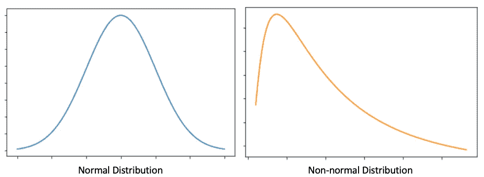

# 用于比较机器学习和基准性能的统计测试

> 原文：<https://towardsdatascience.com/statistical-tests-for-comparing-machine-learning-and-baseline-performance-4dfc9402e46f?source=collection_archive---------5----------------------->

当将机器学习方法与当前解决方案进行比较时，我希望了解任何观察到的差异是否具有统计显著性；这不太可能仅仅是由于数据中的偶然因素或噪声。

评估统计显著性的适当测试取决于您的机器学习模型预测的内容、数据的分布以及您是否正在比较对主题的预测。这篇文章强调了常见的测试以及它们适用的地方。

# 零假设统计检验

零假设统计检验用于比较两个数据样本，并计算在更广泛的人群中观察到的数学特征的感知差异(例如，不同的平均值)的统计置信度。

尽管对零假设显著性检验有持续的批评，但它仍然是最常用的验证技术。

## 虚假设

零假设是两个数据样本的分布之间不存在差异的陈述；任何差异都是由于噪音或偶然因素造成的。

就机器学习而言，我们的零假设是性能指标相等，观察到的任何小的增益或损失在统计上不显著。

## p 值

测试表明我们是否应该拒绝，或者拒绝不存在差异的无效假设。下面讨论的统计检验倾向于提供检验统计量和 p 值。

如果 p 值低于给定的阈值(通常为 0.05)，我们可以拒绝零假设，并推断差异具有统计学意义。

## 商务口译

如果您正在将您的机器学习解决方案与当前基线进行比较，并且您看到了性能的提高，那么这一显著提高是一个好消息！

类似地，如果您使用这些技术来测试某个特定的模型是否比另一个模型表现得更好，这可以指导您决定继续使用哪个模型。

如果您不能拒绝零假设(p 值大于或等于阈值)，则两个数据集之间的任何观察到的效应或差异都不具有统计显著性。如果您正在尝试自动执行一项任务，匹配当前的手动性能就足够了，这可能是一个积极的消息。但是，如果成功的标准是超越当前场景，没有统计上的显著性差异意味着您不太可能看到将该模型用于生产的好处。

# 假设

## 数据分布

当对回归模型使用假设检验时，区分应该使用参数检验还是非参数检验是很重要的。参数检验是首选，因为它们通常比非参数检验具有更大的统计功效；这意味着他们更有可能检测到统计上的显著影响，如果存在的话。然而，这些测试假设数据是正态分布的；如果这个假设不成立，就必须使用非参数检验。

If you plot error values, it is likely they will be of a non-normal distribution

当您比较误差值时，它们很可能是向左倾斜的:大多数误差都很小，随着误差值的增加，频率会降低。如果你要绘制你的数据，你也许可以直观地解释它，但是也有正态性检验，你可以用它来进行数学上的确认。

## 成对或不成对观察值

如果为每个模型从相同的受试者收集数据，这被称为“配对”。在机器学习中，这意味着基线和训练模型的测试数据是相同的。

从两个独立组收集的数据被称为“不成对的”。这在科学研究或 A/B 测试中很常见，当你比较一个对照组和一个治疗组时。

# 适当的统计测试

## 回归

如果您的机器学习模型正在预测数值，则误差度量往往是以下之一:

*   均方误差
*   平均绝对误差
*   平均绝对百分比误差(MAPE)
*   加权平均绝对百分比误差

当使用假设检验来比较平均误差时，您看到的是误差来自同一分布的可能性；如果可能性足够低，则两个平均误差值之间的差异具有统计学意义。

对于正态分布的数据，两种合适的测试要么是**学生 t 检验**要么是**韦尔奇 t 检验**。它们都检验两个总体具有相同的均值，但 Welch 的 t 检验更可靠，因为方差或样本量存在差异。根据观察值是成对的还是不成对的，有两种实现方式。

两个非参数检验是**曼-惠特尼 U 检验**或**威尔科克森符号秩检验**，这再次取决于观察值是否成对。

**分类**

如果您的机器学习模型预测一个实例属于哪个类，则误差度量往往是以下之一:

*   准确(性)
*   精确
*   回忆
*   f1-分数

虽然您的企业必须决定应该优先考虑哪个指标，但是分类模型最常用的技术只是评估错误的比例是否有显著差异。如果您明确希望测试精确度或 F1 分数的统计显著性，则需要进一步的研究。

分类模型可以是二元的(例如搅动的或未搅动的)，也可以是多类的(例如体育、政治或科学)。对于二元分类模型比较，合适的测试是**麦克内马测试**，而对于多类，合适的测试是**斯图亚特-麦克斯韦测试**。

# 算法比较和超参数调整

当评估一个模型相对于基线(或者另一个模型)的结果时，使用上述指标。

当评估不同的算法或超参数时，通常使用 k 倍交叉验证。这允许您训练和测试 k 模型，并收集它们的评估指标，使用它们的平均值作为算法性能的指示。如果对两种算法都这样做，可以使用统计测试来比较这两种方法。

例如，如果要比较逻辑回归模型和随机森林模型。你可以把数据分成 10 份，训练 10 个逻辑回归模型和 10 个随机森林模型。这两个模型将分别具有 10 个相应的性能度量值(例如准确性)，然后可以将这些值传递给统计测试，以查看任何观察到的差异是否具有统计显著性。

随着 k 重交叉验证对数据进行重新采样，训练集之间存在重叠。这意味着这些值不是独立的，这通常是统计假设检验的一个假设。因此，两种最常见的技术是使用修改的 t 检验的 **5x2 交叉验证**和**麦克内马检验**。