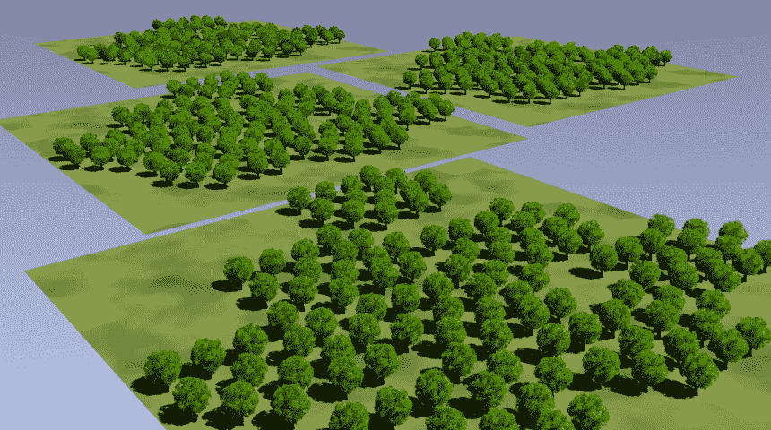
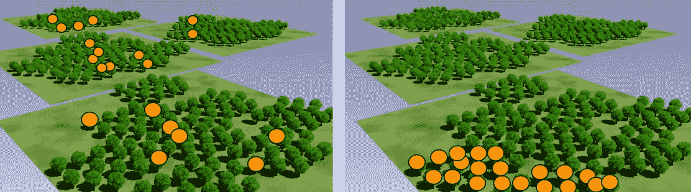
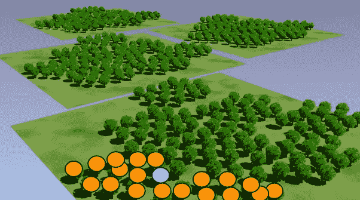
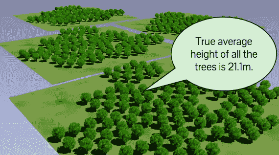
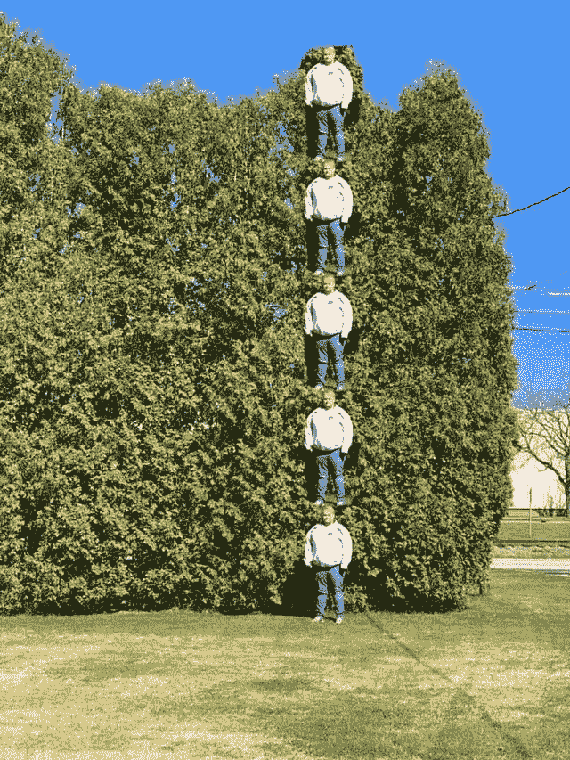
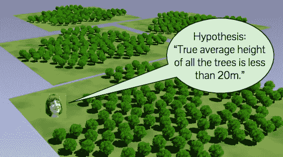
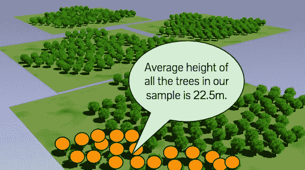
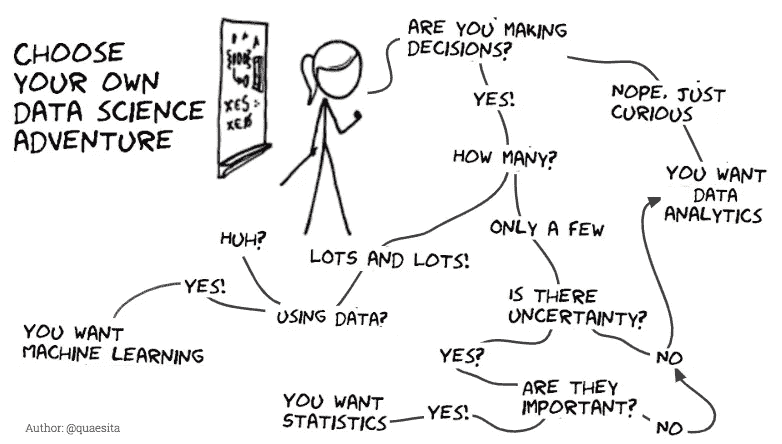

# 统计学家证明统计很无聊

> 原文：<https://towardsdatascience.com/statistician-proves-that-statistics-are-boring-4fc22c95031b?source=collection_archive---------0----------------------->

## 用细致入微的词汇回归基础

我要给你看一个逻辑证明，统计学很无聊...为了帮助你们理解像我这样的[统计学家](http://bit.ly/quaesita_statistics)进行的所有那些花哨计算的[点](http://bit.ly/quaesita_pointofstats)。作为一个额外的奖励，这几乎是你在大多数 STAT101 课程的第一天所学到的，所以它也是对统计数据好奇的间谍任务。让我们从沉湎于一些本地术语开始。

This statistician is about to prove that statistics are boring. Pulling faces all the while — I’m still learning how to use my face. Humaning is hard. Come pull a face back at me [here](http://twitter.com/quaesita) if you like.

# 人口

当典型的人类想到“人口”这个词时，他们会想到什么？人，对吧？不是一两个，而是很多。所有的人！在我们的[学科](http://bit.ly/quaesita_statistics)，更像是*所有的事情*。一个[群体](http://bit.ly/quaesita_popwrong)可以是人、像素、南瓜、神奇宝贝，或者任何你感兴趣的东西。

> 群体是我们感兴趣的所有项目的集合。

停下来。花点时间。你现在看到的是处于整个追求核心的法律合同。

事情是这样的:通过写下对你的[人口](http://bit.ly/quaesita_popwrong)的描述，你同意只有人口，整个人口，除了人口之外没有任何东西对你的决定感兴趣。通过进一步阅读，[您接受这些条款和条件](http://bit.ly/quaesita_savvy)。(正如你所料，这篇博客详细描述了大量的人口。在这里找到更多的沉思。)

如果列出你感兴趣的人群听起来令人生畏，请记住，选择你感兴趣的内容是由你自己决定的。没有不正确的选择，只要具体彻底。我会说得很透彻，我会给你一千个单词:下图中的树木是我们对这篇文章感兴趣的人群。

If my population is all trees in *this* forest, they represent everything I care about for this decision. I’m getting pretty excited about these trees. Actually, to be quite honest with you, the excitement is real: I’m irrationally fond of this graphic because I’ve been using it in my lectures for many years. Allow me my misguided nostalgia just this once… of course trees floating on some planes in space make perfect sense.

因为这是我的种群，我应该记住我没有理由放弃我的分析，因为我相信我已经了解了其他森林中的树木。我的发现充其量只能应用于这些树。在最坏的情况下，嗯…我们只能说在一个[数据科学家](http://bit.ly/quaesita_datasci)的一生中可能会有一些塑造性格的时刻。

这里有你看不见的树吗？对你来说死了，没意思。它不是我们人口的一部分。随便挑一棵树？对你也一样。一样无聊。这不是你的全部人口。只有他们所有人(一起！)对我们来说很有趣。*这是[法律合同](http://bit.ly/quaesita_popwrong)上说的*。

# 样品

样本是总体中任何项目的集合。

> 样本是你拥有的数据，总体是你希望拥有的数据。

Either of these orange collections of trees is a sample. I hope you have some intuition as to which one is the better one here. In a future article, I’ll tell you all about what makes a sample a good sample. I’m going to use the one that irritates professionals for the rest of this example to prove a point.

# 观察

观察值是对样本中一个单一项目的测量。

The measurement we took from this blue-labeled tree is an observation. Sticklers for precise language will notice that a “sample” is a collective noun for a group of observations. Technically, “*samples*” as a plural does not mean “observations”, it means “*multiple collections of observations*.”

# 统计的

啊哈！统计！这肯定是重要的事情，因为我们以这些事情命名了我们的[学科](http://bit.ly/quaesita_statistics)！

> 统计是将样本数据混合在一起的任何方式。

那么…什么是统计？这只是将我们现有的[数据](http://bit.ly/quaesita_hist)进行混合的一种方式。多么令人失望！提示悲伤的长号噪音。事实证明，统计学和统计学学科是两码事，在这里阅读全部相关内容。

Example of a statistic: if we’re interested in tree heights, you wouldn’t be surprised to see a statistic like the average height of all those orange-labeled trees. If you feel like it, though, you could also take those sample tree heights, find the top three, add them up, take the log, add to it the square root of the difference of the bottom two tree heights, send the whole unholy thing through a meat grinder… and out pops another statistic! Maybe useful, maybe not so useful, but also a statistic.

# 证明统计数据很无聊

假设我们感兴趣的是平均树高，在这个例子中恰好是 22.5 米。这个数字对我们来说有意思吗？

我们再回头参考一下我们签约的法律合同:只有人口才是有趣的。这个样本是*人群*吗？没有。因此，我们对此不感兴趣。我们从一些无聊的树上取了一些无聊的测量值，然后我们把这些无聊的测量值搅成糊状……这个过程产生的结果也是无聊的。

所以我向你们证明了你们心里一直都知道的:统计很无聊！神盾局。

# 用词不当！

统计学家疯了吗？为什么我们要用一些无聊的数字来命名我们的学科？其实是用词不当。

我们这些天使用这些术语的方式是，[分析](http://bit.ly/quaesita_analysts)是关于计算统计数据的学科，但[统计](http://bit.ly/quaesita_statistics)是关于超越那些[数据](http://bit.ly/quaesita_hist)混乱的*——一个[伊卡洛斯式的飞跃](http://bit.ly/quaesita_popwrong)进入未知(如果你不小心的话，预计会有一个大的冲击)。在此了解更多[关于](http://bit.ly/quaesita_datasci)[数据科学](http://bit.ly/quaesita_datasci)的子学科。*

我们学科的真实名称(从你可以用来召唤巫师的真实名称的意义上来说)会更冗长:统计的*消化…* 但是这听起来有点粗俗，所以我们把它缩短成一些通俗易懂的东西。(由于我们脾气暴躁的名声，我们需要尽可能的平易近人。)

让我解释一下。

# 参数

进入我们节目的明星: ***参数*** 。这东西太花哨太闪亮了。演出结束后，它会收到一束鲜花，通常还会收到自己的希腊字母(通常是 *θ* )。您可以将参数视为统计数据的总体版本—参数是将所有感兴趣的数据组合在一起的任何方式，我们通常无法访问 IRL。

> 一个参数为您汇总了总体。

我们一致认为，我们对这些树深感兴奋，现在我将为你总结你所关心的一切？安静点，你的小心脏！参数让你如此激动！

Parameter value revealed: the true average height of all the trees just so happens to be 21.1 meters.

想象一下，这是一个星期六的早晨，你正站在森林中的一块空地上。你还没有测量过任何树木，但是你真的很想知道这个数字——这是你梦寐以求的一切。(通过[法律合同](http://bit.ly/quaesita_popwrong)，即。一旦我们写完这篇文章，你就可以回到正常人的生活中，对生活有其他的兴趣。)

要知道这个参数需要什么？

你必须准确无误地测量所有的树！一旦你做到了，你还有什么不确定的吗？不，你有所有的信息。你可以通过使用[分析](http://bit.ly/quaesita_datasci)来结束——继续计算平均值。那么统计量 ***就是*** 这个参数，因为你的样本 ***就是*** 这个总体。你处理的是纯粹的 ***事实*** 。由于拥有完善和完整的数据，不需要复杂的计算。

我碰巧住在纽约市——是我自己选择的！离树越远越好。因此，当我面临“完美地测量所有这些树”这样令人生畏的任务时，懒惰就开始了我很想知道这个参数，但是我开始思考，“我真的需要完全了解它吗？或者我可以只测量几棵树吗？也许我可以只看一眼全貌，就能得出一个对政府工作足够好的参数的最佳猜测。

当我以这种方式思考时，我是在以统计学的方式思考！我永远不会*知道*答案。我的懒惰意味着我不得不放弃获取事实或确定性，但希望我最终会得到一些仍然对做决定有合理帮助的东西。我仍然可以把它变成一个合理的行动。*那*就是[统计学](http://bit.ly/quaesita_statistics)的全部内容。

Speaking of measuring trees *perfectly*, [this photo](https://www.reddit.com/r/funny/comments/g53eis/my_brother_wanted_to_measure_the_trees_in_his/?utm_medium=android_app&utm_source=share) on Reddit made me laugh. The caption was: “My brother wanted to measure the trees in his yard. This is how did he did it.”

# 无中生有？

你们中的一些人希望我会说，*“有了* ***这个*** *的神奇公式，你就能把不确定性变成确定性！”没有，当然没有。没有无中生有的魔法。*

> 当我们没有事实时，我们所能希望的就是结合数据和假设来做出合理的决定。

# 假设

一个[假设](http://bit.ly/quaesita_damnedlies)是关于宇宙可能看起来如何的描述，但它不一定是真的。我们将弄清楚我们的样本是否让我们的[假设看起来荒谬](http://bit.ly/quaesita_fisher)，以确定我们是否应该改变我们的想法，但这超出了*这篇*博文的范围——在这里继续讨论。

Here I am, uttering some uninformed garbage like “The true average height of all the trees is less than 20 meters.” That’s a hypothesis. **You** know the truth (I’m wrong!) because **you’re** omniscient in this example …but *I* don’t know anything. My statement is a perfectly valid hypothesis, describing how reality *might* potentially look. [I’ll see how I feel about it after I get some data.](http://bit.ly/quaesita_fisher)

# 估计和估算者

如果我们知道参数，我们现在就能回家了。我们寻找的是事实，但不幸的是事实并不总是存在的。由于我们无法计算参数，我们只能使用统计数据对其进行最佳猜测。

> 估计只是一个最好的猜测的花哨词。

估计只是一个关于参数真实值的 ***最佳猜测***(*估计命令*)的花哨词语。它是你猜测的值，而*估计值*是你用来得出那个数字的公式。

让我告诉你，你已经很擅长统计估计了。准备好了吗？

让我们假设你只知道其中一棵树有 23 米高。你能告诉我你对所有树的真实平均高度的估计吗？

23m？是啊，我也是！

如果这是我们仅有的信息，我们不得不猜测 2300 万——如果我们猜测其他任何东西，我们只是在编造。我们只知道 23m，所以只能猜 23m。为了得到其他的东西，我们不得不加入更多的信息(在这个例子中我们没有)或者我们不得不做出假设…在这一点上，我们再次处理事实之外的东西。

好吧，让我们试试另一个！假设我们有一个样本，我们只知道它的平均高度是 22.5 米。你现在最大的猜测是什么？

22.5 米？哇！你太擅长这个了！你甚至不需要一门课程！

这里是几个教科书章节的统计数据的妙处，包括*矩估计法*、*最大似然估计法*以及所有它们的表亲:结果证明彩虹尽头的答案就是你刚刚直观得出的答案！在现实生活中，你遇到的 99%以上的情况下，只要把你的样本当作你的总体来对待，不管里面有什么，你就能得到最好的猜测。你不需要任何特别的课程。哒哒，我们完了！

总是需要[统计](http://bit.ly/quaesita_statistics)是骗人的；你不知道。如果你只是试图做出最好的猜测来获得[的灵感](http://bit.ly/quaesita_inspired)，[分析](http://bit.ly/quaesita_bsides)是你的最佳选择。不要理会那些 p 值，你不需要不必要的压力。

相反，你可以选择遵循这些原则:更多(相关)数据[更好，你的直觉很适合做出最佳猜测，但不知道这些猜测有多好……所以保持谦逊。](http://bit.ly/quaesita_hist)

然而，不要认为我在抨击我的纪律。十多年来，我一直致力于研究统计数据，我喜欢认为自己没有完全疯掉。

> 当采取统计方法有用时，它的 [*非常*](http://bit.ly/quaesita_donttrust) 有用。

那么你什么时候真正需要它呢？它什么时候能阻止你伤害自己？看我的 [*“统计学有什么意义？”*](http://bit.ly/quaesita_pointofstats) 找出…

Learn more about the difference between the subdisciplines in data science [here](http://bit.ly/quaesita_datasci).

# 感谢阅读！人工智能课程怎么样？

如果你在这里玩得开心，并且你正在寻找一个为初学者和专家设计的有趣的应用人工智能课程，这里有一个我为你制作的娱乐课程:

Enjoy the entire course playlist here: [bit.ly/machinefriend](http://bit.ly/machinefriend)

# 喜欢作者？与凯西·科兹尔科夫联系

让我们做朋友吧！你可以在 [Twitter](https://twitter.com/quaesita) 、 [YouTube](https://www.youtube.com/channel/UCbOX--VOebPe-MMRkatFRxw) 、 [Substack](http://decision.substack.com) 和 [LinkedIn](https://www.linkedin.com/in/kozyrkov/) 上找到我。有兴趣让我在你的活动上发言吗？用[这个表格](http://bit.ly/makecassietalk)联系。