# R 平方解释| R 平方线性回归

> 原文：<https://towardsdatascience.com/statistics-for-machine-learning-r-squared-explained-425ddfebf667?source=collection_archive---------3----------------------->


Photo by [Roman Mager](https://unsplash.com/@roman_lazygeek?utm_source=medium&utm_medium=referral) on [Unsplash](https://unsplash.com?utm_source=medium&utm_medium=referral)

机器学习涉及大量的统计数据。在前面的文章中，我们将看看 R 平方的概念，它在特性选择中很有用。

相关性(也称为“R”)是一个介于 1 和-1 之间的数字，其中值+1 意味着 x 的增加会导致 y 的增加，-1 意味着 x 的增加会导致 y 的减少，0 意味着 x 和 y 之间没有任何关系。与相关性一样，R 会告诉您两个事物的相关程度。然而，我们倾向于使用 R，因为它更容易解释。r 是由两个变量之间的关系解释的变化百分比(即从 0 到 1 变化)。

后者听起来相当复杂，所以让我们看一个例子。假设我们决定绘制工资和工作经验之间的关系。在上图中，每个数据点代表一个个体。

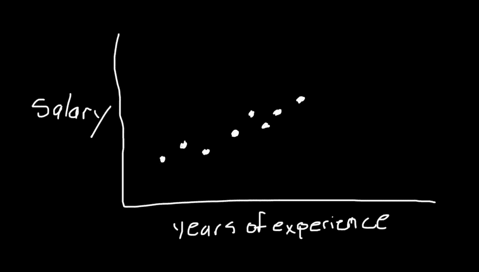

我们可以通过将样本中所有个体的总和除以样本中个体的总数来计算平均值。

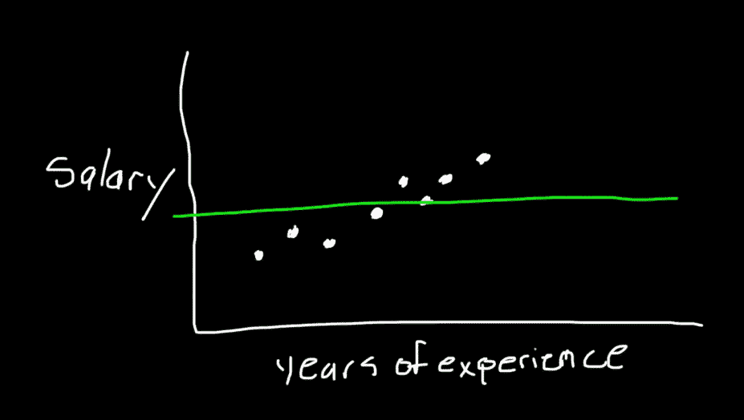

整个数据集的方差等于每个数据点之间的距离和均方值之和。差值的平方使得低于平均值的点不会被高于平均值的点抵消。

```
var(mean) = sum(pi - mean)²
```

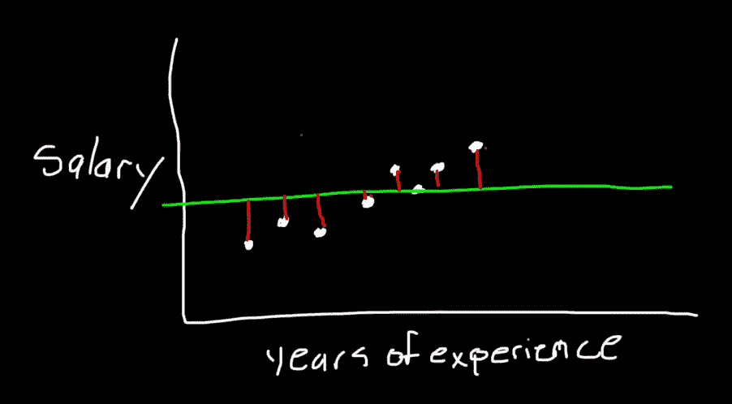

现在说，我们找了同样的人，但是这一次，我们决定画出他们的工资和身高之间的关系。

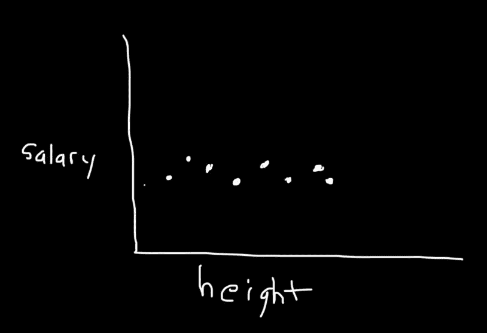

注意，不管我们把什么作为自变量，平均工资都保持不变。换句话说，我们可以用人民生活的其他方面作为 ***x*** 但工资会保持不变。

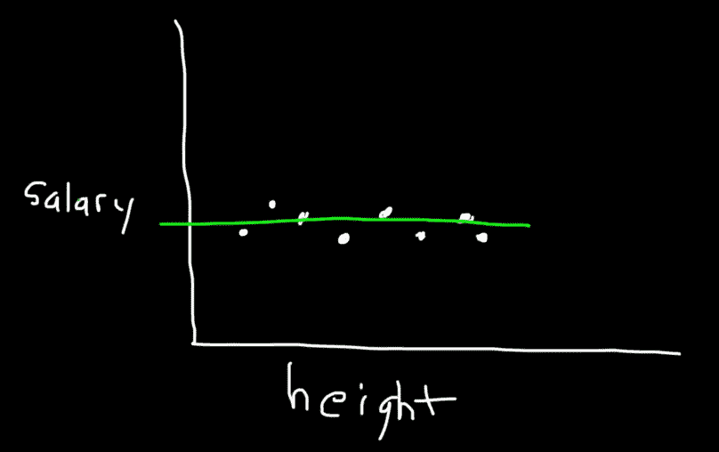

假设我们使用线性回归找到了*最佳拟合*线。

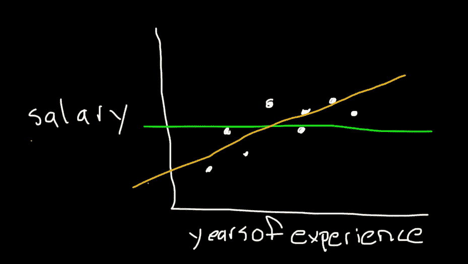

**R** 的值可以表示为:

```
**R² = (var(mean) - var(line)) / var(mean)**
```

其中 *var(mean)* 是相对于平均值的方差，而 *var(line)* 是相对于直线的方差。

就像我们之前提到的，方差可以通过计算个人工资和均方差之间的差来计算。

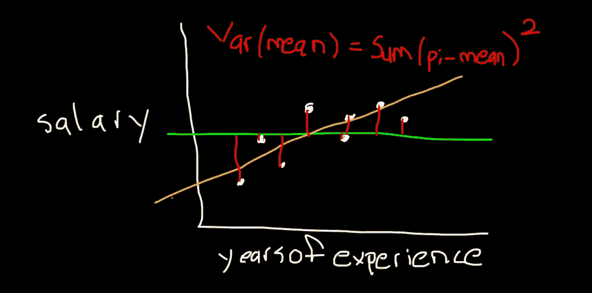

使用相同的逻辑，我们可以确定橙色线周围的变化。

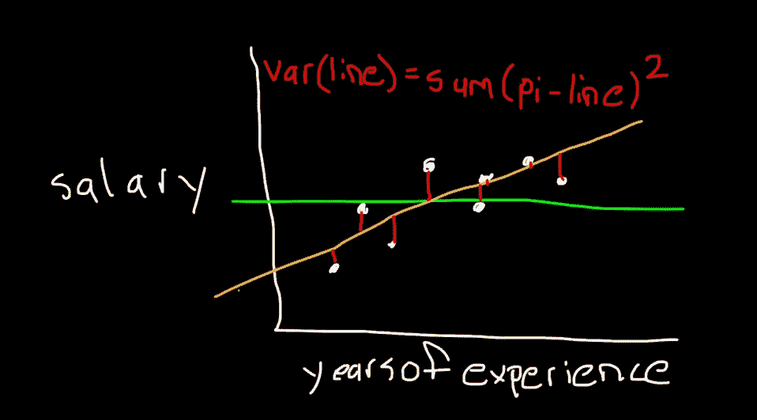

假设我们获得了线的方差和均值的下列值。

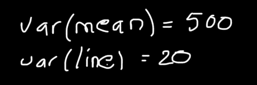

我们可以使用之前描述的公式计算 **R** 。

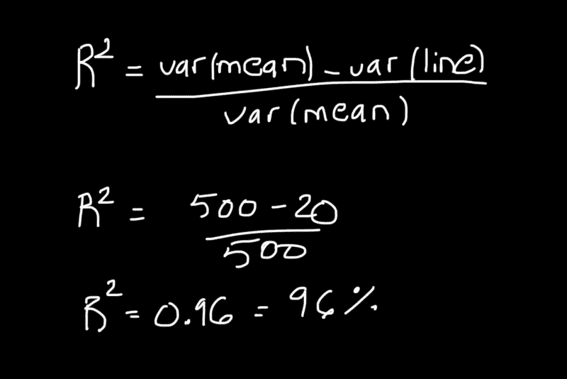

R 值意味着线周围的变化比平均值小 96%。换句话说，工资和工作年限的关系解释了 96%的变异。换句话说，工作年限是薪水的一个很好的预测指标，因为当工作年限增加时，薪水也会增加，反之亦然。

# 密码

让我们看看如何用 R 来评估一个线性回归模型。首先，导入以下库。

```
import pandas as pd
import numpy as np
from matplotlib import pyplot as plt
import seaborn as sns
from sklearn.metrics import r2_score
from sklearn.linear_model import LinearRegression
sns.set()
```

我们将使用以下数据集。如果您想跟进，请将其内容复制到 csv 文件中。

```
YearsExperience,Salary
1.1,39343.00
1.3,46205.00
1.5,37731.00
2.0,43525.00
2.2,39891.00
2.9,56642.00
3.0,60150.00
3.2,54445.00
3.2,64445.00
3.7,57189.00
3.9,63218.00
4.0,55794.00
4.0,56957.00
4.1,57081.00
4.5,61111.00
4.9,67938.00
5.1,66029.00
5.3,83088.00
5.9,81363.00
6.0,93940.00
6.8,91738.00
7.1,98273.00
7.9,101302.00
8.2,113812.00
8.7,109431.00
9.0,105582.00
9.5,116969.00
9.6,112635.00
10.3,122391.00
10.5,121872.00
```

我们使用 pandas 将数据加载到我们的程序中，并使用 matplotlib 绘制它。

```
df = pd.read_csv('data.csv')plt.scatter(df['YearsExperience'], df['Salary'])
```

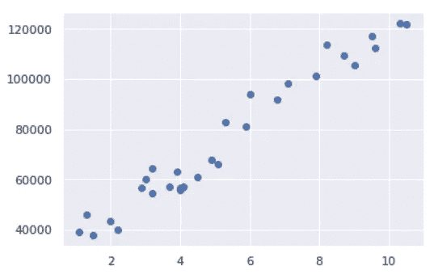

接下来，我们对工资数据训练一个线性回归模型。

```
X = np.array(df['YearsExperience']).reshape(-1, 1)y = df['Salary']rf = LinearRegression()rf.fit(X, y)y_pred = rf.predict(X)
```

我们可以通过运行下面几行来查看模型生成的最佳拟合线。

```
plt.scatter(df['YearsExperience'], df['Salary'])
plt.plot(X, y_pred, color='red')
```

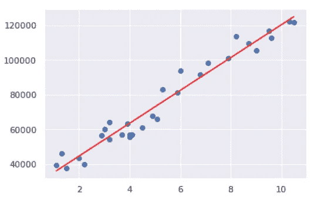

然后，我们用上一节讨论的公式计算 R。

```
def r2_score_from_scratch(ys_orig, ys_line):
    y_mean_line = [ys_orig.mean() for y in ys_orig]
    squared_error_regr = squared_error(ys_orig, ys_line)
    squared_error_y_mean = squared_error(ys_orig, y_mean_line)
    return 1 - (squared_error_regr / squared_error_y_mean)def squared_error(ys_orig, ys_line):
    return sum((ys_line - ys_orig) * (ys_line - ys_orig))r_squared = r2_score_from_scratch(y, y_pred)print(r_squared)
```

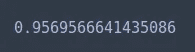

我们可以利用 sklearn `r2_score`函数，而不是每次都从头开始实现。

```
r2_score(y, y_pred)
```

