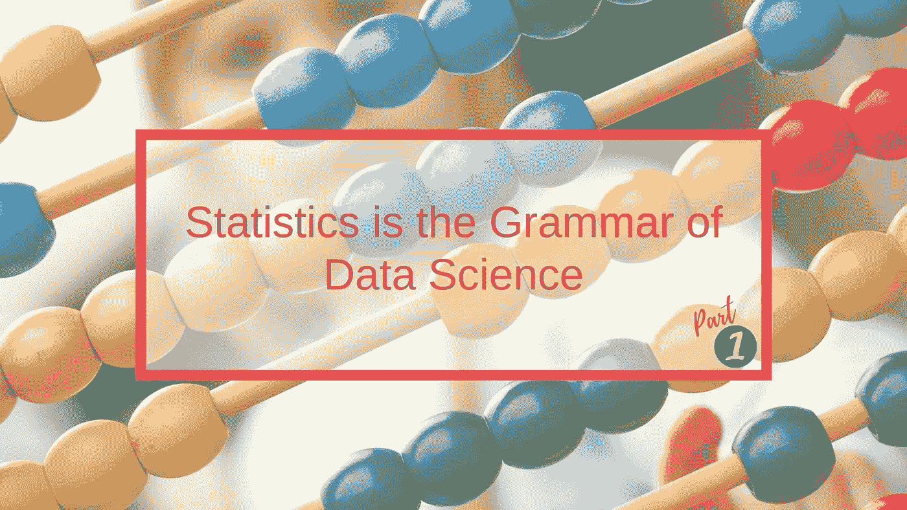
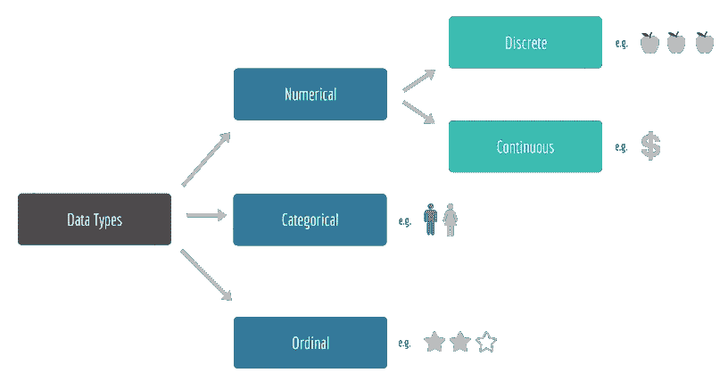

# 统计学是数据科学的语法—第 1/5 部分

> 原文：<https://towardsdatascience.com/statistics-is-the-grammar-of-data-science-part-1-c306cd02e4db?source=collection_archive---------10----------------------->

## 统计复习，开启您的数据科学之旅



英国数学家、现代统计学之父卡尔·皮尔逊被认为是这句话的作者:

> “统计学是科学的语法”

在这里，我们将重点关注与数据科学
*相关的统计数据——看到我在那里做了什么吗？*😄

像 Tensorflow 或 scikit-learn 这样的机器学习库对用户隐藏了几乎所有复杂的数学。
这意味着**我们不需要成为数学专家**，但是对基本原理有一个基本的理解是绝对必要的；这将帮助我们更好地利用这些图书馆。

我正在撰写一个由 5 篇短文组成的**系列文章**，涵盖以下主题，以启动并随后伴随我们的数据科学之旅:

> [*第 1 部分:数据类型|集中趋势度量|可变性度量*](/statistics-is-the-grammar-of-data-science-part-1-c306cd02e4db)[*第 2 部分:数据分布*](/statistics-is-the-grammar-of-data-science-part-2-8be5685065b5)[*第 3 部分:位置度量|矩*](/statistics-is-the-grammar-of-data-science-part-3-5-173fdd2e18c3)[*第 4 部分:协方差|相关性*](/statistics-is-the-grammar-of-data-science-part-4-5-e9b1ce651064)[](/statistics-is-the-grammar-of-data-science-part-5-5-3f6099faad04)

*让我们从 1️⃣…部分开始*

# *数据类型*

**

*我们不能再简单了:数据分为三类，数据科学家根据这三类选择如何进一步分析和处理数据:*

***#1。数字**数据代表一些可测量的可量化信息，并进一步分为两个子类别:*

*   ***离散**数据，基于整数(如人数)*
*   ***连续的**数据，以十进制为基础(如价格、距离、温度)。*

***#2。分类数据是用于将数据分类的定性数据(想象一下编程中的枚举)。例如，性别、汽车品牌、居住国等。有时我们可以给类别分配数字，这样它们会更紧凑，但是它们没有任何数学意义。***

***#3。序数**数据代表离散的和有序的单位，例如冠军联赛排名(第 1、第 2、第 3)、错误优先级(低、关键或表演停止)或酒店评级(1–5 *)。*

# **集中趋势的度量**

*假设我们有一个由 5 个数字组成的数据集:*

```
*{ 6, 3, 100, 3, 13 }*
```

## *平均*

*平均值(用希腊字母 mu— μ表示)是数据集的**平均值**。为了计算平均值，我们将所有值相加，然后除以值的个数。*

```
*E.g. 6 + 3 + 100 + 3 + 13 = 125 →
     μ = 125 ÷ 5 = 25*
```

## *中位数*

*中位数是数据集的中间**点**。为了计算中间值，我们对所有值进行排序(按升序或降序),并取中间值。*

```
*E.g. 3, 3, **6**, 13, 100 → 6*
```

*如果有偶数个数据点，那么我们计算落在中间的两个数据点的平均值。*

*中位数比平均值更不容易受到离群值的影响，因此我们需要考虑数据分布的样子，以选择使用哪一个。*

## *方式*

*众数是数据集中最常见的**值。为了计算模式，我们找到出现频率更高的数字。***

```
*E.g. 3:2, 6:1, 13:1, 100:1 → 3*
```

*模式通常只与**离散**数值数据相关，与连续数据无关。*

# *差异量数*

## *范围*

*范围是数据集的最低和最高数字之间的**差**。为了计算范围，我们从最大值中减去最小值。*

```
*E.g. 100 – 3 = 97*
```

*它向我们展示了**数据集是如何变化的**，也就是说，它是如何分布的，但同样，像均值一样，它对异常值非常敏感。*

## *差异*

*方差衡量**如何展开**数据。为了计算方差，我们从平均值中取方差的平均值。*

*   ***#1。**求数据点的平均值*

```
*From previous section it is 25*
```

*   ***#2。**从每个数据点中减去平均值*

```
*6 - 25 = -19
3 - 25 = -22
100 - 25 = 75
3 - 25 = -22
13 - 25 = -12*
```

*   ***#3。**平方每个结果*

```
*(-19)^2 = 361
(-22)^2 = 484
(75)^2 = 5,625
(-22)^2 = 484
(-12)^2 = 144*
```

*   ***#4。**求结果的平均值(即求和并除以 n)*

```
*361 + 484 + 5,625 + 484 + 144 = 7,098 →
7,098 ÷ 5 = 1,419.6*
```

***✏️《平方和》**
在第 3 步我们之所以使用平方和的区别是双重的:*

*   *负面差异与正面差异具有相同的影响，即它们不会相互抵消*
*   *它放大了数据集中异常值的影响。*

***✏️数据完整性**
根据数据集的完整性，第 4 步有细微的区别:*

*   *对于完全群体，我们除以数据点的数量(n)，即第 4 步是正确的，因为在我们的情况下，我们有一个完全群体*
*   *对于样本，我们除以数据点数减 1 (n - 1)*

```
*7,098 ÷ 4 = 1774.5*
```

## *标准偏差*

*标准差(用希腊字母 sigma — σ表示)就是方差的**平方根**。*

```
*E.g. σ = SQRT(1,419.6) = 37.68*
```

*它是一种离差的度量，即它偏离平均值多少标准差，正如我们将在下面的文章中看到的，它用于判断哪个数据点是异常值。*

```
*100 was a rather big number in our example, let's see how many standard deviations it is away from the mean:μ = 25
σ = 37.68
100 / 37.68 = 2.65*
```

*感谢阅读！[第二部](/statistics-is-the-grammar-of-data-science-part-2-8be5685065b5)快到了…*

**我定期在* [*媒体*](https://medium.com/@semika) *上撰写关于技术的&数据——如果你想阅读我未来的帖子，请“关注”我！**