# 统计学是数据科学的语法—第 2/5 部分

> 原文：<https://towardsdatascience.com/statistics-is-the-grammar-of-data-science-part-2-8be5685065b5?source=collection_archive---------8----------------------->

## 统计复习，开启您的数据科学之旅

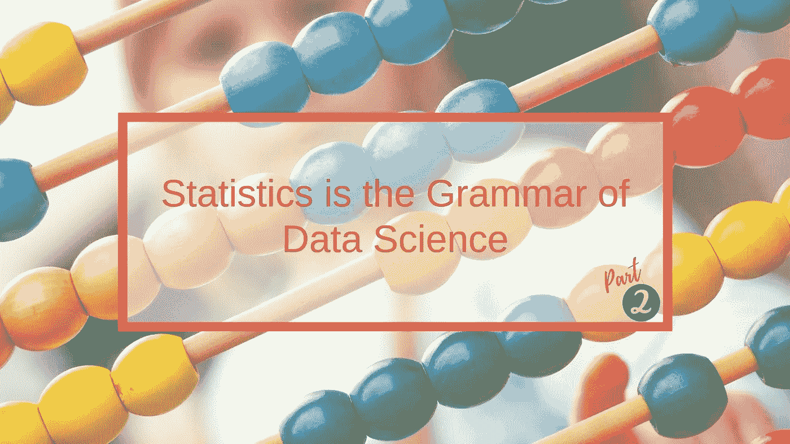

这是“统计学是数据科学的语法”系列的第二篇文章，涵盖了各种类型的**概率分布**以及我们**如何绘制它们**。

## 修订本

其余文章的书签，便于访问:

> **文章系列** [第 1 部分:数据类型|集中趋势度量|可变性度量](/statistics-is-the-grammar-of-data-science-part-1-c306cd02e4db)
> [第 2 部分:数据分布](/statistics-is-the-grammar-of-data-science-part-2-8be5685065b5)🚩
> [第 3 部分:位置|矩的度量](/statistics-is-the-grammar-of-data-science-part-3-5-173fdd2e18c3)
> [第 4 部分:协方差|相关性](/statistics-is-the-grammar-of-data-science-part-4-5-e9b1ce651064)
> [第 5 部分:条件概率|贝叶斯定理](/statistics-is-the-grammar-of-data-science-part-5-5-3f6099faad04)

# 概率分布函数

概率分布是描述事件或结果的**可能性**的函数。它们有许多形状，但只有一种大小:分布中的概率总和总是 1。我们现在将根据数据集是连续的还是离散的来深入研究不同类型的分布。

## 概率密度函数

当我们看到类似下图的图表时，我们*认为*它显示了给定值发生的概率。然而，这对于**连续的**数据来说并不完全正确，因为数据点的数量是无限的。因此，特定值发生的概率可能非常小——无限小！

PDF 表示给定的**值范围**出现的概率。因此有了“密度”这个词！为了形象化概率，我们将数据集绘制成**曲线**。两点之间曲线下的面积对应于变量落在这两个值之间的概率。

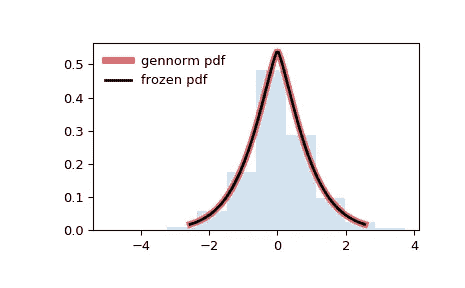

Courtesy: scipy.stats.gennorm

✏️ **“臭名昭著”的钟形标准正态分布**
为了更好地理解这一点，我们将研究 PDF 的一个特例:

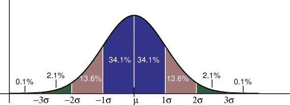

Courtesy: [Princeton University](https://introcs.cs.princeton.edu/java/11gaussian/images/stddev.png)

在平均值和一个标准差(1σ)之间，有 34.1%的可能性值落在该范围内。因此，对于给定值，有 68.2%的机会落在-1σ和 1σ之间，这是非常可能的！！！
这意味着在平均值附近有一个**集中值，当我们超出一个标准差(+-)时，概率变得越来越小。**

## 概率质量函数(PMF)

当谈到**离散**数据时，PMF 是给我们一个给定**值**发生的概率的度量。为了直观显示概率，我们将数据集绘制成直方图。

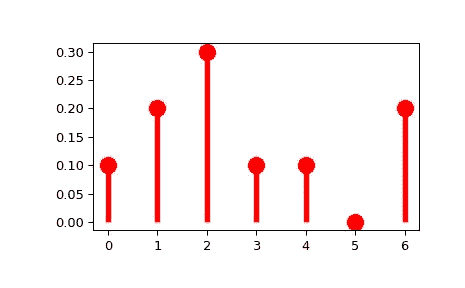

Courtesy: scipy.stats.rv_discrete

# 连续数据分布

现在我们了解了 PDF 和 PMF 之间的区别，我们将看到最常见的分布类型，从连续分布开始。

## #PDF-1:均匀/矩形分布

均匀分布意味着某个值在给定范围内出现的概率为**平坦常数**，并且与同样可能发生的事件有关。

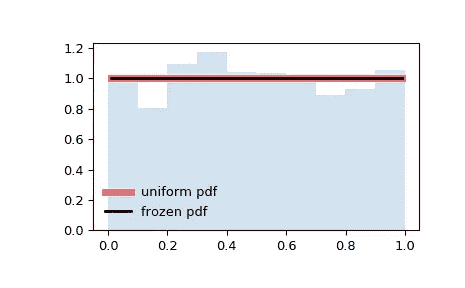

Courtesy: scipy.stats.uniform

在上面的图中，我们不希望看到低于 0.0 或高于 1.0 的范围之外的任何东西。但是在这个范围内，我们有一条平坦的线，因为这些值中的任何一个出现的概率是恒定的。

## #PDF-2:正态/高斯分布

当我们探索 PDF 是什么时，我们看到了一个标准的正态分布。如果我们引入“随机”元素，正态分布看起来不像一条完美的曲线，而更像下面的例子。

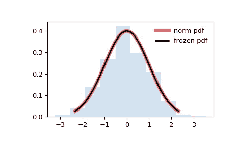

Courtesy: scipy.stats.norm

标准正态分布的平均值为零，标准差为一。

## #PDF-3: T 分布

T 或 Student 的 T 分布看起来很像正态分布的钟形曲线，但稍短一些，尾部较重。当我们有小样本和/或总体方差未知时，使用它(而不是正态分布)。

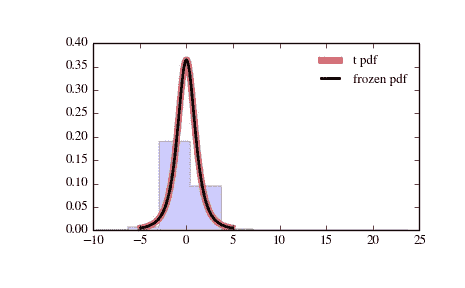

Courtesy: scipy.stats.t

## #PMF-4:卡方分布

卡方(χ)分布用于评估一系列问题:

*   数据集是否符合特定的分布
*   两个总体的分布是否相同
*   两个事件是否可能是独立的
*   人群中是否存在不同的变异性。

曲线向右倾斜。

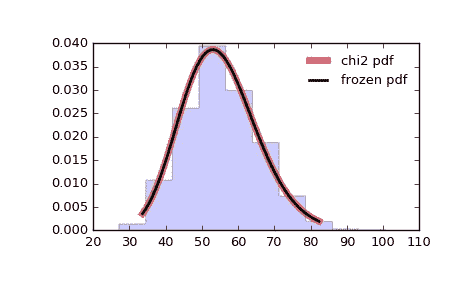

Courtesy: scipy.stats.chi2

## #PDF-5:指数概率分布

另一个经常遇到的分布函数是指数概率分布函数，其中事物**以指数方式**下降。

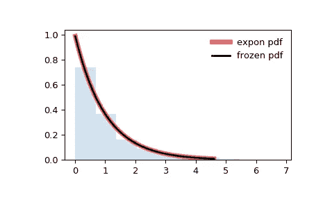

Courtesy: scipy.stats.expon

大值越来越少，小值越来越多，也就是说，某件事发生的可能性很大，接近于零，但当我们离它越远，它就会急剧下降。

一个日常的例子是顾客一次去超市花的钱:花小额钱的人多，花大额钱的人少。

它被广泛用于模拟事件之间经过的**时间以及**可靠性**，后者处理产品持续的时间量，例如汽车电池持续的时间量(从现在开始),以月为单位。**

在我们进入下一部分之前，我想向[推荐来自](https://blog.cloudera.com/blog/2015/12/common-probability-distributions-the-data-scientists-crib-sheet) [Sean Owen](https://medium.com/u/c145ff55eeea?source=post_page-----8be5685065b5--------------------------------) 的这篇关于 pdf 的特别文章，他在文章中创建了他们的关系图:

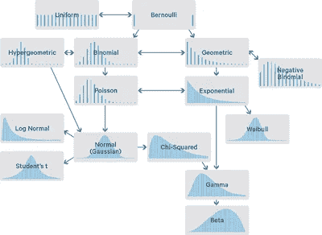

Courtesy: [Sean Owen — Cloudera](https://blog.cloudera.com/blog/2015/12/common-probability-distributions-the-data-scientists-crib-sheet)

# 离散数据分布

至于离散概率分布，两个主要类别包括:

## #PMF-1:二项式分布

让我们考虑一个有两种可能结果的实验:要么成功**要么失败**。假设实验重复几次，重复次数彼此独立。结果证明是成功的实验总数是一个随机变量，其分布称为二项式分布。

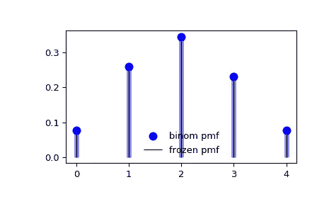

Courtesy: scipy.stats.binom

## #PMF-2:泊松分布

泊松分布给出了在**固定时间间隔**内发生的事件数量的概率，如果这些事件发生:

*   具有已知的平均速率和
*   独立于自上次事件以来的时间。

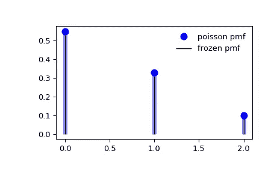

Courtesy: scipy.stats.poisson

一个经典的例子是呼叫中心接到的电话数量。
—或者—
如果我们知道给定时间段内发生的事情的平均数量，另一个用例可以是预测在给定的未来时间获得另一个值的可能性。例如，我的中型帖子平均每天有 1000 次浏览；我可以使用泊松概率质量函数来估计 1500 次访问的概率。

今天的文章到此结束！我希望这对于理解各种类型的分布是什么以及它们看起来是什么样子是有用的，即使我“隐藏”了所有的数学类型！

感谢阅读！[第三部](/statistics-is-the-grammar-of-data-science-part-3-5-173fdd2e18c3)即将上映……

*我定期在* [*媒体*](https://medium.com/@semika) *上撰写关于技术&的数据——如果你想阅读我未来的帖子，请“关注”我！*