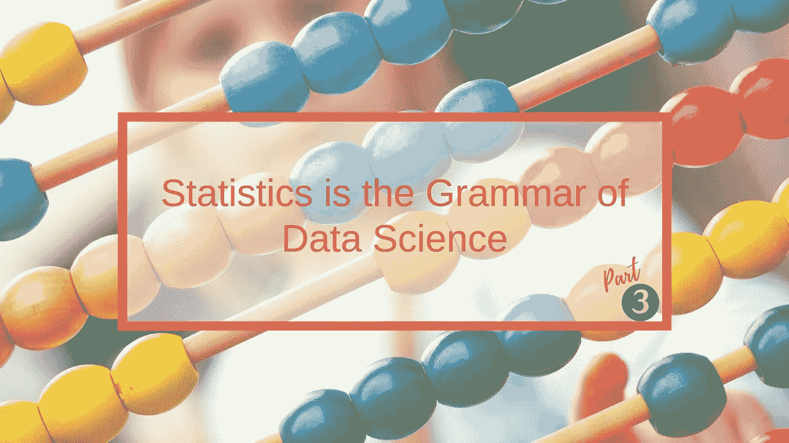
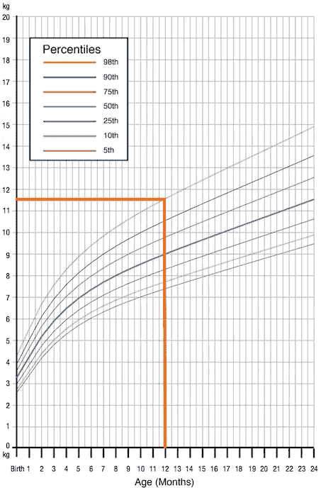
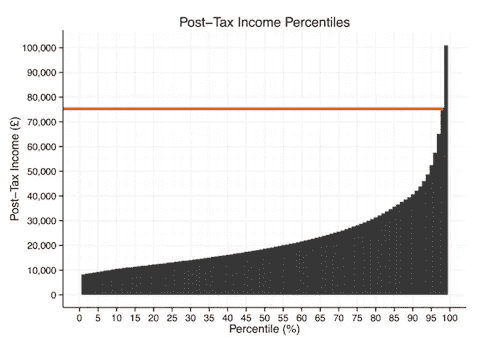
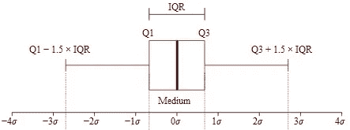
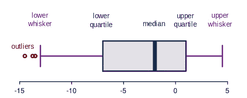
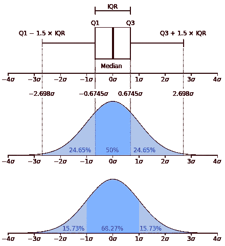
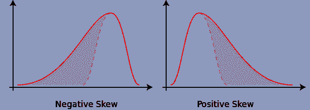
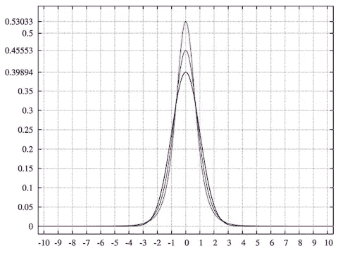

# 统计学是数据科学的语法—第 3/5 部分

> 原文：<https://towardsdatascience.com/statistics-is-the-grammar-of-data-science-part-3-5-173fdd2e18c3?source=collection_archive---------6----------------------->

## 统计复习，开启您的数据科学之旅



这是“统计学是数据科学的语法”系列的第 3 篇文章，涵盖了位置的**度量**(百分位数和四分位数)和**矩**。

## 修订本

其余文章的书签，便于访问:

> **文章系列** [第 1 部分:数据类型|集中趋势的度量|可变性的度量](/statistics-is-the-grammar-of-data-science-part-1-c306cd02e4db)
> [第 2 部分:数据分布](/statistics-is-the-grammar-of-data-science-part-2-8be5685065b5)
> [第 3 部分:位置|矩的度量](/statistics-is-the-grammar-of-data-science-part-3-5-173fdd2e18c3)🚩
> [第四部分:协方差|相关性](/statistics-is-the-grammar-of-data-science-part-4-5-e9b1ce651064)
> [第五部分:条件概率|贝叶斯定理](/statistics-is-the-grammar-of-data-science-part-5-5-3f6099faad04)

# 位置的测量

## 百分位数

百分位数将有序数据分成百分之**和百分之**。在一个排序的数据集中，一个给定的百分位数是数据百分比比我们现在所处的点少**的点。**

第 50 百分位几乎是中间值。

例如，想象一下女婴从出生到两岁的成长图表。顺着这条线，我们可以看到 98%的一岁女婴体重不到 11.5 公斤。



Girls’ growth chart. Courtesy: [World Health Organisation Child Growth Standards](http://www.who.int/childgrowth/en/)

另一个流行的例子是一个国家的收入分配。第 99 个百分位数是指美国其余 99%的人收入低于这个数字，而 1%的人收入高于这个数字。在下图中的英国，这个数字是 75，000。



UK income distribution. Courtesy: [Wikipedia](https://en.wikipedia.org/wiki/Income_in_the_United_Kingdom)

## 四分位数

四分位数是特殊的百分位数，它将数据分成**个四分位数**。第一个四分位数 Q1 与第 25 个百分位数相同，第三个四分位数 Q3 与第 75 个百分位数相同。中位数被称为第二个四分位数，Q2，和第 50 个百分位数。

## I **四分位数范围(** IQR)

IQR 是一个指示**如何分布数据集的中间一半**(即中间的 50%)的数字，可以帮助确定异常值。这就是 Q3 和 Q1 的区别。

```
IQR = Q3 - Q1
```



IQR. Courtesy: [Wikipedia](https://en.wikipedia.org/wiki/Interquartile_range)

一般来说，**异常值**是那些不在 Q1-1.5 倍 IQR 和 Q3 + 1.5 倍 IQR 范围内的数据点。

## 箱线图

箱线图(也称为箱线图和须线图)说明了:

*   数据有多集中
*   **极值**值离大部分数据有多远。



Elements of a boxplot. Courtesy: [Wikimedia](https://commons.wikimedia.org/wiki/File:Elements_of_a_boxplot_en.svg)

箱形图由一个缩放的水平或垂直**轴**和一个矩形**框**组成。

**最小值**和**最大值**是轴的端点(本例中为-15 和 5)。 **Q1** 标记盒子的一端，而 **Q3** 标记蓝色盒子的另一端。

'**须条**'(显示为紫色)从框的两端延伸至最小和最大数据值。也有箱线图，其中的点标记了**异常值**(显示为红色)。在这些情况下，胡须不会延伸到最小值和最大值。

**正态分布的✏️箱线图**
正态分布的箱线图有一个微妙的差别:尽管它们被称为四分位数 1 (Q1)和四分位数 3 (Q1)，但它们并不真正代表 25%的数据！他们代表 34.135%，介于两者之间的区域不是 50%，而是 68.27%。



Comparison of a boxplot of a nearly normal distribution (top) and a PDF for a normal distribution (bottom). Courtesy: [Wikipedia](https://en.wikipedia.org/wiki/Box_plot)

# 朋友圈

瞬间描述了我们分布的**本性**和**形状**的各个方面。

**#1** —一阶矩是数据的**均值**，描述了分布的**位置**。

**#2** —二阶矩是**方差**，描述了分布的**差**。高值比小值更分散。

**#3** —第三个矩是**偏斜度**，它基本上是一个衡量分布有多不平衡的指标。正的偏斜意味着我们有一个左倾和一个长的右尾巴。这意味着平均值在大部分数据的右边。反之亦然:



Skewness. Courtesy: [Wikipedia](https://en.wikipedia.org/wiki/Skewness)

**#4** —第四个矩是**峰度**，描述**尾部**有多粗，**波峰**有多尖。它表明在我们的数据中找到极值的可能性有多大。较高的值更有可能产生异常值。这听起来很像 spread(方差),但有细微的不同。



Kurtosis illustration of three curves. Courtesy: [Wikipedia](https://en.wikipedia.org/wiki/Kurtosis)

我们可以看到，较高的峰值具有较高的峰度值，即最顶部的曲线比最底部的曲线具有较高的峰度。

那都是乡亲们！这是一篇相当短的文章；我们知道了百分位数有多重要，因为它们表明了我们相对于其他人的地位。然后，我们看到了一个特殊的类别，称为四分位数，以及它们在寻找异常值中的应用。最后，我们探索了描述曲线形状的四个“矩”。

感谢阅读！[第四部分](/statistics-is-the-grammar-of-data-science-part-4-5-e9b1ce651064)即将到来……

*我定期在* [*中型*](https://medium.com/@semika) *上写关于技术的&数据——如果你想阅读我未来的帖子，请“关注”我！*