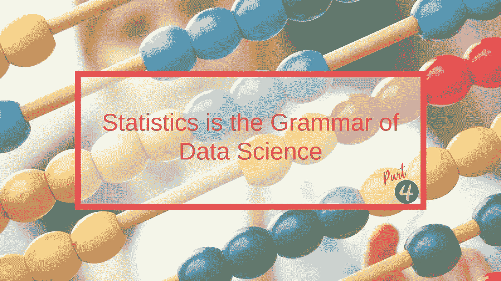
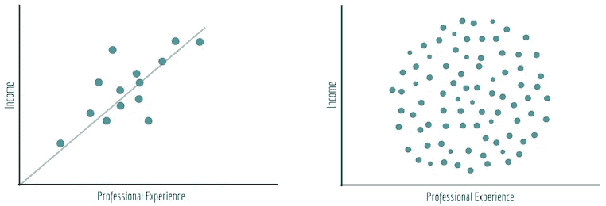
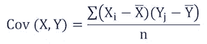
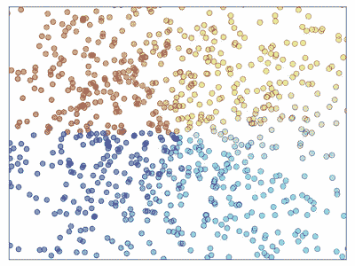
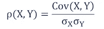
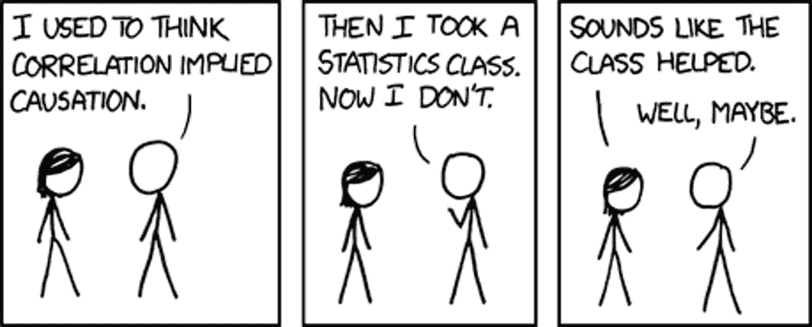
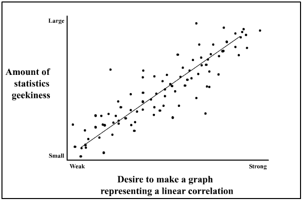
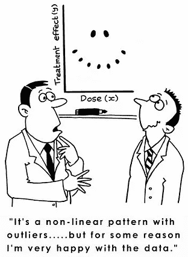

# 统计学是数据科学的语法—第 4/5 部分

> 原文：<https://towardsdatascience.com/statistics-is-the-grammar-of-data-science-part-4-5-e9b1ce651064?source=collection_archive---------16----------------------->

## 统计复习，开启您的数据科学之旅

这是“统计学是数据科学的语法”系列的第 4 篇文章，涵盖了**协方差**和**相关性**的重要主题。

## 修订本

其余文章的书签，便于访问:

> **文章系列** [第 1 部分:数据类型|集中趋势度量|可变性度量](/statistics-is-the-grammar-of-data-science-part-1-c306cd02e4db)
> [第 2 部分:数据分布](/statistics-is-the-grammar-of-data-science-part-2-8be5685065b5)
> [第 3 部分:位置度量|矩](/statistics-is-the-grammar-of-data-science-part-3-5-173fdd2e18c3)
> [第 4 部分:协方差|相关性](/statistics-is-the-grammar-of-data-science-part-4-5-e9b1ce651064)🚩
> [第五部分:条件概率|贝叶斯定理](/statistics-is-the-grammar-of-data-science-part-5-5-3f6099faad04)

# 介绍

为了给本文打下基础，我们将假设我们有一个散点图，每个数据点代表一个人:一个轴上是他们多年的职业经历，另一个轴上是他们的收入。

‘Professional experience vs. Income’ scatterplot

如果散点图看起来像右边的，那么我们得出经验和收入之间没有真正的关系，即对于任何给定的经验，都可能有一个收入范围。

相反，在左图中，这些属性之间存在明显的线性关系。

> 协方差和相关性为我们提供了一种测量数据集属性相互依赖程度的方法**。**

**注意:在这个例子中，描述的数据类型是双变量的——两个变量的“bi”。实际上，统计学家使用的是多元数据，即许多变量。**

# 协方差

协方差是两个(或更多)随机变量之间关联的度量。

顾名思义,“co + variance”类似于方差，但用于比较两个变量——我们用叉积之和代替平方和。方差告诉我们单个变量如何偏离均值；协方差告诉我们两个变量如何彼此不同。因此，可以公平地说:

> 协方差是衡量两个变量之间的方差。

协方差可以是负的也可以是正的(或者明显为零):**正的**值意味着两个变量趋向于以*相同的方向*变化(即如果一个增加，那么另一个也增加)，一个**负的**值意味着它们以*相反的方向* 变化(即如果一个增加，那么另一个减少)，而**零**意味着它们*不一起变化*。

## 公式

这个公式可能很难解释，但更重要的是理解它的含义:

Covariance between variables X and Y

如果我们认为一个随机变量的数据集被表示为一个**向量**，那么在前面的例子中，我们有两个向量，分别是经验和收入。以下是我们需要遵循的步骤:

*   **#1** 。将这两个向量转换为平均值的方差向量。
*   **#2** 。取两个矢量的点积(等于它们之间夹角的**余弦**)。
*   **#3** 。除以样本量(n 或 n - 1，如前所述，基于是否为完全总体)。

第二步，我们有效地测量这两个向量之间的**角度**，所以如果它们彼此接近，就意味着这些变量是紧密耦合的。

## 主要限制

值得注意的是，虽然协方差确实度量了两个变量之间的方向关系，但它并不显示它们之间的关系强度。

实际上，这种度量的最大问题是它依赖于使用的**单位**。例如，如果我们将几年的经验转换成几个月的经验，那么协方差会大 12 倍！

这就是相关性发挥作用的地方！

Rainbow scatterplot. Courtesy: [Scipy](http://scipy-lectures.org/_images/plot_scatter_ex_1.png)

# 相互关系

相关性是统计学中最常见的度量之一，它描述了两个随机变量之间的关联程度。它被认为是协方差的**归一化**版本。让我们看看为什么…

## 公式

相关性(用希腊字母ρ — rho 表示)可以用以下公式表示:

Correlation between variables X and Y

相关性被限制在-1 和 1 之间。与协方差一样，相关性的符号表示关系的方向:正表示随机变量一起移动，负表示随机变量向不同方向移动。

端点(即 1 和-1)表示两个变量之间存在完美的**关系。例如，米和厘米之间的关系总是 1 米对应 100 厘米。如果我们画出这个关系，它将是一条完美的线，因此相关性是 1。**

> 请注意，完美的关系在现实生活数据中非常罕见，因为两个随机变量通常不会通过常数因子相互映射。

相关性为 0 意味着两个变量之间没有线性关系。可能有一个 *x = y* 关系。

## 关键特征

相关性不仅指示关系的方向，还指示其**强度**，(取决于绝对值有多大)因为它是**无单位的**:因为我们将协方差除以标准偏差，所以单位被抵消了。

最后，我们需要记住' ***相关性并不意味着因果关系*** ':两个随机变量之间的高度相关性只是意味着它们彼此*关联*，但它们的关系在本质上并不一定是因果关系。证明因果关系的唯一方法是用**受控实验**，在这里我们排除外部变量，隔离两个变量的影响。

😆 Courtesy: Pinterest

全部完成！我们已经学会了如何使用协方差和相关性来衡量数据集中的两个不同属性是否以线性方式相互关联，以及为什么相关性通常是首选，因为它是无单位的。

感谢阅读！[第五部](/statistics-is-the-grammar-of-data-science-part-5-5-3f6099faad04)即将到来……

*我定期在* [*媒体*](https://medium.com/@semika) *上撰写关于技术&的数据——如果你想阅读我未来的帖子，请“关注”我！*