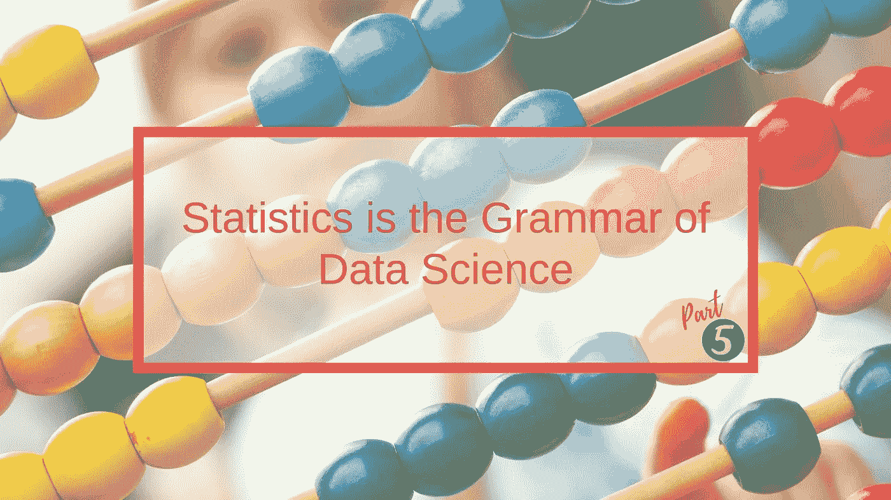
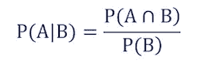
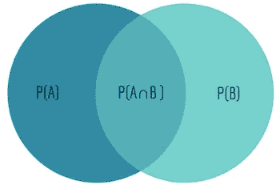
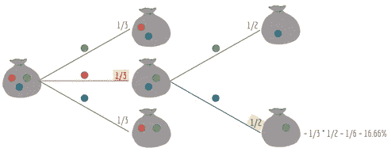
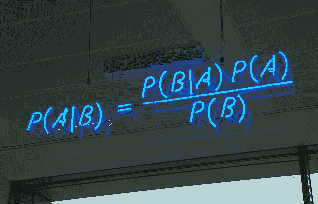
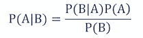
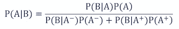
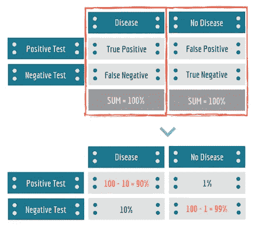
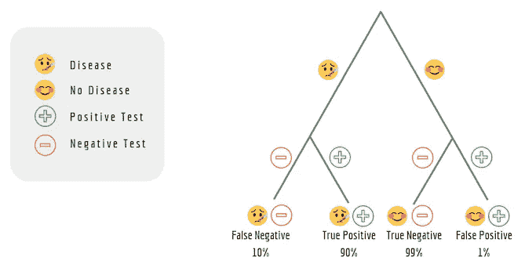

# 统计学是数据科学的语法—第 5/5 部分

> 原文：<https://towardsdatascience.com/statistics-is-the-grammar-of-data-science-part-5-5-3f6099faad04?source=collection_archive---------7----------------------->

## 统计复习，开启您的数据科学之旅



这是“统计学是数据科学的语法”系列的第 5 篇(也是最后一篇)文章，涵盖了**条件概率**和**贝叶斯定理**及其重要性。*准备好了吗？*

## 修订本

其余文章的书签，便于访问:

> **文章系列** [第 1 部分:数据类型|集中趋势度量|可变性度量](/statistics-is-the-grammar-of-data-science-part-1-c306cd02e4db)
> [第 2 部分:数据分布](/statistics-is-the-grammar-of-data-science-part-2-8be5685065b5)
> [第 3 部分:位置度量|矩](/statistics-is-the-grammar-of-data-science-part-3-5-173fdd2e18c3)
> [第 4 部分:协方差|相关性](/statistics-is-the-grammar-of-data-science-part-4-5-e9b1ce651064)
> [第 5 部分:条件概率|贝叶斯定理](/statistics-is-the-grammar-of-data-science-part-5-5-3f6099faad04)🚩

# 条件概率

条件概率是一个事件发生的**可能性**，基于一个**先前事件**的发生。

条件概率的符号是 P(A|B)，读作'**给定 B 的概率**'。条件概率的公式是:



Conditional Probability of A given B

A ∩ B 是维恩图中 A 和 B 的交集，所以 P(A∩B)是 A 和 B 同时出现的概率。
照这样:

> 给定 B 的概率等于 A 和 B 发生的概率除以 B 单独发生的概率。



Venn diagram: Probabilities of events A and B.

## ✏️的例子:

假设我们从一个袋子里抽出三颗弹珠——红色、绿色和蓝色。

> 在已经画了红色的弹珠之后，再画蓝色弹珠的条件概率是多少？

如果事件 **A** 是首先获得红色弹珠的事件，而事件 **B** 是获得蓝色弹珠的事件，我们希望计算 **P(A∩B)** :

*   **P(A)** 是第一回合得到红色弹珠的概率。因为这是三种可能结果中的一种:

```
P(A) = 1/3 = 33.33%
```

*   **P(B|A)** 是第二回合得到蓝色弹珠的概率。因为还剩下两个弹珠:

```
P(B) = 1/2 = 50%
```

*   **P(A ∩ B)** 是第一轮画出红色弹珠，第二轮画出蓝色弹珠的概率:

```
P(A ∩ B) = P(A) * P(B|A) = 33.33% * 50% = 16.66%
```

为了形象化这一点，我们可以使用**树形图**——每个分支都有一个条件概率



Tree Diagram for the marble bag example

## 原因

我们在第四部分中看到了因果关系的含义。条件概率不**不**表示两个事件之间有必然的因果关系，也不表示两个事件同时发生。

## 独立事件

独立事件是那些其结果不影响其他事件结果的概率的事件。由于这个原因:

```
P(A|B) = P(A)
P(B|A) = P(B)
```

## 互斥事件

互斥是指那些不能同时发生的事件，即如果一个事件已经发生，另一个就不能发生。因此:

```
P(A|B) = 0
P(B|A) = 0
```



Neon sign showing the simple statement of Bayes’ theorem. Courtesy: [Wikipedia](https://en.wikipedia.org/wiki/Bayes%27_theorem)

# 贝叶斯定理

刚刚探索了什么是条件概率，让我们来看看贝叶斯定理。它只是说:

> 给定 B 的概率等于给定 A 的 B 的概率乘以 A 的概率，除以 B 的概率。



Bayes’ Rule

换句话说，它提供了一种在 P(A|B)和 P(B|A)之间转换的有用方法。

在更大的范围内，它是统计学中整个领域的基石(“贝叶斯统计学”)。它被用于各种学科，最著名的例子是**医学**和**药理学**，但也用于**金融**，例如预测一项投资成功的概率。

将这些条件变量应用于贝叶斯定理时，数量几乎和质量一样重要。例如，假设我们想计算借钱给借款人的风险。如果我们考虑其他可能性，如借款人的年龄、信用评级和风险偏好，借钱给特定个人的可能性会有所不同。

正如理论本身所假定的那样:

> 变量越多，我们对这些变量越有把握，就越能利用条件概率得出准确的结论！

## ✏️的例子:

假设我们是诊所的医生，我们知道:肝病患者的概率是 20%，酗酒者的概率是 5%，在被诊断为肝病的患者中，10%是酗酒者。我们现在想知道:

> 如果一个病人是个酒鬼，那么他患肝病的条件概率是多少？

*   **P(A)** 是患肝病的概率:

```
P(A) = 20%
```

*   **P(B)** 是成为酗酒者的概率:

```
P(B) = 5%
```

*   **P(B|A)** 是假设患者患有肝病，则患者为酗酒者的条件概率:

```
P(B|A) = 10%
```

*   **P(A|B)** 是假设患者是酗酒者，他们患肝病的条件概率:

```
P(A|B) = (10% * 20%) / 5% = 40%
```

## 互斥事件

贝叶斯定理的一个特例是当事件 A 是二进制值时。在这种情况下，我们用‘A–’表示事件 A 已经发生，用‘A+’表示事件 A 没有发生(即事件 A–和 A+是互斥的)。
公式表示如下:



Bayes’ Rule for mutually exclusive events A- and A+

## 准确(性)

一个**真正**是模型*正确*预测*正*类的结果。类似地，**真负**是模型*正确预测*负*类的结果。*

**假阳性**是模型*错误地*预测*阳性*类别的结果。类似地，**假阴性**是模型*错误地*预测*阴性*类的结果。

**灵敏度**表示测试正确预测病例的概率→真阳性。

**特异性**表示检测将正确识别阴性病例→真阴性的概率。

```
Sensitivity = true positives / (true positives + false negatives)
Specificity = true negatives / (true negatives + false positives)
```

## ✏️的例子:

我们假设某种疾病的发病率为 2%。如果假阴性率为 10%，假阳性率为 1%:

> 一个测试呈阳性的人实际患有这种疾病的条件概率是多少？

如果事件 **A** 是个体患有这种疾病的事件，并且事件 **B** 是个体测试呈阳性的事件，我们希望计算 **P(A|B)** ，即假设个体测试呈阳性(B)，他们实际上患有疾病(A)。

*   **P(A+)** 或 **P(A)** 为患此病的概率:

```
P(A+) = 2%
```

*   **P(A**–**)**为不患此病的概率，可推导出:

```
P(A-) = 100% - 2% = 98%
```

*   **P(B | A–)**是假阳性的概率，即没有患病(A–)但呈阳性(B):

```
P(B|A-) = 1%
```

*   **P(B –| A)**是假阴性的概率，即患有疾病(A)但结果为阴性(B –)

```
P(B-|A) = 10%
```

*   **P(B|A+)** 或 **P(B|A)** 为真阳性，即患病(A)和阳性(B)，可推导出:

```
P(B|A) = 100% - 10% = 90%
```

*   我们现在有了计算 P(A|B)的所有信息:

```
P(A|B) = [ P(B|A) x P(A) ] **/** [ P(B|A-) x P(A-) **+** P(B|A+) x P(A+) ]
       = [ 90% x 2% ] / [ 1% x 98% + 90% x 2% ] =
       = 64.7%
```

我们可以用一个矩阵来显示测试精度:



在树形图中:



完毕完毕。今天我们学习了条件概率反映了一个事件对另一个事件的概率的影响。然后我们深入研究了贝叶斯定理，这是统计学的基础，因为它允许概率推理。

# 结束了


Photo by [Matt Botsford](https://unsplash.com/@mattbotsford?utm_source=medium&utm_medium=referral) on [Unsplash](https://unsplash.com?utm_source=medium&utm_medium=referral)

这是《统计学是数据科学的语法》续集的结尾。我希望您现在已经具备了开始数据科学之旅的知识！如果你想了解其他内容，请在评论中给我留言，并尝试把它添加到我的下一篇文章中。

感谢阅读！

*我定期在* [*中型*](https://medium.com/@semika) *上写关于技术的&数据——如果你想阅读我未来的帖子，请“关注”我！*